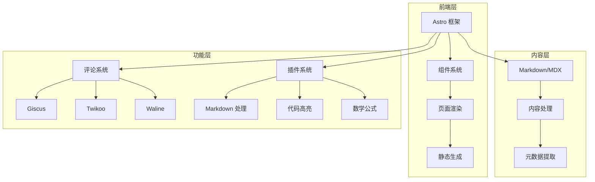

# CG艺术实验室网站项目 Wiki

## 1. 项目概述

CG艺术实验室网站是一个基于 Astro 框架构建的现代化静态网站，专注于数字艺术、动态视觉设计、技术分享和知识管理。

- **多语言支持**：支持中文和英文双语内容
- **响应式设计**：适配各种设备屏幕
- **现代化技术栈**：使用 Astro、TypeScript、UnoCSS 等现代前端技术
- **内容管理**：基于 Markdown/MDX 的内容管理系统
- **评论系统**：集成 Giscus、Twikoo、Waline 等多种评论系统
- **SEO 优化**：内置站点地图、元数据管理等 SEO 功能

## 2. 项目架构

### 2.1 目录结构

```
├── .github/           # GitHub 配置文件
├── patches/           # 补丁文件
├── public/            # 静态资源
│   ├── fonts/         # 字体文件
│   ├── icons/         # 图标文件
│   ├── images/        # 图片资源
│   └── sounds/        # 音效文件
├── scripts/           # 辅助脚本
├── src/               # 源代码
│   ├── assets/        # 资源文件
│   ├── components/    # 组件
│   ├── content/       # 内容文件
│   ├── layouts/       # 布局
│   ├── plugins/       # 插件
│   ├── styles/        # 样式
│   ├── config.ts      # 配置文件
│   └── content.config.ts # 内容配置
├── astro.config.ts    # Astro 配置
└── package.json       # 项目依赖
```

### 2.2 系统架构图



## 3. 核心模块

### 3.1 配置管理

**文件**：[src/config.ts](file:///Volumes/Data/2-Area/cgartlab.github.io/src/config.ts)

该模块负责管理网站的全局配置，包括：

- 站点信息（标题、副标题、描述等）
- 颜色设置（亮色/暗色主题）
- 全局设置（语言、字体、日期格式等）
- 评论系统配置
- SEO 设置
- 页脚设置
- 预加载设置

**核心配置项**：
- `themeConfig`：包含所有配置的主对象
- `base`：站点基础路径
- `defaultLocale`：默认语言
- `moreLocales`：其他支持的语言
- `allLocales`：所有支持的语言列表

### 3.2 组件系统

**目录**：[src/components](file:///Volumes/Data/2-Area/cgartlab.github.io/src/components)

组件系统由以下部分组成：

#### 3.2.1 布局组件

- **Header.astro**：网站头部组件，包含导航栏和站点标题
- **Footer.astro**：网站页脚组件，包含版权信息和社交媒体链接
- **Navbar.astro**：导航栏组件，处理页面导航和语言切换

#### 3.2.2 内容组件

- **PostList.astro**：文章列表组件，用于展示文章摘要
- **PostDate.astro**：文章日期组件，格式化显示文章发布日期
- **TagList.astro**：标签列表组件，展示文章标签
- **LinkCard.astro**：链接卡片组件，用于展示外部链接

#### 3.2.3 评论组件

**目录**：[src/components/Comment](file:///Volumes/Data/2-Area/cgartlab.github.io/src/components/Comment)

- **Giscus.astro**：Giscus 评论系统集成
- **Twikoo.astro**：Twikoo 评论系统集成
- **Waline.astro**：Waline 评论系统集成
- **Index.astro**：评论系统入口，根据配置选择合适的评论系统

#### 3.2.4 工具组件

**目录**：[src/components/Widgets](file:///Volumes/Data/2-Area/cgartlab.github.io/src/components/Widgets)

- **BackButton.astro**：返回顶部按钮
- **CodeCopyButton.astro**：代码复制按钮
- **GithubCard.astro**：GitHub 卡片组件
- **ImageZoom.astro**：图片缩放组件
- **MediaEmbed.astro**：媒体嵌入组件
- **SoundEffect.astro**：音效组件
- **TOC.astro**：文章目录组件

### 3.3 布局系统

**目录**：[src/layouts](file:///Volumes/Data/2-Area/cgartlab.github.io/src/layouts)

- **Head.astro**：页面头部元信息组件，处理 SEO 和标题设置
- **Layout.astro**：主布局组件，包含页面的整体结构

### 3.4 内容管理

**目录**：[src/content](file:///Volumes/Data/2-Area/cgartlab.github.io/src/content)

- **about/**：关于页面内容
- **posts/**：文章内容，支持 Markdown 和 MDX 格式

### 3.5 插件系统

**目录**：[src/plugins](file:///Volumes/Data/2-Area/cgartlab.github.io/src/plugins)

- **rehype-code-copy-button.mjs**：代码复制按钮插件
- **rehype-external-links.mjs**：外部链接处理插件
- **rehype-heading-anchor.mjs**：标题锚点插件
- **rehype-image-processor.mjs**：图片处理插件
- **remark-container-directives.mjs**：容器指令插件
- **remark-leaf-directives.mjs**：叶节点指令插件
- **remark-reading-time.mjs**：阅读时间计算插件

## 4. 核心功能

### 4.1 多语言支持

**实现**：通过 Astro 的 i18n 集成和配置文件管理多语言内容

**配置**：
- 在 `src/config.ts` 中设置默认语言和支持的语言
- 在 `src/i18n/config` 中定义语言映射
- 内容文件通过 `-en.md` 后缀区分英文内容

### 4.2 评论系统

**实现**：集成多种评论系统，可根据配置选择使用

**支持的评论系统**：
- Giscus：基于 GitHub Discussions 的评论系统
- Twikoo：轻量级评论系统
- Waline：带后端的评论系统

### 4.3 数学公式渲染

**实现**：使用 KaTeX 和相关插件实现数学公式渲染

**配置**：在 `src/config.ts` 中启用 KaTeX 支持

### 4.4 代码高亮

**实现**：使用 Shiki 实现代码语法高亮

**配置**：在 `astro.config.ts` 中配置代码高亮主题

### 4.5 图片处理

**实现**：使用 `rehype-image-processor` 插件处理图片

**功能**：
- 图片懒加载
- 图片优化
- 响应式图片

### 4.6 SEO 优化

**实现**：集成 Astro Sitemap 和相关 SEO 配置

**功能**：
- 自动生成站点地图
- 元数据管理
- 搜索引擎验证
- 社交媒体卡片

## 5. 关键 API/类/函数

### 5.1 配置相关

**themeConfig**
- **位置**：[src/config.ts](file:///Volumes/Data/2-Area/cgartlab.github.io/src/config.ts)
- **类型**：`ThemeConfig`
- **描述**：网站的主配置对象，包含所有站点设置
- **参数**：
  - `site`：站点基本信息
  - `color`：颜色设置
  - `global`：全局设置
  - `comment`：评论系统设置
  - `seo`：SEO 设置
  - `footer`：页脚设置
  - `preload`：预加载设置

### 5.2 组件相关

**Layout 组件**
- **位置**：[src/layouts/Layout.astro](file:///Volumes/Data/2-Area/cgartlab.github.io/src/layouts/Layout.astro)
- **描述**：主布局组件，包含页面的整体结构
- **参数**：
  - `title`：页面标题
  - `description`：页面描述
  - `lang`：页面语言
  - `children`：页面内容

**PostList 组件**
- **位置**：[src/components/PostList.astro](file:///Volumes/Data/2-Area/cgartlab.github.io/src/components/PostList.astro)
- **描述**：文章列表组件，用于展示文章摘要
- **参数**：
  - `posts`：文章数据数组
  - `limit`：显示数量限制
  - `showReadMore`：是否显示 "阅读更多" 按钮

### 5.3 插件相关

**remarkReadingTime**
- **位置**：[src/plugins/remark-reading-time.mjs](file:///Volumes/Data/2-Area/cgartlab.github.io/src/plugins/remark-reading-time.mjs)
- **描述**：计算文章阅读时间的插件
- **返回值**：文章的预计阅读时间（分钟）

**rehypeImageProcessor**
- **位置**：[src/plugins/rehype-image-processor.mjs](file:///Volumes/Data/2-Area/cgartlab.github.io/src/plugins/rehype-image-processor.mjs)
- **描述**：处理 Markdown 中的图片，添加懒加载和优化
- **功能**：
  - 为图片添加 `loading="lazy"` 属性
  - 生成图片的低质量占位符
  - 优化图片加载性能

## 6. 技术栈与依赖

### 6.1 核心依赖

| 依赖 | 版本 | 用途 | 来源 |
|------|------|------|------|
| astro | ^6.1.1 | 静态站点生成框架 | [package.json](file:///Volumes/Data/2-Area/cgartlab.github.io/package.json) |
| @astrojs/mdx | ^5.0.3 | MDX 支持 | [package.json](file:///Volumes/Data/2-Area/cgartlab.github.io/package.json) |
| @astrojs/sitemap | ^3.7.2 | 站点地图生成 | [package.json](file:///Volumes/Data/2-Area/cgartlab.github.io/package.json) |
| @unocss/astro | 66.6.7 | 原子 CSS 框架 | [package.json](file:///Volumes/Data/2-Area/cgartlab.github.io/package.json) |
| katex | ^0.16.44 | 数学公式渲染 | [package.json](file:///Volumes/Data/2-Area/cgartlab.github.io/package.json) |
| mermaid | ^11.13.0 | 图表渲染 | [package.json](file:///Volumes/Data/2-Area/cgartlab.github.io/package.json) |
| sharp | ^0.34.5 | 图像处理 | [package.json](file:///Volumes/Data/2-Area/cgartlab.github.io/package.json) |

### 6.2 评论系统

| 依赖 | 版本 | 用途 | 来源 |
|------|------|------|------|
| @waline/client | ^3.13.0 | Waline 评论系统 | [package.json](file:///Volumes/Data/2-Area/cgartlab.github.io/package.json) |
| twikoo | ^1.7.4 | Twikoo 评论系统 | [package.json](file:///Volumes/Data/2-Area/cgartlab.github.io/package.json) |

### 6.3 开发依赖

| 依赖 | 版本 | 用途 | 来源 |
|------|------|------|------|
| @antfu/eslint-config | ^7.7.3 | ESLint 配置 | [package.json](file:///Volumes/Data/2-Area/cgartlab.github.io/package.json) |
| @types/node | ^25.5.0 | TypeScript 类型定义 | [package.json](file:///Volumes/Data/2-Area/cgartlab.github.io/package.json) |
| eslint | ^10.1.0 | 代码检查工具 | [package.json](file:///Volumes/Data/2-Area/cgartlab.github.io/package.json) |
| typescript | ~6.0.2 | TypeScript 支持 | [package.json](file:///Volumes/Data/2-Area/cgartlab.github.io/package.json) |
| tsx | ^4.21.0 | TypeScript 执行工具 | [package.json](file:///Volumes/Data/2-Area/cgartlab.github.io/package.json) |

## 7. 项目运行与部署

### 7.1 开发环境

**安装依赖**：
```bash
pnpm install
```

**启动开发服务器**：
```bash
pnpm dev
```

**构建项目**：
```bash
pnpm build
```

**预览构建结果**：
```bash
pnpm preview
```

### 7.2 辅助脚本

| 脚本 | 用途 | 命令 |
|------|------|------|
| new-post | 创建新文章 | `pnpm new-post` |
| apply-lqip | 应用低质量图片占位符 | `pnpm apply-lqip` |
| format-posts | 格式化文章 | `pnpm format-posts` |
| update-theme | 更新主题 | `pnpm update-theme` |

### 7.3 部署流程

1. **构建项目**：运行 `pnpm build` 生成静态文件
2. **部署到 GitHub Pages**：
   - 项目配置了 GitHub Actions 自动部署
   - 推送代码到 main 分支后自动触发构建和部署

## 8. 配置与开发指南

### 8.1 配置指南

**主要配置文件**：
- [src/config.ts](file:///Volumes/Data/2-Area/cgartlab.github.io/src/config.ts)：网站全局配置
- [astro.config.ts](file:///Volumes/Data/2-Area/cgartlab.github.io/astro.config.ts)：Astro 框架配置

**配置要点**：
- 站点信息：修改 `themeConfig.site` 部分
- 颜色主题：修改 `themeConfig.color` 部分
- 评论系统：在 `themeConfig.comment` 中配置相应的评论系统
- SEO 设置：在 `themeConfig.seo` 中配置搜索引擎验证和分析工具

### 8.2 开发指南

**创建新文章**：
1. 运行 `pnpm new-post` 命令
2. 按照提示输入文章标题和相关信息
3. 在 `src/content/posts` 目录中编辑生成的 Markdown 文件

**添加图片**：
- 将图片放在 `src/content/posts/_images` 目录中
- 在 Markdown 中使用相对路径引用图片

**添加文件**：
- 将文件放在 `src/content/posts/_files` 目录中
- 在 Markdown 中使用相对路径引用文件

## 9. 常见问题与解决方案

### 9.1 评论系统配置

**问题**：评论系统不显示
**解决方案**：
- 确保在 `src/config.ts` 中启用了评论系统
- 检查相应评论系统的配置参数是否正确
- 对于 Giscus，确保 GitHub 仓库已正确配置

### 9.2 图片加载问题

**问题**：图片加载缓慢或显示异常
**解决方案**：
- 运行 `pnpm apply-lqip` 生成低质量图片占位符
- 确保图片格式正确且大小合理
- 考虑使用图片压缩工具优化图片大小

### 9.3 多语言配置

**问题**：多语言切换不工作
**解决方案**：
- 确保在 `src/config.ts` 中正确配置了语言设置
- 确保英文内容文件使用 `-en.md` 后缀
- 检查 `src/i18n/config` 中的语言映射配置

## 10. 总结与亮点回顾

CG艺术实验室网站项目是一个基于 Astro 框架构建的现代化静态网站，具有以下亮点：

1. **现代化技术栈**：使用 Astro、TypeScript、UnoCSS 等现代前端技术，确保网站性能和开发体验
2. **多语言支持**：内置多语言切换功能，支持中英文内容
3. **灵活的评论系统**：集成多种评论系统，可根据需求选择
4. **丰富的内容功能**：支持数学公式、代码高亮、图表渲染等高级内容功能
5. **优化的性能**：通过静态生成、图片优化、代码分割等技术提升网站性能
6. **完善的 SEO**：内置站点地图、元数据管理等 SEO 功能
7. **可扩展性**：模块化设计和插件系统，便于功能扩展
8. **开发工具链**：提供辅助脚本，简化开发流程

该项目展示了如何使用现代前端技术构建一个功能丰富、性能优化的静态网站，适合个人博客、团队网站或内容展示平台。