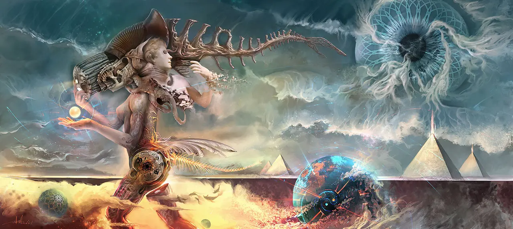

_Tools are extensions of human limbs, computers are extensions of the brain, and writing is thinking itself._

# About the Author

陈阳 (ChenYang) — motion visual designer, product engineer.

My work spans digital motion design, UI/UX, front-end development, AI tools and workflows, writing, and digital art.

# Creative Work

Commercial design is an art of compromise. Most client projects don't enter my portfolio—they are products, not artworks. The few that do either touch areas I am passionate about, match a client's aesthetic vision, or challenge my skills.

Lately I have been carving out time for independent creation and AI tooling. Building private servers, DIY NAS, running local LLMs, integrating AI agents into creative workflows—the same impulse that once drove me to type commands now extends to natural language. This journey led me to what truly excites me: creation.

# About This Site

It started because having your own website is cool. Doesn't every artist have one?

As more content piled up, it began to feel like a container for memories and thoughts—something like a **Pensieve**.

The content inside is my public spiritual world. CG Art handles the visual and audio, writing handles the text and ideas. The entire life cycle of this site is a personal experiment, which is why it is called **CG Art Lab**—no pretentious metaphors.

In recent years the experiment has expanded from traditional digital visuals to include UI/UX design and AI-assisted workflows. The impulse stays the same: use ever better, more interesting tools to express ideas, methods, and perspectives worth spreading.

A weekly [newsletter](/en/weekly/) called _XuanGuang Weekly_ — my public notebook. Sharing what I think, use, see, and hear throughout the week.

# Creative Philosophy

## Tools as Extensions

Tools extend our limbs, computers extend our minds, wheels extend our legs. From pencil to keyboard, from steam to artificial intelligence—technology races forward, but the human impulse to create never changes: use better tools to create more value.

## Grow to Deserve Your Tools

Computers were built by some of the brightest minds on the planet and are the most accessible and empowering creation tool we have.

Problems are everywhere if you push your thinking a little. Finding the _right_ problem, however, is often the hard part. Once you have invested the time, documenting the problem and its solution is valuable in itself.

## Writing is Thinking

I used to avoid documenting my problem-solving—whether finding a keyboard shortcut or building a Hackintosh. It felt tedious, and I assumed the methods would soon be outdated. I now realize this was completely wrong. Techniques are the "how", but documentation is the "why".

Many disciplines share underlying methods. Truly novel concepts are rarely created by ordinary people. But connections can be discovered through accumulation and reflection. Most innovations and discoveries that fall short of genius are hidden in these connections, waiting to be teased apart. This is the kind of writing I practice.

# License

This website adopts a dual-licensing strategy.

## Content License

**Articles, design works, images and other creative content** adopt the [Creative Commons Attribution-NonCommercial-ShareAlike 4.0 International License](https://creativecommons.org/licenses/by-nc-sa/4.0/) (CC BY-NC-SA 4.0)

**This means you can:**

- ✅ **Share** — Copy and redistribute the material in any medium or format
- ✅ **Adapt** — Remix, transform, or build upon the material

**Under the following terms:**

- 📝 **Attribution** — You must give appropriate credit, provide a link to the license, and indicate if changes were made
- 💰 **NonCommercial** — You may not use the material for commercial purposes
- 🔄 **ShareAlike** — If you remix, transform, or build upon the material, you must distribute your contributions under the same license as the original

## Code License

**Theme code, scripts, configurations and other software components** adopt the [MIT License](https://opensource.org/licenses/MIT)

## Usage

- **When citing content**: Please credit "CG Art Lab" and link to the original article
- **When modifying or creating derivative works**: Must adopt the same CC BY-NC-SA 4.0 license
- **For commercial use**: Please contact the author for commercial authorization

# Theme & Open Source

This site is heavily customized from the [radishzzz/astro-theme-retypeset](https://github.com/radishzzz/astro-theme-retypeset) theme, which is licensed under the [MIT License](https://opensource.org/licenses/MIT).

Customizations include, but are not limited to: a custom color system (oklch) with dark/light mode, full i18n (zh/en/zh-tw), custom components and layouts, gallery and portfolio components, AI-generated content disclosure, search index and glossary, and Cloudflare Worker deployment architecture.

In compliance with the MIT License, the theme code portion of this site, as a derivative work, is distributed under the [MIT License](https://opensource.org/licenses/MIT).

# Disclaimer

- **Content Originality**: Unless otherwise noted, all original content is my independent creation. Sources are cited where applicable.
- **Opinion Expression**: Views expressed represent my personal stance only, not any organization or company, and do not constitute professional advice.
- **Technical Content**: Code, tutorials, and technical articles are for learning reference only. The author is not responsible for any losses incurred from their use.
- **External Links**: This site may link to third-party websites but is not responsible for their content.
- **Privacy Protection**: This site respects your privacy. See the full [Privacy Policy](/en/privacy/). Comment features use third-party services (like Giscus)—please refer to their respective privacy policies.
