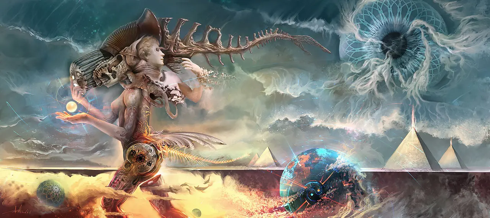

*Tools are extensions of human limbs, computers are extensions of the brain, and writing is thinking itself.*

## About the Author

I'm a designer, and if you've made it to this page, you've probably seen some of my work already.

As an [INFJ](https://www.16personalities.com/personality-types/infj-personality), I spend my free time reading, writing, keeping fish, painting, and exploring various electronic gadgets.

My professional focus spans several areas:

1. Digital Motion Visual Design
2. Front-end Product Development  
3. Writing
4. Personal Fine Art

When it comes to commercial work, I see it as simply earning a living. Most client projects don't make it into my portfolio—even though I created them, the collaborative nature with clients and colleagues means I rarely consider them purely "my" designs. They're products, not personal artworks. The few projects that do end up in my portfolio are those that genuinely resonate with me—either because they touch on areas I'm passionate about, align with a client's aesthetic vision, or challenge my skills in meaningful ways.

To be honest, since around 2019 I've rarely worried about finding clients. This stability, while comfortable, led to some complacency and procrastination at times. I've come to realize that commercial design is fundamentally a negotiation—an art of compromise that I'm still learning to master.

But those periods of relative slack weren't wasted. Working with computers daily, I've developed a genuine fascination with the technology itself. I feel fortunate to live in an era where such powerful tools are accessible.

It's like skating across an endless dark ice lake without skates—thrilling and slightly precarious. From building private servers and DIY NAS systems to creating my first personal website, I've discovered the elegant simplicity of keyboard-driven computing. (As someone who primarily uses mouse and graphics tablet for design work, this keyboard-centric approach feels refreshingly different.) This journey has brought me immense satisfaction and led me to what truly excites me: creative expression.

## About This Site

This website represents a long-held dream of mine—to have a personal space online where I can share my creative journey.

Think of it as a container for my public creative world.

The primary medium for this exploration is [CG Art](https://en.wikipedia.org/wiki/Computer_graphics), and since the entire process feels like a continuous experiment in creativity, "CG Art Lab" felt like the perfect name.

## Website Sections

This site is organized into several key areas:

- **Posts**: Where I share my experiences and insights across technology, design, and knowledge management—everything from technical tutorials to design philosophy and tool evaluations.
- **Works**: A showcase of my personal design projects and artistic creations, spanning digital visual design and front-end development work.
- **Links**: A curated collection of websites, tools, and resources that have inspired me, forming a personal knowledge network.
- **About**: This section—where I introduce myself and share the vision behind this website.

## Disclaimer

- **Original Content**: Unless otherwise noted, all content on this site is my original work. When referencing others' work, I properly cite sources and respect copyright.
- **Personal Views**: The opinions expressed here are my own and don't represent any organization. They're not intended as professional advice.
- **Technical Content**: Code snippets, tutorials, and technical guides are provided for educational purposes. Please adapt them to your specific needs—I'm not responsible for any issues that may arise from their use.
- **External Links**: While I may link to third-party sites, I don't control their content. Please use your own judgment when visiting external resources.
- **Privacy**: This site doesn't collect personal information. Comments are handled through third-party services like Giscus—please review their privacy policies for details.

## Tools as Extensions of Human Limbs

There's a saying that "tools are extensions of human limbs"—fans extend our hands, wheels extend our legs, telephones extend our voices and ears. By that logic, computers extend our minds. I've explored this idea in [several articles](https://cgartlab.com/en/tags/knowledge-management/) about digital note-taking as a tool for thinking.

Ultimately, whether I'm designing, writing, or coding, it's about leveraging computers as creative tools—learning to understand, master, and refine them to solve real problems more effectively.

Computers were created by some of the brightest minds on Earth. Like most people, I often struggle to make technology work exactly the way I want. My approach is simple: **identify the right problems, develop the necessary skills, and grow to deserve the tools I want to use.**

Finding problems is easy; asking the right questions is harder. Once I've invested the effort to identify meaningful challenges, documenting both the questions and their solutions becomes inherently valuable.

## Writing is Thinking Itself

I used to avoid documenting my problem-solving processes—whether it was finding a keyboard shortcut or building a Hackintosh system. It seemed tedious, and I assumed the information would quickly become outdated in our fast-moving tech landscape.

I now realize this was a mistake. While specific techniques (the "how") may change, the underlying principles (the "why") remain relevant.

So I've committed to documenting my journey—the creative processes, technical discoveries, and personal insights that shape my work. This documentation serves primarily as a way to hold myself accountable to high standards.

Whether you find value in it too—well, that's a conversation I'd love to have.
