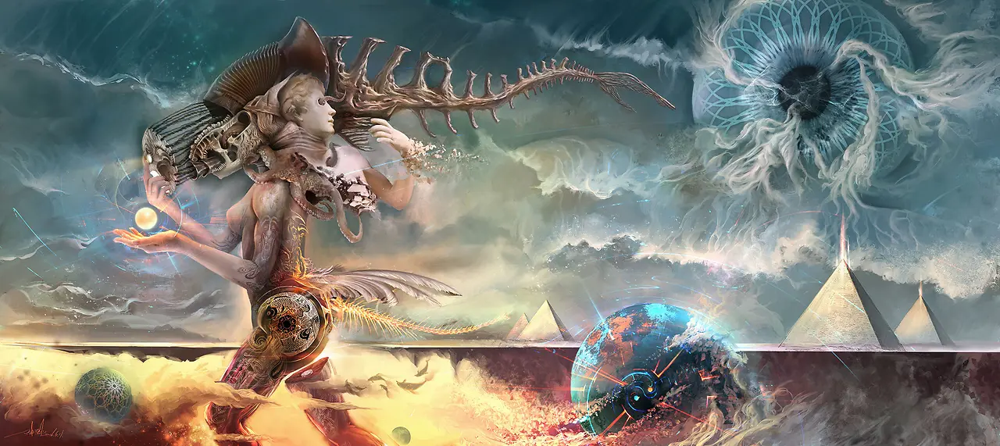
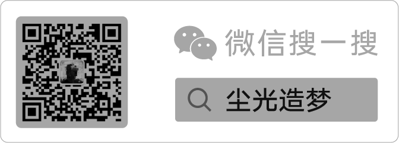

*工具是人類肢體的延伸，電腦是大腦的延伸，寫作是思考本身。*

## 關於作者

我是一名設計師，能點開這個頁面相信你看過我的作品了。

[INFJ](https://www.16personalities.com/ch/infj-%E4%BA%BA%E6%A0%BC) 型，平時愛好看書寫字，養魚畫畫，還有各種電子產品。

目前我從事的領域主要有：

1. 數字動態視覺設計
2. 前端產品研發
3. 寫作
4. 個人純藝術作品

商業部分，就是收錢辦事，純粹為了吃飯。做的東西十有八九我都不會放到自己的作品集裡，雖然出自我手，但有客戶和同事參與，一般我不認同那是我設計的。而且它們不是作品，是商品。剩下會收錄到作品集裡的一二，是感覺相對不錯的，值得多花些精力弄一弄。這些項目裡，有的是因為涉及到自己感興趣的領域，有的是和客戶的審美氣味相投，還有的是因為有對自己的能力有一定的挑戰，能占一條就會引起我的注意。

講句可能欠揍的話，大概從 2019 年之後，我幾乎沒怎麼擔心過會沒有客戶來找自己做生意，可能因為這一點，中間有段時間還是鬆懈了，做事總是拖延的心態。還有個我覺得很重要的原因是，商業性質的設計產物，本質是談判的產物，而談判終究是一門妥協的藝術。這門藝術，我的修煉還差得很遠。

但是這段零散時間的鬆懈，好在沒有浪費掉。

工作，整天和電腦打交道，首先對電腦本身我就很有興趣，經常暗暗開心自己可以活在有電腦用的偉大時代。自然就泡在和電腦相關的各種自覺有趣的事物上。

就像在無邊無際的暗夜冰湖上打出溜，冰刀都不穿。從搭建私人的服務器，DIY Nas，到建立第一個真正屬於自己的網站，慢慢體驗只使用鍵盤敲命令和各種快捷鍵來控制電腦的簡潔和優雅（因為做設計一直都在用滑鼠和繪圖板，反而感到這樣有些笨拙），這個過程有一種說不出的愉悅。這就要說到真正讓我興趣盎然的事，創作。

## 關於本站

本站是我的個人創作之一，起心動念很久，一直想在網上有個屬於自己的容器。

容器裡的內容，是我可以公開的精神世界。

創造精神世界的主要手段是 [CG 藝術](https://baike.baidu.com/item/CG%E8%97%9D%E6%9C%AF/6030742)，整個創造過程也是一次精神實驗，所以就叫【CG藝術實驗室】吧。

如果你更喜歡使用微信，可以關注我的微信公眾號「塵光造夢」。

## 許可協議

本網站採用雙重許可策略：

### 內容許可

**文章、設計作品、圖片等創意內容**採用 [知識共享署名-非商業性使用-相同方式共享 4.0 國際許可協議](https://creativecommons.org/licenses/by-nc-sa/4.0/) (CC BY-NC-SA 4.0)

**這意味著您可以：**

- ✅ **分享** - 在任何媒介或格式中複製和重新分發材料
- ✅ **改編** - 基於本作品進行修改、轉換或創作衍生作品

**在以下條件下：**

- 📝 **署名** - 您必須給出適當的署名，提供指向本許可協議的鏈接，並標明是否對原始作品作了修改
- 💰 **非商業性使用** - 您不得將本作品用於商業目的
- 🔄 **相同方式共享** - 如果您再混合、轉換或者基於本作品進行創作，您必須基於與原始作品相同的許可協議分發您貢獻的作品

### 代碼許可

**主題代碼、腳本、配置等軟件部分**採用 [MIT License](https://opensource.org/licenses/MIT)

### 使用說明

- **引用內容時**：請註明來源 "CG藝術實驗室" 並鏈接到原文章
- **修改或衍生作品**：必須採用相同的 CC BY-NC-SA 4.0 許可
- **商業用途**：請聯繫作者獲取商業授權

## 免責聲明

- **內容原創性**: 本網站所發布的原創內容，如無特別說明，均為本人獨立創作。引用他人作品時會標註來源並遵守相關版權協議。
- **觀點表達**: 文中所述觀點僅代表我個人立場，與任何機構或公司無關，也不構成專業建議。
- **技術內容**: 技術文章中的代碼、教程等僅供學習參考，請根據實際情況調整使用，本人不對因使用相關內容造成的任何損失承擔責任。
- **外部連結**: 本站可能會提供第三方網站的連結，但不對這些網站的內容負責，訪問者需自行判斷內容可靠性。
- **隱私保護**: 本網站尊重用戶隱私，不會收集用戶的個人信息，評論功能使用第三方服務（如 Giscus）請參閱相應服務的隱私權政策。

## 工具是人類肢體的延伸

聽說過這麼一句，講"工具是人類肢體的延伸"。比如扇子是手的延伸，輪子是腿腳的延伸，電話是口耳的延伸。以此類推，看來電腦是人腦的延伸，我也寫過[很多篇文章](https://cgartlab.com/tags/%E7%9F%A5%E8%AD%98%E7%AE%A1%E7%90%86/)來分享這個，裡面粗略講了我自己怎麼看待數位筆記這個工具，實際上廣義層面上看，做設計也好，寫文章、敲代碼也好，都是在說如何用電腦這個工具去更好的創作，去更好的認識，熟悉，打磨這個工具，讓它更順暢高效地解決實在的問題。

計算機是這顆星球上最聰明的一群人設計的，和我一樣的大部分普通人很難讓電腦去真正適應自己，經常無從下手。對此，我自己有一套底層邏輯是：**找到準確的問題，提升自己的實力，以配得上自己想用的工具。**

準確的找到問題是容易的，找到準確的問題相對難一些。既然花時間好不容易找到了，把這些問題，包括解決這個問題的過程記錄下來，本身就是一件有價值的事情。

## 寫作是思考本身

擱以前，我遇到的每個問題，小到去搜一個快捷鍵，大到去攢一台黑蘋果主機，都不會想把這些過程記錄下來，第一覺得麻煩，第二是覺得技術更新這麼快，這些方法甚至可能一段時間就過時了。現在看來，大錯特錯。

這些技巧和方法，雖都是"術"，但這種思想，不符合"道"。

我決定還是老老實實記錄這些過程，這終究是屬於我自己的創作、技巧、經驗、思考，路始終只有自己在慢慢走，公開發布出來更多是讓這些內容先過得掉自己這關。

再談你是否喜歡。
