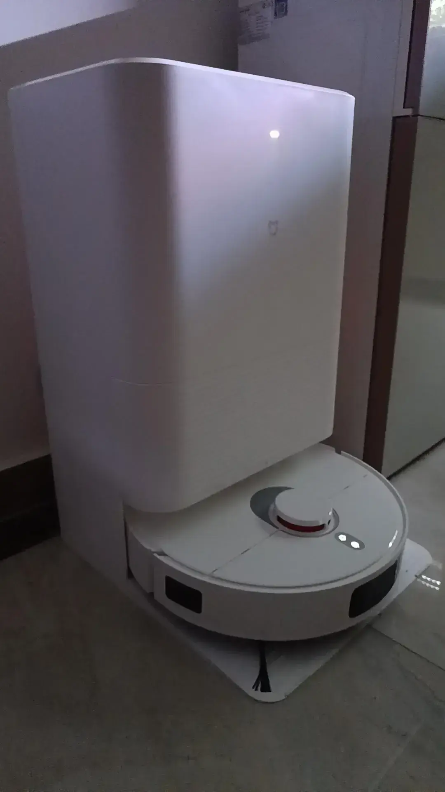
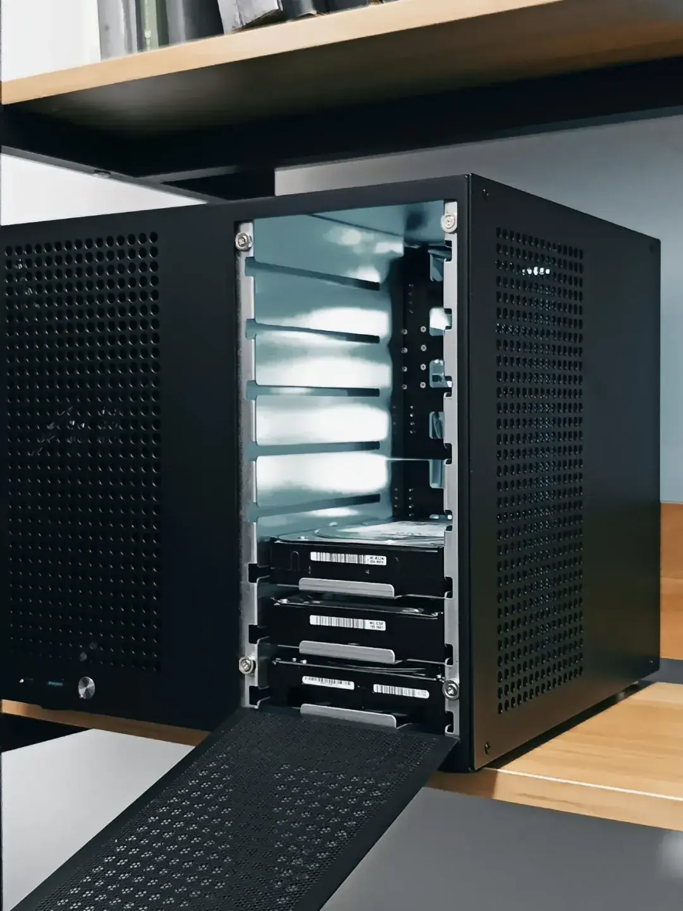
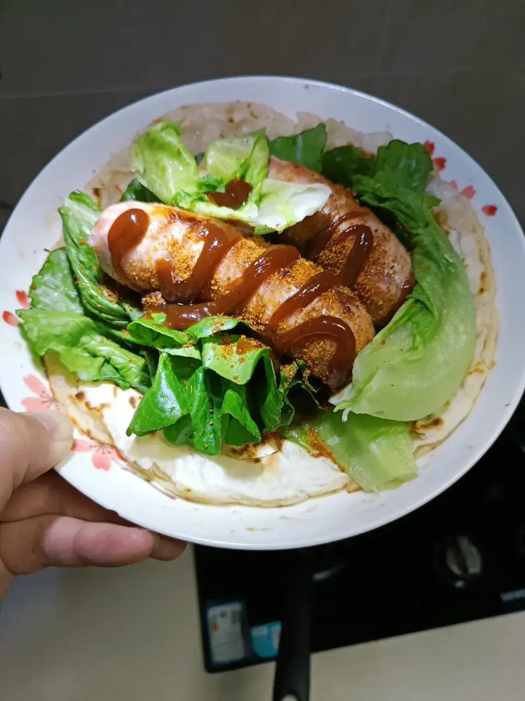
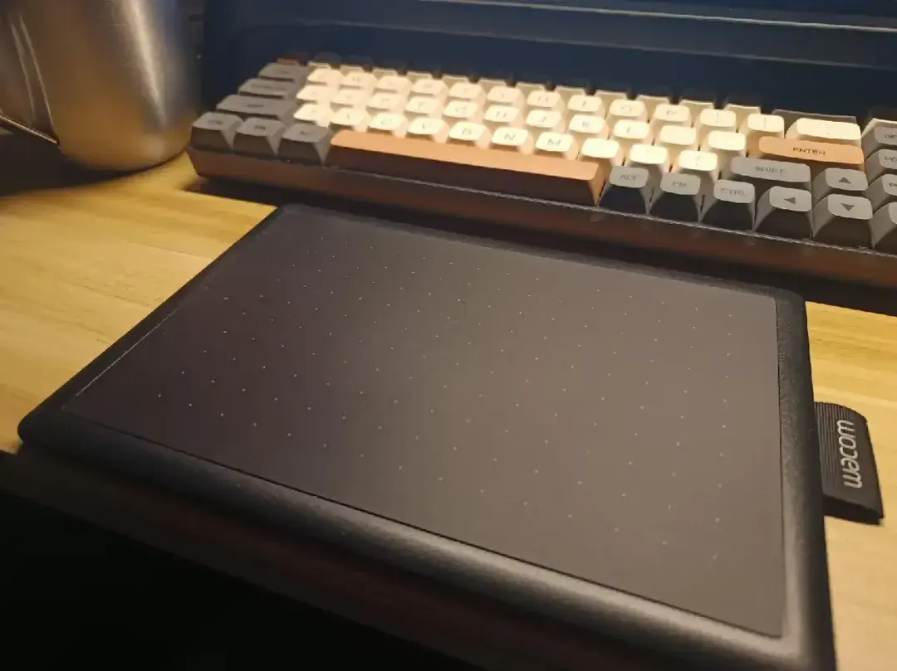
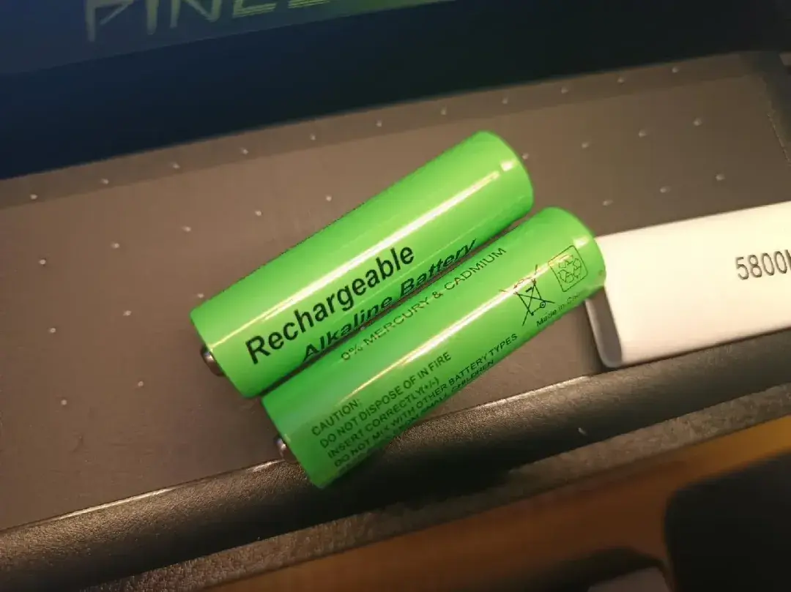

## Mi Robot Vacuum M30

Why: I got a cat. Enough said.

Price: 1,919 CNY, bought with coupon and national subsidy. Accidentally ordered the auto water refill version — my bad, I thought the base model didn't come with a water tank. Listed it on Xianyu for 520 CNY the next day.

Experience: First time using a robot vacuum. Not sure if this is considered loud, but the fact that I'm mentioning it probably means it is. Efficient though — 120 sqm apartment, 80+ sqm of cleanable floor, finished in about 80 minutes. It supposedly collects new data each run and gets smarter over time.

Rating: 4/5

## Sagittarius 8-Bay NAS Case

Why: My old DIY NAS used a Huntkey GS400 full-tower case with only two 3.5" drive bays. Way too big. This one fits perfectly on a bookshelf.

Price: 359 CNY, including a set of eight SATA cables.

Experience: Took about an hour to assemble. Runs smoothly with noticeably lower noise than before. A proper NAS case makes all the difference.

Rating: 5/5

## Royal Tiger Scallion Pancakes & Volcanic Rock Sausages

Why: Recommended by a friend. Decent flatbread options are hard to come by in the south. Good for a quick meal when I'm too busy to cook.

Price: 72.16 CNY.

Experience: Tastes great and super convenient. Just throw them in a dry pan, slow-fry on low heat, flip 4-5 times once softened, and they're done.

Rating: 5/5

## Nutro Wholesome Essentials Cat Food

Why: My cat was getting bored with the domestic brands. Time for a change of palate.

Price: 170 CNY. Imported cat food is seriously expensive — I'd never normally splurge on this.

Experience: Can't say I've tasted it myself, but my cat goes absolutely nuts for it. Even mixed with old food, she picks out the new pieces. No loyalty to local brands whatsoever.

Rating: 4/5

## Wacom Tablet Screen Protector

Why: I accidentally set a hot mug on the original screen protector and it curled right up.

Price: 12 CNY.

Experience: Better than the stock one. Perfect fit, and the black matte finish is nearly invisible once applied.

Rating: 5/5

## Alkaline Rechargeable Batteries

Why: Never enough batteries.

Price: 13 CNY, four AA and four AAA.

Experience: Installed on the 11th, keyboard still at 60% capacity. Haven't swapped the mouse yet — battery life should be even longer there. Rated at 3000mAh, though capacity doesn't really matter for my use case (keyboard and mouse). I prefer replaceable batteries over built-in lithium because you can charge one set while using another. No downtime, no capacity degradation worries. A well-chosen keyboard or mouse can last indefinitely with replaceable batteries — I'll write a detailed post about this later.

Rating: 5/5