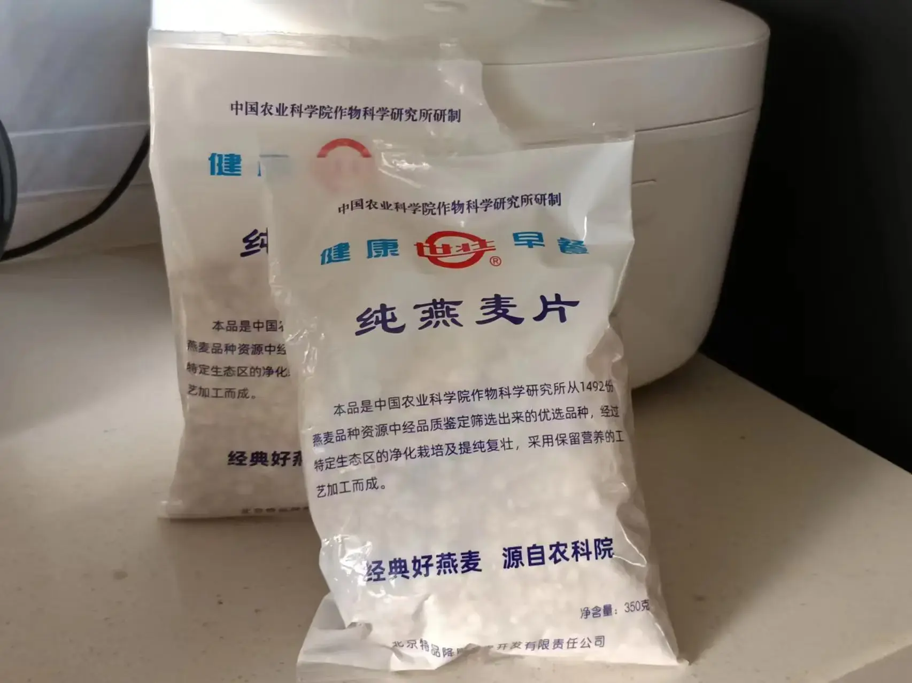
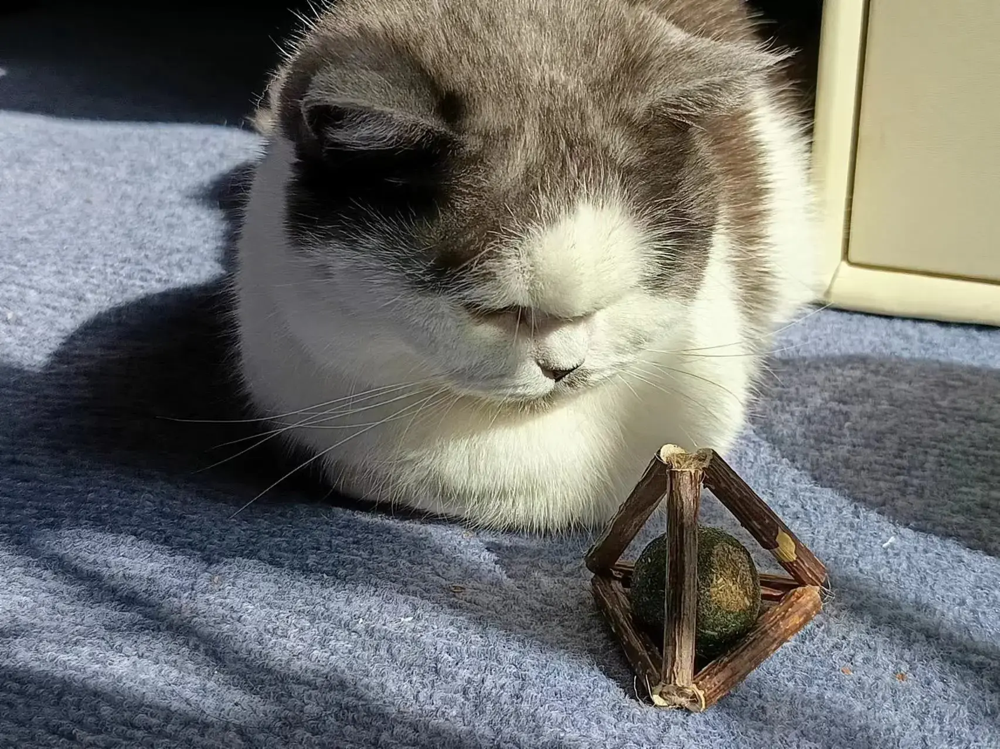
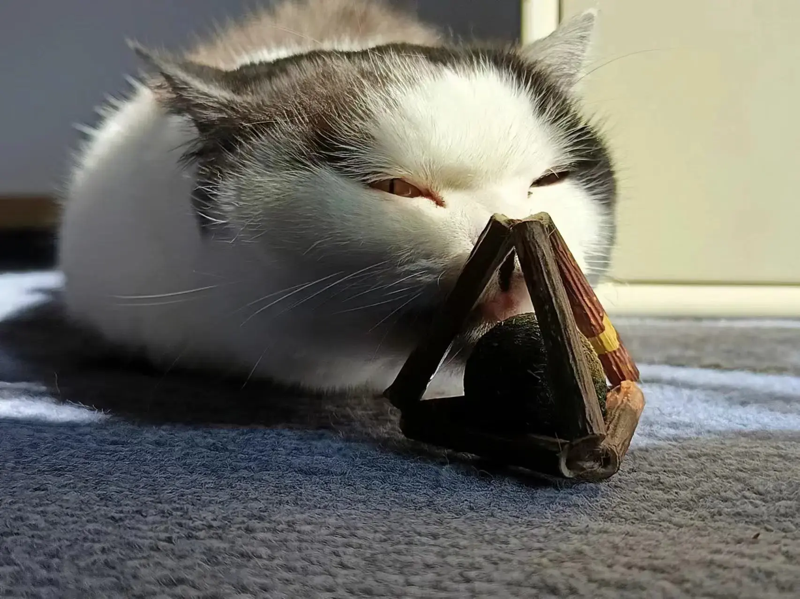
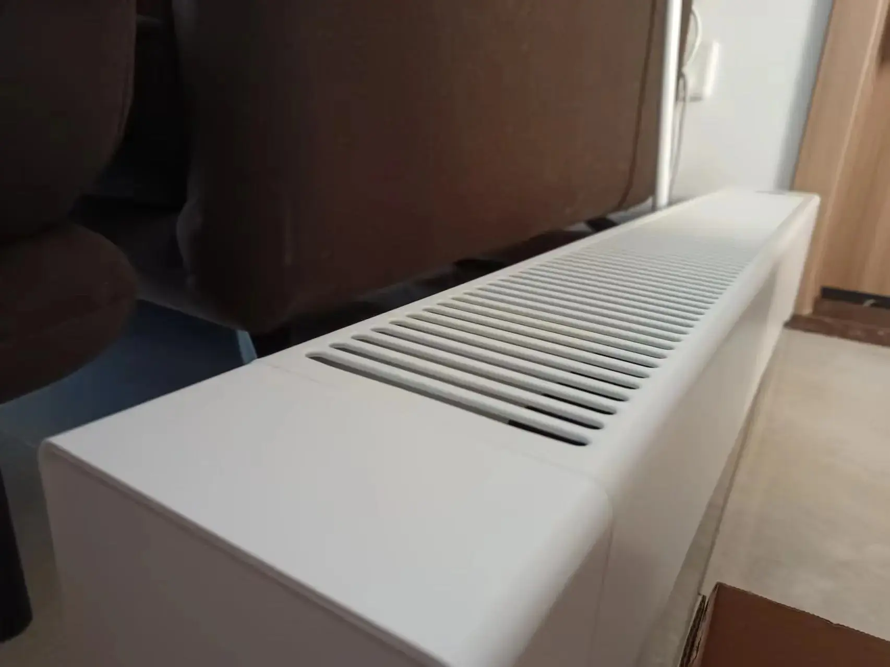
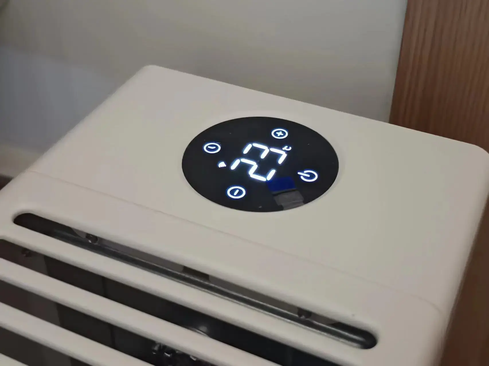
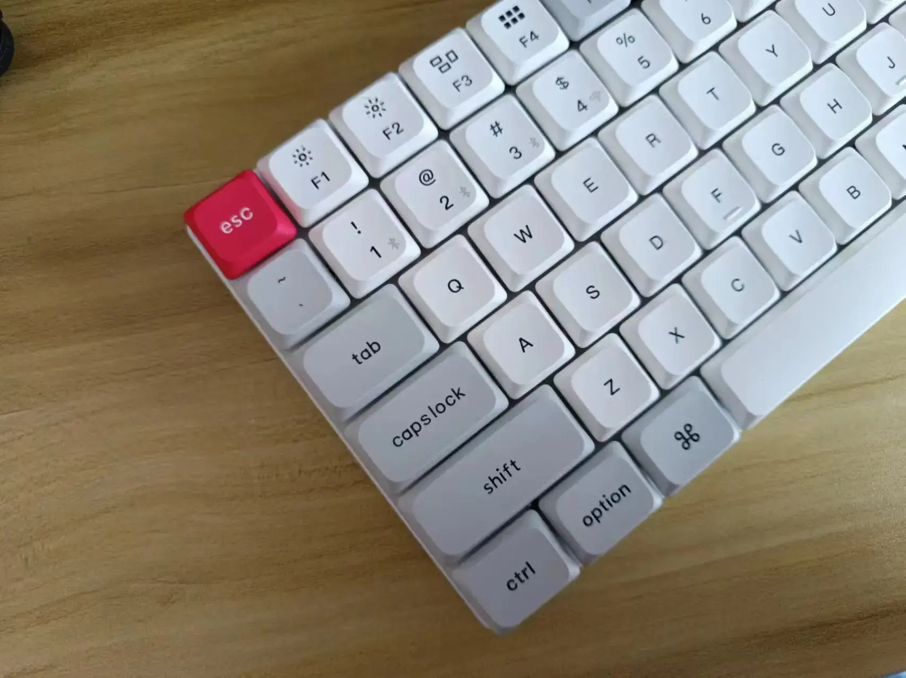
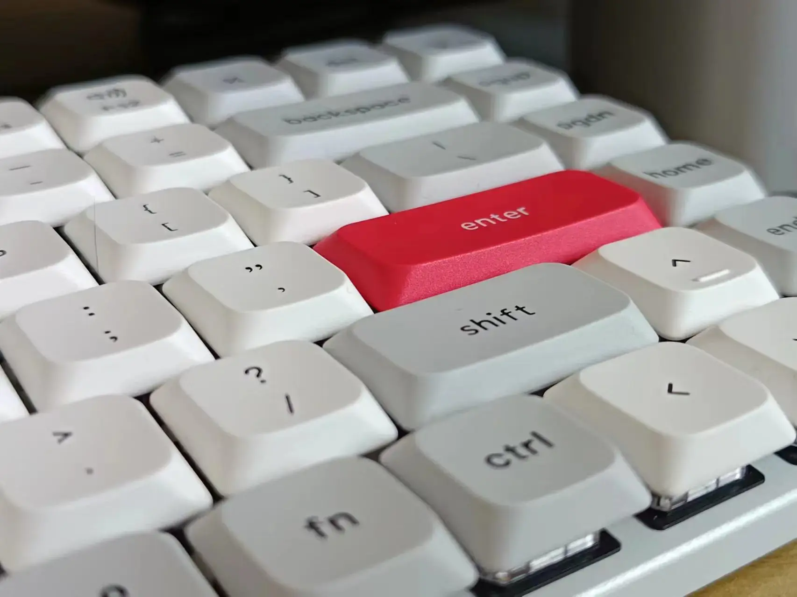
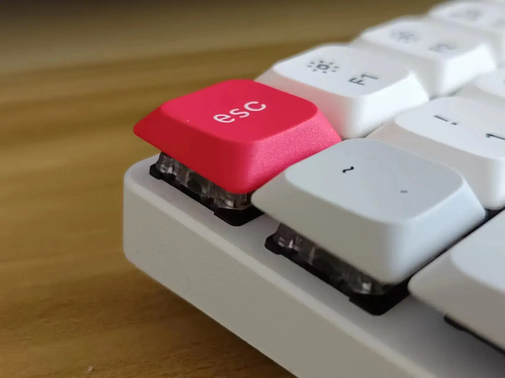
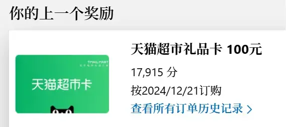

## Academy of Agricultural Sciences Sugar-Free Oatmeal

A breakfast oatmeal recommended by a friend during my study abroad days. Nothing fancy — just pure oats with packaging that looks straight out of the 90s. Hydrates easily, 3-5 minutes in hot milk, or simmer slowly for about 10 minutes. I've been off sugar for a while and find myself disliking sweet foods more and more.

Price: 29 CNY

Rating: 4/5

## Pidan Silvervine Catnip Teething Toy

Recommended by [Midnight Pancake](https://sspai.com/u/tfobrtc6/updates) blogger. When I first brought my cat home, she loved chewing on plants — the pothos and monstera survived, but the areca palm was nearly stripped bare within a month. Got this toy hoping to redirect her attention. Oddly enough, she only licks the catnip ball inside and ignores the silvervine outer layer. The ball's surface is already worn from licking. At least she's stopped terrorizing the plant, so I'll call it a win.

Price: 16 CNY

Rating: 4/5

## Mi Graphene Baseboard Heater

My parents planned to spend Chinese New Year in Kunming this year. My old small heater wasn't enough, so I got this one. Kunming isn't really cold, but a heater is still essential for winter indoors. As everyone knows, nine out of ten southern Chinese cities have a cold that cuts right through your clothes — layering up doesn't help. This thing heats up in seconds. Default is 1500W, but holding the plus button for 7 seconds unlocks 2200W. A 50 sqm living room gets warm in about 20 minutes.

Looks good too — white goes with anything. Works with the Mi ecosystem: set it to auto-shut off when you leave the neighborhood, and pre-warm the room when you're on your way back.

Price: 599 CNY (with national subsidy)

Rating: 5/5

## [Keychron K3 Max](https://www.keychron.com/products/keychron-k3-max-qmk-via-wireless-custom-mechanical-keyboard?srsltid=AfmBOorMoKAj_5yPAmRg-PfyFkV-ZdzE7aIVBDyN_hrtkZjRJsGqUyNd) Low-Profile Mechanical Keyboard

I published some articles on [SSPai](https://sspai.com/u/cgartlab/posts) last year and earned a modest sum in writing fees. Besides stocking up on cat food, I wanted to reward myself for sticking with writing. Picked this up during the Double 12 sales. SSPai had a co-branded version too, but only with hot-swappable sockets. I figured low-profile switches aren't worth modding — keycap options are limited and the tinkering appeal isn't there. Better to just write more and earn my cat some treats.

The keyboard feels solid and has a satisfying heft. I went with the red switches. Paired with custom key mapping and RIME + RimeFrost Pinyin, I'm hoping to push my typing speed further. The battery is a bit small at 1500mAh. Heavy use over Bluetooth without backlighting lasts about six days — acceptable given how thin it is.

I was also eyeing the [NuPhy Air60 Wireless Mechanical Keyboard](https://nuphy.com/products/air60), which also supports both Windows and Mac with a 60% layout. But after reading reviews mentioning inconsistent quality control, I decided to pass.

Price: 433 CNY

Rating: 5/5

### Microsoft Rewards — Tmall Supermarket Gift Card

Stumbled upon this by accident. As a designer, I use search engines daily. One day I got an email from Microsoft saying I had enough points to redeem something. I always thought Microsoft Rewards in China could only be exchanged for game packs, not cash vouchers.

Tried it out of curiosity, and it actually worked. Earning points is dead simple: just use Bing with your Microsoft account. No need to grind tasks or fight with app gimmicks. The only cost is time. I think it's worth recommending — a little surprise for your future self.

Price: 0 CNY

Rating: 3/5

OK, new year, new direction, still on the road.