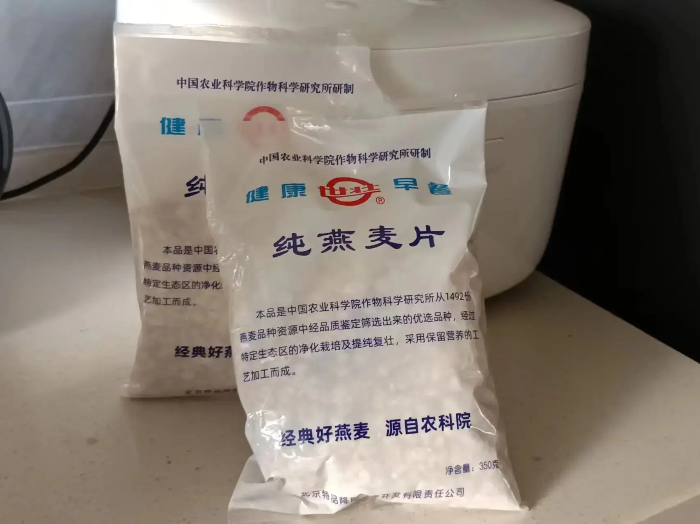
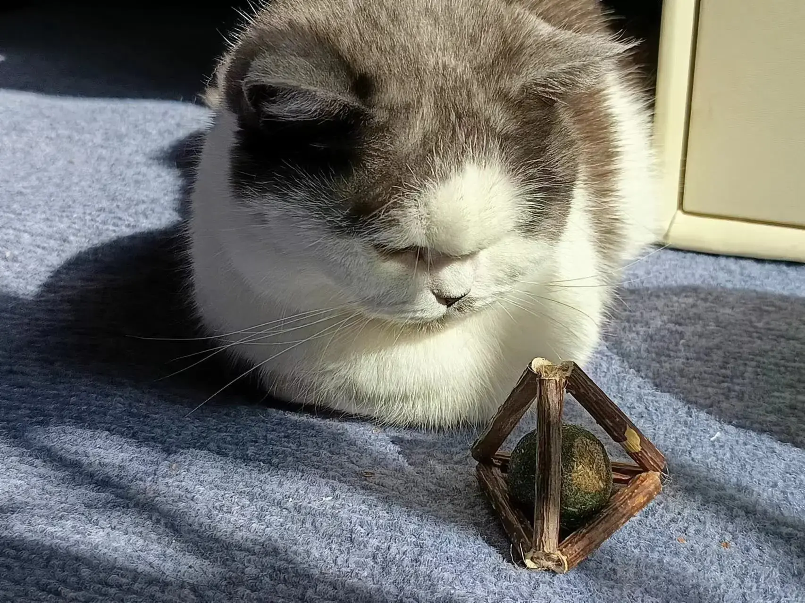
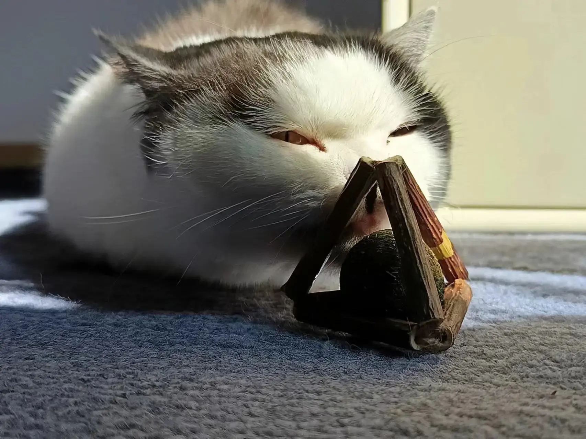
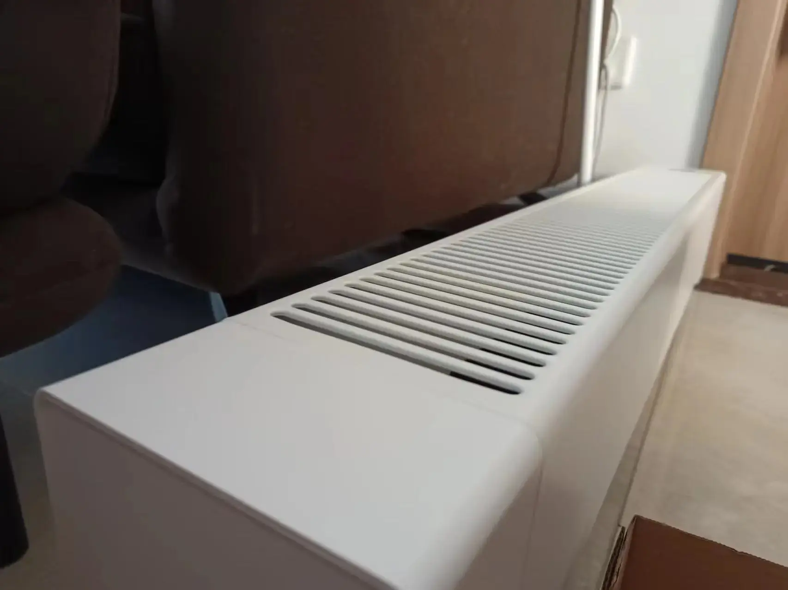
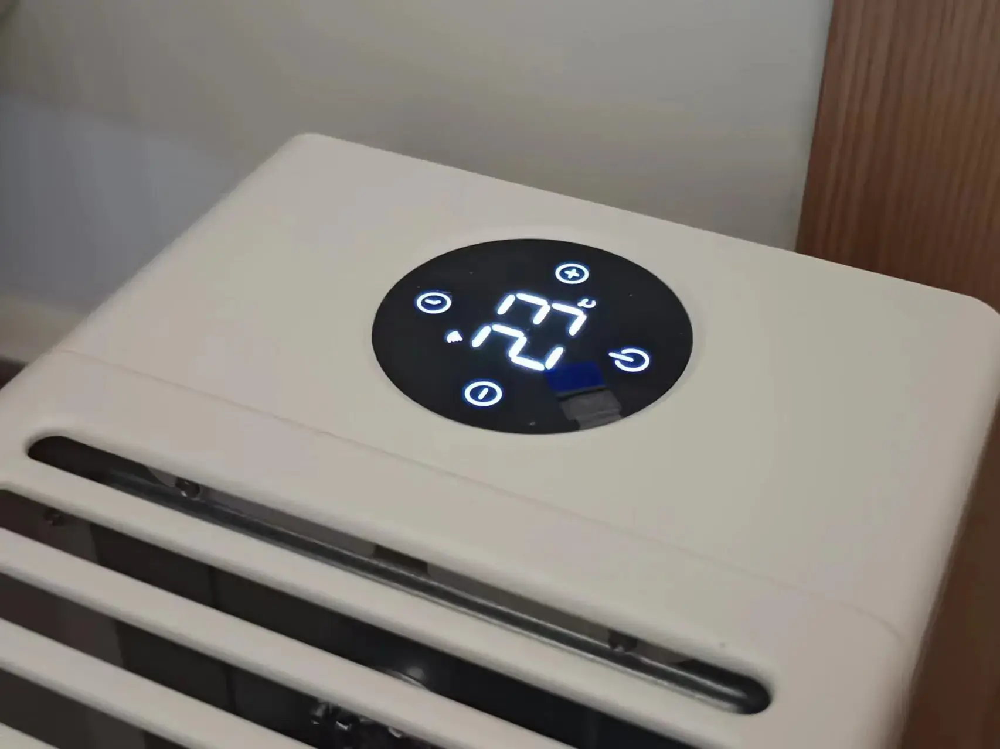
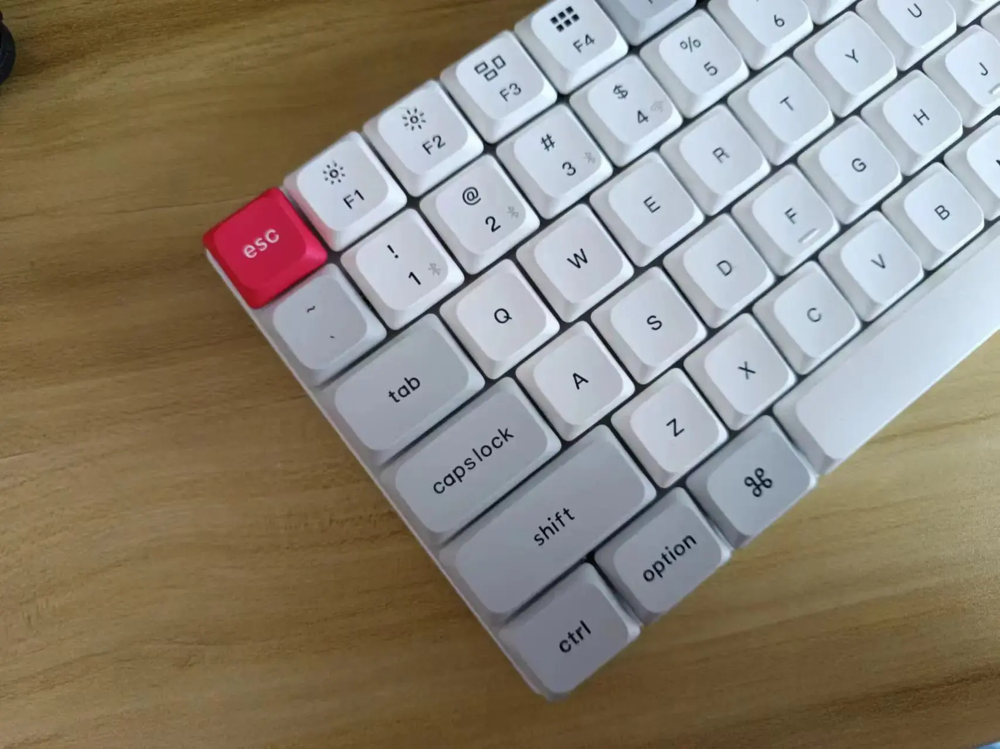
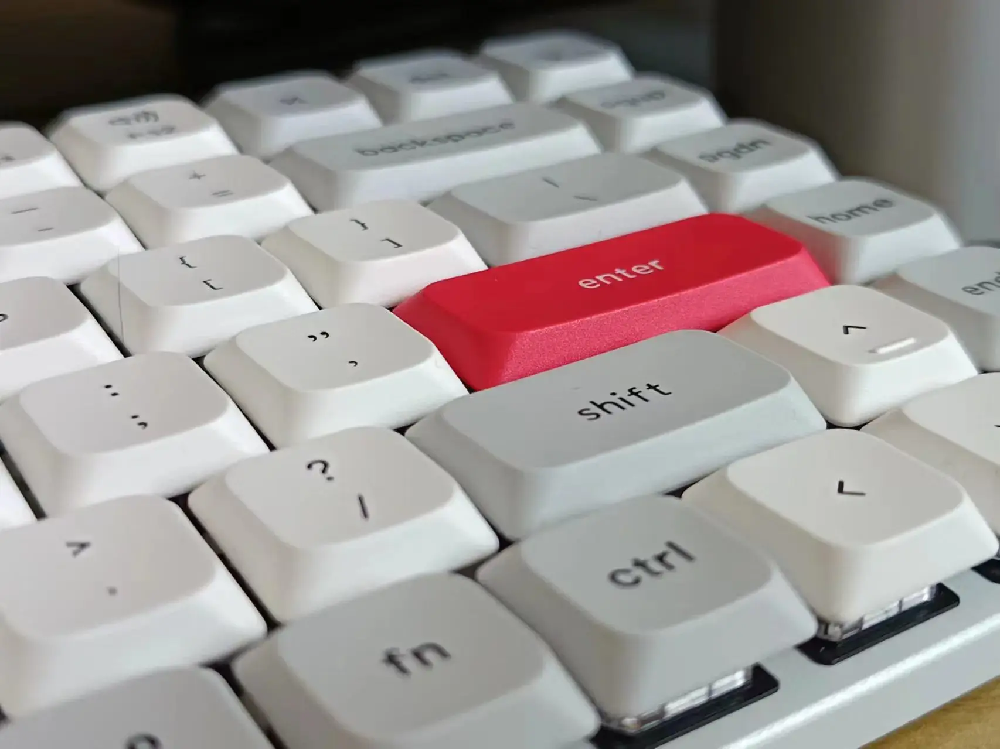
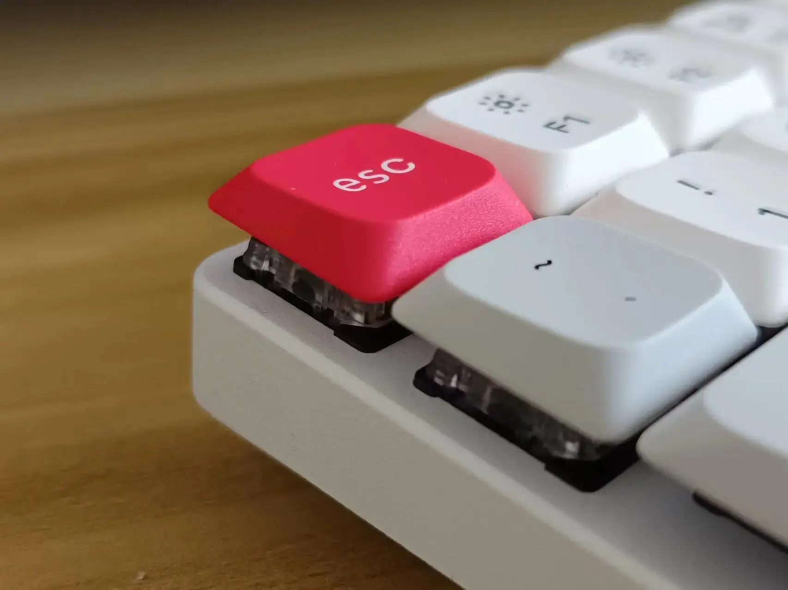
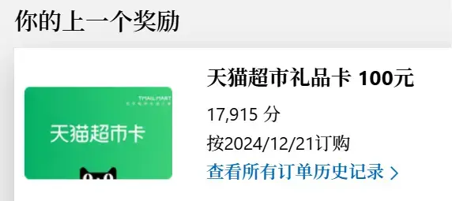

## 农科院无蔗糖燕麦

留学期间被朋友安利的一款早餐燕麦，没什么特别的，就是纯纯的燕麦，包装仿佛来自上个世纪 90 年代。很容易泡开，热牛奶 3-5 分钟就好了。也可以小火慢煮 10 分钟左右。我个人戒糖，时间久了越来越不喜欢甜口儿的食物。

价格：29 元

评价：⭐⭐⭐⭐

## Pidan 木天蓼猫薄荷磨牙玩具

来自 [午夜煎饼](https://sspai.com/u/tfobrtc6/updates) 博主推荐，刚把猫抱家里的时候它喜欢咬花，绿萝龟背竹都幸免了，唯有散尾葵，1 个月左右就快被薅成光杆，所以买了一个这个企图转移一下它的注意力。奇怪的是它只喜欢舔里面的薄荷球，并不喜欢咬外面的木天蓼，你看里面的球都舔掉皮了。不过至少不会天天欺负那盆花，算解决了这个问题吧。

价格：16 元

评价：⭐⭐⭐⭐

## 米家石墨烯踢脚线电暖器

今年爸妈打算来昆明过年，之前我有一个小的电暖器不够用，就买了这个。虽然昆明并不冷，但电暖器依然是冬季室内必备电器，众所都周知，南方城市十个有九个冷空气都属于法穿伤害，多穿是没用的。这玩意儿加热非常快，几秒钟就很热了，默认是 1500 瓦功率，按住加号 7 秒可以解锁 2200 瓦的更高功率，50 平左右的客厅，20 分钟就暖和了。

外观也不错，白色百搭。搭配米家生态，可以设置离开小区后自动关机，回家的时候进入设定范围可以提前让屋子回暖。

价格：599 元（国补）

评价：⭐⭐⭐⭐⭐

## [Keychron K3 Max](https://www.keychron.com/products/keychron-k3-max-qmk-via-wireless-custom-mechanical-keyboard?srsltid=AfmBOorMoKAj_5yPAmRg-PfyFkV-ZdzE7aIVBDyN_hrtkZjRJsGqUyNd) 矮轴机械键盘

去年在 [少数派投稿](https://sspai.com/u/cgartlab/posts)，一轮下来赚到了一小笔稿费，除了充值买猫粮外还想鼓励下自己坚持写作，双 12 就入了这个键盘。少数派也做了联名款，但只有热插拔轴座的，心想矮轴还是不折腾了，键帽不好配可玩性并不高，不折腾多写几个字还能给主子弄点好吃的。

键盘手感很扎实，重量足够压手。我买的是红轴，如果配合自定义改键和 RIME+ 雾凇拼音，码字速度争取再能上一个台阶。电池有点小了，只有 1500 毫安，蓝牙连接，不开背光的情况下重度使用从满电到用完有六天，还行吧，毕竟太薄了不能奢望有太大容量的电池。

同时看上的还有 [NuPhy Air60 Wireless Mechanical Keyboard](https://nuphy.com/products/air60) ，同样对 Win & Mac 双平台适配，60 配列。看了一圈评测说品控不是很稳，没敢上车。

价格：433 元

评价：⭐⭐⭐⭐⭐

### Microsoft Rewards 积分兑换天猫超市卡

我是无意中发现的这个东西，因为做设计经常需要用搜索引擎，用着用着有一天收到一封微软的邮件，说我的积分够数可以兑换了。最开始印象里国内并不能兑换现金券，只能换一些游戏礼包。

抱着试一试的心态，没想到真的可以换，积累分数的条件也非常简单，只要用微软账号登录必应搜索引擎，每天正常用就会有分数，不需要刻意去完成任务，也不需要去什么 App 里和各种套路斗智斗勇。整个过程除了时间几乎没有阻力，个人觉得还是值得推荐一下，可以给自己未来的某一天埋个小惊喜。

价格：0 元

评价：⭐⭐⭐

OK，新的一年，有方向，在路上。
