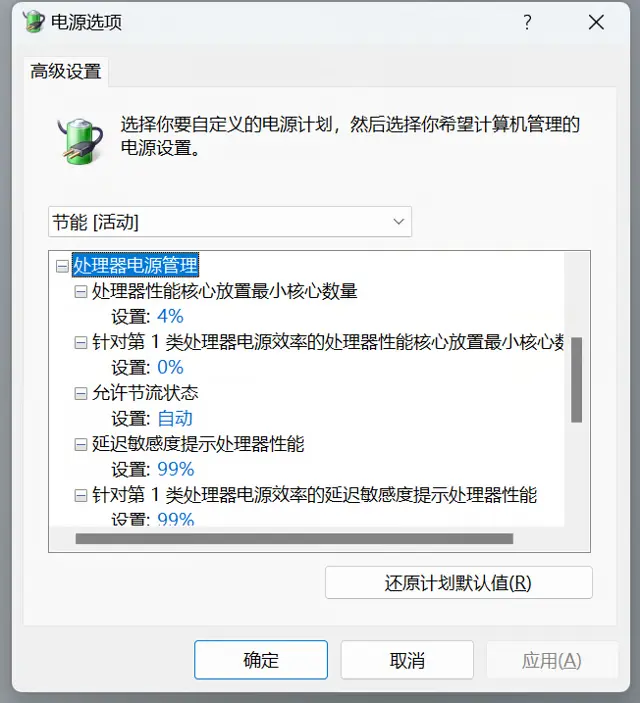
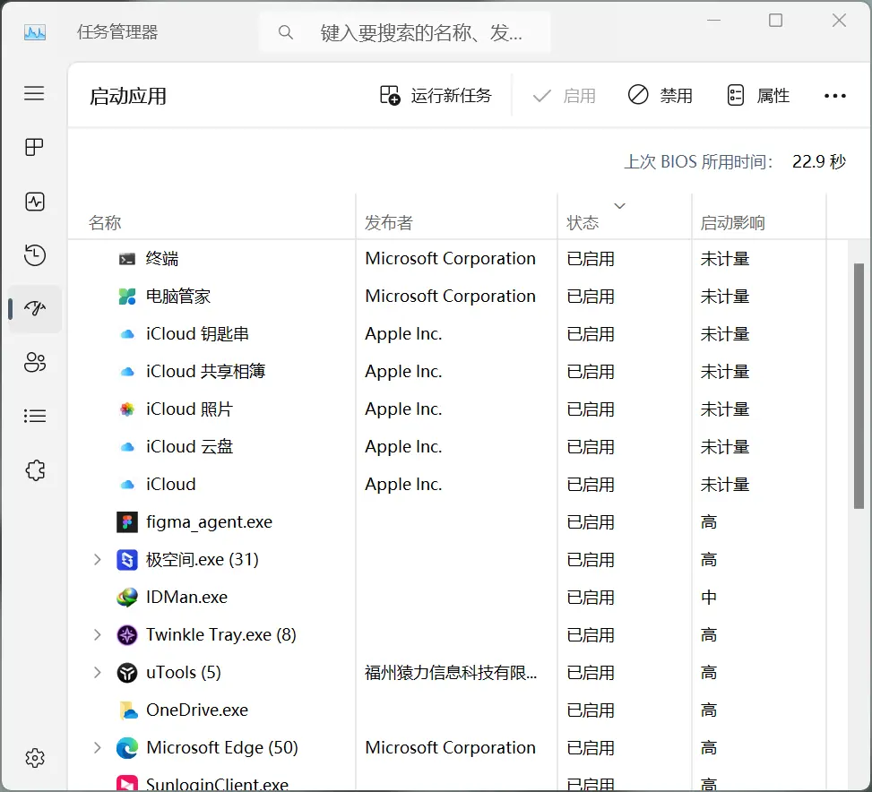
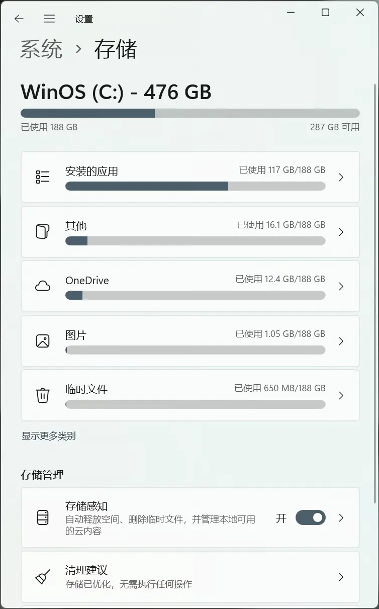
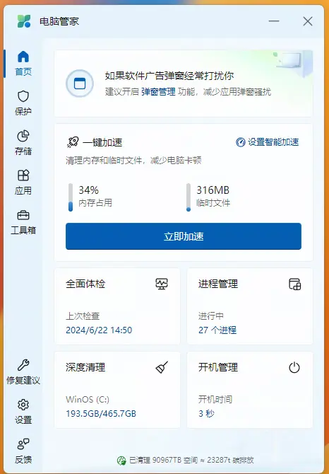
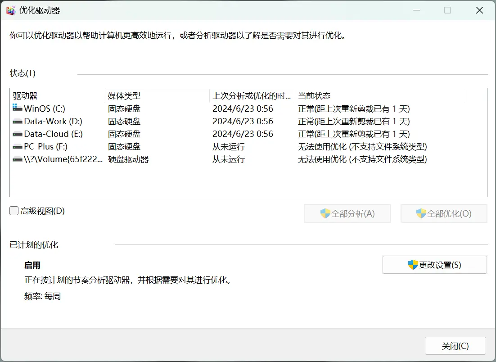
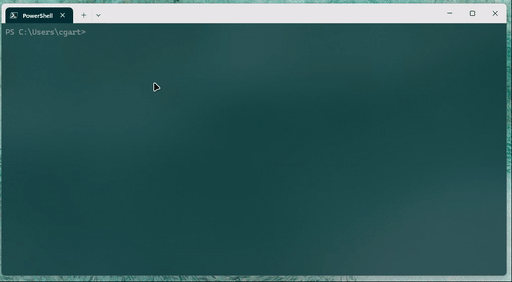

## Introduction

> "A small tool is often more useful than a large one, if it is the right tool for the job." - Proverb

I still remember the excitement of my first encounter with computers, which was over 25 years ago. Since then, I've gone through 3 desktop computers and 4 laptops. Operating systems have evolved from DOS, Windows 95/98/XP/7/8/10/11, to OS X, macOS, Linux, Proxmox, TrueNas. Today, most of our daily time revolves around a computing device.

This article shares my current insights and experiences with using Windows PC. Whether you've just purchased a new PC or are a seasoned veteran who's been working with PCs for years, I believe you'll find some new inspiration and valuable references by reading on.

## What "Elegant Usage" Means

"Elegant usage" means following certain principles: **Simplicity and Intuitiveness, Adaptability and Flexibility, Integration and Compatibility, Cross-Platform Synchronization**.

These principles have been developed and refined through years of personal experience, with the same purpose as the invention of computers: to save time.

In practice, these principles aren't limited to just operating systems but can be applied to any software, and even devices like smartphones, cameras, tablets, e-readers, etc.

- **Simplicity and Intuitiveness**

    The tools you choose should be easy to use, with clean and clear interfaces that are straightforward to learn.

- **Adaptability and Flexibility**

    The tools you choose should be adjustable and customizable according to different needs.

- **Integration and Compatibility**

    The tools you choose should seamlessly integrate with other tools and platforms.

- **Cross-Platform Synchronization**

    The tools you choose should synchronize across multiple devices and platforms.

## Initial Setup and Optimization

When you get a new computer or reinstall the system, don't rush to install software. If you've previously registered a Microsoft account, I recommend logging into the system with that account directly. Edge browser and OneDrive cloud storage will automatically sync settings, history, and file data from your old computer in the background, effectively creating an automatic backup for this transition.

## Basic Settings

On first boot, I always make it a habit to disable and remove some built-in but unnecessary software and features, such as mini-games, system prompts, sidebars, search boxes, personalized ad recommendations, etc. I delete all icons from the desktop to make it extremely clean, since launching programs or searching for files only requires a few keystrokes, as I'll mention below.

Meanwhile, update drivers and install the latest system patches. Windows releases monthly patch updates, and I recommend installing them—**no one understands Windows better than Microsoft itself.** For drivers, I prefer using the Microsoft-certified drivers provided through system updates first. If you don't play games, there's no need to chase the latest versions; stability for work is what matters.

While waiting for background updates, I do some personalization configurations. I usually collect favorite wallpapers in OneDrive, and for series wallpapers, I create single theme files for easy switching.

Other optional custom settings:

- Taskbar: Hide search button, task view button, widgets, chat.
- Start Menu: Hide recently added apps, frequently used apps.
- Folder Options: Set first opening to display "This PC," show file extensions.

Finally, restart once to complete the basic setup.

## Built-in Input Method

Actually, Windows' built-in input method is already quite good. One very practical technique is **U-mode for rare characters**.

For example, if you need to input "叕" but don't know how to spell it, just type "u" first, then type four 'you's in a row, and you can directly find this character.


There's also **V-mode calculator**, for example, typing "v12*15" directly outputs the calculation result.


## Common Keyboard Shortcuts

After long-term computer use, you'll definitely realize that keyboard operations are much faster than clicking around with a mouse. Life is short—whether in the system or software, memorizing a few more shortcuts and forming habits can truly save a lot of time.

Common system-level shortcuts:

```bash
Win + E: Open File Explorer (My Computer)
Win + Tab: Open multitasking interface, keep pressing Tab to switch applications
Win + L: Lock screen
Win + D: Return to desktop
Win + P: Switch display mode (projection or external monitor)
Win + Left/Right Arrow: Switch window left/right alignment
Ctrl + Win + Left/Right Arrow: Switch virtual desktops
Ctrl + Shift + Esc: Open Task Manager
Ctrl + C/X/V: File data copy/cut/paste
Ctrl + Z/Y/A: File data undo/redo/select all
```

Besides system-level shortcuts, I also recommend memorizing frequently used shortcuts within specific software, or even customizing them to be more memorable and better suited to your habits. For example, when creating digital paintings, I set the smudge tool in Photoshop to "N", which happens to be next to the brush shortcut "B", making the painting process smoother.

If I mention common operations later, I'll note their corresponding shortcuts if available.

Don't underestimate these small habits and changes—they accumulate over time and can save significant amounts of time while reducing unnecessary repetitive actions.

## Performance Optimization

A PC's performance always revolves around CPU and memory.

### Default Hidden Power Settings

There are various power modes available in Control Panel. I usually choose customized "Power Saver" or "Balanced" modes.

Windows 11 offers many advanced power setting options for Intel 12th generation and later CPUs, allowing better balance between CPU performance and power consumption. However, these settings are hidden by default. According to [https://cn.windows-office.net/?p=17342](https://cn.windows-office.net/?p=17342), you can make more detailed adjustments.

Here are my settings:





Of course, besides Control Panel, you can also make more precise power settings through motherboard BIOS, but the setting options vary between different brand and model motherboards and CPUs. Therefore, for most users, sticking with factory settings is sufficient, and I won't elaborate further here.

### Startup Items

For applications that aren't frequently used or significantly impact startup speed, I recommend disabling their automatic startup. You can view and manage startup items in the "Startup" tab of Task Manager (Ctrl + Alt + Del). Here, you can disable or enable any installed application from starting up automatically. Disabling unnecessary startup items can improve system boot speed.

1. **Right-click Start Menu**: Right-click the Windows logo (Start Menu) in the bottom-left corner of the screen.
2. **Open "Task Manager"**: Select "Task Manager" from the expanded options.
3. **Select "Startup" Tab**: In Task Manager, click the "Startup" tab at the top.
4. **Enable Startup Items**: In the "Startup" tab, find the application you want to set for automatic startup, right-click it, and select "Enable".



On the other hand, don't disable all startup items just to pursue extreme boot speed—prioritize actual needs. Tools like WeChat and Remote Desktop that are used almost daily should naturally be set to start automatically.

### Automatic Junk File Cleaning

I've never advocated deleting files from computers. So-called "junk files" are those that won't be needed in the long term, but whether these files actually affect performance is more of a psychological effect, similar to not being able to stand the notification red dots on phone app icons.

Many "PC managers" and "junk cleaning masters" exploit this psychological effect. Think about it carefully: if a computer's performance were severely affected by "junk files," that would be a design flaw, and Microsoft would necessarily build in functions to eliminate it, likely doing it more reliably than third-party companies. And Microsoft has indeed done this.



As early as Windows 10, there was a built-in feature called "Storage Sense" that automatically cleans temporary files and files in the Recycle Bin. You can find this feature in "Settings" - "System" - "Storage" - click "Configure Storage Sense or run it now" to set up or clean immediately.

My approach is simply to turn on "Storage Sense" and not worry about it anymore.

### Microsoft PC Manager

If you find the above settings too troublesome, you can also consider installing [Microsoft's official PC Manager](https://pcmanager.microsoft.com/zh-cn). I installed this on my parents' computer—no ads, basic functions are sufficient, automatic cleaning and updates, set it and forget it—it's quite good.



### Disk Optimization

Compared to junk files, regular disk optimization can better help improve your computer's performance in my opinion. You can find this function in "Settings" - "System" - "Storage" - "Optimize Drives". Select the drive you want to optimize, then click "Optimize" to start. You can also set a regular optimization schedule.



### Configuring Virtual Memory

Virtual memory is a technology that allows computers to use hard disk space as temporary RAM. When too many programs are opened simultaneously and physical memory is insufficient, the system uses part of the hard disk space to store this data. Hard disks are certainly not as fast as memory, so opening too many programs will naturally cause lag.


Now that SSDs are popular and fast enough, you rarely notice lag during normal use. Currently, most computers start with 16GB RAM, and the system automatically allocates some virtual memory (usually more than 4GB) to handle computational pressure, which is sufficient for over 80% of routine work by default.

If considering future configuration upgrades, I recommend getting sufficient memory from the start. The value of memory is always: capacity > speed. If you have enough memory, turning off virtual memory might actually be better.

## Directory Structure and File Management

As mentioned in my previous article "[Flowing Programs, Solid Data](https://cgartlab.com/posts/流水的程序铁打的数据/)", I established core principles for directory structure and file management:

> **Don't add classifications unless necessary:** The premise is that this classification can be exhaustive. For example, there are only a few types of files, but countless formats.
> **Complete archiving within 1 minute:** I've seen many people know archiving is important, but few can persist for a year. Often, they're already frustrated and tired after work—who has the energy to bother? Actually, with proper classification, 1-minute archiving becomes natural.
> **Try to use English + date numbers for naming:** This is a professional habit, as many professional applications only recognize English paths, and some fonts don't support Chinese, displaying garbled characters.
> **Important files: cold and hot backups once a week each, important files: cold and hot backups once a week each, important files: cold and hot backups once a week each.** You can skip organizing, but please backup—for world peace.

These principles remain solid as ever. For more specific operational methods, you can refer to the original article. Of course, these rules may evolve along with workflow. If there are major changes in the future that prove useful, I'll write another article to introduce them.

## Efficient Workflow and Common Software

The workflow discussed here targets lightweight and general scenarios. Regardless of your specific workflow, proper usage will benefit you.

### Multitasking

```bash
`alt + tab`: Quickly switch between the two most recently opened programs.
`win + tab`: More advanced multitasking interface, virtual desktops can be added at the bottom.
`ctrl + win + left/right arrow`: Quickly switch between virtual desktops.
```

Multitasking seems to be a consensus reached by all graphical operating systems, with even similar shortcuts. Usage is relatively simple, so I won't elaborate further.

Notably, Windows 11 has made many optimizations to window management. Just drag a window near the top of the screen, and preset window sizes will appear. 99% of software adapts well to this function. Compared to previous versions, there are also more grouping options.


### Virtual Desktops

When using only one monitor, I create at least two virtual desktops: one as the "foreground" focusing on heavy work, and another as the "background" handling documents, emails, and replying to messages.

The benefit is naturally reduced interference during work, but it takes some time to get used to. When first using it, you might forget that you have another "desktop" open.


### Templates Are Great

Machines excel at simplifying repetitive work to save people time. The simplest example is clocks—machines that calculate time, counting minutes and seconds year after year for people. And the rules clocks use to calculate time are the "program's" template.

My most commonly used template is **"Project Directory Structure."**

Very simple: each project directory has only three subdirectories storing three types of files that any project would have: documents, project files, and delivery files.

For easy identification and understanding, I name them: `doc`, `pj`, `render`.

Since I've been researching front-end development recently, I've also gotten used to using all lowercase letters for naming.

```bash
project-name
- doc
- pj
- render
```

One more point: if possible, I don't recommend using Chinese for any files or folders in project directories. Most professional software is developed in English environments, and excessive use of Chinese can cause path recognition issues in software.

## Recommended Common Software

For software selection, I still adhere to **"Do not multiply entities beyond necessity."** I'll list them in order of my usual usage frequency. Additionally, all features mentioned are available for free.

## uTools: Launcher, Search

Similar to macOS's "Spotlight Search" but more powerful. Just press `alt + space` to bring up a clean search box that can search for almost anything you're looking for. Before this, I used the system's built-in search in the Start Menu, which works fine as a launcher but that's about it.


Besides being a software launcher, uTools' file search can combine with Everything for lightning-fast performance. uTools can install many practical small tools, such as quickly modifying hosts files, clearing DNS cache, image compression, batch file renaming, color picking, screen recording, CPU performance rankings, common API documentation queries, etc. Some developers have even created many fun little tools for slacking off—quite interesting.

[**Notion](https://notion.so) and [Obsidian](https://obsidian.md): Project Management, Article Writing, Knowledge Base**

Notion + Obsidian can do so much. Notion's deeply ingrained modular design and Database features, combined with Obsidian's local file management and internal bidirectional linking, can help you manage almost all text content. Sharing information with teams is also very convenient, though there are no servers in China, so access is slightly slower. You can use Notion Faster for free acceleration.


All my articles from the past two years have been edited in Notion. For more detailed introduction, you can read this article "[Analyzing the Designer's Second Brain: From Concept to Practice](https://cgartlab.com/posts/second-brain-for-designer/)".

[**Traffic Monitor](https://github.com/zhongyang219/TrafficMonitor): Hardware Resource Monitoring**


A very lightweight, free, open-source small tool for real-time monitoring of main component usage and temperature. Usually, just displaying it in the taskbar is sufficient. Hovering the mouse can also show traffic information. Say goodbye to LuDaShi. For more professional monitoring data, you can use AIDA64.

[Quicklook](https://github.com/QL-Win/QuickLook): **File Quick Preview**


A tool inspired by macOS's spacebar preview feature. Select any file and press spacebar to directly view its content. Commonly used for quickly viewing images, videos, and text documents.

[Twinkle Tray](https://twinkletray.com/): **Keyboard Screen Brightness Adjustment**


This tool is mainly for desktop computers to conveniently control screen display brightness, utilizing monitor DCI technology (supported by monitors from recent years). If you have two or more monitors, you can control them individually or separately adjust brightness. You can place the mouse on the icon and use the scroll wheel to control brightness, or customize shortcuts. In short, you'll never need to manually press the buttons on each monitor again.

Fluent Reader: **Subscription Management**


A clean and beautiful open-source RSS reader with design inspiration from Fluent Design System. Can read locally and synchronize with self-hosted services compatible with Fever or Google Reader API. Supports synchronization with various RSS services including Inoreader, Feedbin, The Old Reader, BazQux Reader, etc., with relatively complete functionality.

Can import or export OPML files for convenient full application data backup and recovery. Provides built-in article views, can read RSS full text, and can also load webpages by default. Supports searching articles using regular expressions or filtering by reading status.

In my own words, RSS is a good antidote to recommendation algorithms. I'll write a separate article later to discuss the ancient RSS.

## Terminal and Command Line

The biggest advantage of using the command line is that simple one-line commands can execute a series of operations, avoiding the need to click around with a mouse and remember various button and menu positions.

You only need to remember some simple commands the first time you use it, and it will save a lot of time later. Don't be afraid of making input errors that might damage the computer—it can protect itself.



Some terminal commands for beginners:

```bash
# View system information
systeminfo
# Disk partition management tool
diskpart
# Power management
powercfg
# View network configuration information
ipconfig
# Clear screen
cls
# Clear DNS cache
ipconfig /flushdns
# Release or renew IP address
ipconfig /release
ipconfig /renew
```

## Hyper-V Virtual Machine


