# 引言

> “A small tool is often more useful than a large one, if it is the right tool for the job.” - Proverb

我还记得第一次接触计算机时的兴奋，到现在过去了 25 年多。换了 3 个台式机，4 台笔记本。操作系统从 DOS、Windows95/98/XP/7/8/10/11，到 OS X、macOS、Linux、Proxmox、TrueNas，至今人们一天内的大部分时间，都围绕着一台计算设备展开。

于是，这一篇分享一些我目前使用 Windows PC 的心得体会。无论你是新买了一台 PC，还是已经用 PC 工作了很长时间的老手，读下去相信会有一些新的启发和有价值的参考。

# 所谓优雅

“优雅的使用”意思是遵循着一些原则：**简洁直观，适应而灵活，整合与兼容，跨平台同步**。

这些原则是长时间使用后自己摸索并迭代出来的，目的和发明计算机的目的一样，节约时间。

其实在用的时候，这些原则不仅局限于使用一个操作系统，也可以贯穿于任何一个软件中，甚至是手机、相机、平板、电子阅读器等等。

- **简洁直观**

    选择的工具应当易于使用，界面简洁明了，容易上手。

- **适应而灵活**

    选择的工具应当可以根据不同的需求进行调整和自定义。

- **整合与兼容**

    选择的工具应当易于和其他工具平台无缝集成。

- **跨平台同步**

    选择的工具应当在多个设备和平台同步。

# 初始设置和优化

拿到一台新电脑或重装系统之后，不必急于安装软件，如果之前注册过微软账号，建议直接用这个账号登录系统。Edge 浏览器和 OneDrive 云盘会在后台自动同步旧电脑上的设置记录等文件数据，也等于为这一次的变动做好自动备份。

## 基本设置

第一次开机，我都会习惯先关闭和删除一些自带且不必要的软件和功能，例如小游戏、系统提示、侧边栏、搜索框、个性化广告推荐等，删除桌面上的所有图标，让桌面变得极致简洁，因为运行程序或搜索文件只需要按几下键盘就行了，下面会提到。

同时，更新驱动打上最新的系统补丁，Windows 每个月都会有补丁更新，建议该打还是打上，**没有人比微软自己更了解 Windows。**驱动我习惯先用着系统更新里提供的微软官方认证驱动，不打游戏的话不用追求最新版本，只要能稳定的完成工作即可。

等待后台更新的时候，会做一些个性化的配置。一般在 OneDrive 里我会收集一些喜欢的壁纸，系列壁纸则制作成单个主题文件，方便随时切换。

其他可选自定义设置：

- 任务栏：隐藏搜索按钮、任务视图按钮，小组件，聊天。
- 开始菜单：隐藏最近添加的应用、常用应用。
- 文件夹选项：设置首次开启显示为“此电脑”，显示文件扩展名。

最后重启一次，完成基本设置。

## 自带输入法

其实 Windows 自带的输入法已经足够好用了，有个很实用的技巧是**U 模式生僻字**。

例如需要输入“叕”，却不知道怎么拼，只需先打一个“u”，然后连续输入四个‘you’，就可以直接找到这个字。


还有一个**V 模式计算器，**例如输入“v12*15”，输出的直接就是计算结果了。


## 常用快捷键

长期使用电脑，你一定能够感受到，用键盘操作比用鼠标点来点去速度快得多，人生苦短，无论是系统还是软件中，多记几个快捷键，形成习惯后真的可以节约太多时间。

常用的系统级快捷键：

```bash
Win + E：打开资源管理器（我的电脑）
Win + Tab：打开多任务处理界面，不断按 Tab 松开就可以切换应用
Win + L：锁定屏幕
Win + D：回到桌面
Win + P：切换显示模式（投影或外接显示器）
Win + 左/右小箭头：切换窗口靠左/右排列
Ctrl + Win + 左/右小箭头：切换虚拟桌面
Ctrl + Shift + Esc：打开任务管理器
Ctrl + C/X/V：文件数据复制/剪切/粘贴
Ctrl + Z/Y/A：文件数据撤销/重做/全选
```

除了系统级的快捷键，在一些软件内也建议多记住几个经常使用的快捷键，甚至可以自定义更好记，更符合自己习惯的快捷键。例如创作数字绘画的时候，我会把 Photoshop 里面的涂抹工具设置成“N”，这样正好和画笔快捷键“B”挨着，让作画过程更顺畅。

下文如果提到常用的操作，如果有对应的快捷键都会标注说明。

不要小瞧这一个个微小的习惯和改变，日积月累它们会无形中省下大量时间，减少不必要的重复动作。

## 性能优化

一台 PC 的性能，永远绕不开 CPU 和内存。

**默认隐藏的电源设置**

控制面板里有多种电源模式可供选择，通常我会选择自定义过的“节能”或“平衡”。

Windows 11 针对 Intel 12 代之后的 CPU 提供了许多高级电源设置选项，可以更好的平衡 CPU 的性能和功耗。但这些设置默认是隐藏的，根据 [https://cn.windows-office.net/?p=17342](https://cn.windows-office.net/?p=17342) 可以做更细致的调整。

下面是我的设置：

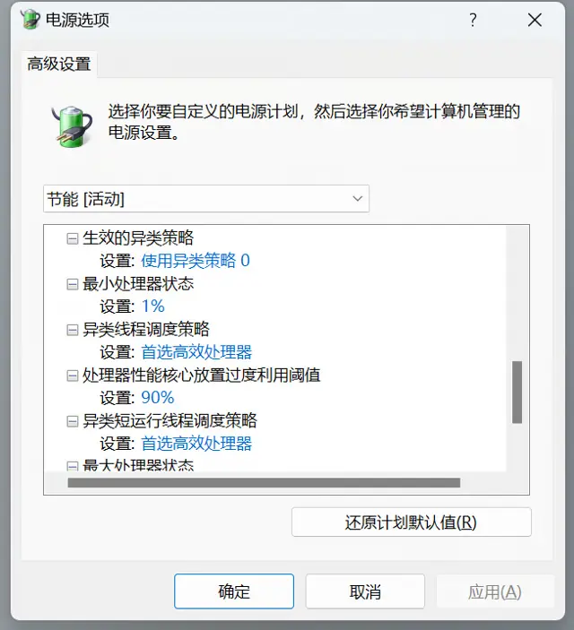

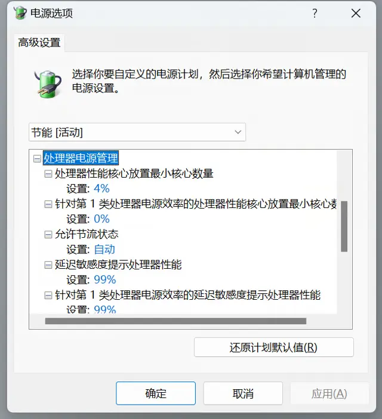

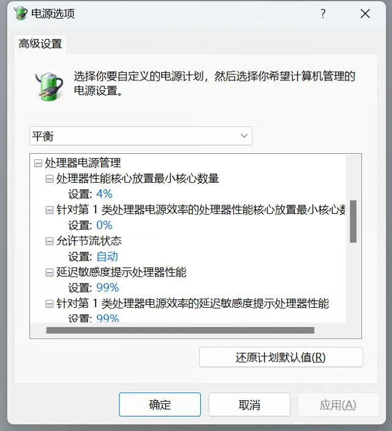

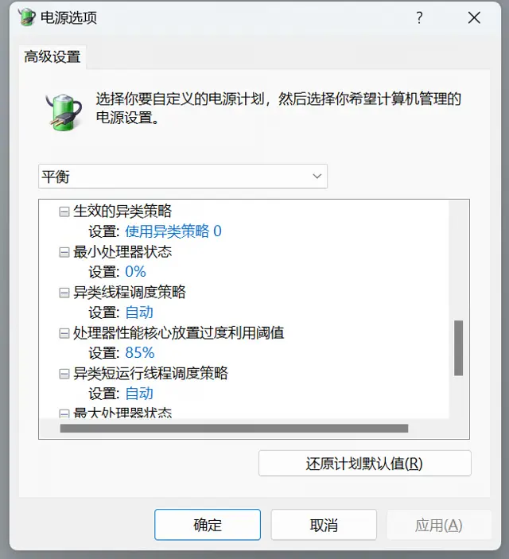

当然除了控制面板之外，还可以通过主板 BIOS 来进行更精确的功耗设置，但不同品牌型号的主板和 CPU 的设置选项也不太相同。因此，对于绝大多数用户使用出厂设置即可，这里就不展开了。

**开机启动项**

对于不经常使用或者对启动速度影响较大的应用，建议禁止其开机启动。可以在任务管理器（Ctrl + Alt + Del）的“启动”选项卡中查看并管理开机启动项。在这里，你可以禁用或启用任何已安装的应用程序在开机时启动。禁用不必要的启动项可以提高系统的启动速度。

1. **右键开始菜单**：右键点击屏幕左下角的 Windows 徽标（开始菜单）。
2. **打开“任务管理器”**：在展开的选项中，选择“任务管理器”。
3. **选择“启动”选项卡**：在任务管理器中，点击上方的“启动”选项卡。
4. **启用开机启动项**：在“启动”选项卡中，找到你想要设置为开机启动的应用，右键点击它，然后选择“启用”。
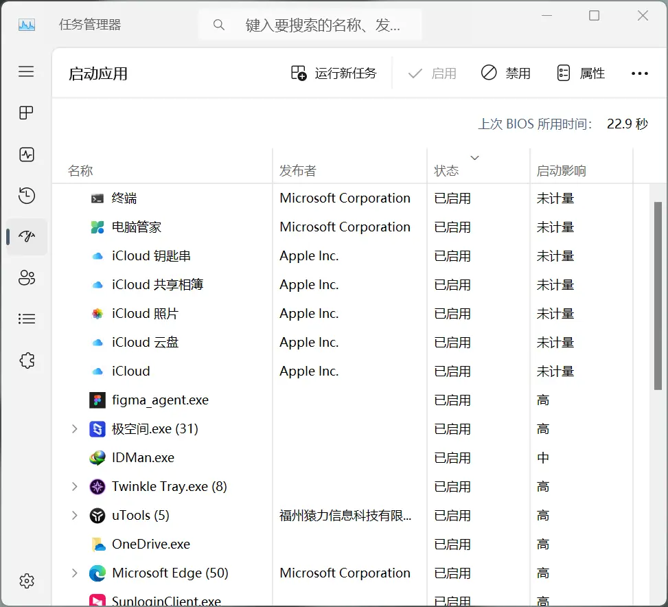

另一方面，也不能为了追求极致的启动速度关闭所有启动项，一切还是以实际需求优先。像微信，远程桌面这样几乎每天会用到的工具自然设置成开机启动即可。

**自动垃圾文件清理**

对于电脑中的文件，我向来不主张删除的。所谓“垃圾文件”即是长远来看不再需要的文件，然而这些文件是否会影响性能，其实更多来自自己的心理作用，就像见不得手机图标上的通知小红点一样。

很多“电脑管家”、“垃圾清理大师”之类的优化软件，正是抓住了人们的心理作用。仔细想想看，如果一台电脑由于存在“垃圾文件”必然严重影响使用体验，已经属于设计缺陷了，那么微软必然会内置一些功能来排除它，也大概率比第三方公司做得更稳妥。微软也确实这么做了。

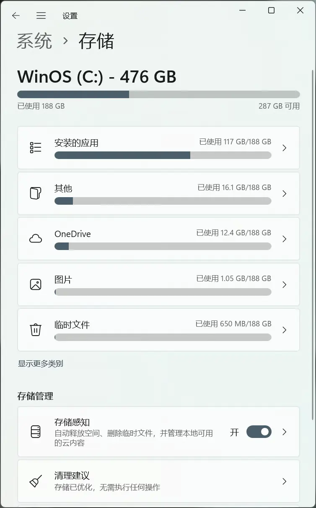

早在 Windows 10 就有个内建功能叫“存储感知”，它可以自动清理临时文件和回收站里的文件。你可以在“设置” - “系统” - “存储”里找到这个功能，点击“配置存储感知或运行现在”就可以进行设置或者立即清理。

我的做法就是打开“存储感知”，不再理会。

**微软电脑管家**

如果觉得上面这些设置还是麻烦，也可以考虑安装 [微软官方的电脑管家](https://pcmanager.microsoft.com/zh-cn)。我给爸妈家的电脑就是装的这个，没有广告，基本功能够用，自动清理自动更新，一劳永逸，还是不错的。

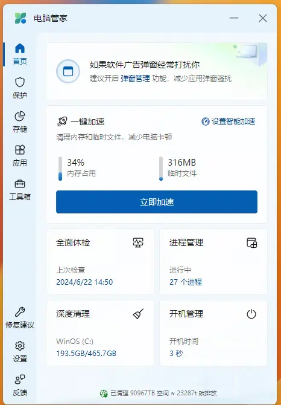

**磁盘优化**

相比垃圾文件，定期进行磁盘优化在我看来可以更好地帮助改善你的电脑性能。你可以在“设置” - “系统” - “存储” - “优化驱动器”里找到这个功能。选择你想要优化的驱动器，然后点击“优化”就可以开始了。也可以设置定期优化的周期。

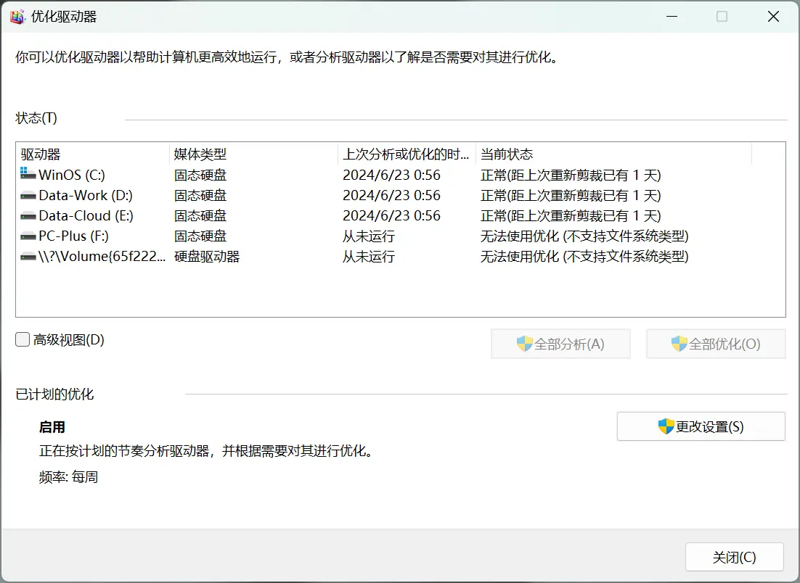

**配置虚拟内存**

虚拟内存是一种让电脑使用硬盘空间作为临时 RAM 的技术。当同时打开的程序太多，物理内存不够了，系统就会使用一部分硬盘空间来存放这些数据。硬盘当然没有内存快，所以开多了程序自然会卡。


现在固态硬盘普及了，速度足够快，正常使用很少会感知到卡顿。目前一般电脑都是 16G RAM 起步，而系统会根据情况自动划分一些虚拟内存（一般都大于 4G）用来应对计算压力，默认情况下足以应付 80% 以上的常规工作。

如果考虑到未来升级配置的话，建议内存还是一次到位。内存的价值永远是：容量 > 速度。内存够大的话，把虚拟内存关闭反而会更好一些。

# 目录结构与文件管理

正如在之前《[流水的程序，铁打的数据](https://cgartlab.com/the-program-of-flowing-water-the-data-of-iron/)》里提到过，对于目录结构和文件管理我定下的核心原则：

> **非必要不增加分类：**前提是这个分类可以穷尽，例如文件类型无非是那么几种，但格式有无数种。

> **1 分钟内完成归档：**我见过很多人知道归档很重要，但能坚持一年的都很少，很多情况是刚做完工作已经很烦躁疲惫了，哪儿还有功夫费那个劲？其实真正做好了分类，1 分钟归档是水到渠成的事情。

> **尽量使用英文 + 日期数字命名：**这个算是专业上的习惯，因为很多专业应用都是只认英文路径，有的字体不支持中文会显示乱码。

> **重要文件每周冷热备份各一次，重要文件每周冷热备份各一次，重要文件每周冷热备份各一次。** 可以不整理，请一定要备份，为了世界和平。

这些原则至今依然坚如磐石，更多具体的操作方式可以看原文。当然，这些规则可能会随着工作流一起进化，如果未来有大的变动，好用的话我会再写一篇介绍。

# 高效工作流和常用软件

这里的工作流是针对轻量和通用的场景，无论你自己的工作流是什么，使用得当都会从中受益。

**多任务处理**

```bash
`alt + tab`，用来快速切换最近打开的两个程序。
`win + tab` , 更高级的多任务界面，底部窗口可以添加虚拟桌面。
`ctrl + win + 左/右箭头`，快速切换虚拟桌面。
```

多任务处理貌似是所有图形化操作系统达成的一个共识，甚至快捷键都是类似的。使用比较简单，不赘述。

值得一提的是，Windows 11 对窗口管理做了很多优化，只要把一个窗口拖到屏幕上边附近，就会显示出预设好的窗口尺寸，99% 的软件都会很好的适配这个功能。相比之前的版本，也有了更多分组选择。

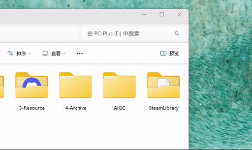

**虚拟桌面**

在只有一个显示器的时候，我会建立至少两个虚拟桌面，一个作为“前台”专注重型工作，另一个作为“后台”处理文档、邮件、以及回复消息等。

这样的好处自然是工作的时候减少干扰，但需要一段时间来习惯适应，刚开始用的时候很可能会忘记自己原来还开着另一个“桌面”。

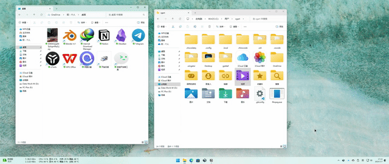

**模板是个好东西**

机器最擅长的就是简化重复性的工作，帮人节省时间。最简单的例子就是钟表——计算时间的机器，年复一年地帮人们数着一分一秒。而钟表计算时间的规则，就是这个“程序”的模板。

我自己最常用的模板是**“项目目录结构”。**

非常简单，每个项目目录下只有三个子目录，存放任何项目都会有的三类文件：文档，工程文件，交付文件。

然后为了方便识别理解，分别取名：`doc`, `pj`, `render`。

由于最近研究前端领域，所以命名方式也习惯全部使用小写字母。

```bash
project-name
- doc
- pj
- render
```

多讲一句，如果可以的话，工程目录下的一切文件和文件夹不推荐使用中文。因为大部分专业软件都是基于英语环境开发的，过多使用中文会出现软件不识别路径的问题。

## 推荐的常用软件

对于软件的选择，我依然坚持**“若无必要，勿增实体”**。这里的顺序我会按平时的使用频率来排，另外，凡是介绍的功能都是可以免费使用的。

**uTools：启动器，搜索**

类似 macOS 中的“聚焦搜索”，但功能更强大。只要按下 `alt + 空格` 就会弹出一个简洁的搜索框，可以搜索几乎任何你想找的东西，在这之前我都是使用开始菜单里的系统自带搜索，当作启动器还可以，但，也就只能当个启动器了。


除了作为软件启动器之外，uTools 的文件搜索可以结合 Everything 来实现神速加持。uTools 可以安装很多实用的小工具，例如快速修改 hosts 文件，清理 DNS 缓存，图片压缩，文件批量重命名，取色，屏幕录制，CPU 性能排名，常用 API 文档查询等，甚至有开发者做了很多用来摸鱼的小玩意儿，挺有意思的。

[**Notion](https://notion.so) 和 [Obsidian](https://obsidian.md)：项目管理，文章写作，知识库**

Notion + Obsidian 能做的事情真的太多，Notion 深入骨髓的模块化设计和 Database 再加上 Obsidian 本地化文件管理和内部双链，可以让它帮你管理好几乎一切文本内容。同时与团队共享信息也十分方便，只是国内没有架设服务器，访问稍慢一些，可以通过 Notion Faster 来获得免费加速。

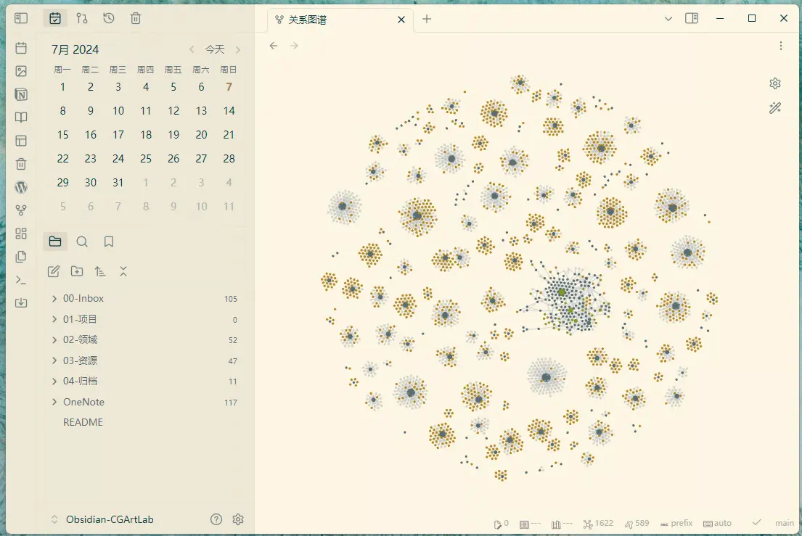

我近两年里的所有文章都是在 Notion 里编辑的，更具体的介绍可以看这篇《[解析设计师的第二大脑：从理念到实践](https://cgartlab.com/analyzing-the-designers-second-brain-from-concept-to-practice/)》。

[**Traffic Monitor](https://github.com/zhongyang219/TrafficMonitor) ：硬件资源监控**

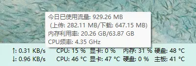

非常轻量的免费的开源小工具，用来实时监控主要部件的使用率和温度。一般只需要显示在任务栏即可，鼠标悬停还可以显示流量信息。从此告别鲁大师。想看更专业的监控数据，可以用 AIDA64。

[Quicklook](https://github.com/QL-Win/QuickLook)：**文件快速预览**

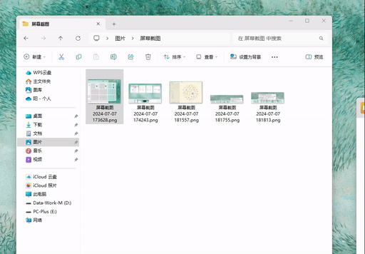

一款借鉴 macOS 空格预览工具，选中任意一个文件按下空格直接查看文件内容。常用于快速查看图片视频和文本文档。

[Twinkle Tray](https://twinkletray.com/)：**键盘调节屏幕亮度**

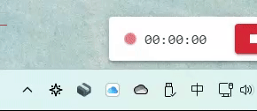

这个工具主要用于台式机以方便控制屏幕显示亮度，利用的是显示器 DCI 技术（近几年的显示器都支持）。如果有两个以上的显示器，可以单独控制，也可以分别控制亮度。可以把鼠标放到图标上直接用滚轮控制亮度，也可自定义快捷键，总之，以后再也不需要单独用手去挨个摸显示器上面的按钮了。

Fluent Reader：**订阅管理**

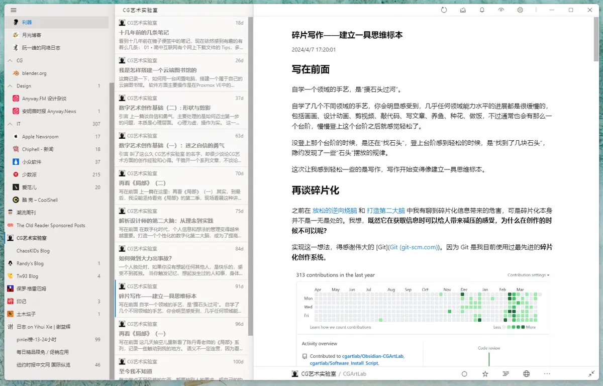

简洁美观的开源 RSS 阅读器，设计灵感来自 Fluent Design System。可以本地阅读，也能与兼容 Fever 或 Google Reader API 的自托管服务进行同步。支持与包括 Inoreader、Feedbin、The Old Reader、BazQux Reader 等在内的多种 RSS 服务进行同步，功能比较完善。

能够导入或导出 OPML 文件，方便进行全应用数据备份和恢复，提供内置文章视图，可阅读 RSS 全文，也能默认加载网页。支持使用正则表达式搜索文章或根据阅读状态进行过滤。

用我自己的话说，RSS 是对抗推荐算法的一剂良药，之后会单独写一篇来聊聊古老的 RSS。

## 终端和命令行

使用命令行最大的好处是，用简单的一行命令就能执行一系列操作，避免了用鼠标点来点去，还要记忆各种按钮和菜单的位置。

只需要第一次用的时候记住一些简单的命令，以后就会节省很多时间。不必害怕输入错误会弄坏电脑，它可以保护好自己的。


新手常用的一些终端命令：

```bash
# 查看系统信息
systeminfo
# 磁盘分区管理工具
diskpart
# 电源管理
powercfg
# 查看网络配置信息
ipconfig
# 清空屏幕
cls
# 清除 DNS 缓存
ipconfig /flushdns
# 释放或重新获取 IP 地址
ipconfig /release
ipconfig /renew
```

## Hyper-V 虚拟机

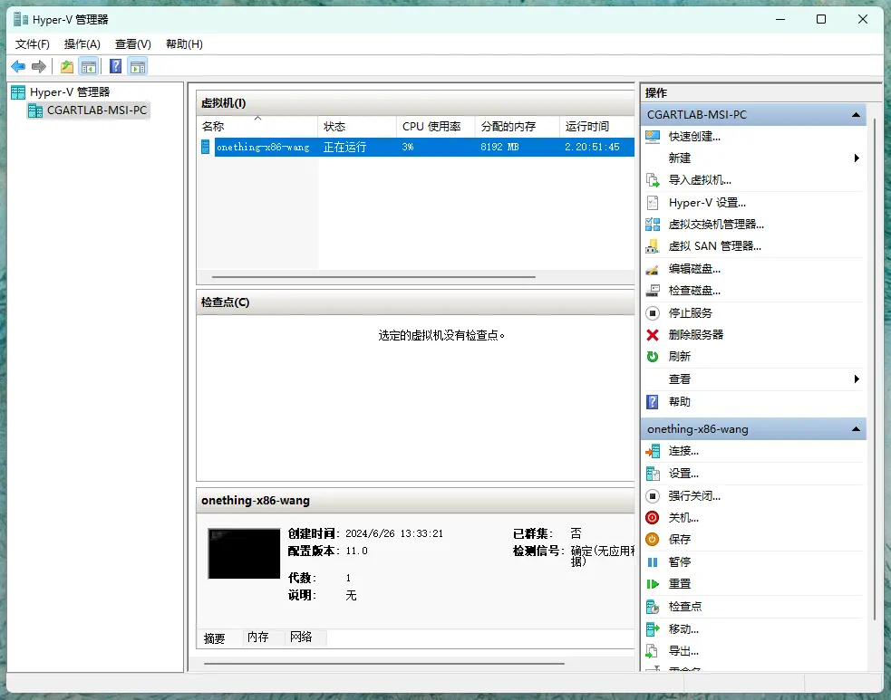

虚拟机简单的理解，就是在 Windows 里面再运行一个 Windows。虽然这个推荐给新手可能有些难度，但 Windows 自带的 hyper-v 虚拟机已经非常简单易懂了。

工作中很有可能会遇到的一种情况是，客户给你发了个文件格式，例如 WPS 文档，但是你平时用的是 Office，打不开或者打开了格式不对。这个格式也就用这么一次，为了这一次再装个 WPS 是得不偿失的。这个时候，就可以在虚拟机中安装 WPS 来处理文件，对主系统不会造成任何影响。因为整个虚拟机系统只是运行在主系统的一个文件里。就算这个虚拟机中毒歇菜了，把这个文件删掉就好。

我自己最常遇到的情况就是，网上下载的很多模型都是 3Dmax 的格式，但 3Dmax 非常占用空间和资源，平时不用，卸载也很难删干净。我平时用的最多的是 Cinema4D，所以就会在虚拟机中装一个 3Dmax，打开模型导出合适的格式，再把虚拟机关掉。

如果有开发或者其他需求的朋友，当然也可以尝试安装别的系统，用来学习和测试其他生产环境。所以，强烈推荐虚拟机，除了 Hyper-V 还有很多第三方的虚拟机应用，这里就不多介绍了。

# 数据安全与隐私保护

数据无价，通常来说，只做到两点就可以避免 90% 以上的数据安全问题。

- 涉及私人和工作等重要文件一般不建议放到任何网盘内。甚至对于更为敏感的文件要进行本地加密处理，并且定期冷热备份。
- 尽量不要下载、安装、运行任何来路不明的程序、代码、命令。如果有，可以先在虚拟机测试再看。

# 小结

工欲善其事，必先利其器。利用工具想做好一件事，首先要对工具本身足够了解掌握。充分利用计算机自身的特性，再加上保持良好的习惯，最终一定会从日积月累的行动中受益。
