## 写在前面


顶着这么多年设计师的头衔，我从未系统性地向别人分享过自己用的这一堆「锤子」和「扳手」。如今信息爆炸，工具选项过盛的时代，单纯罗列一个“最佳应用榜单”已经索然无味。在我看来只有经过无数次实战的洗礼才能大浪淘沙，留下的自然都是能够真正解决问题的利器。

在软件工具的选择和使用上，我逐渐开始以产品设计思维作为标准，甚至遇到感兴趣的产品还会去搜寻作者的采访，尝试更多地了解他们的设计思路。因为自己本身也是做设计的，甚至有时会产生“如果是我会选择 xxx”的想法。下面这些问题也随时会冒出来：

- 这个产品哪里吸引了我？
- 它用起来像是什么？但实际上却是什么？
- 他们到底想解决用户的什么问题？
- 他们用了哪些方法来解决问题？
- 这个产品的发展路线是怎样的？
- 当前阶段的呼声会不会对它过誉了？
- 产品背后的商业模式是什么？
- 如果是我我会选择怎么做？
- 等等…

因此，写这篇文章的主要目的实际上是帮助自己梳理一些优秀的产品，顺便分享给你。每个应用我会更侧重介绍它打动我的核心亮点，解决了我的什么问题？其中包含了不少主观判断，但我相信，我遇到的问题一定也有人会遇到，那分享就具备了价值。

下文列出的这些软件当然不是全部，拿出来分享主要基于以下几个原则，优先级不分先后：

- 开箱即用：安装成功即可满足基本功能。
- 界面好看：~~传说~~颜值是第一生产力。
- 尽量开源：尽量用着心里踏实。
- 跨平台：至少可做到 Mac、Windows 的数据共享同步。
- 免费功能能够满足轻度使用：钱不是大风刮来的。
- 排除做项目用的重型专业工具：术业有专攻，请相信你目前用的就是最好的。
- 排除随机自带的软件：这些应用要么平台独占，要么品牌独占。
- 排除国民级应用：例如微信支付宝，只是不得不用它们而已。

接下来我会按照“**从通用到专用，从核心到辅助**”的逻辑来依次介绍，这样读起来会更顺畅些。

## 一、核心生产力工具

今年最大的转变总体来说是「从外到内」的，出于热爱折腾 DIY 了一台自己的服务器，简单学习了 Linux，PVE 虚拟机，宝塔面板，Docker 和前端编程等服务器的玩法。开始逐渐把和自身有关的一切云端服务和数据逐步迁移到这台本地服务器上，在 AI 的帮助下，这个过程对零编程基础的我来说，总体是十分愉悦的体验，真的像是跟一个靠谱的伙伴搭建了一座赛博城池。

### Notion：中大型商业项目协作中枢

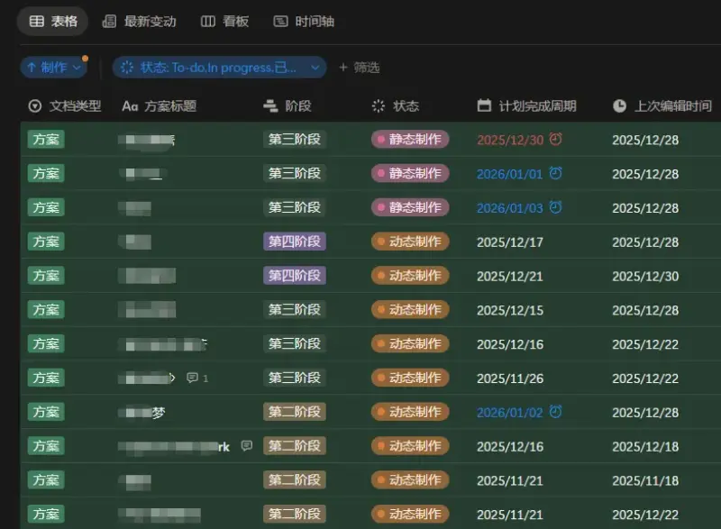

Notion 近些年的动作频频，千呼万唤始出来的中文版，表单，Layouts，更完善的自动化，强大的 AI 加持和网页分享等。它依然是我远程协作办公的绝对主力。

我使用 Notion 主要用来做商业项目跟踪管理和数据复盘，因此，实实在在影响到我的是数据库可视化图表和更加直观且细致的多人协作功能。至于自动化和 AI 等更先进的功能，可能我的工作都是设计相关，因此对于文档和数据库而言其实并没有实际提升多少工作效率。最大的效率提升还是得看和你协作的这些靠谱的人。

还记得几年前最开始用的时候，我也因为数据在云端纠结过安全性的问题，然后在 2021 年实实在在地经历了一次同事误删除了重要文档，然后通过邮件联系客服到妥善解决，整个过程没超过 3 个小时。之后就没有特别那么担心数据安全问题了。当然，定期下载备份个人数据永远是最安全的做法。

另外，如果使用这种闭源线上程序特别介意项目的隐私问题，可以给项目自己起个内部代号，是不是听着就很酷？

### Obsidian：高度自由的个人知识库

老生常谈的一个软件，和 Notion 并列主力。为什么有了 Notion 还要用 Obsidian 呢？

我是这样规划的：Notion 只用来处理需要由我去和他人协作的商业项目，这样的项目往往是较大规模的、中短期的，例如 CG 动画，广告，影视 UI，栏目包装等；Obsidian 处理的一般是只需要我自己创作和维护的文件，例如个人笔记仓库，博客文章，开发文档等。Obsidian 处理的数据都是长期积累、且不需要频繁线上同步的，我更在意的是处理它们的时候是否有高自由度和绝对的本地化。

多设备的同步方案实现起来也很简单，局域网（其实外网也可以）使用 Syncthing 以 NAS 作为中心实时同步给所有设备就行了 (下文会提到)，切勿搞分布式结构，会有很多冲突文件。说实话，在没使用 Syncthing 作为本地同步方案之前，我是几乎不打开 Obsidian 移动端的，无论使用 git 还是网盘同步都十分繁琐还容易冲突文件。现在只要我看到同步状态是最新，就可以放心打开仓库认真写作。

然后桌面端定期再使用 Git 推送到 GitHub 仓库即可，这样方便随时可以回滚到任何一个版本。无论记录、搜索还是整理归纳，综合体验上暂时还没发现比 Obsidian 用着更顺手的，不出意外估计会一直用下去。

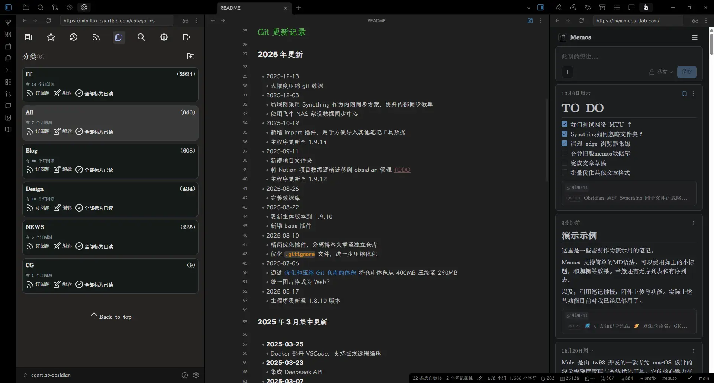

另外记得年初，Obsidian 新增了一个在我看来绝对是重量级的 web view 组件。你或许会觉得，这不就是塞了个浏览器进去么？但对于喜欢自己折腾部署服务的伙伴来说，这意味着：至此，任何可运行在网页端的应用都可以不离开 Obsidian 同时使用。就如上图这样，阅读、记录、输出可以一气呵成。

下半年还新增了一个 Base 数据库的功能，虽没有 Notion 的数据库那般强大，但在项目管理上我也看到的一丝未来的可能性。例如，配合 git 插件同步一个项目仓库也不是不可能，这样理论上也是可以多人协作的，只是对于不懂编程的设计师门槛稍微高了一丢丢。

### Memos：专注纯粹的碎片化记录

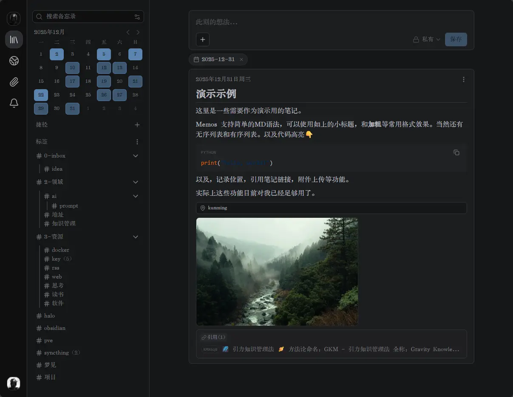

在 GitHub 上很热门的一个碎片化备忘录程序，和 flomo 的功能十分相近。唯一的门槛是需要用 Docker 部署在服务器上，对新手要求稍高。我平时喜欢把它放在浏览器侧边栏，看到好东西直接贴过去就完了，想到更有趣的东西打开就写。

Flomo 的近年来的开发方向逐渐偏向基于 AI 的新功能，这些功能并不是我的刚需，因此我~~正在逐渐~~已经把碎片化记录迁移到 Memos。在家里的私服上部署了一个 Memos 容器，配合 Moememos App 非常便捷，只要基本功能使用得稳定顺畅就够了。

作为 Flomo 的开源替代品，Memos 专注于解决“快速记录”这一单一需求。它没有过于复杂的标签系统和 AI 功能，反而让我更专注于记录想法本身，毕竟这些碎片想法和信息很快都会进入 Obsidian 的笔记仓库中。自己部署的另一个好处是在家可以享受内网的绝对低延迟同步，真正实现随时无摩擦记录。

### Syncthing：去中心化文件同步

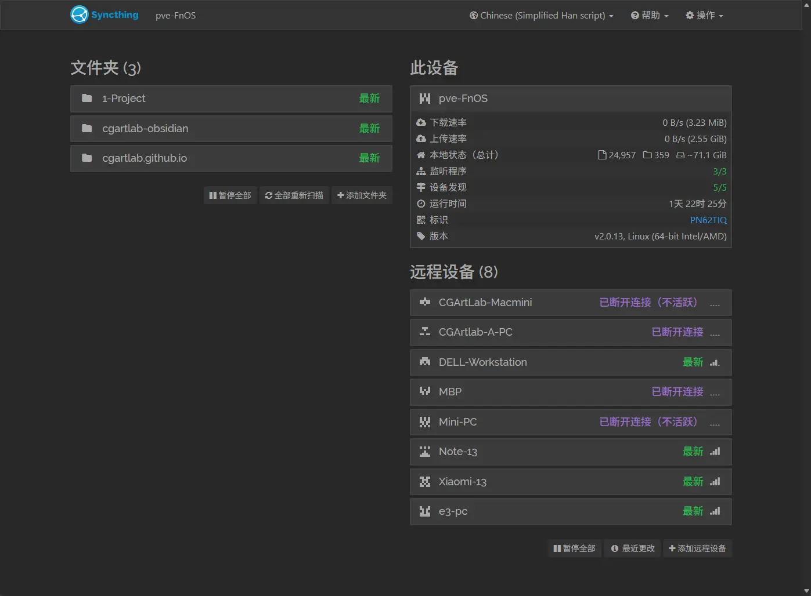

一款开源免费的文件同步工具，在它的设计理念中可以理解成两台以上设备的文件同步，都是互为“云端”的关系。当然，若需要走出家门依然可以享受同步服务，还是需要使用 NAS 部署内网穿透作为临时的“同步中心”。

我通常会用 Syncthing 同步以下类型文件夹：

1. 今年内的商业项目工程目录，只在桌面端同步。
2. 笔记仓库，桌面端和手机平板同步，移动端主要用来查找和阅读。
3. 博客文章，桌面端和手机同步，可以随时拿起来就写。
4. 一个临时的「Inbox」文件夹，随时互传一些小文件十分方便。（什么你说 U 盘？QQ？百度云？文件传输助手？住手！）

### Miniflux：轻量 RSS 信息聚合

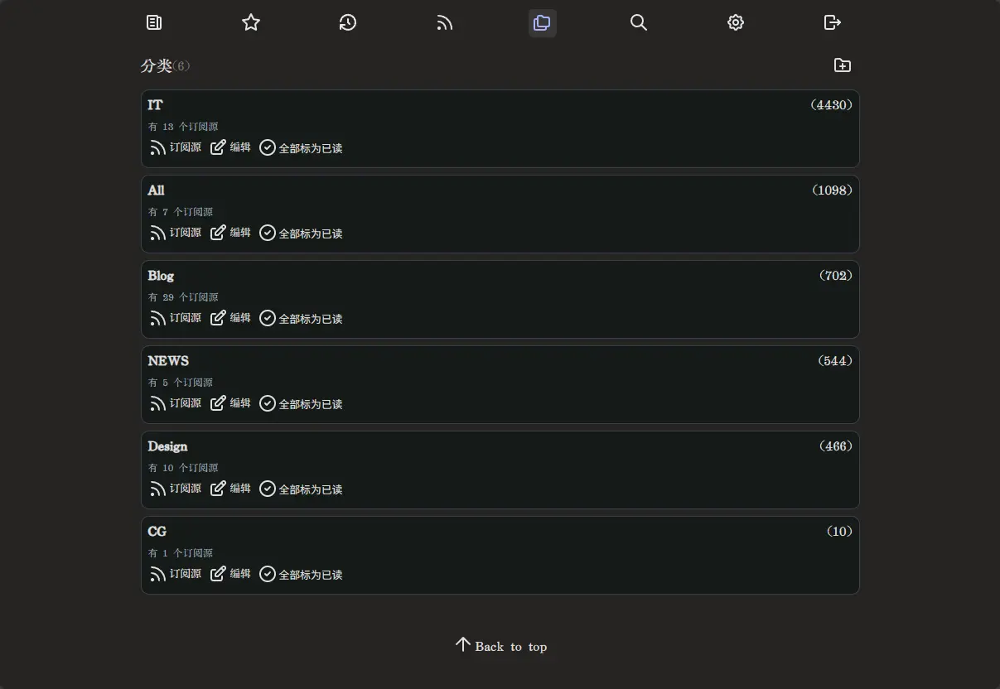

自托管的 RSS 订阅平台，最近刚刚用它替换了 FreshRSS。还是觉得 FreshRSS 相对来说太笨重了，网页端载入总不是很利索。相比之下 Miniflux 没有花哨的界面，只默默做一件事：聚合我在意的信息并按时推送给我。再加上 Miniflux 可以支持自定义样式，实际上若不对离线阅读体验有需要，网页端是足够使用的。

另一方面我不清楚什么原因，相比 FreshRSS，Miniflux 对 RSSHub 转换过的订阅内容，无论是读取成功率还是排版都支持得更好，这也是我放弃 FreshRSS 的一大原因。

以上，就是我每天都在用的核心生产力工具，读到这里不知你发现了没，这些工具已经覆盖了“阅读👉记录👉整合👉输出”的知识管理流程，它实际上适用于任何数字时代下的工作和生活。下面介绍的主要是通用的功能

## 二、基础与通用工具

### Rime（中州韵）：高度可定制的输入引擎

这是目前我的主力 PC，Mac 和两台安卓机都在使用的一款极为优秀的开源输入引擎，由国人佛振老师开发，在不同平台有不同的名字。Windows 里叫小狼毫，macOS 里叫鼠须管。(一看名字就知道作者是个有品位的人)。这个输入引擎安装不复杂，就是上手配置有些门槛，可是一旦前期花时间调教完输入习惯，再加上给自己定制一套常用词库后，只会越用越顺手。

事实上 Android 端由于手机品牌众多，目前这个输入法配置复杂度和稳定性都各有千秋，这里就不推荐新手也在手机上用了。

至于 iOS(在我的认知里 iPadOS 还是 iOS)，自带的输入法就很好。


### Winget/HomeBrew 包管理器：极简应用商店

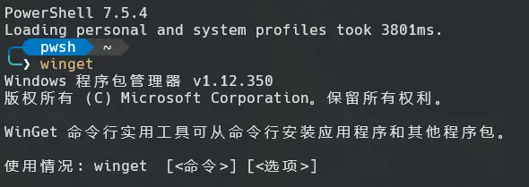

曾经我写过 [一篇文章](https://cgartlab.com/posts/use-winget-on-win11/) 专门介绍过 winget。它虽然不算生产力工具，但最大的好处是在重装系统后，批量安装或更新软件的场景下大大减少了不必要的步骤和时间。

去年为了把这个操作优化到极致，我还专门写了 [一个小脚本](https://github.com/cgartlab/Software_Install_Script)，在一个文件中记录了所有可以通过它安装和更新的软件列表。每次重装一台电脑后，只需要双击运行这个脚本，它就会按照列表顺序挨个自动下载安装，整个过程几乎是无感的。这时就可以同时进行别的设置操作，省心省力。

### Calibre：电子图书馆

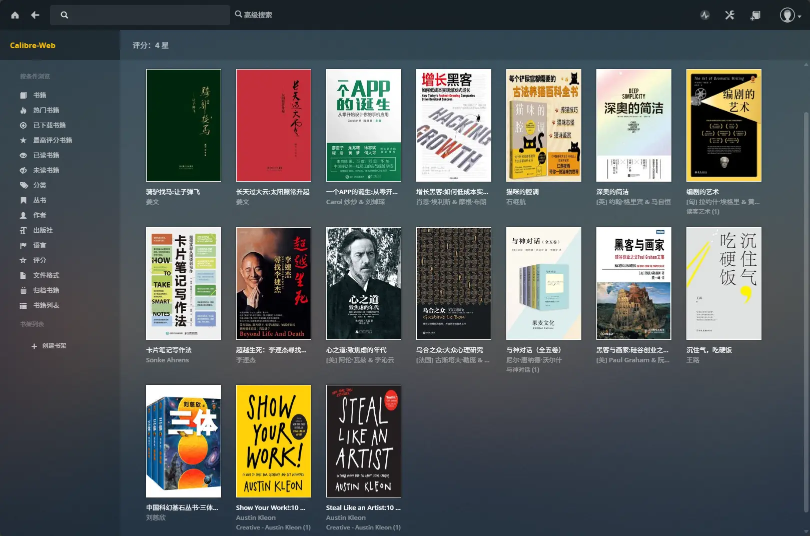

Calibre 是一个功能强大的图书馆管理系统。我主要用它来统一管理、转换和整理从各个渠道获取的电子书，文献和各类电影游戏的设定集（主要是 EPUB 和 PDF 格式），为其添加准确的元数据（封面、作者、简介，看嗨了还会打个分），目前是以 docker 容器的形式部署在 NAS 上。

这个书库在 NAS 上只有一份，能收录进来的书只需要满足非常简单的两个标准，完整翻过一遍加感觉写得不错。

这些年相继用过 iReader、多看阅读、微信读书。虽然完整看完的书总共并不算多，但是当我开始意识到有必要建立自己的知识体系时，开始寻找这样一个可以统一记录和管理电子书的平台。最终过了十几年左右发现，只有握在自己手里的数据才是自由的。而且，毕竟每一家阅读平台的商店不可能包含所有图书的版权，需要查阅相对小众或特定版本的资料就只能自己去网上慢慢翻找。


你说 Calibre 本身阅读体验有多好么？并不。它强大在可以随时转换图书格式，方便能在几乎任何设备随时阅读。但劣势就在于这样传来传去对阅读进度、高亮画线等数据就无法做到多端同步。因此我目前最常用的阅读方式是用 iPad 的 Safari 直接登录 web 端阅读。一开始还很不适应，总想找个能替代它的 App。就这样用久了却慢慢发现，这其实已经够了，重要的就是看完眼前这本书，把里面值得记下来和自己想写的句子记录下来而已。

一年读多少本不重要，一年读几天不重要，一周读多少小时也不重要，对我来说和屏幕使用时间的功能一样，不会让我产生任何行动的念头，无论这个行动是正面还是负面的。

## 三、内容创作与媒体管理

### Eagle：设计素材库


桌面端设计素材管理工具，目前市面上还没有找到功能如此全面的平替产品，我就果断买了正版，购买一次可以同时授权两台设备也很够用了。素材库本体在 NAS 上也只有一份，台式和笔记本都使用 WebDAV 协议保证公网也可读取。这样既能最大限度减少存储空间浪费，还可以放心往里面存图不怕丢。

用起来思路也十分简单粗暴。在做项目前期找参考的时候，让自己习惯先去这个素材库里面找。如果没有 (这通常是第一反应，因为只要素材库里有肯定是看过一次有印象的) 再去别的地方收集。这样慢慢坚持下来，这个素材库也会像笔记仓库那样紧紧围绕你的特点去生长，越来越好用。

唯一不是很喜欢的点在于，eagle 它有自己的一套文件目录结构，导入图片进去就只能通过这个软件去找了，或许是为了性能考虑吧。好在导出是可以保留自己在软件中设计的文件分类结构。

### 向日葵和 RustDesk：远程桌面

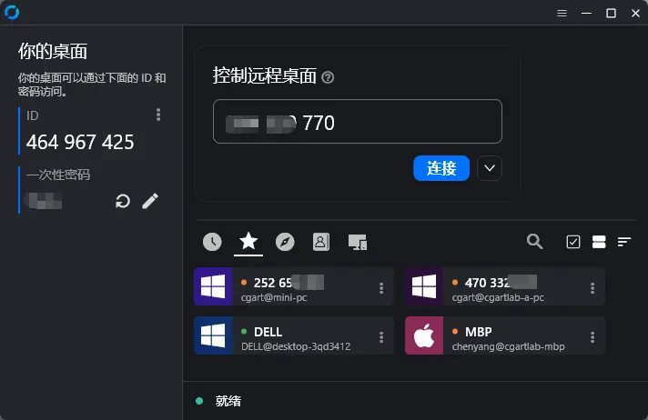

最早用的 ToDesk 和向日葵，但随着屏幕分辨率越来越高，渲染的影像质量对远程协助的画质要求也在不断提升，慢慢免费版本的向日葵已经没法满足需求了。于是我找到一款叫 RustDesk 的开源远程桌面软件。

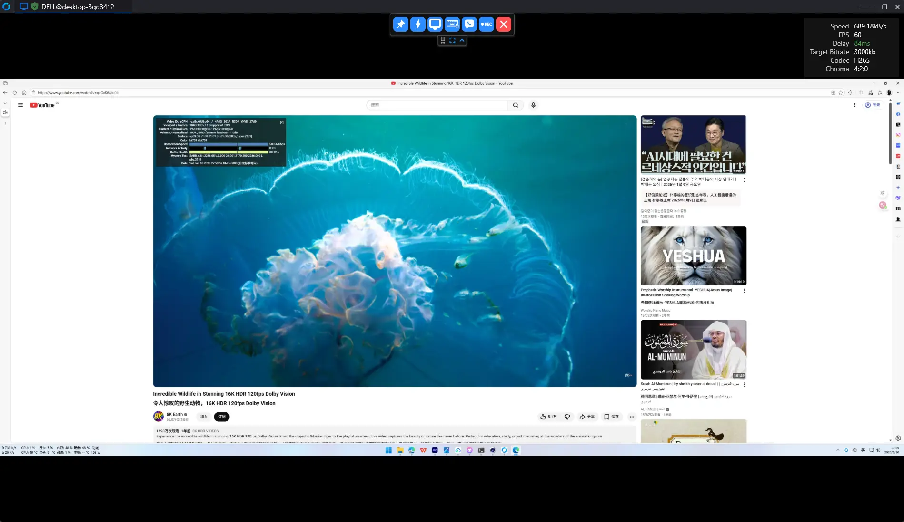

好家伙一用不要紧，这玩意儿是可以点对点直连的。延迟和画质完全取决于你的宽带质量和速度本身，并且可以选择 h.265、h.264、AV1、vp8 等常见硬件解码，即使开着 GPU 渲染动画也不影响传输质量。我测试过从家里（移动网络）连接学校的工作站（电信网络），在 4K 60Hz 画质下延迟只有 60-80ms，这表现相当惊人。

当然向日葵并没有抛弃，它有一套非常逆天的录屏文件压缩算法。10 分钟 1080p 分辨率的远程录屏文件，只有 30m，画质和帧率和在本地操作的一样。

### OBS Studio ：录屏和直播

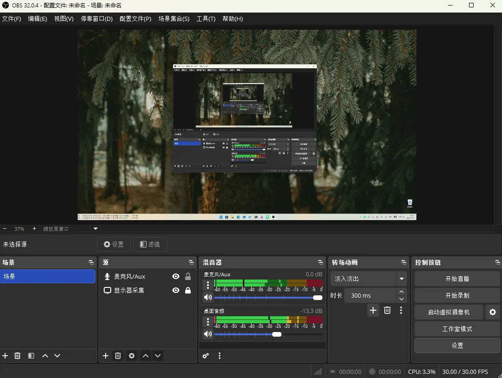

做直播的朋友都对它不陌生，我更多是用来录制一些项目中进阶的操作技巧，是的就是录教程给未来的自己。时间长了谁会回来打开那个糟心的工程文件呢，打开真的啥也不记得。加速看一遍录屏一目了然。

偶尔也会录一些项目规范，制作一些模板使用说明给团队小伙伴，很方便。

### Traffic Monitor：实时硬件监控

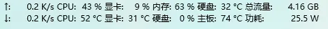

它负责基本的硬件监控，CPU，GPU，内存，硬盘的实时占用率和温度显示，也可以安装插件扩展新的功能，比如我最喜欢的是功率和天气。

### Stats：实时硬件监控

类似 Windows 下的 Traffic Monitor，开源免费的硬件监控工具。标准的小而美，迭代速度平稳，几乎每个月都有 1-2 次小版本更新。平时在菜单栏上只开 CPU、 RAM、 SSD 和网络监控几个模块。

另外，我喜欢它近年新增的手动控制风扇转速的功能，可以配合吹一下电脑里的灰。众所周知，正常用的情况下要让 M 芯片的 Mac 风扇跑满速有多难。

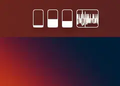

### Handbrake：视频格式转换

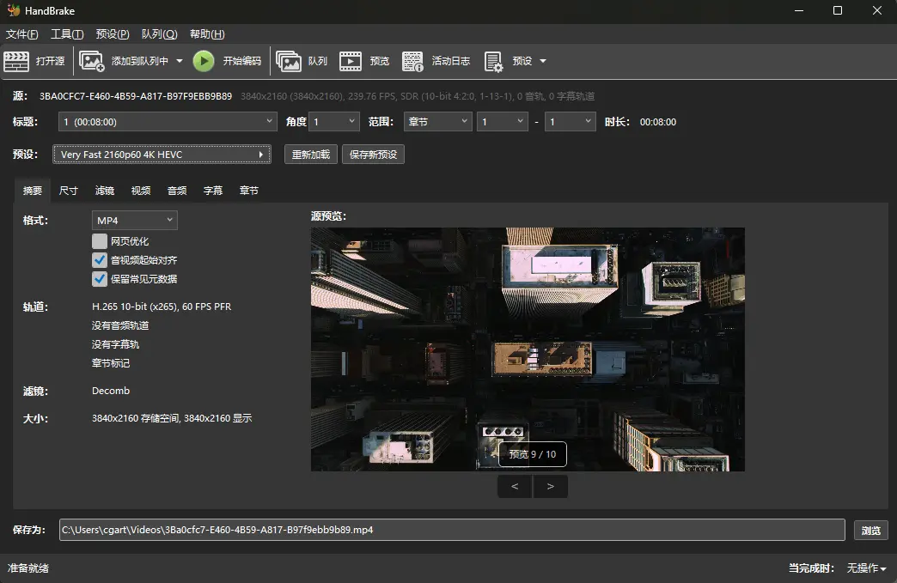

身为动画设计师，视频转码工具还是必不可少的。在这之前我习惯使用的还是 Adobe Encoder，最终换掉它的原因依然是笨重，Handebrake 虽说 UI 界面的操作逻辑上手时可能需要适应一下，但可以同时避免了 ffmpeg 的复杂命令，和 Adobe Encoder 的臃肿。此外，编码速度也令人满意。

## 四、系统增强和效率

### PowerToys：系统增强的瑞士军刀

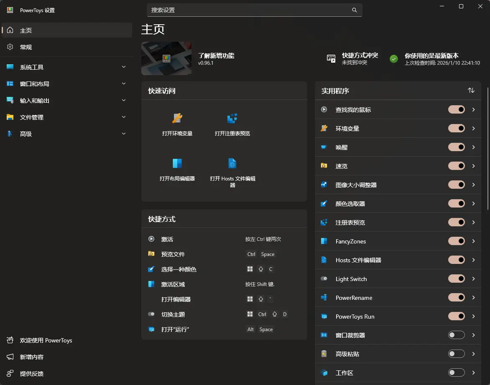

在 2019 年 PowerToys 恢复开发之后（是的这东西非常古老），我曾经使用过一段时间，但由于当时开发的功能还比较少，而且经常会出现莫名其妙的闪退卡死等 bug。然后就找到了 uTools，这一用就是 4 年。如今 PowerToys 开发的已经比较稳定完善，尤其是对于开发者和设计师有不少十分方便的小功能，免费且足够好用。因此，今年在我的工作流中它已经完全取代了 uTools，因为使用了两年 uTools 后我发现真正刚需的功能只有快速启动和搜索、取色器、批量重命名，而为了商业考量，uTools 改变了商业策略开始限制安装插件的数量。

而切换到 PowerToys 后，更吸引我的是，它在多年开发下积累的一些新功能对系统的集成度更紧密。例如，唤醒可以随时切换系统默认的电源管理模式来硬控电脑的睡眠时间，这对于需要长时间高负载渲染动画的设计师来说就是妥妥的刚需; 速览，已经取代了 Quicklook 成为快速预览文件内容的主力; FancyZones 在 Windows 自带的窗口组织排列基础上进一步减少操作步骤，可定制的参数细节更多，这对一般至少两个屏幕起步的专业创作者来说也如虎添翼。最终，这些实用的小功能被集成在一个后台程序中，每次开机便默默运行，帮我在看不见的角落节省了不知多少时间。

### Twinkle Tray：外接显示器亮度调节

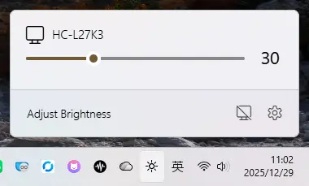

通过显示器的 DDC/CI 协议调整亮度的开源小工具，当然可以同时控制多个显示器，也可以做到多台显示器联动、定时、开关等功能。和音量图标一样，当鼠标放在亮度 icon 上，滑动滚轮可以更精确地控制亮度。

我通常会设置快捷键 `alt + 左右方括号` 来分别控制亮度加减，每次梯度 10%，`alt + \` 直接关闭显示器（并非睡眠）。

### Potplayer 和 IINA：视频播放器

坦率地讲，自从开始用了 NAS，PotPlayer 更多承载的是商业项目中审片的用途，拿它看电影的次数几乎为零。但在我看来，它依然是最好用的 Windows 视频播放器。另外如果你使用的是 AMD 显卡还可以配合这个播放器实现效果最优秀的插帧魔法。我觉得目前 A 卡的插帧效果比电视上那种 AI 的插帧观感上要好得多，但是我说不清为什么，你觉得呢？

另一个 IINA 是 macOS 平台开源免费的万能视频播放器，我的用途和 PotPlayer 一样，给客户审片。它支持更广泛的格式，在给客户看尺寸更大的视频时，比空格预览的性能要好得多。

### Hidden Bar：菜单栏图标管理

无论 MacBook Pro 屏幕有没有刘海，我使用 macOS 顶部菜单栏都习惯用 Hidden Bar 来整理后台运行的工具图标。原因有两个：偶尔需要录制教学或屏幕共享给同事的时候可以让界面更加清爽；很多小工具我需要运行，但我不需要经常查看它的状态，例如科学上网，OneDrive 网盘和下面要说的这个 Stats。

### AppCleaner

macOS 平台的 GUI 卸载工具，非常直观简洁的设计，没有多余的功能。

### Mole

Mole 是由 tw93 开发的一款专为 macOS 设计的轻量级深度清理与系统优化工具。它的核心魅力在于通过极其精简的命令行交互（或者是极简的界面），把原本繁琐的系统垃圾清理、缓存刷新、大文件扫描等操作变得像呼吸一样自然。

只需要在终端运行以下命令（请确保你信任此命令来源后再执行）：

```shell
curl -fsSL https://raw.githubusercontent.com/tw93/mole/main/install.sh | bash
```

虽然是命令行工具，但实际并不需要记住多么复杂的命令。每个操作都会有相应的引导提示。顾名思义，主打功能就像是一只鼹鼠，擅长优秀的垃圾文件深度挖掘查找。一直希望 Windows 也能有一款这样小巧好用的工具，各位如果有推荐欢迎交流分享。

### Reeder

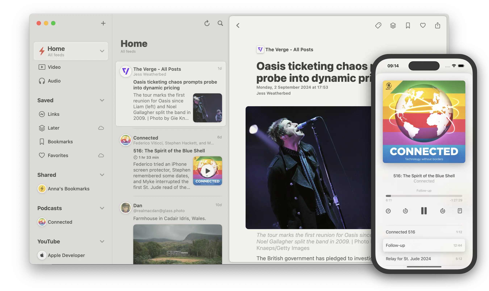

从最开始接触 RSS 之后就一直用到现在的阅读器，只是一直保持在最后一个 classic 版本。

UI 无需多言，美。

当年专门开了个美区 Apple ID 花了 5 美金买它。完美支持各种主流或小众的 RSS 平台，至今任何平台我都没有发现能超越它的 RSS 阅读体验。

### Capy Reader


一款主打配合 Miniflux 服务的移动端 RSS 阅读器。基本功能够用，稳定性也不错。定时或手动同步，向上滚动列表自动标记已读状态，左右滑动等自定义手势该有的都一应俱全。

## AI

AI 放在最后说，因为回看 2025 年它已经渗透进我的各种生产流程中了。无时无刻都在给我提供丰富的解决方案，创意灵感，效果测试，素材生产，具体使用的产品就是市面上那些。

可是如果要把它掰开揉碎去讲，肯定不是一个小标题下能放进去的。以后可以单开一篇细致说说，这里先分享几条经验吧：

1. 尽量选择用户数据可以导出的平台
2. 提醒自己想起来去用它
3. 提出准确的问题
4. 鼓励它反驳自己的观点

## 总结

回顾 2025 年，我的生产力工具经历了一次从“云端依赖”到“本地掌控”的根本转变。通过自建服务器和拥抱开源生态，逐渐让我重新掌握了数据的自主权，更构建了一套高度个性化、围绕“阅读 - 记录 - 整合 - 输出”完整知识工作流的核心系统。从 Notion 与 Obsidian 的双核驱动，到 Memos、Syncthing、Miniflux 等自托管服务的无缝衔接，这些工具不再是孤立的应用，而是相互协同、灵活多变。

选择工具的标准，也从单纯的功能强大，转向了对产品设计理念、数据主权和长期可用性的综合考量。无论是 Windows 上 PowerToys 的瑞士军刀式集成，还是 macOS 上那些小而美的系统增强工具，它们都在看不见的角落，持续为我节省着宝贵的心智与时间。

最终，优秀的工具不在于其榜单排名或技术炫技，而在于它是否真正融入了你的工作习惯，安静地解决了实际问题，并让你对创造过程本身保有更多的专注与热爱。希望这份充满个人偏好的清单，能为你构建自己的数字城池提供一些灵感和思考。

本文首发在 [CGArtLab](https://cgartlab.com)。

---

## 参考链接列表

以下是文中提及的主要工具及其官方或相关资源链接：

### 核心生产力工具

- **Notion**: <https://www.notion.so>
- **Obsidian**: <https://obsidian.md>
- **Memos**: <https://github.com/usememos/memos>
- **Syncthing**: <https://syncthing.net>
- **Miniflux**: <https://miniflux.app>

### 桌面平台通用

- **Rime（中州韵输入法）**:
  - 项目主页: <https://rime.im>
  - 配置指南: <https://github.com/rime/home/wiki>
- **Calibre**: <https://calibre-ebook.com>
- **Eagle**: <https://cn.eagle.cool>
- **RustDesk**: <https://rustdesk.com>
- **向日葵远程控制**: <https://sunlogin.oray.com>
- **OBS Studio**: <https://obsproject.com>

### Windows 独占

- **Winget**: <https://learn.microsoft.com/zh-cn/windows/package-manager/>
- **PowerToys**: <https://github.com/microsoft/PowerToys>
- **Traffic Monitor**: <https://github.com/zhongyang219/TrafficMonitor>
- **HandBrake**: <https://handbrake.fr>
- **Twinkle Tray**: <https://github.com/xanderfrangos/twinkle-tray>
- **PotPlayer**: <https://potplayer.daum.net>

### macOS 独占

- **Hidden Bar**: <https://github.com/dwarvesf/hidden>
- **Stats**: <https://github.com/exelban/stats>
- **AppCleaner**: <https://freemacsoft.net/appcleaner/>
- **Mole**: <https://github.com/tw93/mole>
- **IINA**: <https://iina.io>
- **Homebrew**: <https://brew.sh>

### 移动端

- **Reeder 5 (iOS)**: <https://reederapp.com>
- **Capy Reader (Android)**: <https://play.google.com/store/apps/details?id=com.capyreader>

### 其他提及的服务/概念

- **RSSHub**: <https://github.com/DIYgod/RSSHub>
- **Flomo**: <https://flomoapp.com>
- **Moememos App** (Memos 客户端): <https://github.com/moememos/moememos-official-mobile-app>
- **Git**: <https://git-scm.com>
- **Docker**: <https://www.docker.com>
- **PVE (Proxmox VE)**: <https://www.proxmox.com>
- **宝塔面板**: <https://www.bt.cn>

---

**注**：部分工具（如 uTools、FreshRSS、ToDesk 等）在文中作为比较或已更替的对象被提及，未列入主列表。所有链接在访问时请确认其当前可用性及合规性。对于开源项目，GitHub 仓库通常是获取最新信息和源码的最佳位置。
