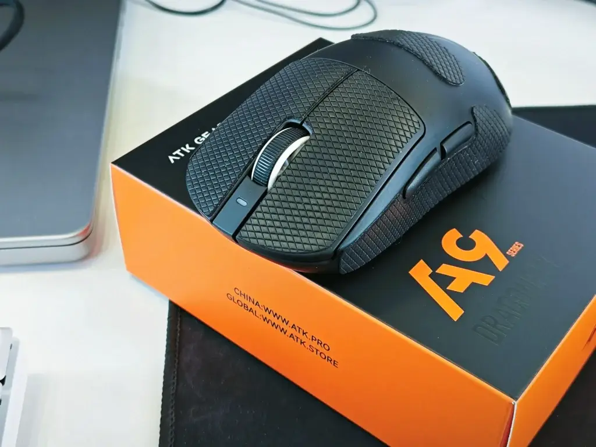
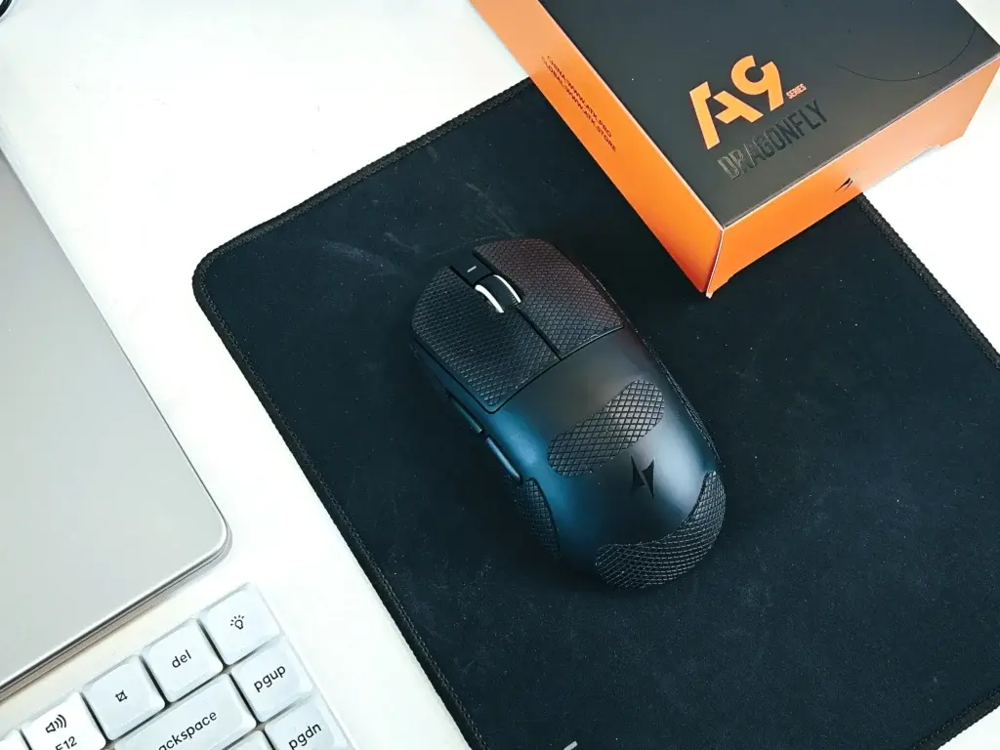
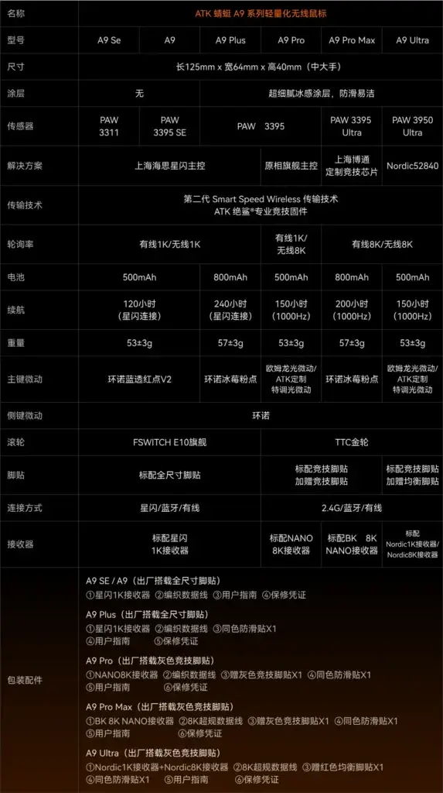
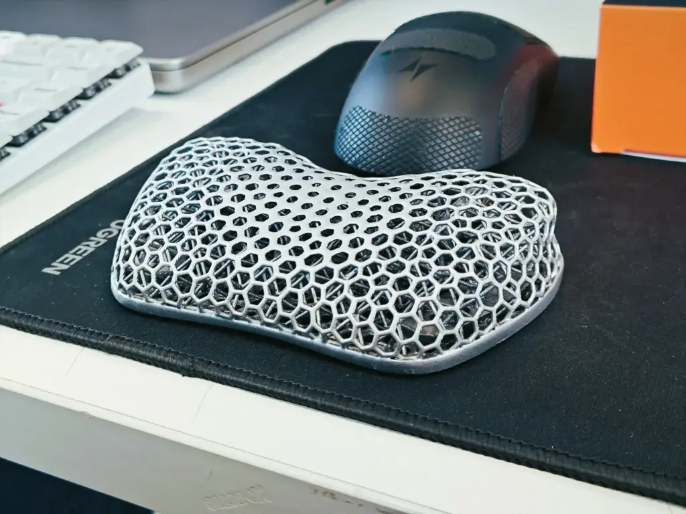
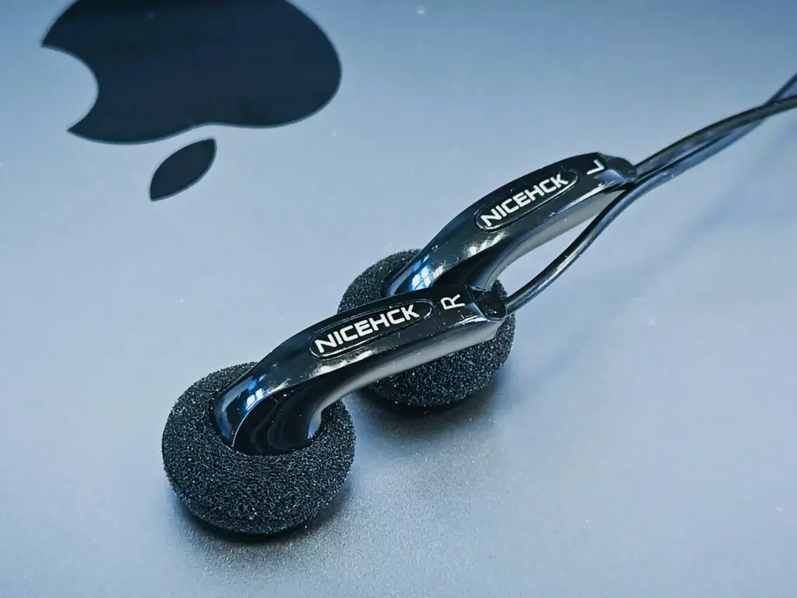
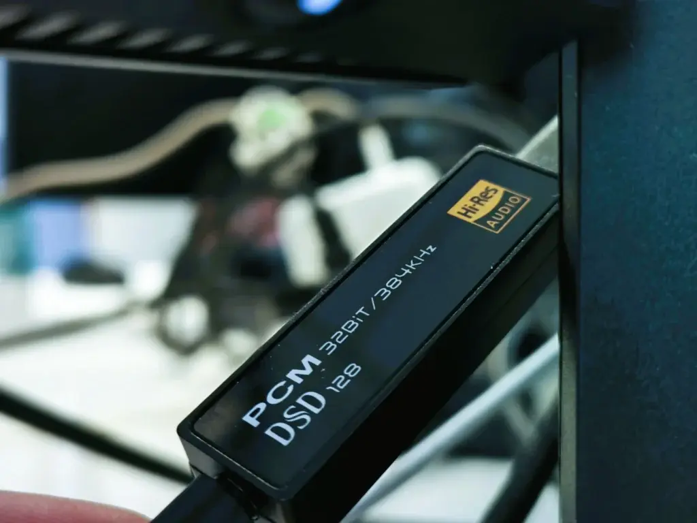

## VGN Dragonfly A9 Plus

Price: 118 CNY

Why: Never used a lightweight gaming mouse before — always thought they'd feel too flimsy. Tried a colleague's GPW Gen 1. Stability and accuracy were impressive, though the hump at the top was a bit uncomfortable for my hand. But I'm not a hardcore gamer, so a GPW would be overkill. Someone recommended the VGN A9 series, claiming it fixed the hump issue. I got one and the feel is indeed great. The 3395 sensor is already overkill for my main use case of 3D animation design and casual FPS gaming.

Experience: I have large hands — palm grip for work, claw grip for gaming. As a designer, I probably clock tens of thousands of clicks daily. The package includes grip tape to prevent wear and oily spots.

I went with the Plus version for the 800mAh battery and StarLink wireless dongle — a good balance of battery life and performance. The main switches are Huano Iceberry Pink Dot, which feel softer than the Logitech G102's Omron White Dots. Lifespan doesn't worry me — I have a soldering iron, so peripherals like mice and keyboards are practically immortal.

3395 sensor, running at 500Hz polling rate. 1200 DPI for dual-monitor work, 2000 DPI for single-screen gaming — 2000 is already plenty fast for me. If you're a higher-level CS player, the Max version with 8K polling might be worth considering.

Rating: 5/5

## 3D-Printed Wrist Rest

Why: Birthday gift!

Price: Unknown

Experience: Great ventilation — always stays cool to the touch.

Rating: 5/5

## UCC Freeze-Dried Coffee

Why: Ran out of stock.

Price: 58 CNY

Experience: This series has many numbers. Tried 114 and 117 — prefer 117's flavor profile. 114 is less bitter and leans more acidic, which isn't really my thing. I'll skip the jar version next time, since it's prone to moisture. The individual sachets offer more consistent concentration and taste.

Rating: 4/5

## NiceHCK MX500 Earbuds (No Mic)

Why: Purely to avoid disturbing colleagues at my desk.

Price: 5.8 CNY

Experience: The absurd value proposition continues. These use the same MX500 mold as Sennheiser's classic. Back in high school, my OPPO V3h MP4 came with genuine Sennheiser MX500 earbuds. These cost less than 10 bucks but sound nearly as good as the 180 CNY originals. One pair for the desk, one for the hotel bag, one in my backpack — no worries if I lose any.

Paired with a HiBy DAC dongle (optional) to filter out background noise, plus the laptop's built-in Dolby Atmos, I can even enjoy Apple Music Spatial Audio. What more could you ask for?

Rating: 5/5
