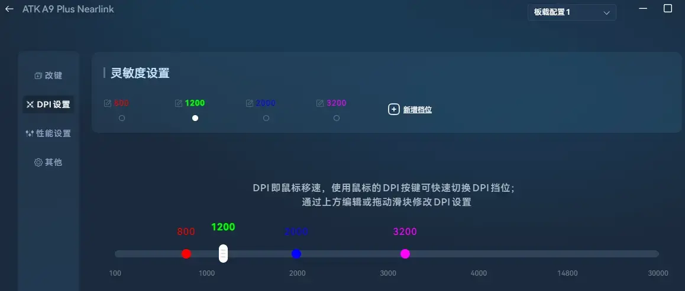
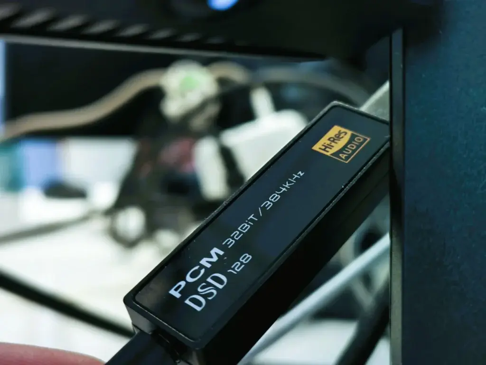

---
# 必填
title: 6月的设计师拔草记录和选荐
published: 2025-07-01
description: 6月的设计师拔草记录和选荐，包含VGN蜻蜓A9 plus鼠标、3D打印腕托、日本UCC冻干咖啡、原道MX500平头塞等产品的使用体验和评价。
updated: 2025-07-01
tags:
  - 好物
draft: false
pin: 0
toc: true
lang: zh
---

## VGN 蜻蜓 A9 plus

价格：118 元。

原因：没用过轻量化游戏鼠标，总觉得轻飘飘的。偶然用了一下同事的 GPW 一代，除了模具最高点有点顶手，稳定性和精准度真没的说，可是我又不是重度玩家，那鼠标给我用属实浪费。然后就被推荐了 VGN A9 系列，据说在 GPW 基础上解决了顶手的问题，拿到后果然手感很好，3395 传感器对于我这种主力办公「三维动画设计」和中度 FPS 业余爱好者而言已经性能过剩了，~~其实就是菜~~。

体验：我属于绝对的大手，平时办公是趴握，打游戏是抓握。由于职业是设计师，平均估算每天按键次数保守估计也有上万次，包装里附带了防滑贴，可以很好缓解磨损打油的问题。

最终选了 plus 版本，800mAh 电池和星闪连接器兼顾了续航和性能的平衡。两颗主按键是环诺冰莓粉点微动，相比罗技 G102「欧姆龙白点」手感偏软。寿命不在意，理论上有一套电烙铁，鼠标键盘这种外设的寿命几乎约等于无限。

传感器 3395，常用 500hz 回报率，双屏工作的常用 DPI 挡位是 1200，单屏游戏是 2000，实际上 2000 对于我来说已经非常快了。如果你的 CS 水平更高可以考虑 max 板载 8K 回报率的版本。

评价：⭐⭐⭐⭐⭐

## 3D 打印腕托

原因：生日礼物~

价格：未知

体验：透气性能很好，总是凉凉的。

评价：⭐⭐⭐⭐⭐

## 日本 UCC 冻干咖啡

原因：库存没了。

价格：58 元。

体验：这个系列有很多编号，试过 114 和 117 之后，更喜欢 117 的口感。114 可能是苦味不够衬托的更酸一点，之后不打算买瓶装了，弄不好容易受潮，还是小包袋装的浓度和味道更稳定。

评价：⭐⭐⭐⭐

## 原道 MX500 平头塞「无麦」

原因：完全为了在工位不打扰别人而已。

价格：5.8 元。

体验：依旧离谱的性价比，套用森海塞尔的 MX500 公模，当年上高中的时候买的 OPPO V3h MP4 就是配套的原装森海 MX500，不到 10 块钱音质丝毫不逊色 180 元的原版，工位一条，酒店一条，包里一条，丢了也不心疼。

配合一枚海贝的 DAC 小尾巴「非必须」过滤底噪和电脑自带的杜比全景声，可以直接听 Apple Music 的空间音频，还要什么自行车。

评价：⭐⭐⭐⭐⭐