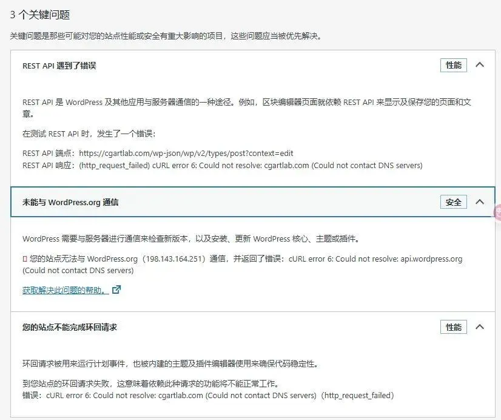
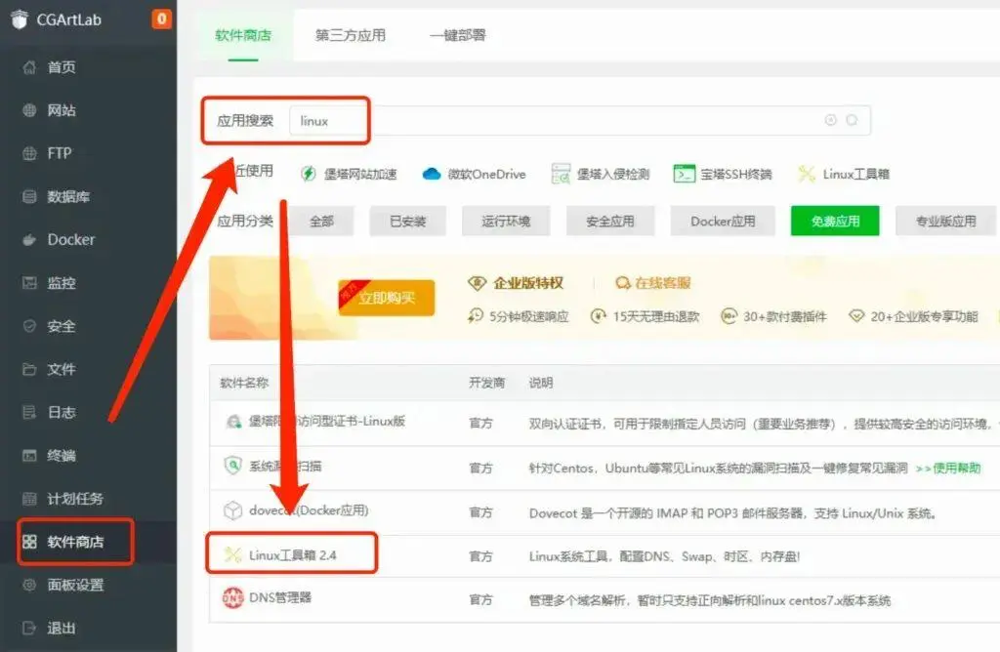

## Introduction

Recently, while installing and replacing page caching plugins for my blog backend (WordPress), the plugin store wouldn't open. The site health page indicated a loop error problem. The prompt message said it was a DNS resolution error, but checking the host server system's DNS configuration still showed default settings.



## Method 1: Install Linux Toolbox via Baota Panel



After consulting DeepSeek, if your server has Baota Panel installed, you can directly search for "Linux" in the software store and install the Linux Toolbox. Opening the toolbox allows you to easily modify the default DNS (such as Alibaba DNS 223.5.5.5 or Tencent `119.29.29.29`).

Additionally, if your website speed has slowed down, you can search for the IP addresses of CDN service providers with the fastest connection speeds within your server's province. Add these IP addresses to the host file, and remember to add access permissions for these IPs in the firewall to maximize website access speed.

## Method 2: Terminal Commands

If Baota Panel is not installed, you can use the following commands to check the current DNS configuration:

```bash
cat /etc/resolv.conf  # Check DNS server addresses
ping 8.8.8.8          # Test network connectivity
nslookup your-domain.com # Test domain name resolution
```

**If resolution fails**:
Replace the DNS server with a public DNS (such as Alibaba DNS 223.5.5.5 or Tencent `119.29.29.29`).

**Linux modification method**: Edit `/etc/resolv.conf` and add:

```bash
nameserver 223.5.5.5
nameserver 119.29.29.29
```

Restart the network service:

```bash
systemctl restart network  # CentOS
systemctl restart systemd-resolved # Ubuntu
```

Finally, verify the fix:

```bash
curl -I https://your-domain.com/wp-json/wp/v2/types/post?context=edit
```

If it returns a `200` or `301` status code, the fix was successful.

### Important Notes

- **Backup configuration files**: Remember to save the original files before making changes to avoid operational errors.
- **Regular network checks**: Loop errors may reappear, so develop the habit of regularly testing DNS and firewall settings.
- **Tool learning**: Although panels simplify operations, familiarity with basic commands (such as `nslookup`, `curl`) can help you locate problems faster.

## Final Thoughts

Building and maintaining your own digital garden requires considerable patience, but I find joy in solving even small problems—life is about tinkering. This series is simply for recording the various pitfalls I've encountered while building this website, because from an expert's perspective, these are all "obvious" explicit knowledge. However, what makes someone an expert is the "tacit knowledge" gained through countless practices. Perhaps I'll discuss this in the next article.
