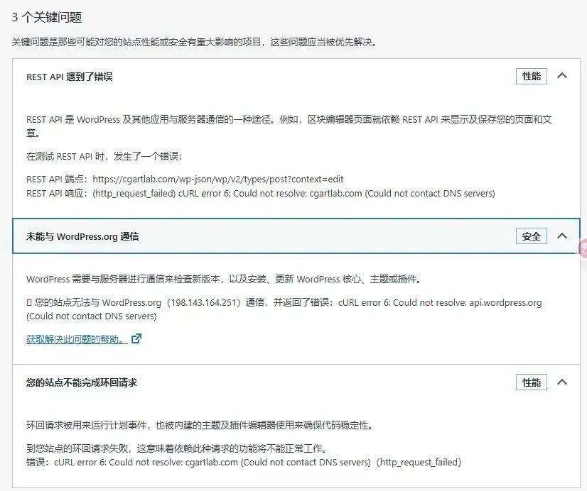

## 写在前面

最近在给博客后台（WordPress）安装更换页面缓存插件的时候，插件商店打不开了。站点健康页面提示遇到了回环错误问题。看提示信息说是 DNS 解析错误，但检查了宿主服务器系统的 DNS 配置依然是默认配置。



## 方法一：宝塔面板安装 Linux 工具箱


问了 DeepSeek 后，如果服务器安装的是宝塔面板，可以直接在软件商店里，搜索「Linux」安装 Linux 工具箱。打开工具箱可以很方便地修改默认的 DNS（如阿里 DNS 223.5.5.5 或 腾讯 `119.29.29.29`）。

同时如果网站速度变慢了，可以搜索服务器所在省内链接速度最快的 CDN 服务商的 IP 地址，把这些 IP 地址加入到 host 文件中，最后要记得在防火墙中添加这些 IP 的访问权限，就能最大限度加快网站访问速度。

## 方法二：终端命令

若没有安装宝塔面板可以使用以下命令检查当前的 DNS 配置：

```bash
cat /etc/resolv.conf  # 检查 DNS 服务器地址
ping 8.8.8.8          # 测试网络连通性
nslookup 你的域名 # 测试域名解析
```

**若解析失败**：
将 DNS 服务器替换为公共 DNS（如 阿里 DNS 223.5.5.5 或 腾讯 `119.29.29.29`）。
**Linux 修改方法**：编辑 `/etc/resolv.conf`，添加：

```bash
nameserver 223.5.5.5
nameserver 119.29.29.29
```

重启网络服务：

```bash
systemctl restart network  # CentOS
systemctl restart systemd-resolved # Ubuntu
```

最后验证修复：

```bash
curl -I https://你的域名/wp-json/wp/v2/types/post?context=edit
```

如果返回 `200` 或 `301` 状态码则修复成功。

### 注意：

- **备份配置文件**：修改前记得保存原文件，避免操作失误。
- **定期检查网络**：回环错误可能反复出现，养成定期测试 DNS 和防火墙的习惯。
- **工具学习**：虽然面板简化了操作，但熟悉基础命令（如 `nslookup`、`curl`）能帮助你更快定位问题。

## 写在最后

搭建和维护一个自己的数字花园是一件十分需要耐心的事，但哪怕解决一个很小的问题我都乐在其中，生命在于折腾。这个系列单纯用来记录自己搭建这个网站踩过的各种坑，因为在老手看来这些都是「明摆着的」显性知识，而老手之所以会成为老手，背后是无数次实践获得的「隐性知识」。下一篇或许可以聊聊这个。