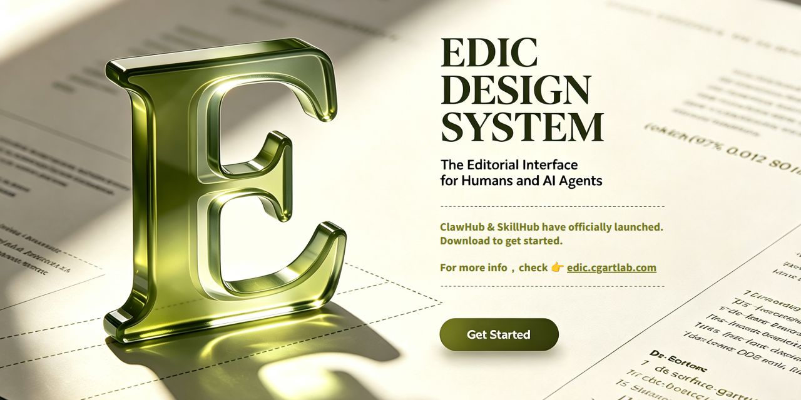

## Overview

EDIC (Editorial Design Interface for Content) is a design system I built for personal use — designed for both humans and AI agents.

## Motivation

Initially, I wanted to leverage Agent capabilities to batch-generate consistent, controllable design assets — icons, components, color pairings. Manually tweaking styles each time was tedious, so I decided to lock in design decisions upfront, allowing Agents to produce compliant output directly.

The idea itself isn't new. But putting it into practice revealed something: for AI to produce "the right design," you need a clear set of rules first. EDIC emerged from that need — a system that grew organically from real demands.

After validating this approach, I packaged it as an open source release.

## Why Open Source

Something that works well for me turned out to help others too. The system is pure static CSS with zero framework dependencies, making integration effortless. Write the rules clearly, and both humans and AI can read them.

## Features

- **200+ Design Tokens** — color, typography, spacing, radius, shadow, motion, full coverage
- **20 Core + 5 Add-on Components** — with dark-mode support and complete states
- **100 SVG Icons** — Lucide-style linear, 1.5px stroke
- **SVG Charts Engine** — supports 10 chart types (bar, line, pie, scatter, etc.)
- **Framework Agnostic** — single CSS works with HTML, React, Vue, Svelte, or email
- **AI Collaboration Tools** — prompts & Skills + references directory let Agents produce compliant designs ([ClawHub](https://clawhub.ai/cgartlab/skills/edic-design-system) / [SkillHub](https://skillhub.cn/skills/user_3697cc42/edic-design-system))
- **10 CI Validators** — including 4 cross-file validators (cssref / darkmode / verext / hardcode)
- **Fallback Model Queue** — `free-models.yml` auto-refreshes available free models every 12 hours; auto-switches when primary model is unavailable
- **Consumer Config** — repo-level `.argus.yml` to customize review dimensions
- **Engineering Governance** — release-please automation, version stamp tools, pre-commit hooks
- **License** — CC BY 4.0

## Version History

### v1.10.2 (2026-08-14)

Audit fixes. Resolved 3 audit findings, refined the release process.

### v1.10.1 (2026-08-14)

Release process correction. Switched to release-please official auto-tag model, addressed 5 P1/P2/P3 review items.

### v1.10.0 (2026-08-14)

SVG charts engine, Skill R2 reliability upgrade, README rewrite.

- **SVG Charts Engine**: unified chart component supporting 10 types — bar, line, pie, scatter, and more
- **Skill R2**: new PATTERNS / RECIPES template library + self-check mechanism for significantly improved reliability
- **Skill references/**: on-demand component examples directory
- **Tooltip ARIA enhancements**: JS interaction, `role=tooltip`, full ARIA support
- **README bilingual rewrite**: concise professional two-column layout with badges

### v1.9.1 (2026-06-25)

Version alignment. Synced manifest / VERSION to 1.9.1.

### v1.9.0 (2026-06-24)

Manual tag-triggered release strategy + auto-generated changelog page. Changelog now sourced from a single `CHANGELOG.md`.

### v1.8.1 (2026-06-24)

CI/release fixes. Fixed version validation from manifest, VERSION sync before packaging, and Skill ZIP filename standardization.

### v1.8.0 (2026-06-23)

Release automation. Added stamp-placeholder bulk updates + changelog page generation system.

### v1.7.0 (2026-06-23)

Layer 2 cross-file validators + release-please pipeline. Added cssref / darkmode / verext / hardcode cross-file validators for cross-resource design consistency.

### v1.6.2 (2026-06-22)

Homepage design system spec compliance fixes. Resolved P0/P1/P2 issues: ds-stat-num double CSS definition, ds-eyebrow letter-spacing conflict, Hero semantic label, Footer inline style cleanup.

### v1.6.1 (2026-06-22)

Pages deployment migration. Migrated to workflow-based Pages, restored v1.6.0 version stamp.

### v1.6.0 (2026-06-22)

Brand rename, hero redesign, frosted-glass navbar, dark-mode enhancements.

- **Brand Rename**: CGArtLab Design System → EDIC Design System
- **Hero Redesign**: sliding word cycle, infinite scroll carousel, unified CTA hierarchy
- **Frosted-Glass Navbar**: `backdrop-filter` acrylic feel + dark-mode aware
- **Fullscreen Mobile Menu**: rewritten from scratch, focus trap + scroll lock + ARIA
- **Dark-Mode Gravitas & Glow**: warm olive-green dark undertone layer
- **Prism.js Syntax Highlighting**: editorial olive-green theme, 16 token types
- **`.ds-pagenav` Unified TOC**: desktop floating card + mobile collapsible, replacing 3 legacy implementations
- **100 SVG Icon Sprite**: `generate_icons.py` auto-generation
- **Version Stamp Unification**: `stamp_version.py` syncs `?v=` across all HTML/MD/CSS/JS files
- **CC BY 4.0 License Full Revision**

### v1.5.x (2026-06-05 ~ 06-19)

Component polish + AI Skill reliability.

- **v1.5.0**: unified `.ds-pagenav` TOC component, Prism code theme adaptation, anti-pattern cleanup (hex/rgba → OKLch)
- **v1.5.1**: fixed TOC scroll-spy yanking the entire page on mobile
- **v1.5.2**: 5 UI/a11y bug fixes + 87 unit tests (Vitest + jsdom) covering theme toggle, navigation, Tabs, Accordion, Copy
- **v1.5.3**: unified data descriptions across the site ("23 components" → "20 core + 5 add-on"), version drift fix
- **v1.5.4**: mobile scroll-lock release fix, footer dead link, `.ds-progress` success/error variants
- **v1.5.5**: Skill release patch — broken links removed, version sources aligned, ClawHub/SkillHub metadata (corresponds to the 06-19 entry in CHANGELOG; the 06-05 entry with ds-pagenav / Prism / Layer 2 validators is consolidated into the v1.5.x group)

### v1.4.x (2026-06-04 ~ 06-05)

Brand rename.

- **v1.4.0**: renamed from CGArtLab Design System to EDIC (Editorial Design Interface for Content), repositioned as "a design system for both humans and AI agents"
- **v1.4.3**: resolved 12 cross-document contradictions (brand name, version numbers, component counts)

### v1.1.0 (2026-05-31)

Multi-page showcase website, brand logo, motion system, AI collaboration tools.

- **6-Page Showcase**: home / visual handbook / documentation / prompts / downloads / terms
- **Brand Logo** (v1.3 redraw — 45° pen-nib monogram)
- **Motion System**: `ds-fade-up/in/down` / `ds-zoom-in` / `ds-float` / `ds-draw`, full `prefers-reduced-motion` support
- **AI Collaboration Deliverables**: system prompt, quick prompt, Agent Skill package
- **Dark Mode Polish**: warm gray base + olive-green dark lift + 0.4s smooth transitions

### v1.0.0 (2026-05-14)

First official release.

- **200+ Design Tokens**: OKLch color system (10 neutrals + 10 olive greens + 4 semantic), 4 font families, 11 type scale levels, 4px spacing grid, 7 radius levels, 6 shadow levels, motion/duration/easing/breakpoints/z-index/blur
- **23 Core Components**: Button / Card / Input / Select / Checkbox / Radio / Toggle / Badge / Chip / Alert / Modal / Tooltip / Accordion / Tabs / Progress / Avatar / Breadcrumb / Pagination / Table / Navigation / Slider / Date Picker / Article TOC
- **100 SVG Icons** (Lucide-style linear, 1.5px stroke)
- **Dark Mode** (`[data-theme="dark"]`)
- **GitHub Pages Deployment** (edic.cgartlab.com)

## How to Use

### Get started in one minute

Include two files in your HTML page:

```html
<link rel="stylesheet" href="https://edic.cgartlab.com/styles.css">
<script src="https://edic.cgartlab.com/scripts.js"></script>
```

Then use component class names directly — no framework, no install needed:

```html
<button class="ds-btn ds-btn--primary">Click me</button>
<div class="ds-card">This is a card</div>
<input class="ds-input" type="text" placeholder="Type something">
```

Every component supports dark mode — just add `data-theme="dark"` to the `<html>` tag.

### Need more?

- **25 components**: buttons, cards, inputs, selects, modals, tabs, tables, and more — all documented on the [docs page](https://edic.cgartlab.com/docs.html), copy-paste ready
- **100 icons**: SVG icon library, embed with `<svg>` tags, no extra loading
- **10 chart types**: bar, line, pie, scatter, and more — pure SVG, embed directly
- **Dark mode**: all components auto-adapt, no extra CSS needed
- **AI collaboration**: install the EDIC Skill in Claude / Cursor / Kiro so AI generates code that matches your design system

### Download

Grab the [zip package from the website](https://edic.cgartlab.com/downloads.html), unzip it, drop `styles.css` and `scripts.js` into your project — done.

## Links

- Website: [edic.cgartlab.com](https://edic.cgartlab.com)
- GitHub: [github.com/cgartlab/edic-design-system](https://github.com/cgartlab/edic-design-system)
- ClawHub: [clawhub.ai/cgartlab/skills/edic-design-system](https://clawhub.ai/cgartlab/skills/edic-design-system)
- SkillHub: [skillhub.cn/skills/user_3697cc42/edic-design-system](https://skillhub.cn/skills/user_3697cc42/edic-design-system)
