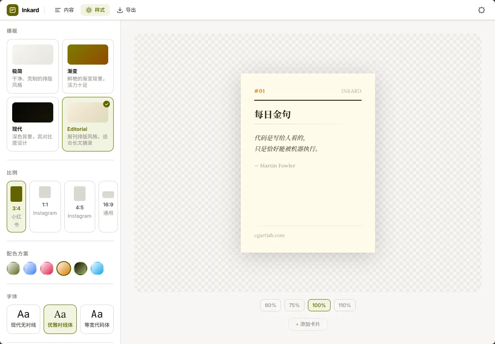

# Overview

Inkard is an online card generator that transforms text, quotes, and lists into beautiful card images in one click. Designed for social platforms like Xiaohongshu, WeChat, and Instagram — everything renders locally in the browser, no data is uploaded.

# Motivation

As a content creator, I often needed to turn a paragraph or a list into a polished image for social media. Opening Photoshop just to tweak fonts, layout, and colors every time was tedious — and any text change meant starting over.

I wanted a tool where you paste text, pick a template, and export directly. Thus Inkard was born.

# Why Open Source

There are many tools like this out there, but most require login, have watermarks, or charge for exports. Inkard's core is pure client-side Canvas rendering — it can run entirely locally. Open sourcing it means anyone who needs it can use it directly, or self-host their own instance.

# Features

## Design Capabilities

- **4 Templates**: Minimal / Gradient / Modern / Editorial, each with a distinct character
- **6 Color Schemes**: Olive / Slate / Rose / Amber / Ink / Sky
- **3 Fonts**: Modern Sans / Elegant Serif / Monospace
- **Dark Mode**: auto-follows system, with manual toggle
- **OKLch Color**: perceptual uniform color space

## Content Handling

- **4 Content Types**: Quote, List, Article, Minimal
- **Live Preview**: form-based editing, WYSIWYG
- **Batch Import**: Markdown (split by `##`) or JSON format, generate a whole series at once
- **Frontmatter Support**: specify title, author, tags in Markdown headers

## How to Use

Visit [inkard.cgartlab.com](https://inkard.cgartlab.com) — your first card takes about 3 minutes:

**Step 1: Paste your text**

Type or paste your content in the left editor. It could be a quote, a list, or a few lines of text. Markdown format is supported (use `##` to split into multiple cards), and plain text works too.

**Step 2: Pick a template and color**

- Choose from 4 templates: Minimal for clean layouts, Gradient for eye-catching designs, Modern for tech content, Editorial for magazine-style
- Pick from 6 color schemes: Olive for nature topics, Slate for professional content, Rose for emotional posts, and more
- Choose from 3 fonts: Sans (modern), Serif (elegant), Monospace (technical)

The right side shows a live preview — any change appears instantly.

**Step 3: Pick a size and export**

Choose the right size for your platform: 3:4 for Xiaohongshu, 1:1 or 4:5 for Instagram, 16:9 for WeChat or general use. Click "Export" and the card image downloads to your computer. No login, no charge, no watermark.

### Platform Sizes

| Ratio | Size | Best For |
|-------|------|----------|
| 3:4 | 1080 × 1440 px | Xiaohongshu |
| 1:1 | 1080 × 1080 px | Instagram Square |
| 4:5 | 1080 × 1350 px | Instagram Portrait |
| 16:9 | 1920 × 1080 px | WeChat / General |

### Batch Mode

If you need a whole series of cards at once (e.g. a content series), write them in a single Markdown file with `##` separating each card, then import. Inkard auto-generates all cards in your chosen template — no copy-pasting one by one.

## Architecture

- **Astro 7 + React 18**: Islands architecture, JS only loads for interactive components
- **Tailwind v4**: utility-first CSS
- **Canvas Export**: browser-side rendering, zero data upload
- **Cloudflare Workers**: global edge deployment

# Links

- Live demo: [inkard.cgartlab.com](https://inkard.cgartlab.com)
- GitHub: [github.com/cgartlab/inkard](https://github.com/cgartlab/inkard)
