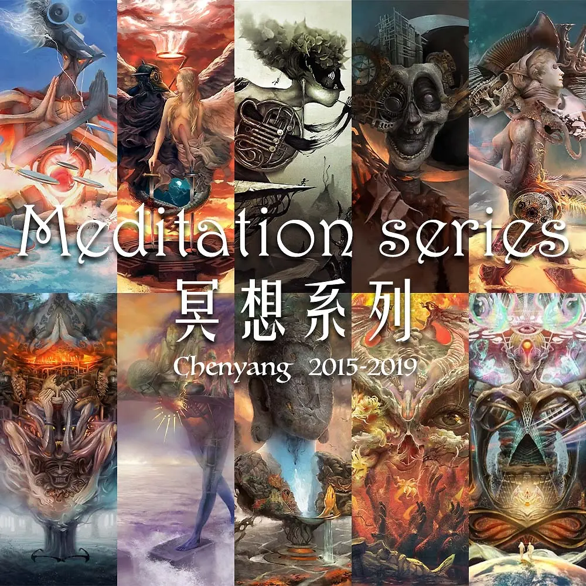
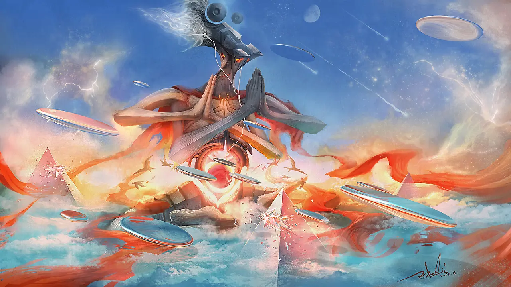
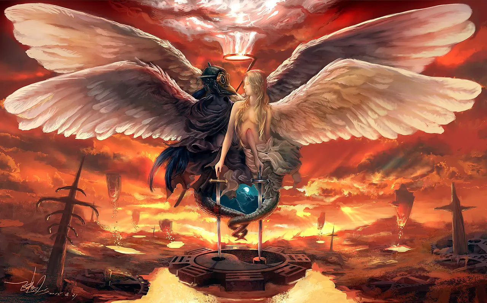
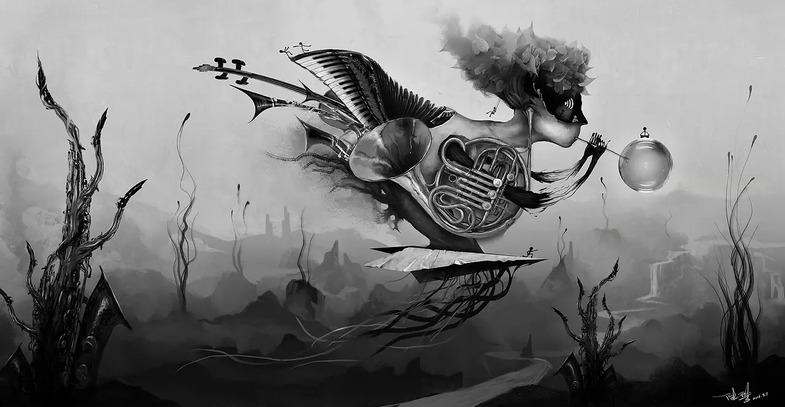
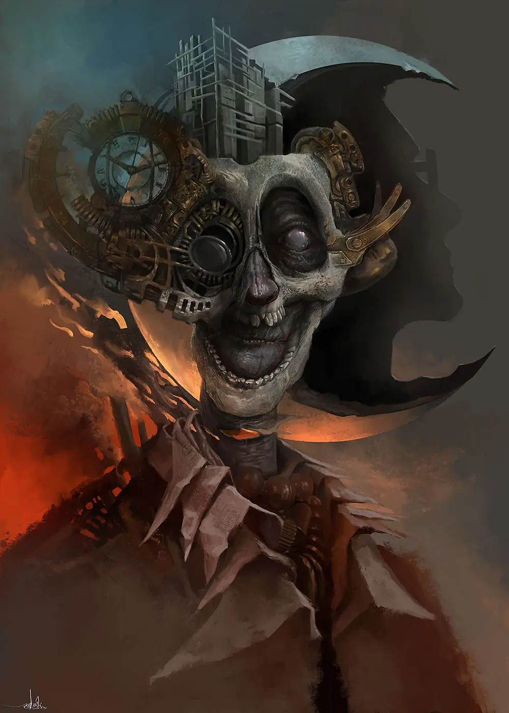
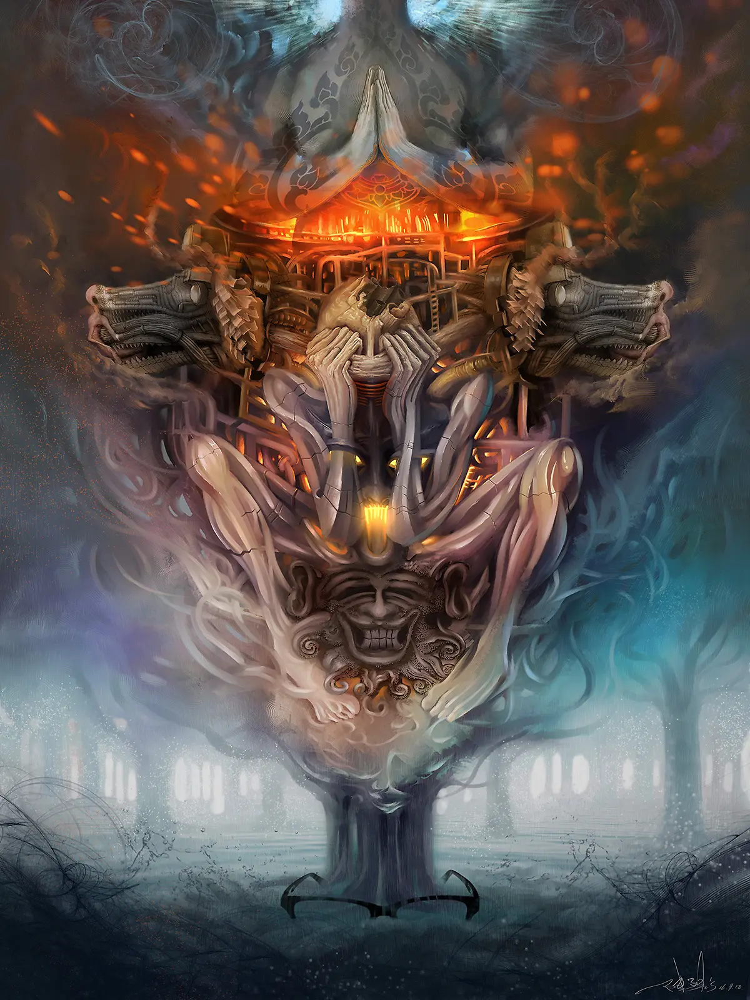
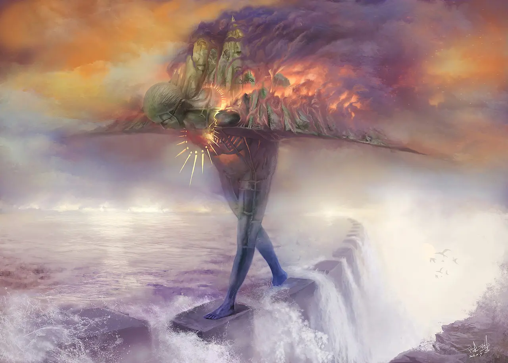
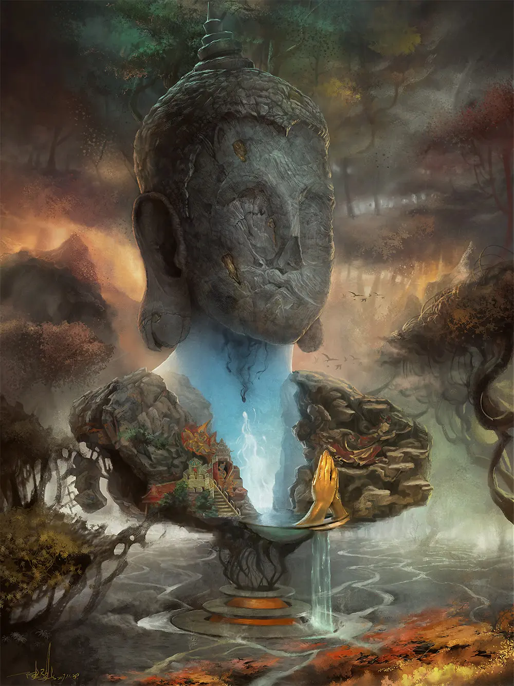
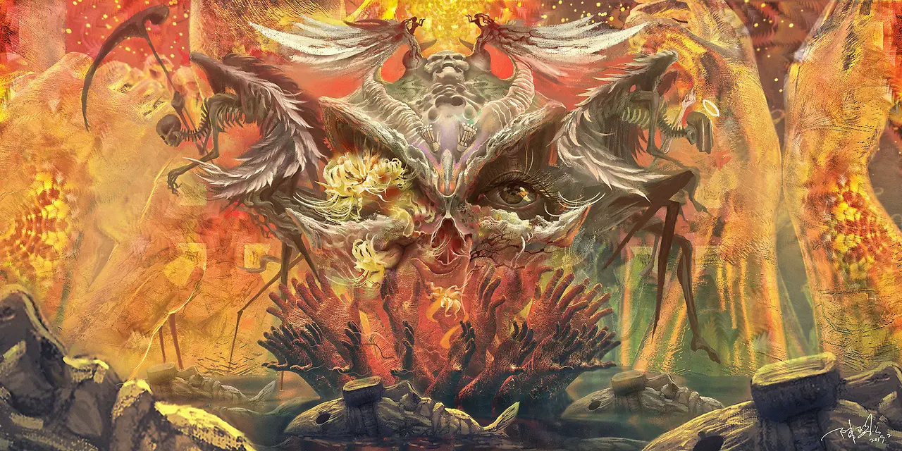
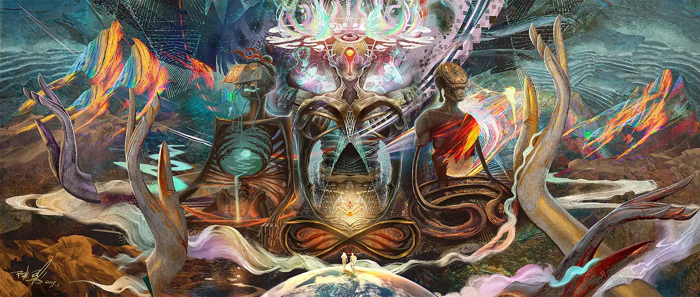

## About the Work

Meditation is a form of consciousness transformation

It is a process of dissecting one's inner self

It is a path to approaching reality infinitely

I first encountered this concept in 2013

In the subsequent years of work and life

It gradually became a habit of communicating with myself

This wonderful experience is perfectly suited for expression through digital painting

Over the following years

I created this series in my spare time

Each piece speaks to a different stage I experienced

At each stage, I chose different themes to converse with my inner self

From the visual perspective

The underlying human psyche is far from beautiful

But it's not entirely unbearable either

Heavy oppression, contradictory conflicts, complex struggles

All represent the authentic self

---

