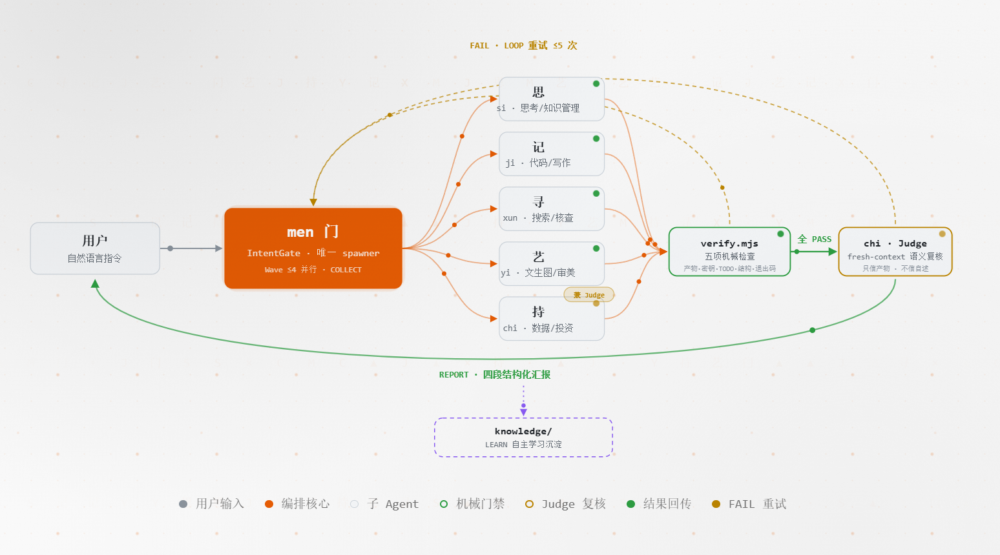

## 最近更新

### 2026-08-27：六个角色分工更清楚了

把六个 Agent 各管一摊的职责重新理了一遍，省得大家抢活、也省得你分不清该找谁：

- **门**成了唯一的总调度。你只跟它说话，活由它分下去、结果由它收回来，其他角色之间不再互相派活。
- **思**变成专门 " 想事情、管知识 " 的人——负责想清楚方案、把经验存下来，不再自己动手写代码。
- **记**专心写代码、写文档，做完先自己查一遍才交。
- **艺**的核心转向文生图提示词，把 " 让 AI 出好图 " 这件事做扎实。
- **持**除了投资评审，还多了数据统计的活。
- **寻**立了条死规矩：没核实清楚的事，不说。

顺手把网站和说明里的角色介绍、协作关系图都同步成了新分工，技能包数量也校正了一遍（去掉了一个空壳）。

### 2026-08-21：从一个能跑的仓库，变成会自己进步的团队

这一版让 men 从 " 一个能跑的程序 " 升级成了 " 有规矩、有流程、能复盘 " 的团队：

- **开源该有的一套补齐了**：许可证、贡献指南、安全策略、自动检查流水线……别人照着规范就能一起改，坏代码进不了主干。
- **加了 " 自主学习 "**：每次干完活，men 会把踩过的坑和好用的套路记进 `knowledge/`，下次不再犯同样的错；还会给自己算 8 项 KPI（完成率、一次通过率、回归率……），用数据看团队有没有变强。
- **工具从 3 个扩到 7 个**：能抓网页、能操作 GitHub、能记长期记忆、能做复杂推理，能干的活明显变多了。

## 作品介绍

Men（门）是我用 OpenCode 搭的一套 Agent 团队系统。解决的场景是，一个人又想写东西又想做项目，它给你配了六个各有专长的虚拟助手，再加一个负责统筹的「门」。你只管把想法丢给它，它自己分活、盯质量、收工汇报。

利用 AI 完成特定的内容创作，其实目标无非是 " 做完还做得对 "。所以 Men 最在意的是**机械验证优先，假完成必识破**：AI 说 " 我做完了 " 不算数——程序先扫一遍证据，再让一个新的子 Agent 复核一遍。只信产物，不信自述。

## 6+1 角色

听起来像一支小工作室，其实是六个 Agent 加一个调度核心：

- **门（men）· 前台 / 项目经理**：所有指令都从它这进，它判断你要干啥、分给谁、最后把结果汇给你。它自己不动手。
- **思（si）· 团队里的脑子**：负责深度思考、想方案、把知识沉淀下来。只出计划，不写代码。
- **记（ji）· 干活的人**：按计划写前端代码、写技术文档、操作 GitHub，做完自己先过一道检查才交付。
- **持（chi）· 财务 + 质检**：一边帮你算投资账，一边当独立裁判——它没参与干活，所以能客观挑毛病。
- **艺（yi）· 设计师**：自动把简单命令编写成专业提示词、出图、定配色和版式。
- **寻（xun）· 调研员**：上网搜、读 RSS、查事实，规矩是 " 没核实不输出 "。
- **门**，是唯一的派活人，禁止角色互相嵌套派活；六个人共享 7 条谁都不能碰的红线。

## 核心机制

让这几个助手能够按规矩合作，我设计了以下红线规则：

- **双重检查**：干完活先跑 `verify.mjs` 做五项机械检查（退出码对不对、文件到底生没生成、有没有泄露密钥、有没有留 TODO、结构对不对）；全过了，再由持用全新上下文独立复核一遍。相当于 " 自己说做完 " 不算，" 机器和旁观者都点头 " 才算。
- **能并行就并行**：互不依赖的活同时开工，最多四路一起跑；每个子任务的要求写得清清楚楚，中途不用回头问。
- **先问清楚再动手**：碰到 " 查资料 / 出东西 / 多角色协作 / 大项目规划 " 四类事，拿不准时先跟你确认，绝不瞎猜着干。
- **安全绳**：`gate.mjs` 把能碰的东西列成白名单防注入；同一个活连续失败 5 次就喊停，不让你电脑空转。
- **全程留痕**：14 种关键事件记在 `events.jsonl` 里，只追加不删改，事后能一条条回放，谁做的什么决定都查得到。
- **会复盘**：`learn.mjs` 从记录里提炼经验，`eval-metrics.mjs` 给你算团队 KPI——干得怎么样，看数就知道。
- **零依赖**：验证、门禁、审计这三件套全是纯 Node 写的，不装任何第三方库，环境要求极低，换台机器就能跑。

## 快速开始

最省事的办法——把下面这句直接发给任意 AI 助手（OpenCode / Claude / Cursor 都行），它会自己帮你装好并启动：

> 帮我安装并启动 men：`git clone https://github.com/cgartlab/men.git && cd men && node scripts/install.mjs && npx astro dev --config site/astro.config.mjs`

想自己敲命令也可以：

```bash
# Linux / macOS
bash <(curl -fsSL https://raw.githubusercontent.com/cgartlab/men/main/install.sh)

# Windows（PowerShell 7+）
irm https://raw.githubusercontent.com/cgartlab/men/main/install.ps1 | iex
```

装好后在项目目录运行 `opencode`，默认 Agent 就是门（men）。三个最常用的命令：

- `/ultrawork <任务>`：一句话交给它，9 步协议自动调度团队把活干完
- `/verify <角色>`：机械检查 + 独立复核，确认产物靠谱
- `/hyperplan <项目>`：大项目先想清楚再动手，拆成能执行的小步

## 相关链接

- GitHub：[github.com/cgartlab/men](https://github.com/cgartlab/men)
- 站点：[men.cgartlab.com](https://men.cgartlab.com)
- 许可证：MIT
