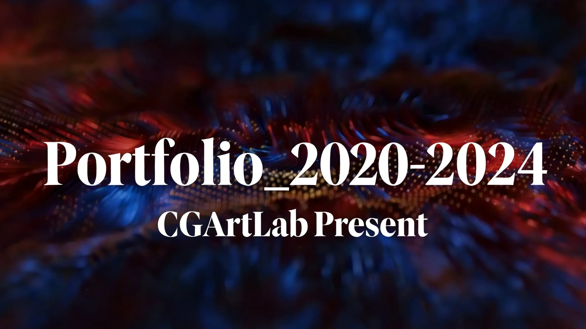

  <iframe
	src="//player.bilibili.com/player.html?isOutside=true&aid=113323500772909&bvid=BV1yyyKYVEeZ&cid=26336890328&p=1"
	style="position: absolute; top: 0; left: 0; width: 100%; height: 100%;"
	scrolling="no"
	border="0"
	frameborder="no"
	framespacing="0"
	allowfullscreen="true">
  </iframe>

---

This portfolio demo is a snapshot of my creative journey over the past few years.

