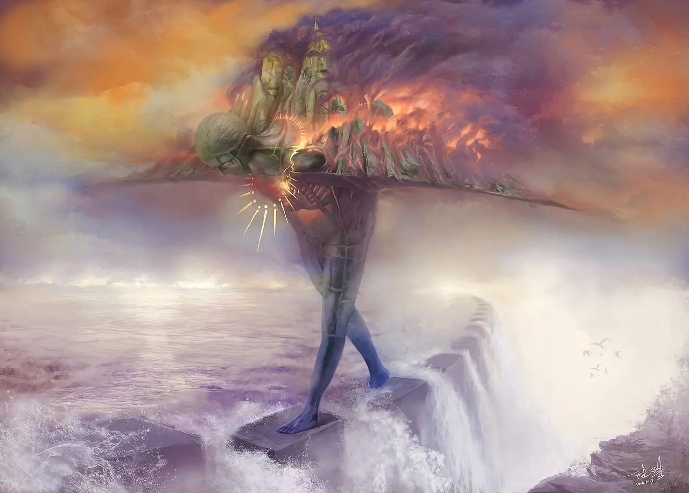

## 作品介紹

冥想是一種改變意識的形式

是解剖自己內心的過程

是讓人無限接近實相的道路

第一次接觸這個概念是在 2013 年

在隨後的工作生活中

它慢慢變成了我與自己交流的一種習慣

這種奇妙的體驗很適合用數位繪畫的形式表達出來

在接下來的幾年裡

我用自己的業餘時間創作了這個系列

每一幅作品都聊到了我經歷的不同階段

每個階段我選擇不同的主題與自己的內心交談

從畫面上也能感覺到

人類底層的內心絕談不上美好

但也沒有那麼不堪

繁重的壓迫，對立的矛盾，複雜的衝突

都是真實的自己

