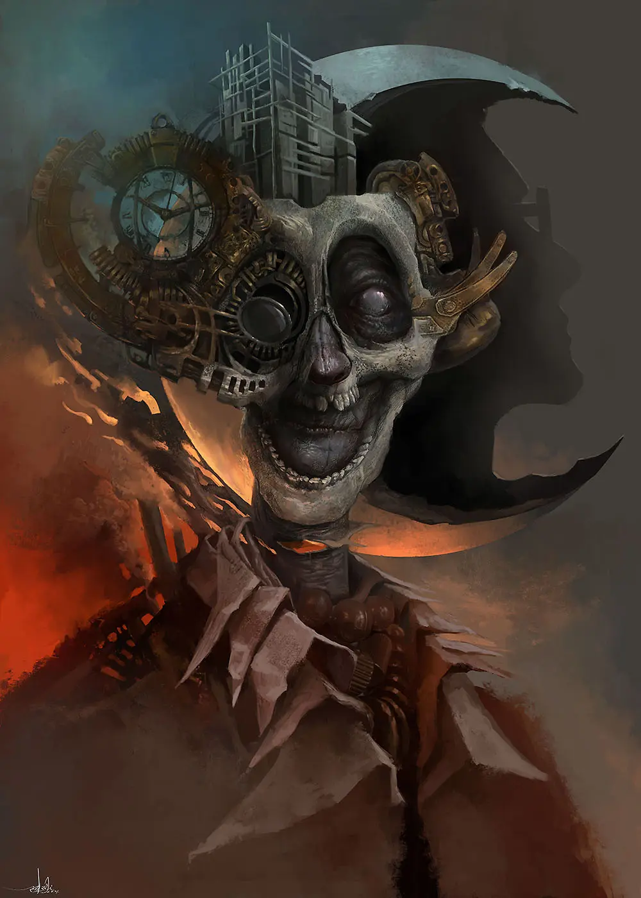
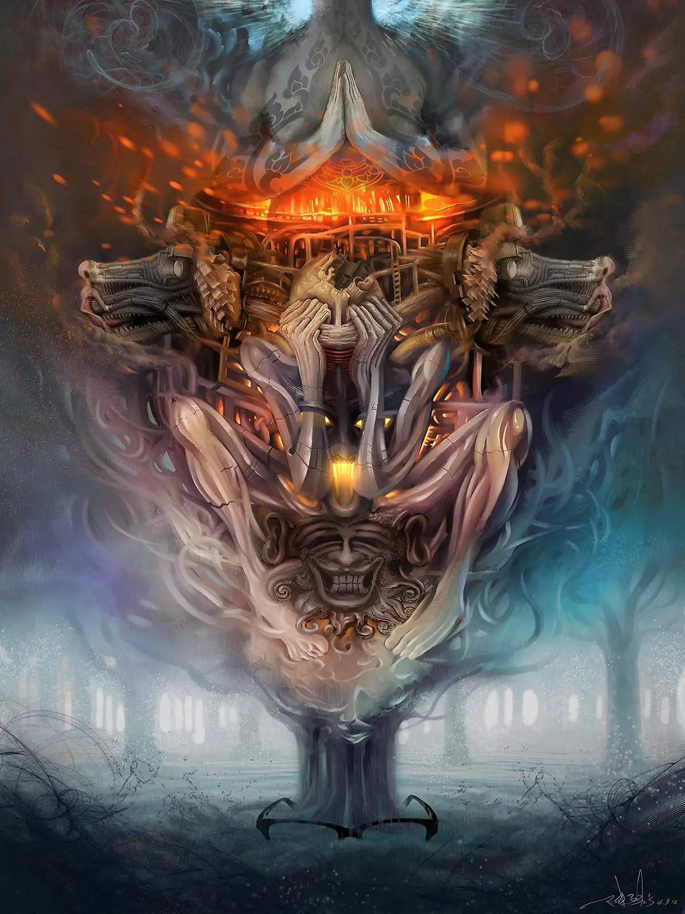
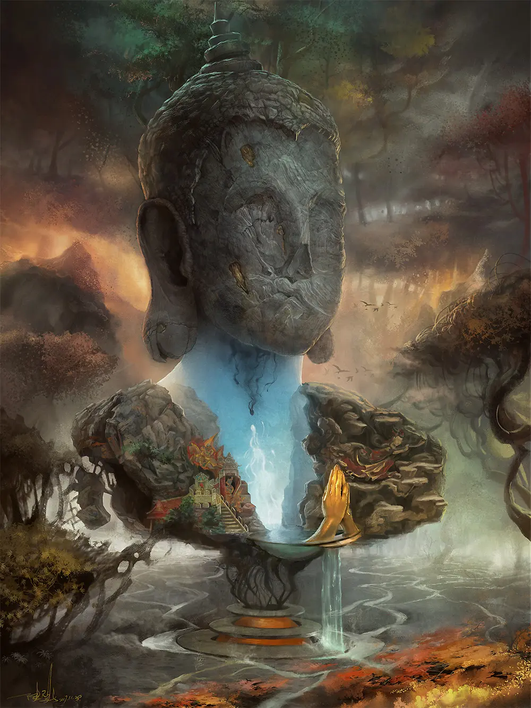
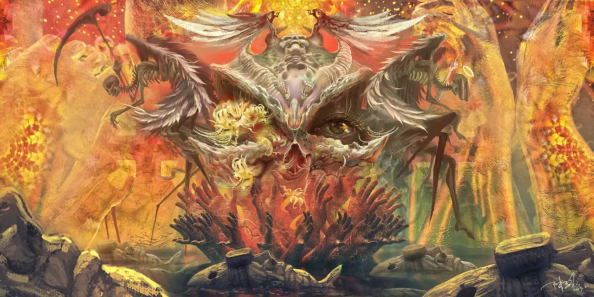

## 作品介绍

冥想是一种改变意识的形式

是解剖自己内心的过程

是让人无限接近实相的道路

第一次接触这个概念是在 2013 年

在随后的工作生活中

它慢慢变成了我与自己交流的一种习惯

这种奇妙的体验很适合用数字绘面的形式表达出来

在接下来的几年里

我用自己的业余时间创作了这个系列

每一幅作品都聊到了我经历的不同阶段

每个阶段我选择不同的主题与自己的内心交谈

从画面上也能感觉到

人类底层的内心绝谈不上美好

但也没有那么不堪

繁重的压迫，对立的矛盾，复杂的冲突

都是真实的自己

