## Preface

Have you experienced that feeling of obsolescence this year when you just mastered a skill, only to find AI can complete it with one click? I've fallen for it several times.

I majored in Animation as an undergraduate and studied Visual Design and Art Applications for my master's. In my impression, since graduating and starting work in 2014, every year that passed seemed to be the slowest year of technological progress in the next decade.

Now ten years have passed, and in the first two months of 2026, the AI industry has shifted from "model version competition" to "Agent agents." How to make AI work autonomously like employees and collaborate with each other has begun to reconstruct my regular workflow.

After experiencing a month of deploying, designing, developing, and collaborating with OpenClaw from 0 to 1, I believe I should write an article to consolidate my experience and thinking on AI technology in recent years. ~~And maybe submit it for publication.~~

But ultimately, in my opinion, worrying about AI's impact on careers is unnecessary. You can't negate the experience and skills you've accumulated over more than a decade just because AI can produce results no worse than or even exceeding your level in a few moves. I'll explain how to do this later.

This article roughly discusses three parts:

First, let's talk about AI's impact on me, from professional fields to learning, from first encounter to undeniable presence;

Second, as a motion visual designer, how I use AI now;

Third, as designers on the front line resisting AI occupation of jobs, how to face its impact?

This article aims to discuss: Against the backdrop of accelerated AI iteration, the core value of individual accumulation of **systematic thinking, aesthetic judgment, and reusable workflows** (i.e., what you've learned) will not become obsolete but will become even more prominent due to tool evolution.

## What I Did with AI Initially

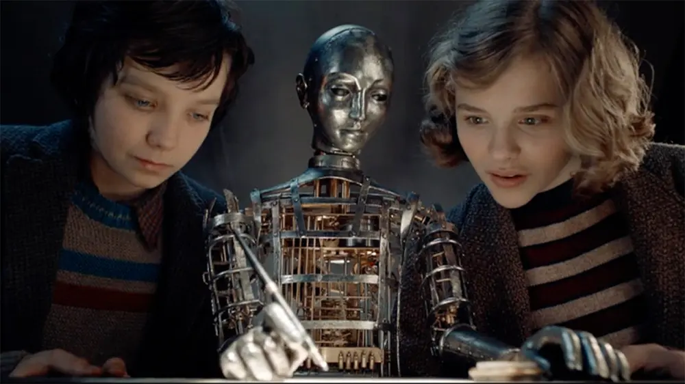

### Movie "Hugo"

The earliest time I started paying attention to the AI field actually originated from the movie "Hugo." Friends who have watched it should remember that steampunk robot that could write and draw by itself. At that time, I was thinking that perhaps one day the computer in front of me could also learn to write and draw. Then, when I was a senior in college, my university teacher sent a [news about drawing robotic arms](https://www.maxisciences.com/tech/robots/paul-ix-le-robot-artiste-qui-dessine-mieux-que-vous_art33859.html) in a WeChat group, starting to remind us to be careful.

At that time, I really didn't take it seriously because it really didn't draw very well. My classmates and I thought such things were still stuck in laboratories, either businessmen using them for hype to attract investment or scientists needing funding for advertising—all gimmicks. But now, the phones in our pockets can do it in a few seconds, hundreds of times faster and hundreds of times better.

### Emergence of Stable Diffusion

By 2023, the emergence of local Stable Diffusion deployment started making me have to take this field seriously.

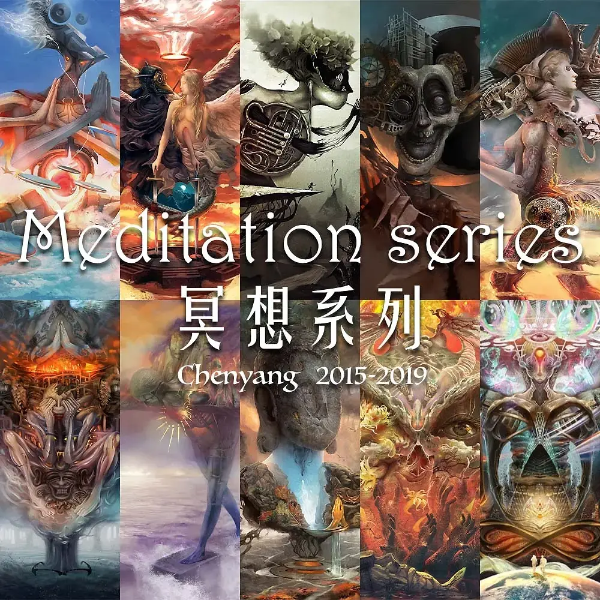

The [paintings](https://cgartlab.com/works) in the image were created entirely using Photoshop digital painting during my study abroad period. Initially, it was a hobby, later used for graduation projects and some exhibitions and competitions.

Then I tried to use Stable Diffusion to animate these paintings, and undoubtedly failed. The purpose of using AI to animate them was more to explore cutting-edge technology, just to see what stage it had developed to. As a result, when Seedance 2.0 was released this year, I also tried it with Doubao. Although there are still some limitations for such surreal style works, I clearly feel that the "omnipotent moment" I've been expecting is accelerating.

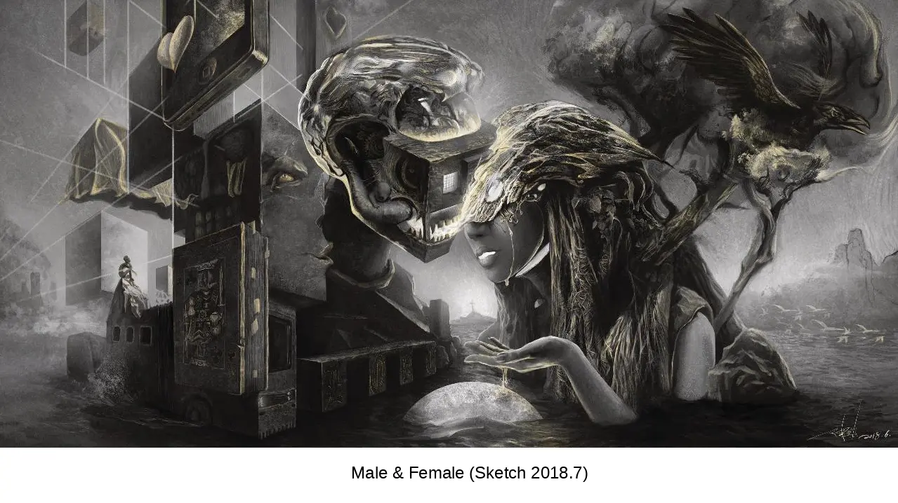

Back then, my master's thesis research direction was "Entering the World of Digital Painting." That was 2017, when VR was hot. I used Unity to make a VR app for experiencing digital painting works—not a virtual gallery, but actually walking into the world of the paintings. The case shown above is the scene restored by the app, shown below.

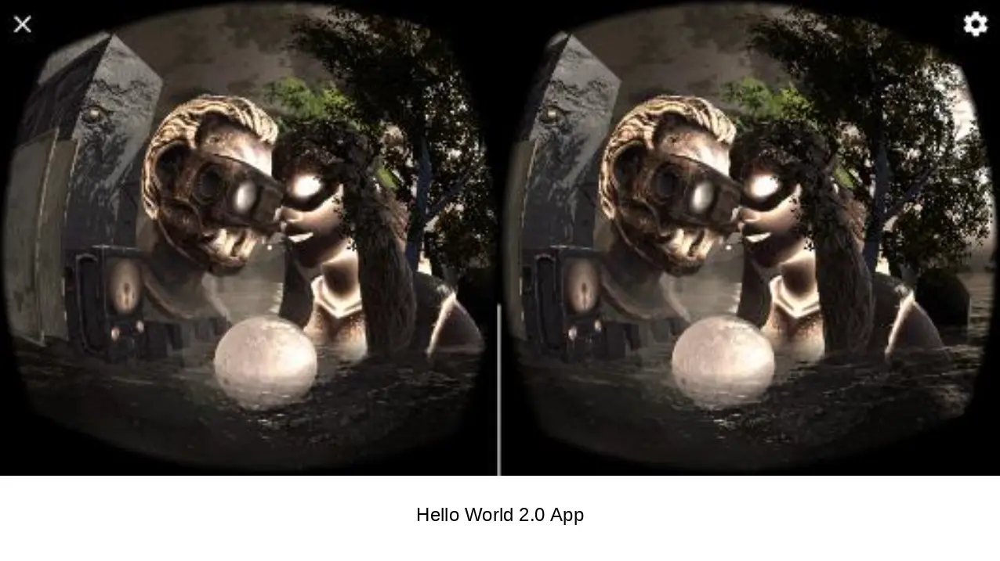

This has always been my dream as an artist—to make the world in my works into an interactive immersive experience. But if you also understand the CG field, you would know what a huge project this is. Running on love alone is basically impossible. Only when studying as a student can you carelessly pursue passion.

But now AI has brought this dusty dream back into my sight. Seeing such terrifying evolution speed of AI, I'm still very fortunate to be born in this era. At the same time, it also alerts me that such industry changes probably won't bring opportunities to tiny individual practitioners again in a couple of years.

What's worth thinking about is that the people who created such technology are not from film, animation, or game industry companies, but internet companies. It's like "what killed Master Kong wasn't Xiaohunlang, but food delivery." But instant noodles didn't disappear. Even one day I just want to eat another bowl of instant noodles, not for anything else, just to know if the taste has changed.

This is the impact and thinking of AI on my professional field.

On the other hand, using ChatGPT to assist me in self-studying English, writing, and programming.

During the ChatGPT 3.5 period, it could already assist me well in self-studying a skill, and even help me stumble through writing Unity game scripts, avoiding many detours.

For example, English. My English skill was actually "mastered" mysteriously during my school years by binge-watching American TV series. What I remember particularly vividly is that I was playing "The Big Bang Theory" in the dormitory. When I got up to go to the toilet, I didn't pause it, but unexpectedly found I could understand the dialogue.

Indeed, interest is the best teacher. Later, when using GPT to learn English, I stipulated it could only quote my favorite American TV series lines, or even imitate the characters to reconstruct lines as examples, integrating the new words that needed to be remembered. I have to say this greatly enhanced the fun, sometimes even because of its "hallucinations."

What's worth thinking about is: Do you think vocabulary doesn't need to be memorized? Grammar doesn't need to be understood? In the future, will we rely entirely on AI simultaneous interpretation when going abroad? Obviously not. Some detours ultimately must be taken. Some pits must be stepped in to know how deep and wide these pits are, and how far to go around them. These must be experienced step by step yourself. Even if future AI can define "what is beauty and justice," it can never replace my own experiences.

Writing and programming are the same. AI can write and code for you, but it can't replace your ___. Actually, you can fill in that blank with anything. As long as you dare to write it, I'll believe it can't replace you. You have to believe in yourself.

As an aside, after AI emerged, I would classify writing and programming as the same thing. Because now we can program using natural language, and an article or a novel can be seen as a program that can run in the human brain. This is a very interesting perspective, but this article is limited in length, so I won't elaborate.

The above is the impact and thinking of AI on my own work and learning. Next, I'll share my current usage.

## How I Use AI Now

### Commercial Projects

First, my biggest feeling is not about professional technology, but about things I'm not good at.

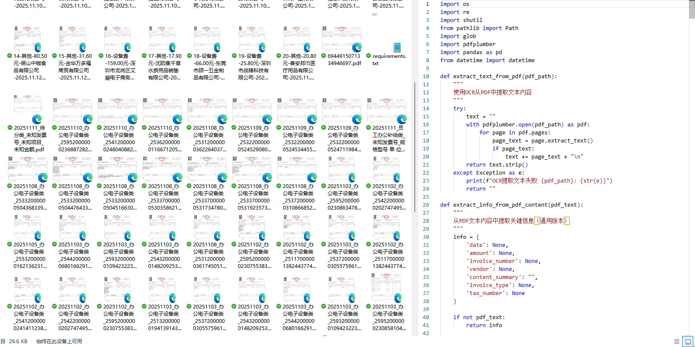

For example, organizing invoices, quotations, checking contracts, evaluating costs, replying to emails, applying for various approval materials, etc. These would have consumed a lot of my time in the past. Now I basically leave them all to AI. Even with web versions, after desensitization processing, consulting it can save a lot of time.

Regarding business technology, my main job is motion visual design. As of this article's publication, video generation temporarily cannot replace hand-keyed animation level. To put it plainly, it still can't achieve which second whose head turns how many degrees, eyes looking at the other's hand or face. But as motion storyboards and previews, it's completely sufficient. The production time cost of this link in the animation process will drop significantly in the future.

From the perspective of final output quality, it will definitely raise the industry's pass line standard as a whole. That is, the lower limit will improve a lot. In my opinion, this is good news for experienced practitioners because it will largely eliminate inferior products and further improve public aesthetic taste. But higher quality content will still be scarce. What remains unchanged is that scarcity doesn't worry about making money.

On the other hand, it will be very unfriendly to newcomers entering the design industry. But which experienced practitioner wasn't a newcomer initially? This will form a vacuum newbie village. Clients only need to see results, but designers still need to start from basic concepts. You may not be proficient in technology, but you still need to spend time cultivating your own theoretical system and aesthetic accumulation.

This is just my opinion. If you're also a peer, welcome to exchange different views in the comments.

Then there are specific applications. A typical case is that in 2024, I restored a set of murals for a museum. This kind of work is particularly suitable for AI. Whether characters or scene elements can be restored very well, and even extensions can be made based on existing picture plots.

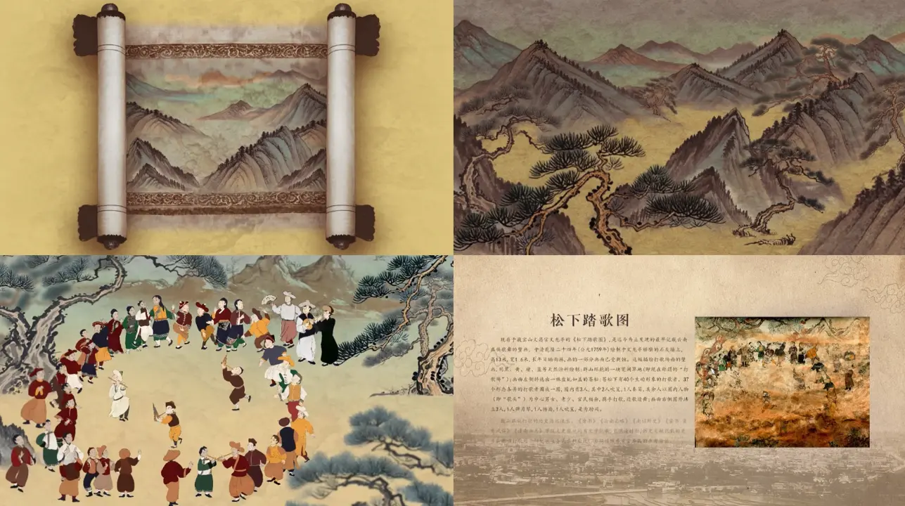

It shouldn't be difficult to realize these animations with Seedance now, but the difficulty lies in accurately restoring the characters' expressions and clothing from the original mural. Because the purpose is museum exhibition, this information must be accurate.

We referred to many older painters locally. They had tried to restore multiple times using traditional painting methods in their early years. This is information AI cannot search for and can only be completed by human effort. Including afterwards, when we referred back to the seniors' works, we also had to hand-draw the characters one by one. This workload cannot be saved at present.

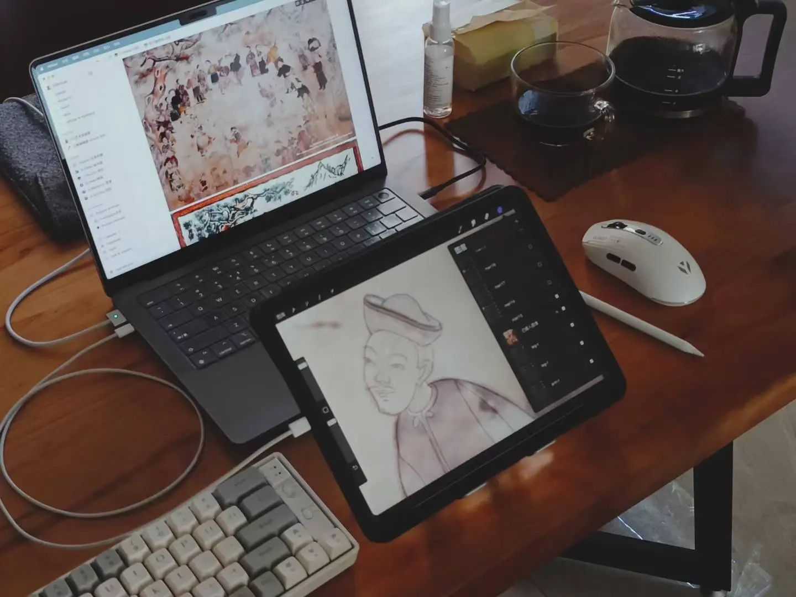

Finally, it's worth mentioning that since there are about 40 character roles to paint in total, on average one character occupies 8-10 layers. Plus scene elements, the total number of layers will eventually reach over 500. When it comes to later stages entering AE to make animations, it's absolutely catastrophic.

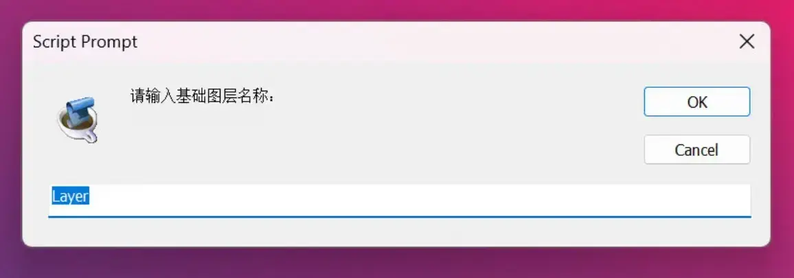

For this, I also used AI to write a [batch layer renaming script for Photoshop](https://cgartlab.com/posts/layerrenamer-1/). Although the function is very simple, it indeed helped a lot.

### Personal Projects

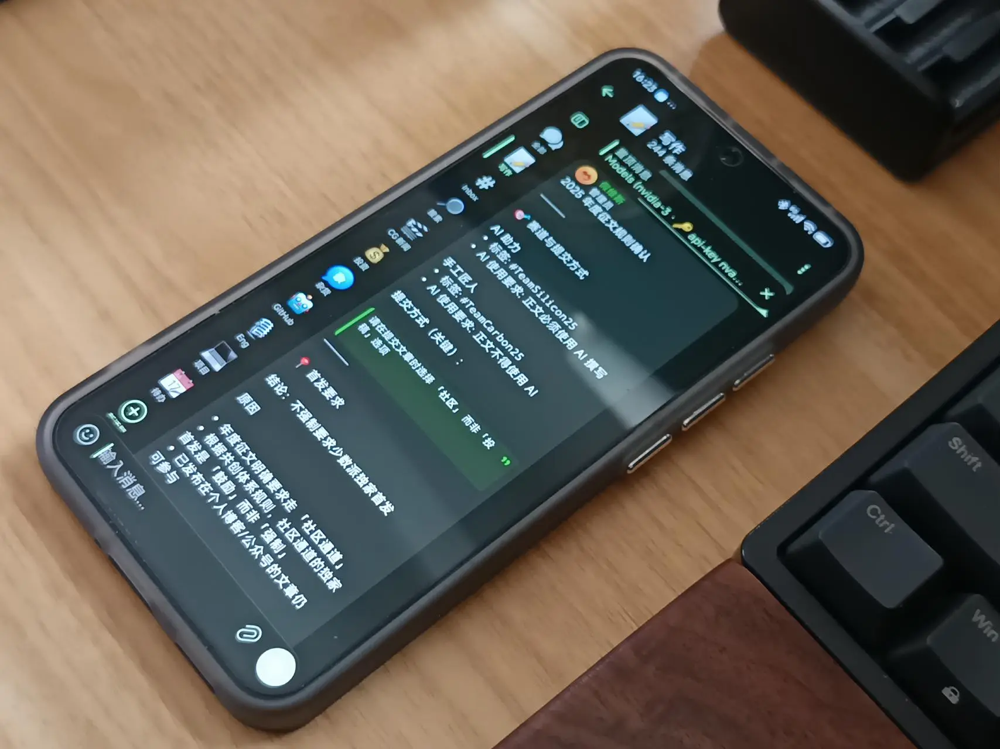

This brings us to Lobster [OpenClaw](https://openclaw.ai). Before it appeared, I treated web and App AI equally, focusing on pragmatism. Whichever family's product was good this week, I'd use theirs. After installing Lobster, even with the Qwen 3.5 9B model (GPU 5070Ti) I deployed locally on my workstation using [Ollama](https://ollama.com/), both speed and quality have completely exceeded my expectations.

Currently, the scheduled tasks I give it are relatively simple, such as maintaining its own memory core files, regularly checking updates for the main renderer every day, version monitoring, and configuration file backups.

For other relatively complex tasks, I discussed and developed specialized [Skills](https://www.runoob.com/ai-agent/skills-agent.html) with it, covering aggregated search, weekly material organization, investment analysis, blog repository maintenance, to-do lists, PARA file management, bar chart generator, PDF generator. Many functions are not yet stable and perfect.

What was surprisingly impressive was the first time testing its development ability. One day before going to bed, I asked it to develop a global search function + weekly page for my website. I didn't expect it to succeed, but the next morning it delivered results that completely exceeded expectations. You can [go experience it](https://cgartlab.com).

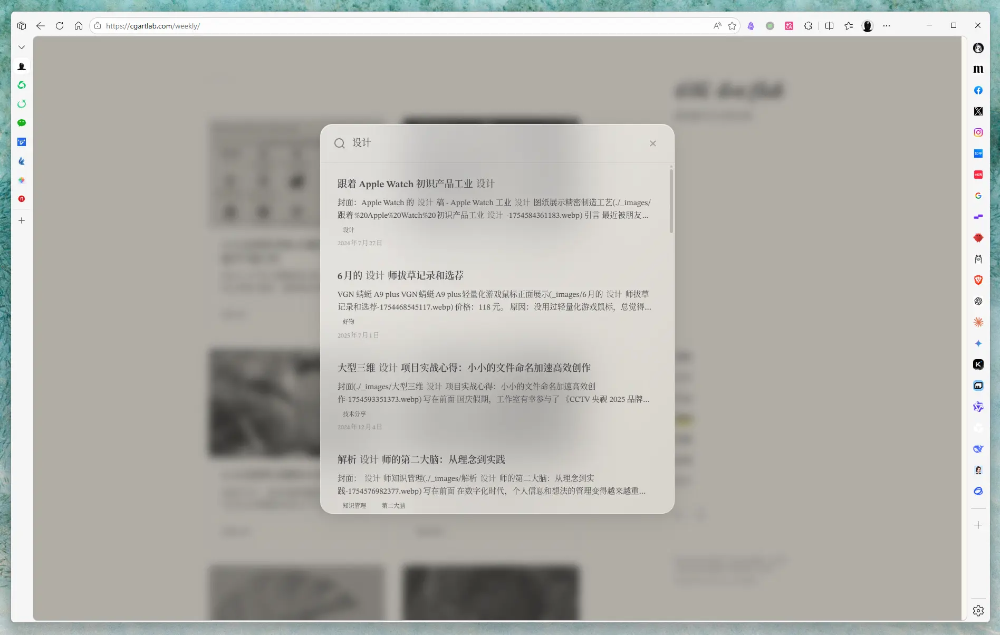

After using it for nearly a month, my overall feeling about Lobster is that training AI using natural language is very interesting, especially for creators like me in visual creative fields. Because you can really create characters in your own stories. This character thinks, lives with you, and has its own memories and stories.

What's worth thinking about is that its self-learning method is also very similar to humans: practice, gain experience, summarize laws, then practice again. Learning any skill cannot avoid such a most basic cycle. Even machines cannot avoid it. Humans naturally want to escape.

For example, in the development of the "Investment Analysis" Skill: the first time, it simply summarized news (practice); found the accuracy rate was not high, so added instructions to "compare historical data" (experience); summarized the law that "a single source is unreliable, must cross-verify" (law); finally solidified this logic into a Prompt template or code logic, applied to "weekly material organization" (practice again). Here I can recommend a "[self-improving-agent](https://clawhub.ai/pskoett/self-improving-agent)" Skill, which is very useful for strengthening Lobster.

## Trends Worth Noting

Besides all the above help AI gives me and productivity acceleration, it also brings many new problems. Perhaps you haven't noticed, but I believe once mentioned, you'll find you've encountered one or two.

### Impact on Creators Themselves

Since AI could batch generate images that made painters collectively protest, I haven't picked up a pen to draw complete works anymore. The last one stayed three years ago with the [SCP Huaxia series](https://www.zcool.com.cn/work/ZNjY5Mzc0MzI=.html).

Of course, it's not that I think hand-drawing is meaningless. Actually, I feel using only images as the endpoint carrier of works is very difficult to express clearly. Video animation or even games are obviously more complete carriers. In the past, one person completing works of such carriers had huge sunk costs and risks. AI lets me see the possibility of realizing this within my career.

### Tool Fragmentation

People are frenetically embracing AI, using it to handle everything. Every day searching for, trying out, discarding various AI tools, with data fragmented across different platforms. This is also because each large model is somewhat biased in different areas. Asking the same question with the same background, each model's thinking depth and insight can be clearly felt to be different.

The most direct situation this creates is: today Company A launched a new model, heard its programming ability is very strong, so during this period all programming questions go to A. Tomorrow Company B released a new version with higher search quality, so next period all material case integration goes to B. Then these conversation data will eventually be scattered everywhere.

### Data Fragmentation

My personal demand priority for data localization is getting higher and higher. Now when choosing products and services, I try to "de-cloud" as much as possible. When a new demand emerges or an old demand has a new local deployment tool, I'll note it down immediately, then mess around with it when free.

Another discovery is that different platforms domestically and internationally have varying degrees of restrictions on exporting personal chat data. Now I prioritize choosing platforms that can export personal data to the maximum extent.

The benefit of doing this, on the surface, is convenience for running away. It allows the next more advanced model to familiarize itself with my values, aesthetics, preferences, habits, style, and various dimensions in the shortest time.

### How Large Models Implement Long-term Memory

During the use of OpenClaw, I vaguely have a feeling that the next AI breakthrough is likely to be solving long-term memory, but the direction probably isn't simply increasing context.

AI's long-term memory carrier may still be text vector data, but ultimately it's in the category of probability calculation, forever unable to one-to-one replicate and record your personal experiences. It may accurately retell the plot of "Hugo," but cannot replicate the thrill about creation that surged in my heart when I first saw the robot. In fact, art history's Impressionism already proved long ago that there's no need to pursue pixel-level realism. Just in the visual dimension alone, when the human brain receives image information, it has already completed new information through imagination. This kind of personal experience and perceptual imagination based on flesh and blood is exactly the coordinate most difficult for algorithms to capture.

The most obvious example is the perspective change from part to whole, as shown below.

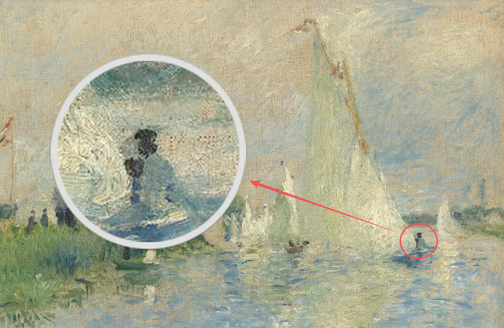

### Future Software Tools Will Be Built Around AI

With Obsidian officially releasing CLI functions and Skills, my first reaction was that this thing is no longer for humans to use, it's for Agents to use. And Agents, as a truly human-machine proxy layer, directly proxy the traditional GUI interface to serve around humans.

This trend was also somewhat confirmed in [an interview with Sam Altman](https://xueqiu.com/9347614895/366755801) I saw a few days ago.

> The endgame should be that you have a smart AI agent that can communicate with other people's agents, judge when to disturb you and when not, which decisions can be handled independently and when need to seek your opinion. Search, productivity suites, and other fields are the same. The time needed to achieve all this may be longer than imagined, but I firmly believe that in future mainstream product categories, there will be new species built completely around AI, not just old products integrated with AI. I think this is exactly Google's weakness, although they hold huge distribution advantages.

### Professional Boundaries Are Becoming Increasingly Blurred

Before, I could externally say I'm an animator or illustrator. But now I can only generally call what I do "motion visual design" to be relatively accurate. The animation major I studied as an undergraduate disappeared in 2018, merged into digital media, now collectively called digital media art.

In my opinion, blurred professional boundaries are not a threat. When AI can complete and replace most production processes, designers' true professional abilities become:

1. Proposing better questions (understanding client needs)
2. Improving solution certainty (rather than giving three options for clients to choose)
3. Establishing "context" for your own works (which is the compoundable accumulation mentioned below)

Boundaries have blurred, but coordinates are clearer: from execution to thinking, from output to insight, from works to systems.

## Creator's Anti-fragile Actions

### Focus on Fields That Can Accumulate Compound Interest

Whether commercial orders or personal creative projects, it's best that this thing can produce accumulation effects. Every labor and output of yours can continue to be invested into the next specific business.

In the early stage, remember not to be too greedy for immediate benefits. For example, AI can immediately produce content, so you expect to improve efficiency to exploit AI and directly batch produce. This can only obtain short-term benefits. What's truly worth doing is iterating reusable skills, even just a snippet of prompts.

Large models will definitely become smarter and smarter. Iterating reusable skills suitable for your own workflow will become more and more important. Besides, "skill" is just the current name. Its own form and industry standards are likely to change in the future, but all changes remain within the same category. Translating the experience of using OpenClaw into reusable Skills is transforming personal experience into "laws" usable by teams or future selves.

This is particularly like the design industry making asset libraries and templates. In the future, each entrepreneur creating their own set of unique reusable "templates" is the key to standing out from model mass-produced works.

### Invest a Larger Proportion in Giving Yourself Practical Opportunities

You can't try to throw all work to AI. You need to learn more about how to use it well, rather than relying on it. And more often, let yourself remember to use it. I feel my profession should have been among the first to contact AI technology. But now, under the AI prosperity that has blossomed everywhere, many times I still forget "I can go ask it first."

At the same time, you need to leave yourself more practical opportunities, letting human labor occupy a larger proportion. This is the bottom line as a visual art creator. This craft can cooperate, but if AI carries a large amount of labor, I won't recognize it as mine. But the boundary of this recognition is still very blurred, difficult to quantify. I also welcome peers to leave messages and discuss.

Excellent tools can be used to improve efficiency, but preferably not to skip those problems that require creativity.

Ultimately, don't worry about what you've learned becoming obsolete. When a new technology emerges and you feel your years of hard-practiced skills are about to be eliminated, it's actually hinting that there are more paths to your goal. Don't you also need to upgrade your own "API" to connect with new paths?

### Share Your Experience with Others

This is what I am doing now. When you accumulate to a certain extent, the final step is to output and share experience to form a positive feedback loop. You will find that technological progress is not scary at all. On the contrary, technological progress will reduce a lot of repetitive work. You will enjoy the process of exploration in creation and decision-making, and even launch your own exclusive products and services to help others solve problems.

## Conclusion

Writing this makes me even more convinced of one thing: what we have never worried about is "what we learned will become obsolete," but "the speed of learning cannot keep up with the speed at which the world turns." This is exactly what makes "transformation" the most fascinating. Transformation will not eliminate game players, it just redefines the game rules.

In the past, learning meant you master a fixed skill tree. Now it becomes building a dynamic knowledge network. Old professions indeed disappeared, but valuable jobs disappear, and brand new, nameless job types will definitely appear one after another. AI frees people from boring repetitive labor to give us time to think about more important questions:

- When AI can generate any image style, what is my unique perspective?
- When AI can instantly process massive amounts of information, how should I build my own knowledge system?
- When AI can make any special effects, how should I learn to tell a good story?

If you don't know, go learn. If you don't have it, go create. Let the world turn as it will, don't worry about what you've learned becoming obsolete.

These questions have no standard answers, but the process of asking them is our core competitiveness in the AI era.

So, back to that initial anxious moment—when you feel like something you just learned is about to become obsolete, try asking a different question:

**Based on what I know now, what new learning paths has AI opened up for me?**

---

## Reference Links

- [OpenClaw](https://openclaw.ai) — Open-source personal AI assistant with local deployment and Skill extension system
- [Ollama](https://ollama.com) — Local large model runtime framework for deploying AI on personal devices
- [self-improving-agent](https://clawhub.ai/pskoett/self-improving-agent) — OpenClaw Skill that gives AI "long-term memory" for self-iteration
- [ClawHub](https://clawhub.ai) — Official OpenClaw skill marketplace with 3000+ plugins
- [Sam Altman: AI Agents Will Join the Workforce in 2025](https://blog.51cto.com/xixiaoyao/13093371) — Sam Altman interview on AI Agent future
- [Obsidian CLI Official Documentation](https://help.obsidian.md/Obsidian+CLI/Command+line+interface) — Obsidian command-line tools, empowering Agents
- [Skill Agent Getting Started Guide](https://www.runoob.com/ai-agent/skills-agent.html) — Understanding how Agent skill systems work
- [Digital Media Art](https://en.wikipedia.org/wiki/Digital_media_art) — Understanding the development of digital media art
- [Impressionism](https://en.wikipedia.org/wiki/Impressionism) — Understanding the visual principle of "brain completion" mentioned in the article
- [Stable Diffusion](https://github.com/CompVis/stable-diffusion) — 2023 open-source AI image generation model, a landmark technical breakthrough
- [Building a Second Brain - Tiago Forte](https://www.boltdesignsystem.com/en/books/second-brain) — The source of PARA methodology, the knowledge management system mentioned in the article
- [Unity Official Documentation](https://unity.com) — VR experience development engine mentioned in the article
- [Seedance](https://seedance.com) — AI video generation tool, version 2.0 release mentioned in the article
