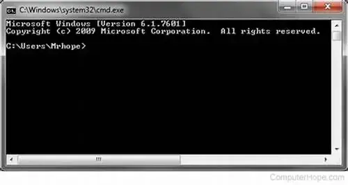

## 从 DOS 到激活 Windows 7

我最早接触命令行，要追溯到上小学三年级，90 年代末，学校当时有微机课，用的是当年极为先进的 DOS 系统，鼠标都是机械带铁球的那种。现在还清楚记得当时的 D 盘里有一个狮子王的游戏，也算是我接触的第一款电脑游戏了。

当时印象最深的一个操作就是换目录命令 `cd D:\` ，敲几个字母就能把只显示黑底白字还不是中文的屏幕，瞬间变成一款游戏。我不懂为什么，只觉得神奇，这对当时的我来说，这些命令就像是咒语。

之后被义务教育了九年，终于在上了大学后有了属于自己的第一台电脑，当时也正赶上 XP 系统和 Windows 7 的更替时期，一下就被华丽的毛玻璃边框和拟物化设计的界面牢牢吸引。可能由于学的也是设计相关的专业，这些系统里优秀的图形设计让我慢慢开始忽视、甚至排斥代码。理所应当的认为，那些东西都是古董，该被淘汰了。唯一使用代码的地方，就是每次帮同学或给自己电脑重装系统的时候，打开命令行用来激活一下“官方原版”的 Windows 7。

直到现在，我才逐渐认识到，这一行一行的「咒语」叫作命令行「CLI——Command-Line Interface 」，它是 Windows PC 中最强大的应用程序之一。
