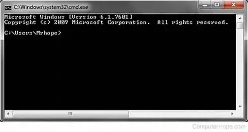

## 从 DOS 到 Windows 7：那些年我错过的"魔法"

我最早接触命令行，要追溯到上小学三年级，90 年代末，学校当时有微机课，用的是当年极为先进的 DOS 系统，鼠标都是机械带铁球的那种。现在还清楚记得当时的 D 盘里有一个狮子王的游戏，也算是我接触的第一款电脑游戏了。

当时印象最深的一个操作就是换目录命令 `cd D:\`，敲几个字母就能把只显示黑底白字还不是中文的屏幕，瞬间变成一款游戏。我不懂为什么，只觉得神奇，这对当时的我来说，这些命令就像是咒语。

之后被义务教育了九年，终于在上了大学后有了属于自己的第一台电脑，当时也正赶上 XP 系统和 Windows 7 的更替时期，一下就被华丽的毛玻璃边框和拟物化设计的界面牢牢吸引。可能由于学的也是设计相关的专业，这些系统里优秀的图形设计让我慢慢开始忽视、甚至排斥代码。理所应当的认为，那些东西都是古董，该被淘汰了。唯一使用代码的地方，就是每次帮同学或给自己电脑重装系统的时候，打开命令行用来激活一下"官方原版"的 Windows 7。

直到现在，我才逐渐认识到，这一行一行的「咒语」叫作命令行「CLI——Command-Line Interface」，它是 Windows PC 中最强大的应用程序之一。

## 命令行是什么：设计师能理解的类比

### 类比一：Photoshop 的动作面板

- 动作就是"录制好的命令序列"，一键执行一串操作
- 命令行就像：给电脑录一个动作，然后随时播放

### 类比二：Figma 的组件变体

- 组件 = 命令，变体参数 = 命令选项
- 输入 `git commit -m "fix"` 就像在 Figma 里选择"修复"变体

### 类比三：URL 是互联网的命令行

- `https://www.google.com/search?q=...` = 用命令行搜索 Google
- `mailto:example@email.com` = 用命令行打开邮件客户端
- 命令行只是更直接、更强大的 URL

### 核心概念扫盲

- CLI vs GUI：命令行是"告诉它做什么"，图形界面是"展示它能做什么"
- 终端（Terminal）vs Shell：终端是"屏幕"，Shell 是"屏幕里那个能听懂命令的程序"
- Windows 常用 Shell：PowerShell（默认）、CMD（遗留）、WSL2（Linux 子系统）
- 路径概念：绝对路径 vs 相对路径，`\` vs `/` 的区别

## 为什么设计师应该学一点命令行

### 痛点一：重复操作消耗生命

- 批量重命名 100 张图片？点 100 次不如一行命令
- 批量压缩 50 个文件？拖进压缩软件不如 `tar -czf` 一行搞定
- 批量查找替换文本内容？Notepad++ 不如 `sed` 精准

### 痛点二：跨软件协作的胶水

- 设计文件导出为不同格式？命令行 + ImageMagick 自动处理
- 从 API 获取数据再导入设计工具？`curl` + `jq` 一条龙
- 设计稿同步到各设备？`rsync` 比任何同步软件都可靠

### 痛点三：版本控制的门票

- Git 是现代协作的"基础设施"，而 Git 的核心是命令行
- 不是"设计师必须会编程"，而是"会用命令行才能用好 Git"
- 参考《[[从黑苹果到独立博客，这是我的开源旅程]]》里的 Git 使用心得

### 痛点四：AI 工具的入口

- OpenCode、OpenClaw 这类 AI 工具，交互界面就是命令行
- 不会命令行 = 只能用图形化的"阉割版" AI
- 参考《[[我常用的 OpenClaw 工作流 Skill]]》

## 我的命令行学习路径（设计师版）

### 第一阶段：不要记，先抄

- 找一张"常用命令速查表"，遇到操作先查再用，不用硬背
- 常用速查：《[[优雅的命令行：速查表]]》（本系列第二篇）

### 第二阶段：从 GUI 替代开始

- 用 `explorer` 替代"我的电脑"
- 用 `start .` 在当前目录打开资源管理器
- 用 `code .` 用 VS Code 打开当前文件夹

### 第三阶段：认识环境变量和 PATH

- PATH 是什么：系统去哪里找你要运行的程序
- 为什么 `node -v` 能找到 Node.js，但 `python` 可能找不到
- 添加 PATH 的意义：让任何地方的命令都能被找到

### 第四阶段：学会写脚本

- PowerShell 脚本 (.ps1)：Windows 原生，语法接近英语
- 把重复操作写成脚本，一键执行——这就是"自动化"的起点
- 示例：用脚本自动备份设计文件到 NAS

### 第五阶段：拥抱 Linux（可选但推荐）

- WSL2：在 Windows 里运行 Linux，不需要双系统
- Linux 命令行的哲学：一个小程序做一件事，组合起来威力巨大
- 参考《[[WSL2 入门：设计师的第一堂 Linux 课]]》

## 这个系列会讲什么

### 系列总览

- **开篇**（本文）：系列介绍、学习路径、为什么值得学
- **第二篇**：速查表——设计师最常用的 30 个命令
- **第三篇**：PowerShell 入门——Windows 上的第一门编程课
- **第四篇**：从 Git 到 GitHub——命令行版版本控制入门
- **第五篇**：用命令行提升设计工作效率——实战案例

### 适合谁来读

- 被"黑底白字"劝退过的设计师
- 想提升效率、减少重复操作的内容创作者
- 想深入理解工具链的设计师/开发者
- 不适合：已经有扎实命令行基础的人

### 读完能获得什么

- 不再害怕命令行界面
- 能看懂并修改简单的脚本
- 能用命令行完成日常的重复操作
- 为进一步学习编程和自动化打下基础

## 下一步

- 如果你用的是 Windows：建议先从 Windows Terminal + PowerShell 7 开始
- 如果你用的是 macOS：内置的 Terminal.app 已经足够好，可以考虑装个 Homebrew
- Linux 用户：你可能比我更熟练 :)
- 推荐阅读：《[[优雅的命令行：速查表]]》（待发布）
