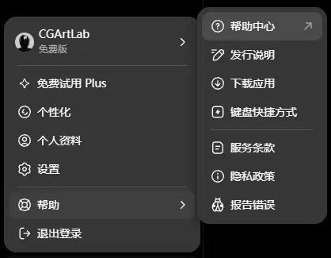

## 引言

最初，这是一本计划写给家里长辈看的小册子。本篇是这本小册子的开篇，写它的另一方面，是想尝试看看自己能否驾驭更大体量的长文写作。

起因就是最近两年，经过我的科普和安利，我爸妈也开始习惯使用各种 AI 产品。到现在每天都会用到 AI ，从查菜谱到了解法律常识，从设置一场世界杯比赛提醒到折腾自己的自媒体创作，几乎无所不包。

有意思的是，虽说他们不像年轻人生在移动互联网时代，但至少也已经用了十几年智能手机了，可无论手机智能到什么程度，即便已经存在 AI 这样方便的「黑科技」帮手，依然会不断出现下面这些现象：

```markdown
- 面对精简到极致的输入框，反而无话可说
- 从「想不起来问AI」到「什么都想问AI」
- 好不容易心里明白要问什么了，但到嘴边不知从何问起
- 得不到满意的答案直接放弃，基本不会尝试第二次
- 得到了满意的答案，过两天又找不到了，还得问第二次
- 每次对话都是「一次性」的，下次从零开始
- 很难分辨 AI 是否在一本正经地胡说八道
- 轻易发送自己的私人信息
- 出现弹窗，依然不假思索点击「同意」或「确定」
- ······
```

回头再看我们这些年轻人，虽然从智能手机时代长大，似乎天生就熟练使用更多 App ，天生也会分辨哪些信息是更可靠的。但是在面对高速进化的人工智能时代，我们这些所谓的年轻人，在 AI 面前其实和长辈面对智能手机时没什么两样。因为，以上问题在几年前都同样适用于我。

即便周围认识我的人，大多数都认为我是个 [Geek](https://zh.wikipedia.org/wiki/%E6%9E%81%E5%AE%A2) ，我也经常会对 AI 平台和产品的变化束手无策。只是我觉得这是个非常厉害的工具，没有轻易放过它，然后近几年又捡起了写作的爱好，整理了不少自己用着很爽的「干货」。

因此，我觉得记录和分享自己是如何解决这些问题的过程，把这几年攒下来的「干货」总结梳理出一套相对通用的文字沉淀下来，相信是一件有长期价值的事情。

在你决定往下看之前，还需要知道的一些事：

- 本系列面向的是新手，老手不需要往下看的。
- 本系列完全免费，禁止一切商用，公开转载不用通知我，自觉注明出处即可。
- 本系列的内容大纲和第一版草稿由我撰写，最终由 Codex 提供完善建议和润色。
- 本系列所有的 AI 使用案例统一使用 ChatGPT 网页版，每个案例都附上了链接。
- 本系列的所有图片使用 AI 生成。
- 本系列不是快速上手指南，希望速成的朋友请直接放弃。
- 本系列将带你从一名「规则执行者」，逐步成长为明显提升 AI 输出质量的「规则设计师」

## 为什么不是快速上手指南？


从上世纪 90 年代开始，计算机和互联网让这个世界的运转加速了不知多少倍。人们依然在毫不犹豫地期望更快的信息传播，发展，获利。

多，快，好，省，是永恒的刚需。

人工智能，现在无论从内容产出速度，发展进化速度，行业吸金速度，资源消耗速度，好像哪个方面来看，它都是最「快」的那个行业，目前没有之一。

你可能会想，这和怎么用好它有什么关系？有啊，正是因为它已经很快了，并且人类把它造出来就是用来帮助人类变得更快的。

那着急什么？单从用好人工智能这个工具的层面来看，我觉得反而是不必着急的。

原因如果只有一个，我认为是：AI 是个放大器。人类的优势和劣势在它的加持下，都会被快速放大。面对这个革命性的放大器，反而应该更加谨慎对待，系统地学习如何用好它。

原因如果有多个，我认为是：

```text
- 学习可以加速，但绝无捷径
- 提问质量决定答案质量
- 好的学习习惯和思维方法，需要时间沉淀
- 习惯和思维方法不是一天可以养成的
- 工具会过时，思维和习惯不会
```

发现了么，这些原因居然 AI 没什么关系的。AI 不管你的用法好坏，只会无情地、毫无保留地、越来越快地放大人的优势和劣势。

放大优势比较好理解，怎么还能放大劣势呢？因为别人的优势被放大了，我没有，其实也相当于我的劣势被放大了，不是么？

那么问题就变成了，我要如何让自己的优势多一点，劣势少一点？请 AI 放大更多优势，最好不要放大我的劣势。

换句话说，需要我克服的，其实都是过去老生常谈的朴素问题：

> 面对那些陌生领域，该如何学习和思考？

这也是整个系列文章背后真正想转递给你的能力，这套方法学任何东西都用得上。

### 文字已经是速度最快的信息载体

其实从最初 ChatGPT 的出现就可以看出一些端倪，比如最开始所有大模型也是通过阅读海量的文字信息训练出来的，然后才逐渐出现可以文生图，文生视频的能力。你想过为什么是这样的顺序吗？

单从信息存储和传输的角度看，手机拍摄的一张图片平均大小为 2MB 左右，而如果是同样大小的文字信息能承载的字数大概是数十万字左右。换句话讲，文字在数字世界是最高效的信息载体，没有之一。

而人脑却天生更擅长处理图像和声音，这也是为什么短视频如此火爆的原因。甚至网络上很多文章第一段已经流行一个标题叫 [太长不看](https://zh.wikipedia.org/wiki/TL;DR)（TLDR），仔细想想真的是一个很值得玩味的现象。

> AI 在老老实实一字不落地阅读原文，人类却恨不得立刻获得几百字的摘要和结论。

本文写到这里大概也有几千字了，如果你能耐心看到这里，已经超过了大多数人。越往下读，你越会发现耐心阅读文字的重要性。

### 识别长期价值


慢下来，保持耐心的另一个重要目的，是识别长期价值。事实上，识别长期价值的能力几乎是做一切重大决策的根本。

郭帆导演在拍摄现场经常说：

> 大家别着急，慢一点儿反而比较快。

当然电影片场并不敢真的慢，但这个做事理念我是很认同的。

学习从不存在速成，强如 GPT 从研发到发布也用了七年。只要它自己不掉链子，这个差距竞争对手很难追上，想追上只能想办法弯道超车。

慢，几乎注定伴随着长期。我们都认为做有价值的事是正确的。换句话说，长期价值，意思就是坚持做正确的事。

那么识别出长期价值，其实就是再问一个问题：

到底是做正确的事，还是把事情做正确？

这也是我选择写这本小册子的原因之一，掌握技巧固然重要，但在变化如此迅猛的 AI 时代，很多技巧都可能过时，并不具备长期价值。

具有长期价值的事物，一般都会有以下特征：

- 它足够通用，掌握之后一通百通或者举一反三都只是早晚的事。
- 它足够稳定，伴随文明，不会轻易被淘汰。
- 它足够简单，就像自然规律一样。

如果你坚持看到了这里，相信你已经意识到了，你周围认识的人，谁通常在做有长期价值的事情。

那么在使用 AI 方面，对你我这样的普通人，眼下最大的长期价值是什么？

**学会如何设计规则。**

## 从规则执行者到规则设计师


还记得最开始提到的现象吗？

```markdown
- 面对精简到极致的输入框，却无话可说
- 从「想不起来问AI」到「什么都想问AI」
- 心里明白想问什么，但到嘴边不知从何问起
```

我刚开始认为提不出高质量的问题，是组织语言和表达能力不足造成的。很快发现不对， AI 非常擅于帮我整理思路和组织语言啊，那我还是得不到高质量的回答又是为什么呢？

后来我慢慢想通了，这是上班的惯性。我自己是设计师，设计的工作本质是在解决问题，其实大部分人的工作都是如此。现在反过来了，我想让 AI 解决我的问题，我一下变成了需要提出问题和需求的人。

提出好的问题和需求，本质是在设计规则。

上班的时候，其实何止是上班啊，只要在一天里清醒的时候，我们大部分都是规则和命令的执行者。每天都要按规则起床，洗漱，吃饭，出门，工作，加班，回家，睡觉。大部分人甚至从未思考过一个每天都在执行的规则是否正确合理，更不会考虑该如何设计规则。

如果逐渐感觉哪里不对劲了，最多的想法恐怕是，太好了，今天终于不用遵守和执行那些规则了，赶紧放松休息一下。于是，丝滑的切换到了另一套规则里去了……

用好 AI 的第二步，就是要学习亲自设计规则。

跟谁学？当然是那些擅长设计规则的人。可是马上就会发现，生活中擅长设计规则的人，往往是领导，甲方，老板…

好在，设计规则也是 AI 擅长的。

向 AI 提出一个高质量的问题，本身就是一次微型的规则设计。我们将在第三章深入探讨如何系统化地设计这些「规则」。

### 找到那个最牛的规则设计师

AI 毫无疑问是普通人能买得到，买得起的最强规则设计师。另一个毫无疑问的是，越贵的越强。

在 2026 年，在我接触过的上班族和学生，很多依然认为给一个聊天机器人付费，还按月，是极其不理智的行为。其中：

- 上班族给出的理由我听到最多的是，用来工作的工具应该由公司买单。
- 学生给出的理由普遍是，免费的够用了。

其实这两种理由的出发点都没错，只是依然是从规则的执行者身份考虑的，从未思考过如何设计规则，变成规则的设计者。

而生活中通常善于设计规则的人，最常见的是甲方，领导，上级，学校，老师，政客，通俗讲，是那些「少数的聪明人」。

不妨试想，如果去找和你关系最好的老板，领导，甲方，去向他们请教如何设计规则，得到一个真正靠谱的答案，到底需要消耗多少成本？

而现在只要一个月最贵也就不到两百元钱，就能请来一个 24 小时待命，毫无怨言的策略专家为你解答一切困惑。还不够划算吗？如果划算，那还不选评价最好的吗？

现在，聪明的你如果现在意识到这一点，就会认同以下真诚建议：

- 你的时间很宝贵
- 在你的能力范围内，无论技术上还是经济上，选择你能用得起的，普遍公认最先进的那个 AI 产品和服务
- 最好也是资本市场认为最先进的那个 AI 产品和服务
- 如果需要折腾一下才能用上，不要怕麻烦

上面这几条看起来是一堆「正确的废话」，可往往就是因为如此显而易见，才会被大多数人忽略不计。

另外必须承认，和以往人类历史上的数次「科技革命」不同，AI 看似是类似计算机，互联网，智能手机一样似乎是能够带来「平权」的工具。但事实似乎并非如此，最先进的模型往往需要付更多费用，而愿意为它付费的人，目前仍是少数。

现在我相信你已经选好了适合自己的平台和产品，或者计划重新开始认识 AI 这位规则设计大师。以下我们统一以 ChatGPT 的网页版进行说明和举例（使用其他平台，例如 DeepSeek，Kimi，豆包，也完全不影响）。

### 为什么要先用网页版？


无论 ChatGPT、Claude、DeepSeek、Kimi、GLM，成熟的 AI 产品都能够运行在以下 6 种形态：

- 网页版
- 手机版
- 桌面版
- CLI
- API
- Agent

大多数人只会接触到前三个，那为什么我们非要以 GPT 的网页端为准进行说明和举例？这其实也是我问过 GPT 的问题，不妨先看看它怎么说。

节选部分回答如下：

> ## 如果只推荐普通用户学习顺序
> 	大多数人不需要一开始研究所有入口。
> 	比较合理的路径是：
>
> 	**第一阶段：网页端**
> 	理解 ChatGPT 的基本逻辑：
> 	“提出问题 → 提供背景 → 让 AI 生成结果 → 继续修改”。
> 	这是最重要的一步。
>
> 	**第二阶段：手机 App**
> 	把 ChatGPT 变成日常工具。
> 	例如：
> 		- 拍一张菜单，让 AI 翻译；
> 		- 拍一个不会的题，让 AI 解释；
> 		- 走路时用语音交流；
> 		- 随时记录想法。
>
> 	**第三阶段：桌面端**
> 	当 ChatGPT 开始参与工作时，桌面端价值明显提升。
> 	例如设计师：
> 		- 上传设计稿，让 AI 分析；
> 		- 讨论方案；
> 		- 阅读项目文件；
> 		- 辅助写文案。
> 	例如程序员：
> 		- 查看代码；
> 		- 修改文件；
> 		- 调试问题。
> 	桌面应用目前已经强化了与本地文件、浏览器和开发工具的结合
>
> https://chatgpt.com/share/6a5394a8-df34-83ee-a3f1-efc39e5d0b8c 👈原回答链接

当然，拿到答复之后我也结合了自己的经历和思考：

在我最早使用 AI 的时候，最先排除的就是手机版。

- 首先，小屏幕注定不适合进行生产工作 [^1] 的。
	- 在我的认知里，一个普通人的全部工作如果能够全部在一台手机上完成，想必也不会是普通人了吧。
	- 在需要高复杂度信息处理、创造和管理任务时，电脑仍然是目前综合生产效率最高的个人设备。
- 第二，容易分心。
	- 手机还有其他众多 App，来一个电话或信息就会打断思路。
	- 切换到娱乐模式太容易了，不赘述。
- 第三，看手机视力明显会下降更快，不赘述。

总之说到底，在我看来手机终究是个用来通讯和娱乐消费的设备，最多用来维护生产而不是从事生产。再者，手机上也分网页版和 App 两种形态，以 GPT 举例，我依然更推荐使用网页版，因为无论什么系统的手机，安装国外市场的 App 真的很不方便。可以使用手机浏览器里的「添加到桌面」功能，在手机桌面上保存一个「快捷方式」即可。

与之相应，这也自然引入了网页版的核心优势：

- 几乎哪里都能用。
	- 只要是一台能联网的设备，网络顺畅就可以直接用。
- 数据和功能及时更新同步。
	- 数据同步显而易见，不赘述。
	- 功能方面， App 想用新功能肯定需要下载安装新版，网页端每次使用一定是最新版。
	- 相应的，平台调整和公告等信息通常也是网站最先发布。
- 学习成本低。
	- 这一点或许有些反直觉，我解释下，网页版和客户端（包含桌面端和移动 App）相同的地方是，几乎所有相对进阶或高级的功能都在那个「设置」面板里。
	- 但是网页版要找到一个高级功能通常要比 App 步骤少，App 的高级功能会藏的更深一些。
	- 不要小看多出的这一步，交互上多出一步，点击率是会直线下滑的。

事实上 2026 年，网页版已经没有那么流行了。从数据来看不得不承认：

- 全球 83% 的 AI 使用发生在移动 App（Graphite.io, 2026 年 3 月）
- ChatGPT 是史上最快达到 10 亿月活的 App（Sensor Tower, 2026 年 5 月）
- ChatGPT 网页流量份额从 76%→53%，Gemini 已占 27-28%（Similarweb, 2026 年 5 月）

我在此向新手推荐使用网页端完全是个人观点，如果你已经熟悉或习惯了使用 App 或客户端，依然适用之后讲述的方法。

## 耐心阅读文字

这是我从业视觉创意十多年后深以为然的结论：耐心阅读一段文字，从未像当下这个时代这么重要过。


### 影像和声音正在让阅读能力弱化

先说一个反直觉的事实：数字时代，人们的阅读量实际上显著增加了。

我大学是学动画专业的，曾经我一度认为，图片和视频相比文字，必然承载更多的信息量。因为这在电脑上的表现非常直观，一部高清电影少说 10 个 G，而七部《哈利·波特》也不过 10MB。因此，我有很多年天真地认为，文字的信息量是微不足道的。

而这其中存在一个天大的误会便是：文件大小 ≠ 信息密度。从带给大脑的信息密度来看，**文字和影像承载的是不同类型的信息**——影像擅长记录具体的、感官的、空间的信息；文字擅长抽象的、逻辑的、结构化的信息。

一张图片其中包含固定的，色彩，光影，空间，角色，环境信息。注意，只要你是消费者不是生产方，每张图片的是固定的。视频其实也一样，只是加入了时间维度变成了一堆图片按顺序播放而已。依然是，固定的。

但文字不是，一句话其中包含的信息除了视觉听觉，还有读者自己脑补的嗅觉，味觉，甚至还有「我看到了甜味」这种「通感」修辞手法，因此，相对于影像，文字传递的信息不是固定的。

如果你认同这个说法，那就不难得出：影像擅长记录世界，而文字擅长构建世界。

在如今影像媒介泛滥的时代，大多数人在大多数时间摄入的信息都是影像，那么大多数人必然是越来越对「读一段文字」这件事毫无耐心的。也就是在逐渐地失去耐心阅读文字的能力。

反过来说，想要超过大多数人，其实是越来越容易的。只需要「稍微有点耐心去多看几行字」就可以了。

### AI 也是最先通过文字学习进化的

从 ChatGPT 出现的那一刻起，这个事实就摆在台面上：所有大模型都是通过阅读海量的文字信息训练出来的，然后才逐渐出现可以文生图、文生视频的能力。

我在 CGArtLab 写过一篇文章叫《碎片写作——建立一具思维标本》，里面提到一个类比：

> **" 文字创作也是一种编程。文章和书籍类似人脑可以运行的程序。"**

这意味着：你阅读和写下的文字不只是 " 信息数据 "，而是 " 代码 "——它们应当被结构化、可复用、可连接。而 AI 恰恰是最擅长处理这种 " 代码 " 的工具。

所以，当你在用 AI 时，你实际上是在和一个 " 通过文字学习进化 " 的智能体对话。它理解文字的方式，通常比人类更纯粹、全面、彻底。

还记得前文的那句话吗？

> AI 在老老实实一字不落地阅读原文，人类却恨不得立刻获得几百字的摘要和结论。

**在与 AI 协作这件事上，文字是最高效的交互媒介**。因为 AI 本身是通过文字训练的，你用文字表达需求的能力，直接决定了 AI 输出的质量。

大部分人是希望赶快拿到结论走人的，不愿意再阅读的过程中多花费一秒。反过来说，想要超过大多数人，也是越来越容易的，只要「别那么怕麻烦」多看一会儿，多看几遍就行了。

### 但会一本正经胡说八道

正因为 AI 是通过文字学习的，它也会继承文字中的错误、偏见和矛盾。面对 AI 的输出，耐心阅读一方面是获取最完整且高密度的信息，另一方面是分辨真伪的关键防线。

李笑来在《必须用好计算机》中写道：

> 任何工具拿到手，你只要肯第一时间认真阅读说明书，你就已经拼掉了 99% 的人。

计算机及其软件的出错信息 99% 都是英文。在过去，对很多人来说，英文的确是实实在在的拦路虎。可这个拦路虎已经被 ChatGPT 彻底消灭了——你把任何出错信息扔给它，无论是不是英文，它都能带着你从问题直飞到答案。

但这里有个关键前提就是刚才讲到的：你得有耐心去阅读。阅读理解能力差的根源是缺乏耐心。总想快一点，总想图省事儿，总想直接获得结果。他们的脑子里和嘴里最经常出现的一句话是：" 我不想听/看/知道那么多，你就告诉我……怎么弄吧！"

这句话我深有体会。我自己也曾经这样——遇到问题，第一反应是 " 有没有现成的答案 "，而不是 " 让我先看看说明 "。曾经这种习惯让我错过了太多有价值的信息，也让我最初在面对 AI 输出时，容易被 " 一本正经地胡说八道 " 带偏。

以下我用 GPT 收集整理的 AI 当前仍然高概率产生幻觉的领域，仅供参考：

> - 法律
> - 医疗
> - 新闻热点，人物
> - 学术、参考文献
> 
> 原会话链接：https://chatgpt.com/share/6a6d74fa-84b8-83ea-bf90-ee5851b34c08

大多数人是习惯不求甚解的，拿到结论很容易不假思索就去用了。反过来说，想要超过大多数人，至少「再检查核对一次」就可以。

### 官方文档是个好东西

所谓官方文档，你可以方便理解为软件的「使用说明书」。通常它也叫「帮助」、「说明」、「更多」有时候还会是一个「带圆圈的问号」，就像下图这样。



你可能会纳闷儿，我现在能问 AI 了为啥还要看什么官方文档呢？

在 AI 时代，官方文档的价值反而更加凸显。原因有三：

**第一，文档是规则的源头。** AI 可以帮你解读文档，但文档本身才是权威。当 AI 给出一个答案时，对照官方文档验证，是避免被 " 一本正经胡说八道 " 带偏的最佳方法。当然，如果你对 Agent 已经使用熟练，可以一定程度避免这个问题，但这是后话。

**第二，文档是长期价值的载体。** 技巧会过时，但文档中蕴含的底层逻辑和规则设计思路，往往具有长期价值。正如：" 工具会过时，思维和习惯不会。"

**第三，阅读文档本身就是训练。** 每一次耐心阅读文档，都是在锻炼深度阅读能力。这种能力不仅适用于 AI，也适用于任何需要理解复杂系统的场景。现在很多文档也都是网页，可以很方便的搜索关键词，因此阅读起来并没有想象中的费劲。

**第四，当我们学会通过阅读官方文档来验证 AI 时，其实已经在实践一种最基本的数据主权——不盲目相信单一信源。** 在下一章，我们将把这种意识扩展到更根本的层面：如何确保我们的数据本身是安全且由自己掌控的。

我在搭建个人知识管理系统时，有一个原则：**所有重要的框架设计决策，都要有对应的理论文档支撑**。不是因为我信任文档，是因为我信任 " 可追溯 "——当 AI 给出一个建议时，我能快速回溯到原始文档，验证它的合理性。

## 小结

曾经我对这些所谓的「基础认知」也是不屑一顾的，认为自己早已「知道」，随后被现实一次一次打回原形才认识到没有捷径。如果你有幸坚持读到了这里，依然抱有「好了，我已经知道了」这样的心理。我分享一段曾经让我「大受震撼」的话：

> 你已经知道水壶烧热了，会烫手。不，你不知道。你只有真的用手碰过，感受过什么是「烫」，再也不会碰了，才算知道。

另一点是，我们最初面对 AI 时的那些手足无措——无话可说、不知从何问起、得到答案却不会用——根源不在于它有多难，在于我们习惯了执行规则，却从未刻意学习和练习过设计规则。

AI 是个无情的放大器。它不会区分优劣，只会将我们已有的能力或缺陷成倍放大。想要让它放大优势而非劣势，唯一的路径是慢下来，系统性地重建我们与信息、与工具、与思考的关系。

以下是在学习如何用好 AI 之前，需要我们提前建立三个基础认知：

1. **识别长期价值**：在追求极致「多快好省」的 AI 时代，反而应该更谨慎。具有长期价值的事物往往足够通用、稳定、简单——比如「学会设计规则」这项能力。
2. **转变身份认知**：从规则执行者到规则设计师。AI 是最强大也最经济的规则设计导师，但前提是你愿意为这项投资付费——无论是金钱还是时间。
3. **重建阅读能力**：在影像泛滥的时代，耐心阅读文字正成为稀缺的竞争优势。 AI 正是通过文字学习进化的，文字是与 AI 协作最高效的媒介。但这也意味着，你需要建立验证机制——官方文档是避免被 AI 幻觉蒙蔽的最后防线。

不怕慢，慢一点，是为了看清方向。在下一章，要带着这份耐心，开始学习如何设计第一个规则：从数据安全到提示词工程，一步步构建属于你自己的 AI 规则体系。

---

## 参考资料

- [Graphite.io, *AI Is Much Bigger Than You Think*, 2026](https://graphite.io/five-percent/research/ai-is-much-bigger-than-you-think) — 全球 AI 使用形态分布（移动端 83%）
- [Sensor Tower, *State of AI 2026*](https://sensortower.com/report/state-of-ai-2026) — ChatGPT 10 亿月活里程碑与市场格局
- [Similarweb, *AI Search Stats 2026*](https://www.similarweb.com/blog/marketing/geo/gen-ai-stats/) — 全球 AI 平台网页流量份额
- [Microsoft, *2026 Work Trend Index*](https://www.microsoft.com/en-us/worklab/work-trend-index/agents-human-agency-and-the-opportunity-for-every-organization) — AI 时代人类角色转变调研
- [OECD, *Empowering Learners for the Age of AI*, 2026](https://www.oecd.org/en/publications/empowering-learners-for-the-age-of-ai_65cd27d4-en.html) — AI 素养框架与「元认知懒惰」研究
- [世界经济论坛, *Shaping the Future of Learning*, 2026](https://www.weforum.org/publications/shaping-the-future-of-learning-education-readiness-for-the-age-of-ai/) — AI 教育风险与认知萎缩
- [世界经济论坛, *Asia's Human-led AI Opportunity*, 2026](https://reports.weforum.org/docs/WEF_Human_Centric_AI_Transformation_in_Asia_2026.pdf) — 方向设定者 / 判断保持者 / 责任承担者
- [Stanford HAI, *AI Index Report 2026*](https://hai.stanford.edu/ai-index/2026-ai-index-report) — AI 幻觉率与谄媚效应数据
- [Andrej Karpathy, Software 3.0 / Context Engineering](https://www.mindstudio.ai/blog/software-3-0-explained-karpathy-context-window-ram-model-weights-cpu) — 「上下文工程师」框架
- [Kevin Kelly, *1,000 True Fans*, 2008](https://kk.org/thetechnium/1000-true-fans/) — 「一千个铁杆粉丝」理论
- [Li Jin, *The Passion Economy and the Future of Work*, 2019](https://a16z.com/the-passion-economy-and-the-future-of-work/) — 热情经济与创作者经济
- [Nathan Baschez, *Creator Platforms Neglect the Sell*, 2021](https://future.com/creator-platforms-neglect-the-sell/) — 创作者营销赋能的缺位
- [方可成, 《把你的邮箱调教成最好的新闻阅读器》, 2017](https://newslab2020.github.io/Collection/%E5%AA%92%E4%BD%93%E9%A3%9F%E8%B0%B1/%5B%E6%96%B0%E9%97%BB%E5%AE%9E%E9%AA%8C%E5%AE%A4%5D%20-%202017-05-10%20%E6%8A%8A%E4%BD%A0%E7%9A%84%E9%82%AE%E7%AE%B1%E8%B0%83%E6%95%99%E6%88%90%E6%9C%80%E5%A5%BD%E7%9A%84%E6%96%B0%E9%97%BB%E9%98%85%E8%AF%BB%E5%99%A8%EF%BD%9C%E5%AA%92%E4%BD%93%E9%A3%9F%E8%B0%B107.html) — 信息饮食与媒体素养
- [维基百科：极客](https://zh.wikipedia.org/wiki/%E6%9E%81%E5%AE%A2) / [TL;DR](https://zh.wikipedia.org/wiki/TL;DR)

### 对话原文

- [AI 使用形态与学习顺序](https://chatgpt.com/share/6a5394a8-df34-83ee-a3f1-efc39e5d0b8c)
- [AI 高概率幻觉领域整理](https://chatgpt.com/share/6a6d74fa-84b8-83ea-bf90-ee5851b34c08)

注释列表：

[^1]: 可以简单理解为能赚到钱的工作


