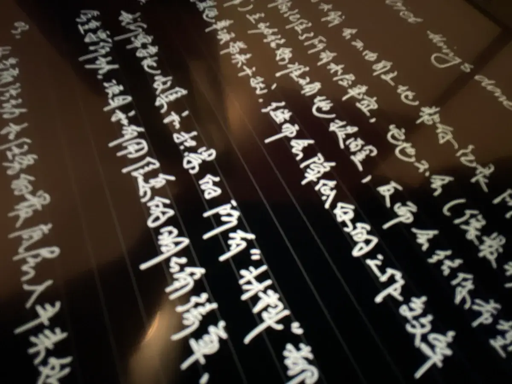

好久不见，我又开始码字了。

码字说的好听一些叫写作，这个词儿一换呀，马上就会感觉待会儿要讲的东西不一样了，好像自己围绕着写作所有的动作都变得神圣起来。其实相对于写作，最早我是更愿意画画。最主要的原因就是，我告诉自己：画面胜过千言万语，能用一幅画讲清楚的东西，何必写一堆字呢？

我的妈，多天真，完全不能理解文字背后的威力。接下来，利用画画考上了大学，继续学习用电脑画画。发现一张大图占用几十几百 MB 的数据空间，全套哈利波特的纯文本电子书也不过几 MB，更加坚定了这个信念。

我不认为画画就要比写字高大上，其实单纯是觉得自己更擅长去画，不擅长讲话，把自己不擅长的事回避掉了。

然后，画着画着，我开始感觉到不对劲。因为每次无论画个什么东西发出来，都被要求写一段“作品介绍”。直到去留学读研，居然要为几张画搞一本几百页的论文出来才能证明你有能力拿到这个学位。我开始意识到问题的严重性，除了图像，原来还有人需要看到自己用文字去组织那些画布上输出的思想。

在去留学之前，那时候我在电视台工作，空余时间还开了个公众号打算写点东西，但当时写的原因主要有两个，一个是，遍地都在开公众号，有随波逐流的成分；二一个是，发自灵魂深处对传统媒体工作的抵触。所以，促使我去码字的动力都不来自我自己，那辞职去留学之后，自然就没有理由继续写了。公众号就此荒废，现在翻翻电脑里的备份，眼睛疼的不忍直视。

留学回来后，自由可支配的时间依然被五花八门的工作任务瓜分得所剩无几，这些时间落在这个信息爆炸的时代，就像热锅沾了水。

我自己感觉下来，相对于视频内容，文字内容更耗费我的精力和时间，视频好歹能快进，变速，决定一个视频要不要继续看，一分钟都用不到。但文字不行，一个字看错了，领会的意思都会天差地别。那么，怎么去处理好这些让我头大的文字信息来源，渐渐就成了头等大事，最初，我的策略是：

第一步，限制输入。宗旨就是把让我消费内容的 App 减少到 3 个以内。比如，在微信里取关了所有的公众号，把专业和工作相关的公众号都转移到的微信读书里。微信就是个聊天软件，纯粹社交。

第二步，整合其他感兴趣的内容，我找到的解决方案是 RSS。把所有感兴趣的内容订阅聚合在一起。至于那些在特定平台发布优质内容的作者，随他去吧。插个题外话，估计现在的 00 后没几个听说过 RSS 这玩意儿，这是上古互联网时期的一种订阅推送信息的方式，可以说是“家人们记得点关注”的前身，挺有意思的，那会儿刚接触电脑的我对这些一概不知，我之后一定要写一篇聊聊怎么处理信息爆炸。

第三步，至此所有需要消费文字性内容的 App 只剩下了，微信，RSS 订阅，Kindle。再插个题外话，Kindle 最近我也不太看好它在国内发展的潜力，可能还是水土不服吧。

这一系列操作下来，让我看到了更多的高质量文字内容，自然有了更多思考的时间，没有精力再去刷新那些一秒一换的算法推荐。很神奇，同样是订阅，公众号并没有给我这种踏实感，可能这就是产品形态的不同吧。于是，当我纯粹追随自己的兴趣，看到了有意思的内容，自然产生了很多能让我眼前一亮的想法。时间久了（大概持续了一年），这些想法也会在脑袋里生根发芽，互相产生奇妙的联系。据我所知，那些引领世界的灵感和创意，也是通过这样的方式慢慢产生的。既然这样，那还是记录一下，万一呢是吧？

于是现在，正如你看到的，我又乖乖滚回来码字了。