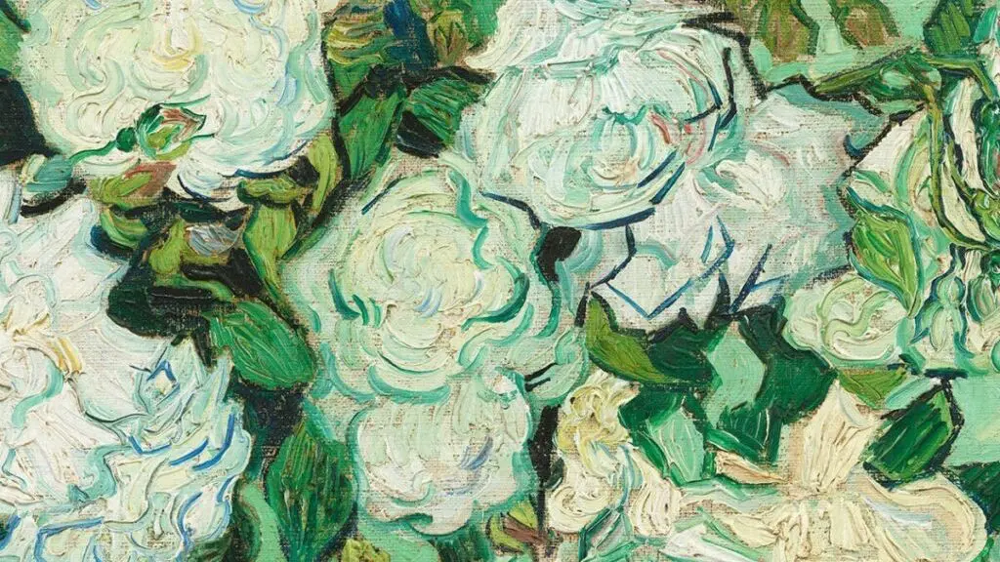

## Foreword

I recently rewatched Chen Danqing's documentary series "The Local" and jotted down some thoughts that resonated with me.

The progression may not feel coherent, because my viewing wasn't either — ideas jumped around in my head.

Quotes aren't verbatim either. When the same topic comes up across two or three episodes, I merge them for clarity, so my future self can still follow along.

## Guided Viewing

> Chinese painting's lack of perspective is like a telephoto lens; Western painting's standard perspective is like a wide-angle lens.

This is the complete opposite of what I've always believed.

I once cited a similar theory in my own thesis — that the immersive form of VR can actually be traced back to classical Chinese scroll paintings. This "guided viewing" approach is a bit like a panoramic photo on a phone, except panoramas still carry perspective. Classical paintings "flatten" space for you, creating not just visual immersion, but temporal immersion. The documentary touched on the relationship between painting and time too, but I'm not quite there yet in my understanding, so I'll skip it.

> A film or a painting is really about how the author guides the viewer's gaze.

A truism (not meant pejoratively). Composition, element arrangement, shot scale, internal movement — all of it guides how the audience sees the world through the author's eyes. What's unspoken is that if the "guidance" works, the piece is already more than halfway there. That's the part I agree with. At the same time, protecting this "guidance" is something I often mess up in my own work. When I get carried away creating, I gradually erode part of the guidance I'd planned. The work is innocent.

> To see something and then write it or paint it — that's already a big step forward.

Reminds me of a line I can't remember where I read: "Never miss the five minutes after an idea appears."

> Orson Welles, *Citizen Kane*.
> Bernardo Bertolucci, *1900*.
> Federico Fellini, *8½*.
> Andrei Tarkovsky, *The Sacrifice*.

These are four great directors mentioned in the book, said to have masterful command of camera and scene choreography. Added to the watchlist.

> Obsessed with secondary information — the important thing isn't the story but the scene.

Still frames are fine, they can even form a unique style. But for moving images, story still matters.

> Ancient paintings, in unprovable and imperceptible ways, have always lingered in the works of today.

It's true when you think about it. Picasso said, "Cézanne is our father." In theory, any film or TV work involving fine art today carries echoes of the Renaissance masters. The reason, I think, is that "you are not the fish — how can you know the fish's joy?"

> The use of perspective in painting essentially assumes the viewer is also present.

What VR and AR break through is this "assumption," while still preserving perspective. There's a subtle parallel to the decentralized thinking of [[Web 3.0]] — handing everything over to the viewer.

But that doesn't mean abandoning "guidance." Masterful works are full of it.

> If perspective led to the invention of photography and film, why hasn't the observational approach of Chinese painting moved forward to this day?

This was the line that hit me hardest. I thought about it for a long time and had nothing to say.

## The Great Deviation

> Norms always await the author's deviation, because no norm can encompass the boundless diversity of reality.

Like Wertheimer's Gestalt psychology, whose core thesis is: the whole is not equal to and greater than the sum of its parts. It advocates studying psychological phenomena through the dynamic structure of the whole — what the subject experiences and perceives in the moment is a meaningful whole that doesn't entirely align with direct external stimuli.

Applied to psychology, I've read online that this approach has its flaws. But applied to artistic creation, it's perfectly apt.

> All deviation comes not from the artist's creation, but from discovery.

There's probably no such thing as absolute originality in humanity. Is life itself original? The prevailing theory is that the earliest life forms emerged from capillary pores in ancient海底 volcanic rock formations, slowly forming single-cell structures. If true, then maybe.

Back to art — at its core, it's a benevolent deception. Discovering a new way to deceive is what we call creation.

> To develop your own style, you must approach your predecessors in the same way you leave them behind.

Style takes care of itself — it changes naturally. What's interesting is the second half. Approaching and leaving aren't two distinct phases; they happen simultaneously. As you approach a predecessor, you're already leaving them behind. The way you approach is by copying. The way you leave is by copying no more.

To be continued.