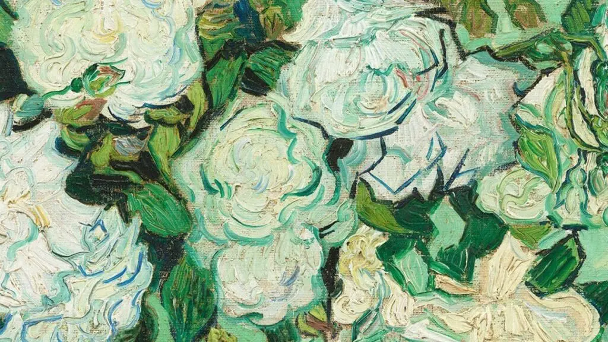

# 写在前面

这几天抽空儿重新看了陈丹青老师的《局部》系列，记录一些触动到我的地方。

语义不一定连贯，因为看的时间就不连贯，一些思考在脑子里面直接跳过去了。

同时引用的部分也不是原封不动的复制过来，两三集内同一话题，会选择合并记下，是方便未来的自己也能看懂。

# 诱导观看

> 中国画的无透视好比长焦镜头，西方绘画的标准透视好比广角镜头。

和我至今的认识完全相反。

我曾经在自己的论文中引用过类似的理论，大意是虚拟现实技术的实现形式其实可以追溯到中国古典绘画长卷，这种“诱导观看”的方式有点类似手机里面的全景照片，唯一的不同是全景照片依然带有透视关系。但古典绘画一律把空间“展平”给你看，带来的不仅是视野上的沉浸，还有时间上的沉浸。关于绘画和时间的关系视频也提到了，但可惜我道行还不够，参不透，略。

> 一部电影一幅画，其实是看作者怎样诱导“观看”的目光。

一句正确的废话（非贬义）。无论构图，元素安排，景别，画面内部的动线，都是在诱导观众如何观看作者眼中的世界。话外似乎还隐含了另外一层含义，若“诱导”成了，画面已经成功了一半以上。我认同的是这一层。同时，对“诱导”的保护也是我自己在创作时经常容易搞砸的一点，很多时候创作的嗨起来，就会慢慢把原先想法里规划过的“诱导”抹杀一部分。作品是无辜的。

> 看见什么，写出来画出来，就是往前走了一大步。

让我想起忘了在哪里看到的一句话：“永远不要错过，想法出现之后的那五分钟。”

> 奥逊威尔斯，《公民凯恩》。
> 贝托鲁奇，《1900 年》。
> 费里尼，《八又二分之一》。
> 塔可夫斯基，《牺牲》。

这是书里提到的四个伟大导演的片子，据说对镜头和场景的调度出神入化。列入片单。

> 热衷次要讯息，重要的不是故事而是场景。

静帧的画面没问题，甚至可以形成独特画风。但如果是做动态影像，还是故事要紧。

> 古代的绘画，都在用一种不可证明不可觉察的方式，一直留在现在的各种作品当中。

想想看确实如此，毕加索说过：“塞尚是我们的父亲。”理论上，如今任何一部涉及美术的影视作品都能找到文艺复兴时期各位大师的影子。我想原因正是，“子非鱼，安知鱼之乐？“。

> 绘画中透视的运用本质上是假定观众也在现场。

虚拟现实或增强现实所突破的就是这种“假定”，但同时保留了透视。感觉上其实和 [[Web 3.0]] 的去中心化思维有些微妙的相似之处。一切交给观众。

但可不是放弃 " 诱导 "，高超的作品里全是”诱导“。

> 如果透视法导致了摄影和电影的发明，为何国画的观察方式依旧到今天没有向前一步？

这是最震撼我的一句，想了半天，也无言以对。

# 伟大的偏离

> 规范永远在期待作者的偏离，因为任何规范不可能包容千差万别的真实。

就像韦特海默的格式塔心理学中，核心论点即：整体不等于且大于部分之和。主张以整体的动力结构来研究心理现象，所谓“主体当时感受到或体验到的一切，即主体在对现象的认识过程中所把握到的经验。这种经验是一个有意义的整体，它和外界的直接客观刺激并不完全一致。”

如果按这个研究心理学，我看网上说还是有一定的缺陷。但用在艺术创作却十分恰当。

> 一切偏离都不来自艺术家的创造，而是来自发现。

人类肯定不存在绝对的原创了。生命形态是不是原创的呢？目前流行的说法是，最早的生命来源于远古海底火山岩柱中的毛细空洞，慢慢形成的单细胞结构。若情况属实，可以是。

说回艺术，本质是一局善意的欺骗，发现了新的欺骗手法，美其名曰创造。

> 如果要成全自己的风格，就要像走向前辈的方式离开前辈。

风格不用去管，它会自然变化的。有意思的是后半句，走向前辈和离开前辈不是泾渭分明的两个阶段，而是同时进行，你在走向一个前辈的时候，就已经在离开前辈了。走向的方式，即照葫芦画瓢。离开的方式，即照葫芦，也不再画瓢。

未完。
