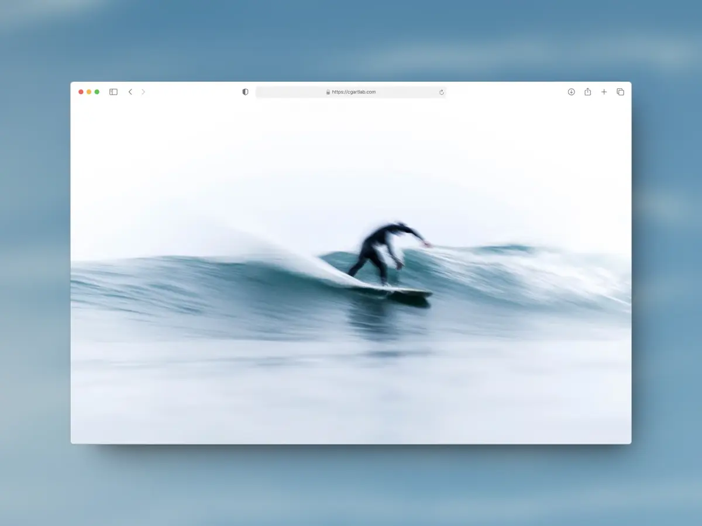
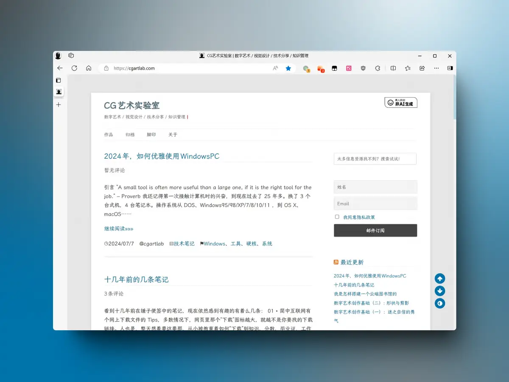
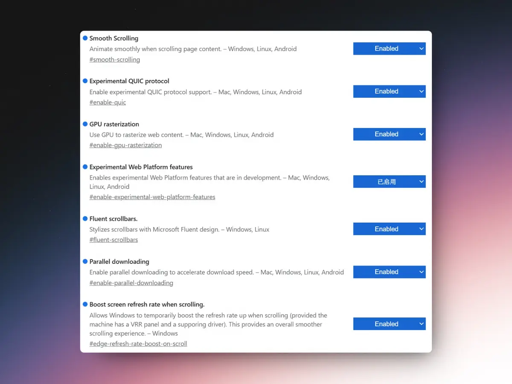
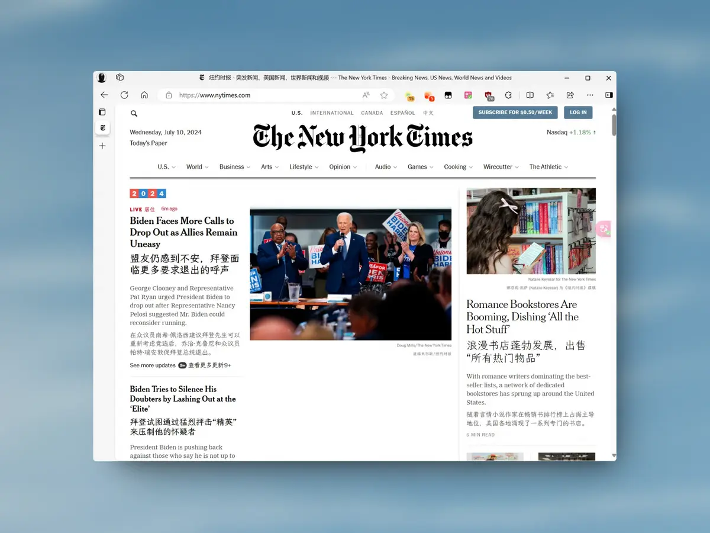

# Introduction

I wonder how many people still remember the term "surfing the web." The internet is like an ocean, websites are the waves, and the browser is the surfboard beneath your feet.

Today, browsers are something every digital worker uses daily. I'm quite picky about my surfboard. With a touch of OCD, I've naturally polished this tool to suit my needs perfectly and developed my own set of practices. Every now and then, people ask me which browser I use and how to browse the web more efficiently. So I decided to write it all down in one article.

# What Makes a Great Browser

**First, speed above all.**

A slow browser ruins your mood. If a website can't load in 3 seconds, you'll blame the site. I hold my own website to the same standard — it has to be fast. People are only getting more impatient.

**Second, features are fine as long as you can turn them off.**

Tab groups, bookmarks, password manager, sidebar, translation, read-aloud, reading mode, privacy and security — these are all standard features in modern browsers, not counting the specialty ones. The list is already too long. More features are welcome, but they must be optional. Keeping features you don't use running is just bloat, and it inevitably slows things down.

**Third, convenient and good-looking.**

This one is subjective. Geeks want to open web pages from the command line; stock traders want K-line charts visible the moment they boot up. Aesthetics are personal too — to each their own.

# What I've Used

From the legendary IE 7/8/9/10/11, 360, Maxthon, to Chrome, Opera, Firefox, Safari, Min, Tor, Arc — it's been a bumpy ride, and the tinkering has been... extensive.

Ever since college, when I learned that most domestic browsers are just Chrome's Blink engine with a different skin, I stopped using them. ~~It's definitely not about bundled bloatware, slow speeds, family buckets of unwanted software, incomplete uninstallers, incessant notifications, or privacy concerns.~~ I think most discerning folks probably use Chrome anyway.

It's worth noting that a browser's essence lies in its engine — a genuinely hardcore piece of engineering. Every browser worth mentioning on this planet uses its own self-developed engine.

As far as I know, there are only 5 browser engines in the world:

1. **Trident (IE engine)**: Developed by Microsoft, also known as the IE engine. One of the earliest browser engines. Browsers using Trident include Internet Explorer, Maxthon, The World, 360 Browser, etc. Trident offers good compatibility with various web standards but has relatively slow rendering speeds.
2. **Gecko**: Developed by Mozilla Foundation, widely used in Firefox, Netscape 6+, and others. Gecko is fully open-source, highly customizable, renders quickly, and provides a better web experience.
3. **WebKit**: Developed by Apple, widely used in Safari, Chrome, and others. WebKit is fast, efficient, and not constrained by IE or Firefox engines, offering better security. It's one of the most popular browser engines today due to its excellent performance and smooth browsing experience.
4. **Presto**: Developed by Opera Software for Opera 7+. Presto is fast and efficient, providing a good rendering experience. However, its influence has waned as Opera's market share declined.
5. **Blink**: Google's fork of WebKit, used in Chrome, Opera, and others. Blink inherits WebKit's strengths while adding improvements for faster rendering and better compatibility. Most domestic browsers are "modded" versions of this open-source project. If Google hadn't open-sourced it, there'd be nothing for them to build on — there was even [a famous incident](https://www.leiphone.com/category/gbsecurity/tSIjaHWIXcBnjuD5.html) about this.

Since there are only a few engines, the companies behind them naturally optimize and maintain their "own" browsers the best. Choosing from these is always the safest bet.

# What I Use Now

**My primary browser is Edge.**

I have a love-hate relationship with Edge. The hate comes from it getting increasingly "heavy." The first time you open it, it's always cluttered. But as I mentioned, you can turn off features you don't need.

The love is because it uses the Blink engine — fast, with native Chrome extension support. You can seamlessly sync bookmarks, history, and even send files to your phone with a Microsoft account. The UI got an upgrade this year, and it looks good overall. If the default theme could achieve a pure Fluent Design style, I'd be set for life.

**Safari is my secondary browser.**

No other reason — it performs best in the Apple ecosystem. The UI is impeccable, cross-device sync is seamless, and speed is excellent.

Its only two drawbacks: one, it's overly "secure." Sometimes I get "Unable to establish a secure connection" errors, even on my own blog, making me question my server. Two, the extension ecosystem is limited. Even an ad blocker requires installing a separate app.

# Edge Out-of-Box Setup

Windows 10/11 comes with Edge pre-installed. For other platforms, you can [download it here](https://www.microsoft.com/en-us/edge/download). I recommend signing in with a Microsoft account and enabling all sync features. This way, when you switch machines, everything is already set up.

If you're moving from another browser, sign in to your Microsoft account first, then import data from the other browser. Do it once, done forever.

# Toggle This, Toggle That

Edge has a staggering number of settings. Fortunately, the settings page has a search bar — you can search for any option without digging through menus. ~~Which means I don't have to list every location.~~

- **Microsoft Rewards**: Off. Not useful outside supported regions.
- **[This page](https://edge//settings/privacy)**: Keep Tracking Prevention and Microsoft Defender on — safety first. Everything else can be turned off.
- **Floating menu**: Off. Designed for touch screens, not keyboard and mouse.
- **Open Office files in browser**: Off.
- **[This page](https://edge//settings/languages)**: Everything can be turned off.
- **Startup boost**: On.

Everything else is personal preference. These settings won't impact performance much. After making these changes, your browser will feel noticeably lighter and cleaner.

# Some Hidden Settings

Like Chrome, Edge has a hidden settings page with experimental features. They're quite stable already — mostly intended for developers. Turning them off doesn't affect normal use, but turning them on usually makes things better.

Type `edge://flags/` in the address bar to open the experimental features page. Here are my settings:

- **Smooth scrolling**: On. Enabled by default in the latest version.
- **Dynamic high frame rate scrolling**: On for high-refresh-rate monitors. Silky smooth.
- **GPU hardware acceleration**: On. Reduces CPU usage and supposedly saves power. I haven't compared.
- **Multi-threaded downloading**: On. Downloads really do get faster.
- **Harmonic scrollbar**: Makes the scrollbar rounded instead of square blocks. Toggle based on preference.

This page is only available in English, but the options are searchable. You can follow the screenshot below.

# Useful Extensions

Don't install too many extensions — they slow things down and can interfere with each other. I recommend installing from the Chrome Web Store for the fastest updates and greatest peace of mind.

Here are my most-used recommendations:

- **[Immersive Translate](https://chrome.google.com/webstore/detail/immersive-translate/bpoadfkcbjbfhfodiogcnhhhpibjhbnh)**: A god-tier plugin. The results are stunning. The best web translation tool, bar none.
- **[uBlock Origin](https://chrome.google.com/webstore/detail/ublock-origin/cjpalhdlnbpafiamejdnhcphjbkeiagm)**: A lightweight ad blocker. No custom configuration needed — just install it and forget it. If you still see unblocked ads, right-click on the ad and use the context menu to hide anything you don't want to see.
- **[Tampermonkey](https://github.com/derjanb)**: You don't know what you're missing until you try it. It's a userscript manager — you don't need to understand what that means. Just know that by installing small scripts through it, you can enable many useful features: price comparison while shopping, video ad removal, cloud storage search, website UI optimization, and much more. There's a lot to explore. I won't go into detail here, but there are plenty of articles online about it. Just don't install too many scripts — they'll impact performance.
- **[SwitchyOmega](https://microsoftedge.microsoft.com/addons/detail/proxy-switchyomega/fdbloeknjpnloaggplaobopplkdhnikc)**: A proxy tool for browsers. It can detect which connections are broken and lets you set different proxies for different domains for optimal connectivity.
- **[RSSHub Radar](https://microsoftedge.microsoft.com/addons/detail/gangkeiaobmjcjokiofpkfpcobpbmnln)**: Another gem. If you use RSS feeds, you know. It can convert over 90% of web pages into RSS feeds.

# Final Thoughts

Beyond these basic settings, browsers have keyboard shortcuts that can greatly improve efficiency. Here are the ones I use most:

- `Ctrl+L`: Quick search of history, bookmarks, and URLs
- `Ctrl+T`: New tab
- `Ctrl+H`: History
- `Ctrl+J`: Downloads

Over time, as you internalize these shortcuts and remember commonly used locations, you'll save a lot of time. You don't need to follow my approach entirely — some of it is pure OCD. Pick and choose what works for you. If you have better tips, feel free to share. Peace.

Originally published on [CGArtLab](https://cgartlab.com)
