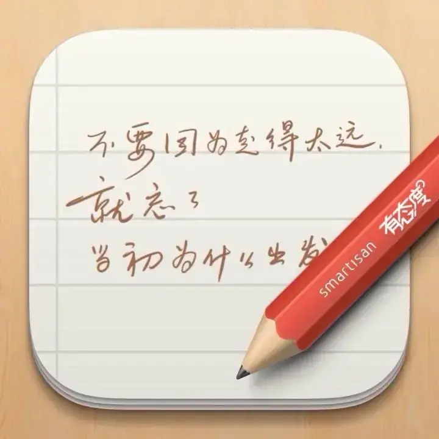

Looking back at notes I saved in Smartisan Notes over a decade ago, a few still feel interesting:

01 • There's a tip for downloading files on the Chinese internet: in most cases, the bigger the "Download" button on a webpage, the less likely it is the actual link you're looking for. Same goes for people. Everyone's always wanting this and that. From childhood, we're taught how to "download" knowledge, grades, diplomas. At work, we start "downloading" salary, fame, power. The download button keeps getting bigger, and the time it takes to download a wish grows longer and more painful. "Ding" — it's done. Screenshot it, post it on social media, announce it to the world. And then the button gets a little bigger again. You look up from your screen for once, telling yourself you're still young and strong — better keep clicking while you can.

02 • Going to a brick-and-mortar bookstore these days still feels like rummaging through a trash heap for food.

03 • Newton's First Law should be: a body at rest in bed tends to stay at rest in bed.

04 • A person spends their whole life writing poetry and painting, and then AI casually surpasses Li Bai and Michelangelo. I've always been optimistic — I don't think we need to worry too much about this. Art was never meant to be a competition. What does it matter who wins? AI might surpass Li Bai in literary flair and imagery, but most people just want to use art to say a few words to someone they care about: recent experiences, feelings, what they want, what they miss. A purely personal expression. I use art to convey emotion and meaning. Even if I'm not good at it, no master can do it for me. Just like someone tone-deaf still wants to sing, a colorblind person still wants to paint, a terrible chess player still wants to play. The real value of creation isn't just the output — it's about spending time in a particular way, not becoming a king of singers or a sage of chess. I suspect that when humans are completely outclassed by machines in every way, we'll understand this more deeply.

05 • The version of you that lives in someone else's mind is also part of your soul.

Also, Smartisan Notes was genuinely a great product. I heard it's now switching to a subscription model. What a shame.
