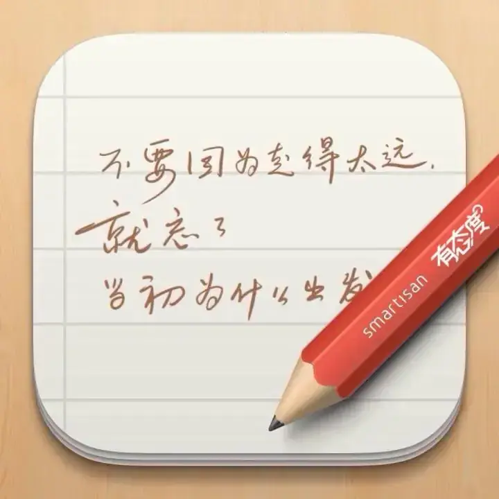

看到十几年前在锤子便签中的笔记，现在依然感到有趣的有着么几条：

01 • 简中互联网有个网上下载文件的 Tips，多数情况下，网页里那个“下载”图标越大，就越不是你要找的下载链接。人也是，整天想着要这要那，从小被教育着如何“下载”到知识、分数、毕业证，工作又开始“下载”薪水、名望、权利。这个下载按钮也在越来越大，下载一个愿望的时间变得越来越漫长痛苦。“叮”的一声，下载完成，反手截个图，发到社交媒体上，宣告全世界，然后那个按钮又变大了一点点。你破天荒的抬起头看看四周，告诉自己趁着年轻有劲，在赶紧多按几下吧。

02 • 现在去新华书店看书，依然有一种去垃圾堆里找吃的的错觉。

03 • 牛顿第一定律应该是：身体处于睡眠静止状态就像一直那样静止下去。

04 • 一个人花了一辈子写诗画画，结果 AI 随随便便就超过了李白和米开朗基罗。我一直乐观地想，不需要特别担心这个问题。艺术本就不是为了竞争而存在，决出胜负又如何？AI 是可能在文采和意象上超过李白，而大部分人只想用这种方式跟在乎的人讲几句话：最近的经历，感受，想要什么和怀念什么。一种纯粹私人的表达。我只用艺术的方式传情达意，就算力有不逮，高手也无法代劳。正如一个五音不全的人也要唱歌，色盲也可要画画，臭棋篓子照样下棋，创作的真正价值除了输出作品，更要紧的在于以一种特别的方式度过时间，而不是成为歌王或棋圣。我猜，当人类全方位被机器完爆以后，会更深刻地领受这一点。

05 • 别人心里的你，也是你的灵魂。

另，锤子便签真的是一款好产品，据说现在也开始搞会员制交月租，可惜了。