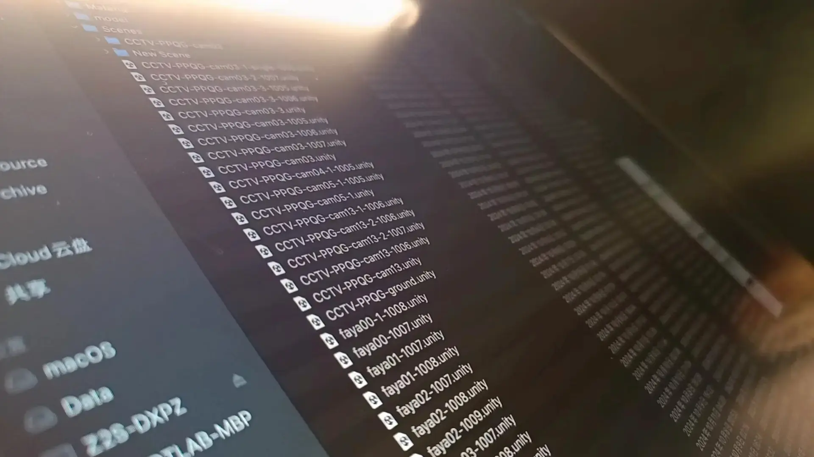
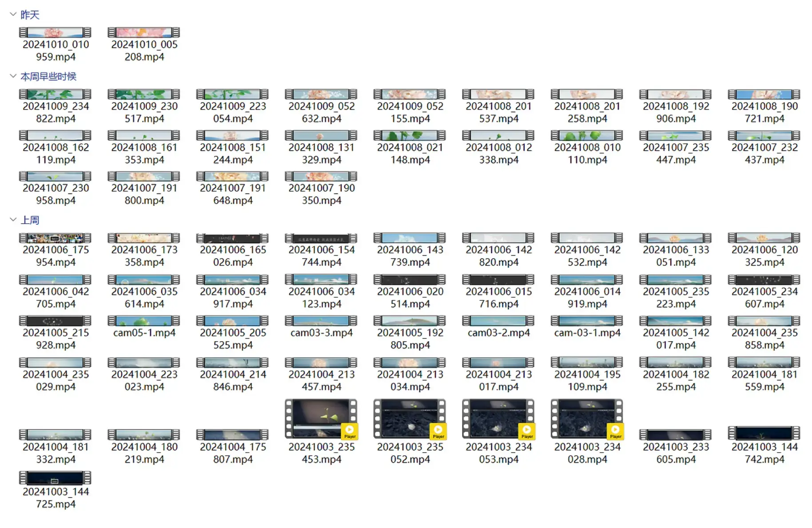
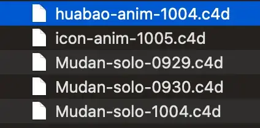
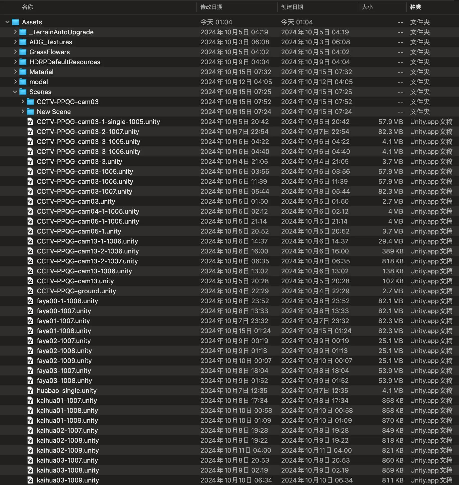

## Foreword

During the National Day holiday, our studio was fortunate to work on the opening sequence for [CCTV's 2025 Brand Power Project Launch](https://www.bilibili.com/video/BV1sH2bY5Ew9/). The entire process was anything but smooth — it was a frantic scramble. The project had an incredibly tight turnaround: just 20 days, no negotiation. Yet the video specs were absurdly demanding — 90 seconds long, rendered at 7036 x 1000 pixels, 30fps.



What's even more brutal was the iteration pace. After the project wrapped, I did a quick tally — I don't know about my colleagues, but the shots I personally handled went through 70 revisions in 12 days. The entire project folder ballooned to 280GB of data.

Our team was 10 people, spread across multiple provinces and cities, working remotely. Setting aside the technical challenges, this kind of breakneck pace makes efficient workflow management and file organization essential for completing a large-scale project. This article won't dive into boring technical details. Instead, I'll share the file management and naming conventions that can help in most remote collaboration scenarios — and also reflect on the various pitfalls I encountered along the way.

## Clear Directory Structure

I briefly mentioned my work directory template in [How to Elegantly Use Windows PC in 2024](https://cgartlab.com/posts/2024-elegant-use-windows/):

~~~shell
project name
- doc
- pj
- render
~~~

But for team collaboration, the structure was adapted for this project:

~~~shell
project name
- 01-in         # files from upstream colleagues
- 02-doc        # documentation and references
- 03-pj         # project files
  - tex         # assets called by project files
- 04-export     # output directory
  - pre         # preview files for review
  - render      # final output for downstream colleagues
~~~

This approach has several benefits:

- Numbered prefixes at the top level enforce an input-to-output order, making the file flow clear and intuitive.
- The "in" directory keeps upstream files untouched — save a copy to the project directory instead of modifying the original. This saves others' time if you need to re-request files after accidental changes.
- Keep the number of directory levels to a minimum. Leverage your OS's built-in sorting (by type/date/name) to reduce unnecessary folders, saving browsing time and keeping more screen space.
- Aids version tracing. While not as convenient as Git (which excels at code and plain text), it still helps locate files quickly for optimization and quality control.

There are downsides too:

- Due to plugin behavior in professional software, it's best to keep directory names non-Chinese to avoid confusion for others. A workaround is to package with Chinese names, or write a README in the project root for complex structures.
- New team members need time to learn the system, which can slow things down in urgent situations.
- The structure is somewhat rigid. When the project scales beyond expectations with many sub-tasks, subdirectories can become complex, increasing the chance of mistakes.
- May not suit search-heavy workflows — animation projects produce massive sequences and files, making search slower.

## Make It Understandable for Yourself First

No matter what kind of digital work you do, clear directory structures and file naming habits are crucial. The most important thing is to make it understandable for yourself — or more precisely, for your future self.

Even if you've forgotten the details, a well-structured directory and clear file names let you identify a file's purpose at a glance, without needing to preview it.

As a side note — trust me, organize and review your past projects, whether commercial or personal. Your hidden wealth is buried there.

## Key Principles of File Naming

One sentence summary: Follow your production workflow within a systematic naming convention.

Let me elaborate.

### Windows File Naming Rules

[Microsoft's official documentation](https://learn.microsoft.com/en-us/windows/win32/fileio/naming-a-file) actually explains file naming in detail. Here are the key points:

- All file systems follow the same basic naming convention: a base name and optional extension, separated by a period.
- A "directory" is just a file with a special attribute marking it as a directory. It must follow all naming rules like regular files.
- Don't assume case sensitivity. For example, treat OSCAR, Oscar, and oscar as the same name, even though some file systems may distinguish them. I personally use case differences in disk and project root names for readability, but functionally they're identical.
- Don't end a file or directory name with a space or period.

macOS follows similar rules.

### Components of Standardized Naming


In practice, my naming is quite concise. Using this 3D animation project as an example:



A C4D project file for a flower bud model is named `huabao-anim-1004.c4d`, broken down as:

```bash
Naming word: huabao (flower bud)
Category/Status: anim (animation project)
Creation date/Version: 1004 (created October 4th)
```

Another file for a "peony" model:

```bash
Naming word: Mudan (capitalized because it's a parent of the bud in the model hierarchy)
Category/Status: solo (static single model, no animation)
Creation date/Version: 0929 (created September 29th)
```

Simple, right? Both my colleagues and I can instantly tell each file's purpose and status. No searching needed — just keep files sorted by name and they're easy to find.



One more thing about separators: I use hyphens `-` and underscores `_`. Hyphens work well as natural separators for information categories in filenames. I avoid underscores as separators because most programs treat them as spaces.

## Iterate and Optimize

Rome wasn't built in a day. After setting up your initial naming convention, test it on a small project first. Observe whether you and your colleagues can quickly adapt to the system — treat it like a beta test.

If colleagues express confusion or suggestions, dig into whether the issue is the naming convention itself or a communication problem.

Then, through larger collaborations and project requirements, expand and iterate on the naming convention. This is how team efficiency improves invisibly.

## Conclusion

Standardized file naming reflects strong summarization and categorization skills. This isn't just an essential professional skill — it's also a mark of a designer or engineer's expertise in their field.

Naming files is a thinking process. Humans are naturally lazy — our brains prefer low-energy operation. Much of our anxiety and frustration comes from "seeking benefit and avoiding harm" and "wanting quick results." But I firmly believe that "slow is smooth, and smooth is fast."

If you have better file naming methods, feel free to share in the comments.

## References

- https://learn.microsoft.com/en-us/windows/win32/fileio/naming-a-file
- [Wikipedia: Naming Convention (Programming)](https://en.wikipedia.org/wiki/Naming_convention_(programming))
- [Wikipedia: Computer File](https://en.wikipedia.org/wiki/Computer_file)

Originally published on [CGArtLab](https://cgartlab.com)