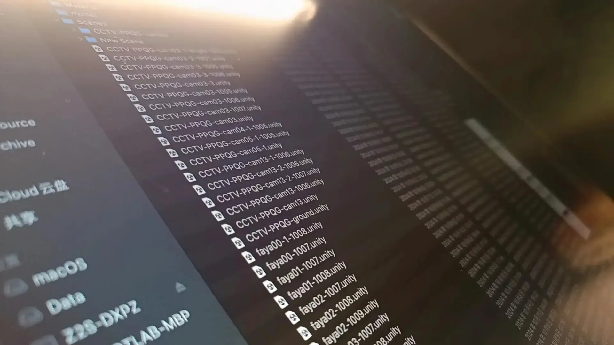
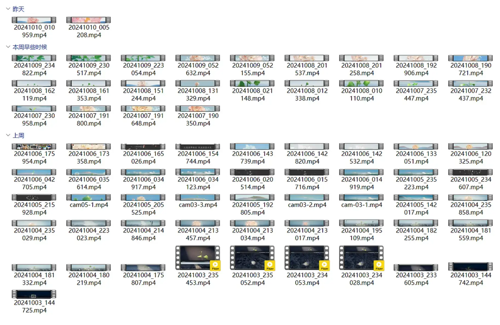
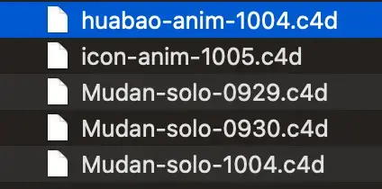
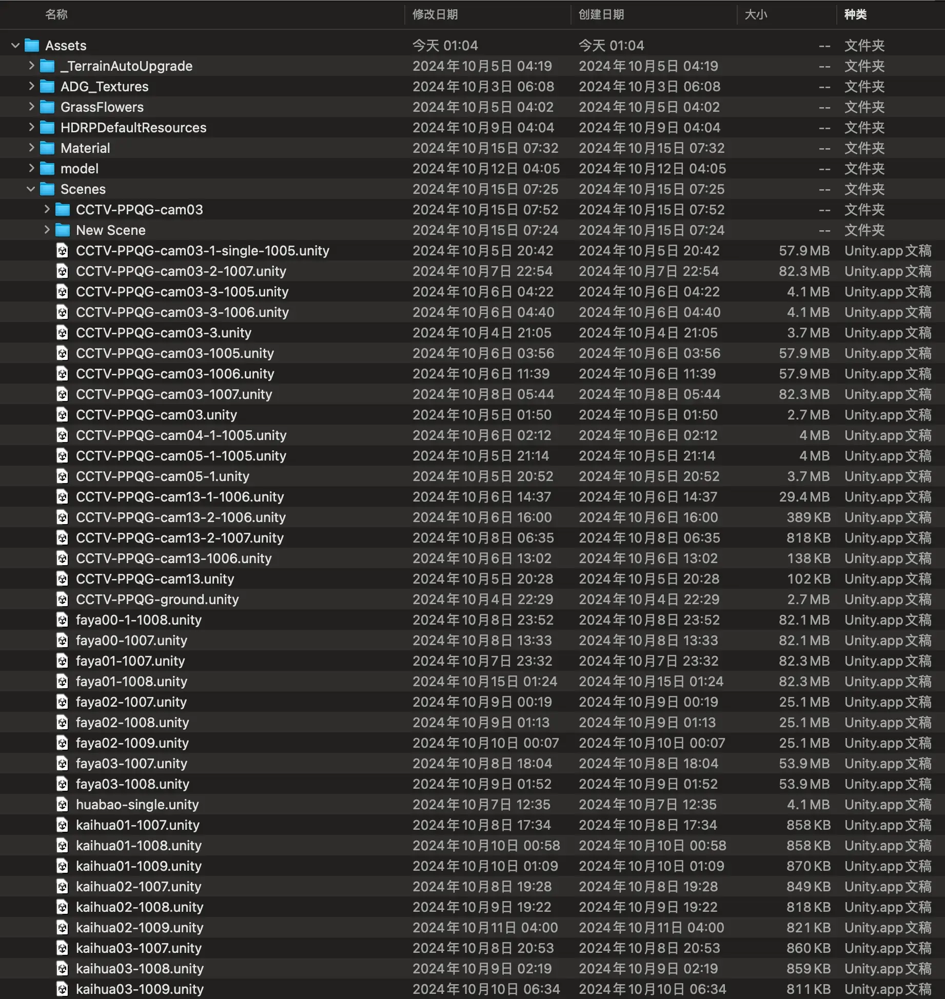

## 写在前面

国庆假期，工作室有幸参与了 [《CCTV 央视 2025 品牌强国工程发布会》](https://www.bilibili.com/video/BV1sH2bY5Ew9/) 开场片的制作。全程不能说是磕磕绊绊吧，简直是连滚带爬。这种项目的节奏非常快，制作周期一共只有 20 天时间，没得商量，而视频规格却高的离谱，时长 90 秒，出片分辨率：7036 x 1000 像素，30fps。



更凶残的是迭代速度，项目完成后我自己统计了一下，别的同事不知道，光我一个人负责的镜头，在进组的 12 天内，就修改迭代了 70 稿，整个项目的文件夹有 280G 的数据。

团队一共 10 个人，同时又分散在多个省市远程协作。排除技术难点，如此紧张的节奏，高效的流程把控和文件管理也是完成这类大型项目的必要条件。这篇文章不会大篇幅描述让人犯困无聊的专业知识，主要分享可以应对大部分场景下的远程数字化协作都有帮助的文件管理和命名规范，也是自己对这次经历踩过的各种坑进行一次复盘。

## 清晰的目录结构

曾在 [《2024 年，如何优雅使用 WindowsPC》](https://cgartlab.com/how-to-use-windows-pc-elegantly-in-2024/) 中一笔带过我的工作目录模板，如下：

~~~shell
project name
- doc 
- pj 
- render
~~~

然而，由于涉及团队协作，目录结构根据这次的项目做了相应调整：

~~~shell
project name #项目名称
- 01-in #上游同事提供的文件
- 02-doc #文档和参考资料
- 03-pj #工程文件
	- tex #工程文件会调用到的素材
- 04-export #输出目录
	- pre #用于审核的预览文件
	- render #输出给下游同事的文件
~~~

这样做有几个好处：

- 顶级目录手动加入序号前缀，可以强制按照输入 ➡ 输出的顺序排列，文件流向清晰直观。
- “in”目录下，上游同事发来的文件不做任何改动，自己再另存一份到工程目录下，以防不慎修改后再向同事要一次，节约他人时间。
- 依然尽可能保持最少粒度的目录数量，充分利用电脑自带的“按类型/日期/名称”等排序功能减少不必要的目录，节约查找时间，同时还可以减少打开的窗口数量，屏幕空间也是很宝贵的。
- 利于版本回溯，虽然不像 Git 这种先进版本控制系统快捷方便，且 Git 更擅长代码或纯文本类型的文件处理，但是依旧可以相对快速的定位文件，帮助项目的优化和质量把控。

有利就有弊，这么做缺点也有：

- 由于专业软件的插件等特性，建议目录最好为非中文，这样别人不易看懂，有效解决方法是用中文名打包，若结构更复杂一些可在项目根目录写一份“说明文档”。
- 新上手的伙伴需要一定的学习和理解成本，在项目紧急或突发状况下反而会拖慢效率。
- 目录结构相对僵化，项目一旦规模超预期，多出很多分支任务的时候，子目录极易趋于复杂，一定程度上会增加误操作的几率。
- 可能不适用于搜索，因为动画项目输出的序列和文件数量巨大，搜索反而更耗时。

## 先让自己看得懂

无论做什么类型的数字化工作，清晰的目录结构和文件命名习惯都起着至关重要的作用。在我看来首当其冲的关键在于先让自己看得懂，准确地讲，是让未来的自己看得懂。

这样就算以后搜索的时候，即便已经忘记了很多细节，无需预览，只看目录结构和名字也更容易确认文件的大致用途。

说句题外话，相信我，一定要对过往的项目进行整理和复盘，无论商业还是原创，你的隐形财富就藏在里面。

## 文件命名规范的要点

一句话总结：在系统的整体命名规范下，以你的生产流程为准则。

接下来分别说明。

### Windows 下的文件命名准则

其实 [微软在官方文档中](https://learn.microsoft.com/zh-cn/windows/win32/fileio/naming-a-file) 是对文件命名有详细说明的，我整理了一些需要注意的要点：

- 所有文件系统都遵循单个文件的相同常规命名约定：基文件名和可选扩展名，用句点分隔。
- “目录”只是具有特殊属性的文件，该属性将其指定为目录，但不管怎样，必须像常规文件一样遵循所有命名规则。 因此，除非另行指定，否则文件的任何命名或使用规则或示例也适用于目录。
- 不要假定区分大小写。例如，将名称 OSCAR、Oscar 和 oscar 视为相同，即使某些文件系统可能将其视为不同。我自己虽然会在磁盘和项目根目录使用大小写区分，但仅仅只是为了方便查看和美观，他们的内容本质没有区别。
- 不要用空格或句点结束文件或目录名称。

macOS 下其实大同小异。

### 规范命名的构成要素


具体到实际工作，我习惯的命名十分精简。以这次三维动画项目为例：



其中制作花苞的 c4d 工程文件名为“huabao-anim-1004.c4d”，整个名称分为：

```bash
命名词：huabao（花苞）
所属类别/状态：anim（表示是用来制作动画的工程）
创建时间/版本：1004（10 月 4 日创建）
```

另外一个“牡丹”的工程文件也是：

```bash
命名词：Mudan（因为它在模型结构上属于花苞的父级，因此大写）
所属类别/状态：solo（表示单体静态模型，里面没有制作动画）
创建时间/版本：0929（9 月 29 日创建）
```

是不是非常简单，这样无论是我还是同事，很容易就可以看出每个文件的作用和状态。不用检索，只要正常保持按名称排序可非常容易找到。



另外值得一提的是分隔符的使用，一般为短横线 `-` 和下划线 `_`，短横线在英文中作为连字符，但在文件名内可以非常好的用于划分信息类别，而我不使用下划线做分隔是因为在程序中，下划线通常被等同于空格。

## 不断测试和优化

罗马不是一天建成的。当你给自己制定好一个初步的命名规范之后，最好先在小规模的项目中试用一段时间。在推进过程里观察同事和自己是否能够很快适应并接受这种方式，就像游戏内测一样。

如果同事提出了困惑和建议，一定要询问清楚理解困难和感受不方便的地方。弄明白到底是命名规范不合理，还是团队之间的沟通问题。

之后再通过更大规模的合作和项目需求，进一步扩展和迭代更多的命名规范，这样团队的配合效率才会无形中提升。

## 总结

规范的文件命名背后意味着高度的概括和归纳能力。这种能力不仅是职场专业人士的必备技能，也是作为设计师或工程师对其领域专业程度的一种体现。

给文件命名是一个思考的过程，人是爱偷懒的，大脑本身更偏爱低能耗的运作方式。人类焦虑和烦恼永远来自于“趋利避害”与“急于求成”，而我更愿意相信“慢就是快”。

如果你有更好的文件命名方式，欢迎留言讨论分享。

## 参考：

- https://learn.microsoft.com/zh-cn/windows/win32/fileio/naming-a-file
- [维基百科：命名规则（程序设计）](https://zh.wikipedia.org/wiki/命名规则 _(程序设计)#:~:text=程序设计%20 的中%20 命名规则%20（naming%20convention）是電腦%20 程序設計%20 的，源代码%20 针对%20 標識符%20 的名称字符串进行定义（即「命名」）而规定的一系列规则%E3%80%82%20 通常是为了提高源代码的易读性、易认性、程序效率以及可维护性%E3%80%82%20 命名规则根据各个程序语言的规格、内存大小等硬件制约、编辑器以及%20 集成开发环境%20 的功能等等会有各种制约%E3%80%82)
- [维基百科：计算机文件](https://zh.wikipedia.org/wiki/電腦檔案)

本文首发在 [CGArtLab](https://cgartlab.com)