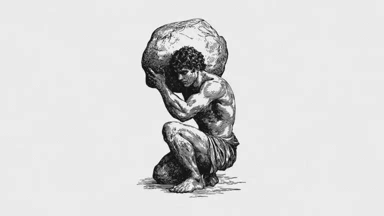
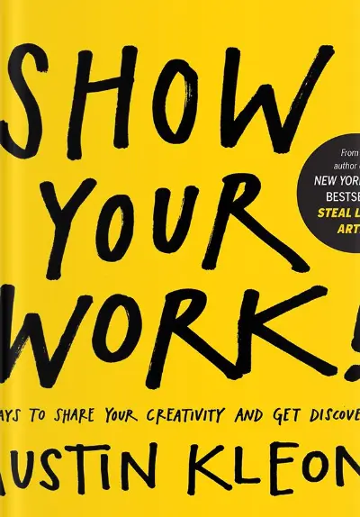
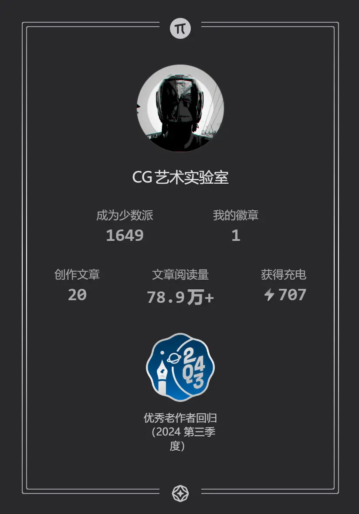

This image is from Dan Koe's personal website. Even though it's AI-generated, I really like this picture. It reminds me of the day I went abroad to study—stepping out of the airport alone into an unfamiliar country, facing endless unknowns ahead, yet with direction and motivation exceptionally clear. Two seemingly contradictory forces harmoniously coexisting within.

I wonder if you've ever had such an experience. My feeling is that this depicts the essence of creation: **to know oneself.**

Before talking about him, I want to share this little story first.

## 01 When Applause Can't Reach the Stage

The other day I came across a video—a performance of pure technical brilliance, so astonishing in its execution and skill that it left me breathless. So I gave it a like, a coin, and the full three-click treatment.

But when I looked at the uploader, it was just an ordinary marketing account. Clicking on their profile showed a bunch of content designed purely for traffic. What I really wanted was to give that three-click treatment to the actual artist. Truth be told, that artist probably doesn't need my validation—their work can reach audiences in our country, suggesting they might already be a top performer in their own land.

The original video is this 👉 [Martin Grubinger - Planet Rudiment II](https://www.youtube.com/watch?v=Sw1g9qlnOKA).

Actually, this thought has crossed my mind many times before, but each time it just passed. Until I became a professional creator myself and started gaining more recognition, this feeling grew stronger with each occurrence. And when I was brainstorming this article topic, I decided to write it down. During that process, the question transformed into this:

**In a world built by algorithms, traffic, and intermediary platforms, how can we better use our attention and ensure our "applause" reaches the stages that truly deserve it?**

The reason there's a whole "content reposting" industry exists is because information gaps will always exist. This is an objective reality we can't change; we can only try to adjust our own actions as best we can.

Practical approaches:

- Use various clues to find the artist's own account
- Consciously prioritize following and interacting with accounts that clearly credit sources and respect copyright, using our "attention" to vote for healthier dissemination ecosystems

Attention is so precious these days. The amount of high-quality, uninterrupted attention each of us can invest daily might only be one or two hours.

On the other hand, as a creator, Dan Koe's case itself serves as a perfect footnote. He proves that in this era of extremely scarce attention, **content that's truly valuable, systematic, and capable of sparking deep resonance still possesses terrifying power to cut through all the noise and reach people's hearts directly.**

His success isn't accidental; it's the result of combining a set of validated creative principles with consistent output. This leads to a more crucial question: How do we transform from "attention consumers" into "creators of attention value"?

## 02 Talking About Dan Koe

He recently wrote a long post on 𝕏 (Twitter) titled [《How to fix your entire life in 1 day》](https://x.com/thedankoe/status/2010751592346030461). As of this article's publication, less than half a month after he posted it, it had already garnered 170 million views on 𝕏 alone. I only started paying attention to him because my social media feeds and RSS subscriptions were flooded with mentions of this.

To be honest, before this long post appeared, I was quite resistant to articles promoting "one-person companies" and "independent development." The reason is simple: they're useless, the paths aren't replicable. From these articles, I couldn't see the authors actually practicing what they preached—these contents felt more like "promotion" than anything else.

After reading several of Dan Koe's articles, I had only one feeling: If you want to learn his creative thinking and philosophy, don't use AI to summarize or interpret his articles. Just use a browser plugin to translate them and read the originals patiently. His individual articles are extremely long, but they're not tiring to read. ~~Even the original English isn't that high a barrier,~~ after all, content that can achieve such explosive reach isn't going to be academic papers.

The reason he's reached his current level is that he's summarized a methodology perfectly suited for the digital age. Simply put, here's how he typically operates:

- **Test and validate**: Use Twitter to test ideas with short posts, expand into deeper content after validation shows resonance
- **After validation, expand deep content structure**: Hook (pain point), identify the problem, create resonance, provide solutions
- **7/3 content rule**: 70% of content experiments with new topics, 30% replicates proven successful topics

Honestly, my assessment is that Dan Koe's creative method isn't suitable for most people. If you're a complete beginner starting from zero, even the first step is difficult to overcome. He's not writing for beginners. More accurately, what he summarizes seems more like principles for breaking through bottlenecks. Following these principles can make it easier to hit the mark with your audience, but they're definitely not shortcuts for beginners.

Creation only has patterns and methods, not shortcuts.

Oh, and here's his homepage 👉[Home - Dan Koe](https://thedankoe.com/). Go experience his terrifying prowess, and remember to come back.

## 03 How to Get Applause

Let me share my experience.

### First, You Have to Really Like It

Writing is a pure hobby for me. If I had to say why I like doing this, it's because the cost is minimal—just paper and pen—while the joy is immense. Especially when thousands of people have told you "I learned something, thanks for sharing" (roughly meaning approval), really, you experience a kind of meditative euphoria.

Writing is somewhat different from other creative pursuits like calligraphy, music, painting, or performance. I've painted quite a bit too (cgartlab.com/works). Take painting: first, it genuinely requires some talent; even with AI, you need aesthetic accumulation. Second, even with talent, painting requires extensive practice—it's a vocational skill, don't lightly challenge someone's livelihood with a hobby. Finally, if you still like it after experiencing all this and believe you're the chosen one, you can ignore all advice and just paint. Even if you don't become a master, you won't be far off.

Speaking of this, I'm reminded of a small book particularly suitable for this stage: Austin Kleon's *Show Your Work!*.

The biggest inspiration this book gave me was that it pierced through a layer of window paper: **You don't need to be a perfect genius to have the right to share.**

We always think we need to master extraordinary skills or create masterpieces before we're worthy of showing them to others. But Kleon says no. What truly attracts and connects people is often your **clumsiness during practice, confusion when seeking inspiration, even post-failure reflections.** Sharing these "works in progress" is "showing your work." This perfectly echoes the "really like it" point. Only when you truly like something will you tirelessly record those trivial, imperfect processes: today you copied a painting, which part was always difficult; you read a particularly resonant sentence, why it moved you; or just venting about "wrote another 5,000 words that went nowhere."

**The essence of "Show Your Work" is transparently presenting that state of "really liking" something.** You're not sharing a perfect result, but that steaming hot "liking" itself. This kind of sharing, free from utilitarian motives, feels exceptionally authentic and makes it easier to encounter "fellow travelers" on your wavelength.

So, if you're starting to write, paint, or do anything because you "like it" but don't know how to take the first step, I sincerely recommend this little book. It won't teach you writing techniques or painting secrets, but it will give you the most relaxed, friendly mindset: **Like inviting friends over to see the LEGO you're building, openly "show" your creative process.**

### Second, Seriously Feel Life

I think the craft of writing is quite similar to performing crosstalk. Guo Degang always likes to start with:

"You can talk, I can talk, why do you pay to hear me talk? This is high-tech."

You can write, I can write, but you're willing to spend time reading this far. I haven't managed to cover daily expenses with writing yet, so I can't call this high-tech, but at the very least, it's a craft worth everyone studying, especially in today's era.

Initially, I was resistant too, because I didn't know what to write, who to write for, what could my modest skills offer others? But I kept a "bad habit" from high school: I liked copying sentences I thought were particularly brilliant, then I'd expand, modify, remove parts I didn't like, and add what I cared about more. For example:

> 01 • There's a tip for downloading files on the Chinese internet: most of the time, the bigger the "download" icon on a webpage, the less likely it is to be the actual download link you're looking for. People are similar—always wanting this and that, taught from childhood how to "download" knowledge, grades, diplomas, then starting work "downloading" salary, fame, power. This download button keeps getting bigger, the time to download a wish becomes increasingly long and painful. "Ding"—download complete, take a screenshot, post on social media, announce to the world, and that button grows a bit bigger. You look up at your surroundings as if seeing them for the first time, telling yourself to hurry up and click a few more times while you're young and energetic.
>
> 02 • Going to Xinhua Bookstore to read books still feels like searching for food in a garbage dump.
>
> 03 • Newton's First Law should be: A body at rest tends to stay at rest.
>
> 04 • Someone spends a lifetime writing poetry and painting, then AI casually surpasses Li Bai and Michelangelo. I've always optimistically thought we don't need to worry too much about this. Art doesn't exist for competition—what does winning or losing matter? AI might surpass Li Bai in literary talent and imagery, but most people just want to use this method to say a few words to those they care about: recent experiences, feelings, desires, and memories. A purely personal expression. I only use art to convey feelings and meanings; even if my ability falls short, masters cannot substitute. Just as tone-deaf people still sing, colorblind people still paint, terrible chess players still play chess, the true value of creation lies not only in outputting works but more importantly in spending time in a special way, not in becoming a singing champion or chess sage. I suspect when humans are completely outperformed by machines in all aspects, we'll understand this more profoundly.
>
> 05 • The you in others' minds is also your soul.

I wrote the above "bits" (I couldn't find a better term) in 2015.

It's only in recent years that I learned this "bad habit" now has a trendy name: "knowledge management." Over time, as experiences accumulated and skills gradually increased, I learned to use computers to amplify this "bad habit." Let these topics, viewpoints, concepts, and thoughts interconnect, collide, merge, and ferment. Every piece of content you see me write now originally evolved bit by bit from these fragments.

Combining private and public writing, since starting my own website, I've written for 5 years total, 120,000 words. In the third year, I received my first writing fee from Minority Report. It wasn't much, but I was overjoyed.

This kind of very positive feedback—honestly, you can't clearly explain how it comes about. Luck, persistence, habit, fate—all play a part. I particularly like this example I heard:

When you decide to eat rice noodles instead of fried chicken today, think about this question: How many conditions need to be objectively met from your decision to actually eating those rice noodles? When you slow down and think about these conditions, you might conclude that everything is coincidental. Even what you eat today requires satisfying countless conditions simultaneously—miss one, and you don't get to eat it.

Given this, the method to get "applause" becomes clear: do your best to create these conditions. This is the so-called "opportunity favors the prepared."

Looking back now, this is how I got my first "applause."

### Third, Just Write

Find a time you like, grab a tool you like, get into a comfortable position, and write.

Nothing to write about? Write your thoughts. Whatever comes to mind, use the simplest words, the most basic way, write it down. After all, only you're reading it right now; nothing else matters.

I remember watching a YouTuber say in an interview:

> "Making videos is like scooping up mud with your hands and throwing it at a wall, over and over. Then you see which part of the wall it sticks to easily, sticks more, each time maybe try adding more water or more dirt, wait until that area feels almost full, then find the next wall section. But first, you need mud, right?"

Don't think writing down thoughts in plain language is crazy or idle. I used to doubt this too, until I studied in Thailand, where Buddhism is prevalent. I asked my mentor what his usual meditation method was. Surprisingly, it was writing thoughts. He said this method makes it very easy to calm the mind; by the end, there are hardly any distracting thoughts left.

After my surprise, I found opportunities to ask other teachers. Their methods varied widely—cycling, walking, swimming, sitting, lying down—essentially anything that makes it easier to enter a state similar to "flow." Enter that state first, and naturally you'll know what to do next.

This gave me huge inspiration: **We're always looking for creative "methods," but often overlook the creative "state."**

Methods tell you steps; they're rational, external. The state concerns your entire way of being; it's emotional, internal. You can't solve complex math problems when anxious and irritable, and of course it's hard to write truly moving sentences when unsettled. What those teachers taught me wasn't meditation techniques, but **how to create a physical and mental environment "suitable for creation" for yourself.**

Writing, especially in the initial stages, has never had "can't write" as its biggest enemy, but rather "can't start." That blank document or notebook acts like a mirror, reflecting all your hesitation, self-doubt, and distracting thoughts. "Is my writing good enough?" "Will anyone read this topic?" "Am I wasting time?"… This noise instantly drains your attention, making it hard to even type the first word.

And this seemingly clumsy method of "writing thoughts" is precisely a blunt knife to cut through this noise. It doesn't require eloquence, logical rigor, or even a clear theme. It only requires **honesty.** Pour out whatever is buzzing in your mind right now, no matter how trivial, childish, or contradictory. This process itself is a powerful "state switch." When you externalize internal chaos into words, you accomplish a magical separation: **You are no longer those distracting thoughts themselves; you become their observer and organizer.** Like throwing a tangled mess onto a table, you can see which threads are useful. The mind calms down just like that.

Once you enter this calm, focused state, magical things happen. The chaotic thoughts you wrote down start seeking companions. Reflections on "attention scarcity" might automatically link to that moment of regret last week about "wasting time scrolling on your phone"; impressions from a movie scene might suddenly illuminate a concept you're pondering. **Bidirectional linking in note-taking apps is technological convenience, but real "linking" happens deep in your calm mind.** Creativity is no longer forced contemplation but natural emergence.

So, stop asking "what should I write about." **Whatever you're thinking right now, write that.** The starting point of writing is always yourself, your real feelings and confusions. Those most personal, specific moments are precisely the path to the most universal resonance. When you clear the internal stage through "writing thoughts," your own unique voice will naturally take the stage.

### Fourth, Don't Count on It for a Living

Not counting on it for a living determines the ultimate ceiling you can reach. This sounds contradictory, right? Not relying on it for income, yet talking about ceilings?

Let me rephrase it so you understand.

**When you make "earning a living from this" your primary goal, your creation puts on shackles.** You'll unconsciously start calculating: What topics get high traffic? What titles attract clicks? What expressions are safer, more pleasing? Your pen tip becomes hesitant, your words start to please. You're no longer seeking answers for the questions in your heart, but producing standardized parts for the "market" and "algorithms."

At this point, your ceiling is whatever the market likes today, whatever the algorithm recommends today. It goes high, low, left, right, completely beyond your control.

Conversely, **when you treat creation purely as a tool to know yourself and organize the world, the ceiling disappears.** Or rather, the ceiling becomes your own cognitive boundaries and life experiences. You write simply because you want to understand something, because a thought keeps you awake, because a feeling must be expressed. Your readers are no longer vague "traffic," but another "kindred spirit" in the world who might share your same confusion, same feelings.

You stop studying viral formulas and start studying how to express more honestly, clearly. What you polish isn't 套路 (routines), but your thinking itself.

At this point, two things happen:

First, **you'll write with immense satisfaction.** Because you're writing for yourself. After finishing each piece, regardless of whether anyone reads it, you've first achieved clarity, satisfaction, understanding. Monetary compensation pales in comparison to this sense of acquisition.

Second, **you're actually more likely to reach others.** Because human nature is universal. The deeper and more honestly you dig into your own heart, the more likely you are to touch that same place in others' hearts. The path you 梳理 (organize) to solve your own problems might also illuminate someone else's path. Dan Koe's long post went viral not because he studied what 170 million people wanted to see, but because he unreservedly, systematically presented his deep thinking on "how to fix your life." He just solved his own problem first, then shared it, incidentally solving countless others' problems.

So you see, "don't count on it for a living" isn't telling you to be passive; it's **telling you to use your energy in the right place.** Don't waste precious creative energy on 揣测 (speculating) and 迎合 (catering). Channel that effort entirely into inward excavation, outward exploration, telling your future self what you want to understand in the way you best understand it.

When you choose to be such a person, your words naturally carry weight. By then, whether applause comes, whether there's income, becomes a byproduct you don't need to worry about excessively. Because you know you already possess the most solid thing—a self-sufficient, abundant inner world built through writing. Actually, switching to this creative state, the ceiling no longer exists.

So, keep writing. For no other reason than to curiously see what you can ultimately become.

---

A couple more words:

The first section of this article came from a short 图文 (graphic post) I shared on my public account a few days ago. Originally planned for the weekly newsletter, but it kept getting longer. The next issue of the newsletter is almost ready too :）

This article was first published on [CGArtLab](https://cgartlab.com)
