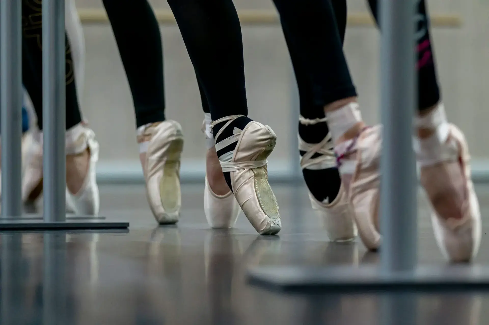

Of course it can, if you want it to.

In my view, art is the transmission of meaningful information to the viewer's inner world through sound, light, and motion.

If a viewer believes that a dancer's audiovisual presentation brings them beauty, resonance, inspiration, or reflection — in short, meaningful information reaching the spirit — then it is art.

And only the viewer can make that judgment.

As for the dancer as an "artist," there are two scenarios:

One: they are consciously and actively expressing so-called "meaningful information."

The other: they just want to unwind, but they happen to dance beautifully. The viewer still feels beauty, resonance, inspiration, or reflection — and that viewer is perfectly entitled to call it art.

I saw someone use Yang Liping as an example in their response. Well, first of all, she's already an artist — her work speaks for itself. If she danced a guangchangwu routine, most viewers would still judge it as art based on her identity. But as a fellow art creator, I know that if Teacher Yang really danced it, she would do so consciously and intentionally. I'd call it art too, but it would be closer to performance art — and not really about guangchangwu itself.

Consider another example: AI face-swapping is so easy now. We'll inevitably see videos like "Yang Liping dances guangchangwu." That's still art, even though the creator isn't necessarily Yang Liping herself. The author is using technology intentionally, but again, it has nothing to do with guangchangwu.

Notice something? Art has no necessary connection to the medium, the category, the field, or even the artist.

It only has a connection to the viewer.

Who the viewer is, what they've experienced, what they like and dislike — that determines the boundary of what they consider art.

Once that boundary is crossed, judgment comes naturally. Even if they don't understand it, they'll be shaken and exclaim:

"That's so f***ing art!"

For more on AI and art, see [this post](https://cgartlab.com/en/posts/vangogh-level-artists-ai-replacement/).

Originally published on [Zhihu](https://www.zhihu.com/question/439930978/answer/3623694886)