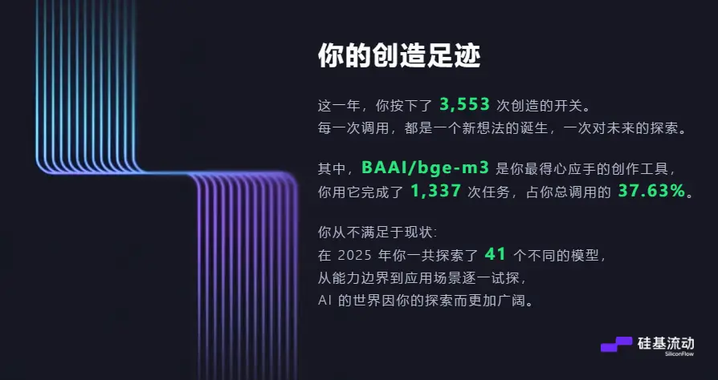

基于你的写作风格和现有内容，我为你生成这篇文章的大致框架。你的风格特点是：**从具体现象切入，结合个人实践与系统思考，最终提炼出可操作的方法论**，并常以自然或生物隐喻来组织概念。

### 文章框架建议

**标题：** 当AI开始“学习”：我们该如何向ChatGPT提问？
**核心主题：** 探讨在AI具备“学习模式”等引导功能的新阶段，用户应如何调整提问策略，以实现更高效、深入的知识构建，而非简单的答案索取。

---

#### 1. 写在前面：从“抄答案”到“学方法”的转变
*   **现象切入：** 引用OpenAI推出“学习模式”的背景——美国青少年使用ChatGPT做作业的比例翻倍，但过度依赖导致缺乏独立思考[^1]。
*   **核心问题：** 当AI从“答题机”转向“辅导者”，我们的提问方式是否也需要一场进化？
*   **个人视角：** 类比个人在“碎片化写作”中从收集骨头到组装标本的历程[^2]，提出提问也是一个需要设计和迭代的“构建过程”。

#### 2. 识别“提问模式”：我们通常如何向AI提问？
*   **（现象分析层）** 列举几种常见的低效提问模式（如：模糊指令、封闭式问题、直接索要结果）。
*   **（概念引入层）** 对比“情绪板”（Moodboard）与“风格景观”（Stylescapes）的区别[^3]：前者是静态、零散的灵感点（类似碎片化提问），后者是融入场景的动态框架（类似系统化提问）。
*   **观点提炼：** 好的提问，不是索取一个答案“点”，而是共同搭建一个思考“景观”。

#### 3. 构建“提问框架”：像Git管理创作一样管理对话
*   **（方法论层）** 借鉴你在[[碎片写作——建立一具思维标本]]中阐述的Git理念[^4]，将一次深入的AI对话视为一个“项目仓库”。
    *   **版本控制（迭代式提问）：** 不追求一次完美提问，而是通过“提问-反馈-修正”循环，逐步逼近核心。
    *   **分支管理（探索式提问）：** 针对复杂问题，创建不同角度的提问分支（如：“从技术层面看…”、“从用户体验看…”），再合并见解。
    *   **备份与同步（积累式提问）：** 将优质的对话记录和提炼的“提示词”作为知识资产保存，形成可复用的“提问模板库”。
*   **（实践步骤层）** 提出一个可操作的“提问工作流”：
    1.  **捡骨头（收集问题点）：** 随意记录所有相关疑问。
    2.  **搭骨架（建立逻辑框架）：** 将问题点分类、排序，形成有层次的提问提纲。
    3.  **组装完整（执行对话）：** 基于骨架展开对话，并允许AI追问和反诘。
    4.  **持续完善（提炼与复盘）：** 对话后整理答案，反思提问的有效性，优化框架。

#### 4. 从“提问”到“构建”：AI作为思维标本的共建者
*   **升华主题：** 总结“学习模式”的本质是邀请用户从“消费者”变为“共同创造者”。
*   **呼应隐喻：** 再次回到“思维标本”的比喻——每一次系统化的提问与对话，都是在AI的辅助下，共同建立一具更清晰、更完整的关于某个问题的“思维标本”[^5]。
*   **最终观点：** 最佳的提问状态，不是完美，而是可持续的进化。如同自然演化，在与AI的互动中，通过不断的调整（拧松或拧紧螺丝），找到最适合当前认知阶段的对话节奏与深度。

#### 5. 写在最后
*   **行动号召：** 鼓励读者将下一次与AI的对话视为一个创作项目，尝试用项目管理的思维去设计它。
*   **关联与延伸：** 可提及这与“碎片化写作”、“第二大脑”构建是同一套底层逻辑——**系统化地管理知识流**。

---

#### 框架设计思路说明：
1.  **结构上**，遵循了你常用的“现象 -> 分析 -> 方法论 -> 升华”的递进逻辑。
2.  **内容上**，紧密关联了你知识体系中的现有概念（碎片写作、Git管理、Stylescapes），使新文章与旧笔记形成网络，增强了你个人知识库的凝聚力。
3.  **风格上**，延续了使用比喻（思维标本、景观、演化）和从个人实践经验中提炼原则的特点。
4.  **实操上**，框架的每一部分你都有现成的笔记素材或思考可以关联和展开，降低了写作启动难度。

你可以直接在这个框架下，将[[当AI开始“学习”：我们该如何向ChatGPT提问？]]草稿中的图片和想法填充到对应部分，开始“组装完整”的步骤。

#### Sources
[^1]: [[09 玄光周刊-OpenAI推出学习模式]]
[^2]: [[碎片写作——建立一具思维标本]]
[^3]: [[07 玄光周刊-双钻石设计模型：从用户需求到产品落地的黄金框架解析]]
[^4]: [[碎片写作——建立一具思维标本]]

