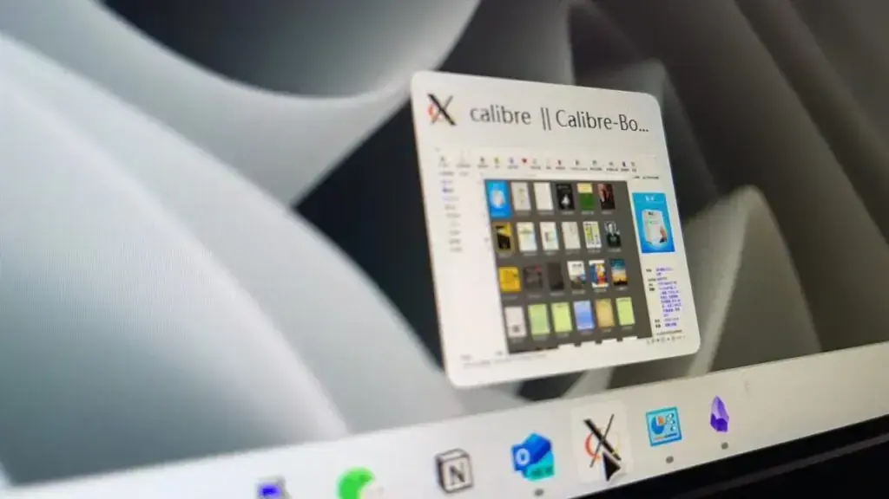

这篇记录一下，如何用一台闲置电脑，搭建一个属于自己的云端图书馆。

软件方面主要操作是在 Proxmox VE 中的 Debian 12 虚拟机上安装并运行 Calibre，包括配置 X11 转发和解决 Qt 平台插件错误的问题。

### 1. 创建并配置 Debian 12 虚拟机

1. **登录 Proxmox VE Web 界面**。
2. **创建虚拟机**：

- 点击“创建虚拟机”。
- 输入虚拟机的基本信息，例如名称。
- 在“操作系统”选项卡中选择“Linux”并选择 Debian 12 的 ISO 文件（可以从 Debian 官方网站下载）。
- 配置硬件设置，包括 CPU、内存、硬盘和网络。
- 完成向导并创建虚拟机。

4. **启动虚拟机**并按照提示安装 Debian 12。

### 2. 更新系统并安装必要的软件

登录到 Debian 12 虚拟机并更新系统包，安装必要的软件包。

```bash
sudo apt update
sudo apt upgrade -y
sudo apt install -y xorg openbox xauth x11-apps libxcb-xinerama0
```

### 3. 安装 Calibre

使用官方推荐的脚本安装最新版本的 Calibre。

```bash
sudo -v && wget -nv -O- https://download.calibre-ebook.com/linux-installer.sh | sudo sh /dev/stdin
```

### 4. 配置 X11 转发

### 在本地计算机上

- **Windows**：

- **安装 Xming 或 VcXsrv**：

- [下载并安装 Xming](https://sourceforge.net/projects/xming/) 或 [下载并安装 VcXsrv](https://sourceforge.net/projects/vcxsrv/)。
- 启动 Xming 或 VcXsrv。

- **配置 PuTTY**：

- 打开 PuTTY。
- 在“Session”页面中输入您的虚拟机 IP 地址。
- 在左侧菜单中，导航到“Connection -> SSH -> X11”。
- 勾选“Enable X11 forwarding”。
- 返回到“Session”页面并连接到虚拟机。

- **macOS/Linux**：

- **安装并启动 XQuartz（macOS）**：

- [下载并安装 XQuartz](https://www.xquartz.org/)。
- 启动 XQuartz。

- **使用 SSH 连接并启用 X11 转发**：

```bash
ssh -X user@your-debian-vm-ip
```

### 在 Debian 虚拟机上

1. **验证 DISPLAY 变量**：

```bash
echo $DISPLAY
```

确认输出类似于 `localhost:10.0` 或 `:0`。

4. **运行 X11 应用测试**：

```bash
xeyes
```

确认 X11 应用程序窗口正常显示。

### 5. 运行 Calibre 并解决 Qt 插件错误

如果运行 Calibre 时遇到 Qt 插件错误，请确保已安装必要的依赖项。

1. **运行 Calibre**：

```bash
calibre
```

如果仍然遇到错误，请安装以下库：

Copy

```bash
sudo apt install -y libxcb-xinerama0
```

5. **重新运行 Calibre**：

```bash
calibre
```

### 6. 使用 VNC 进行图形界面访问（可选）

如果 X11 转发仍有问题，可以使用 VNC 进行图形界面访问。

1. **安装 VNC 服务器**：

```bash
sudo apt install -y tightvncserver
```

3. **启动 VNC 服务器**：

```bash
vncserver :1
```

5. **配置 VNC 客户端**：

- 在本地计算机上安装 VNC 客户端（如 [TightVNC Viewer](https://www.tightvnc.com/download.php)）。
- 连接到虚拟机的 VNC 服务器，地址格式为 `your-debian-vm-ip:5901`。

7. **在 VNC 会话中运行 Calibre**：

```bash
calibre
```

通过这些具体步骤，您应该能够在 Proxmox VE 中的 Debian 12 虚拟机上成功安装并运行 Calibre。如果仍有问题，请仔细检查每个步骤的配置，确保所有依赖项已正确安装。

在使用 PuTTY 设置 X11 转发时，可以按照以下步骤进行配置，以确保能够成功地在远程 Linux 服务器上运行图形界面程序，并在本地的 Windows 系统上显示这些程序的图形界面。

### 步骤一：服务器端配置

1. **安装必要的软件包**：

- 在 Linux 服务器上，确保安装了 `xterm`（或其他图形界面程序）以及 `xauth` 程序。这些程序通常可以通过包管理器（如 `yum` 或 `apt-get`）进行安装。
- 例如，在 CentOS 上，可以使用以下命令安装：

```bash
sudo yum install xterm xauth
```

- 在 Ubuntu 上，可以使用以下命令安装：

```bash
sudo apt-get install xterm xauth
```

3. **配置 SSH 服务**：

- 编辑 SSH 服务的配置文件 `/etc/ssh/sshd_config`，确保启用了 X11 转发。找到 `X11Forwarding` 这一行，将其值设置为 `yes`。
- 重启 SSH 服务以应用更改。这通常可以通过执行类似 `sudo systemctl restart sshd` 的命令来完成（具体命令取决于你的 Linux 发行版）。

### 步骤二：桌面端配置

1. **下载并安装 Xming**：

- Xming 是一个在 Windows 上运行的 X 服务器，它允许你通过 SSH 连接在远程 Linux 服务器上运行图形界面程序，并在本地 Windows 系统上显示这些程序的图形界面。
- 你可以从 Xming 的官方网站（如 [http://www.straightrunning.com/XmingNotes/](http://www.straightrunning.com/XmingNotes/)）或 SourceForge 页面（如 [http://sourceforge.net/projects/xming/](http://sourceforge.net/projects/xming/)）下载 Xming 的安装程序。
- 下载后，按照安装程序的指示进行安装。

3. **配置 PuTTY 以进行 X11 转发**：

- 打开 PuTTY 程序。
- 在“Host Name (or IP address)”字段中输入远程 Linux 服务器的 IP 地址或主机名。
- 在左侧导航栏中，展开“Connection”->“SSH”->“X11”。
- 在右侧面板中，选中“Enable X11 forwarding”复选框。
- （可选）在“X display location”字段中，输入 `localhost:0.0` 或 `localhost:10.0`（取决于你的配置和需求）。通常，`localhost:0.0` 是默认设置，但在某些情况下，你可能需要使用其他值。
- 点击“Open”按钮以建立 SSH 连接。

### 步骤三：测试 X11 转发

1. **登录到远程服务器**：

- 使用你在 PuTTY 中设置的凭据（用户名和密码或私钥）登录到远程 Linux 服务器。

3. **运行图形界面程序**：

- 一旦登录到远程服务器，你可以尝试运行一个图形界面程序，如 `xterm`，来测试 X11 转发是否成功。
- 在终端中输入 `xterm` 命令并按下回车键。如果一切正常，你应该会在本地的 Windows 系统上看到一个新的 `xterm` 窗口弹出。

如果成功看到了 `xterm` 窗口或其他图形界面程序，那么恭喜你，你已经成功配置了 PuTTY 以进行 X11 转发！现在你可以通过 SSH 连接在远程 Linux 服务器上运行任何图形界面程序，并在本地 Windows 系统上显示它们的图形界面了。