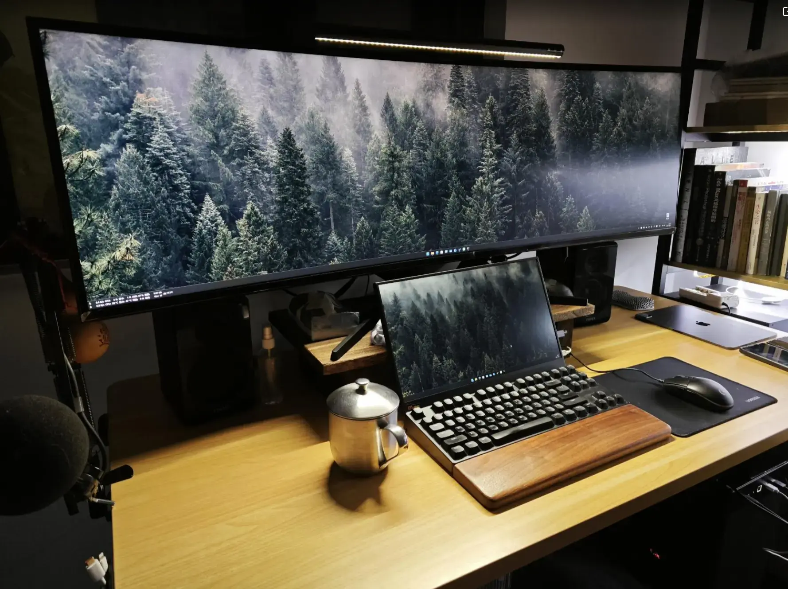

**本文参加声擎×少数派『角落新声』征文活动**

> [!NOTE] AI 辅助创作披露
> 本文基于作者真实经历独立完成，后期使用 ChatGPT 进行结构讨论、语言优化和部分资料整理。会话链接：https://chatgpt.com/share/6a5b9cdb-534c-83ea-a033-1c22823c476f

## 写在前面

对于作为设计师的我来说，一张放着电脑的桌子就是创作环境的全部。无论站着还是坐着，手往键盘鼠标上一放，直接进入我专属领域的「上帝模式」。

回想自己从刚刚进入设计行业，到如今慢慢开始尝试经营着自己的产品和服务。这一路走来，这张桌子已经在不知不觉中发生了巨大的变化。

每次伴随着念书，搬家，辞职，出差等等变动，它都会随着我的认知和积累进化一点点。只是我从未认真观察记录过这些变化，更从未从创作环境的角度认真思考过这些变化背后的原因。

计划写这篇文章在整理照片时才发现，这张「桌子」的变化，基本上也是我的认知成长缩影。有趣的是，创作环境中的「声音」也在跟着它的载体和来源，以及我的目的和意义而变化。

借参加这次征文的机会，正好可以认真地梳理一下，分享给大伙儿。

如果「地球 Online」这款游戏有等级设定，我更愿意从认知层面来划分我作为一个普通玩家的每个阶段。我和我的创作环境经历的阶段大致如下：

> 新手村，触碰规则。声音是生存的刚需。
>
> 发育期，学习和模仿。欣赏音乐回归主场。
>
> 瓶颈期，面对困境和挑战。从耳机到音箱的必然选择。
>
> 现在，建立自己的秩序。回归环境，顺应自然而然。

另外，在你决定花更多时间读下去之前，以下是你有必要先了解的背景信息：

- 我的新手村职业是动画设计师
	- 现在行业划分远没那么清晰了，如今叫做动态视觉设计师更准确一些。
- 从业十二年
	- 经历过的职位包括项目经理，平面设计师，培训讲师，影视 UI 动效师。
	- 如今大体算是产品工程师，兴趣太多所以有点杂。
- 本文出现的照片
	- 除特别标注外均为作者拍摄。
	- 没有严格的时间顺序。
	- 只是大致反映当时的创作环境状态。
	- 图片和文中举例仅作为参考，并不推荐购买其中出现的任何设备和品牌。
- 前提观点
	- 我认为具体用什么设备并不重要。
	- 更要紧的是弄清自己真实的工作流和习惯。
- 所以，我更愿意向你分享每个阶段在改进创作环境方面或许能帮助很大的书或视频，以及我自己沉淀下来一些方法论。

或许会给你带来一些不一样的思考。

## 新手村，触碰规则

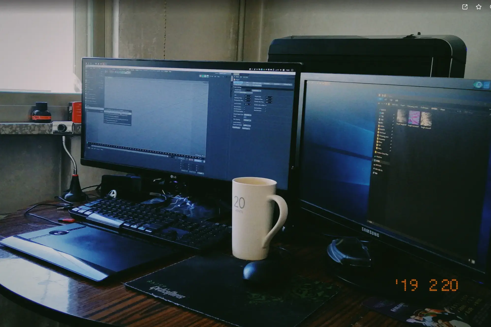

从大学毕业，到工作两年后决定辞职留学（大致 2014-2016 年），是我的新手村时期。

此时，我根本不存在什么所谓创作环境的概念，只在乎电脑配置是否到位，能不能顺利完成任务「喇叭能响就行，屏幕能亮就行」。

非常简单粗暴，为了生存而已。现在想来无比幸运的是，我的工作和爱好是一致的。

做自己喜欢的事情，顺便还可以赚钱。这无疑是一个良性循环。反应在这张桌子上，就是每天至少 10 个小时都在面对它也感觉不到累。甚至，遇见一个特别想弄明白的问题，会舍不得睡觉。

时间久了，干活愈发熟练，工具的粗糙和缺陷也越来越明显，越容易感知到。

当时我虽说能感觉到哪里不对劲不顺手，可并不知道该如何改进它，日益繁重的工作也让我无暇顾及这些问题。大部分空余时间也都花在点技能树上了。

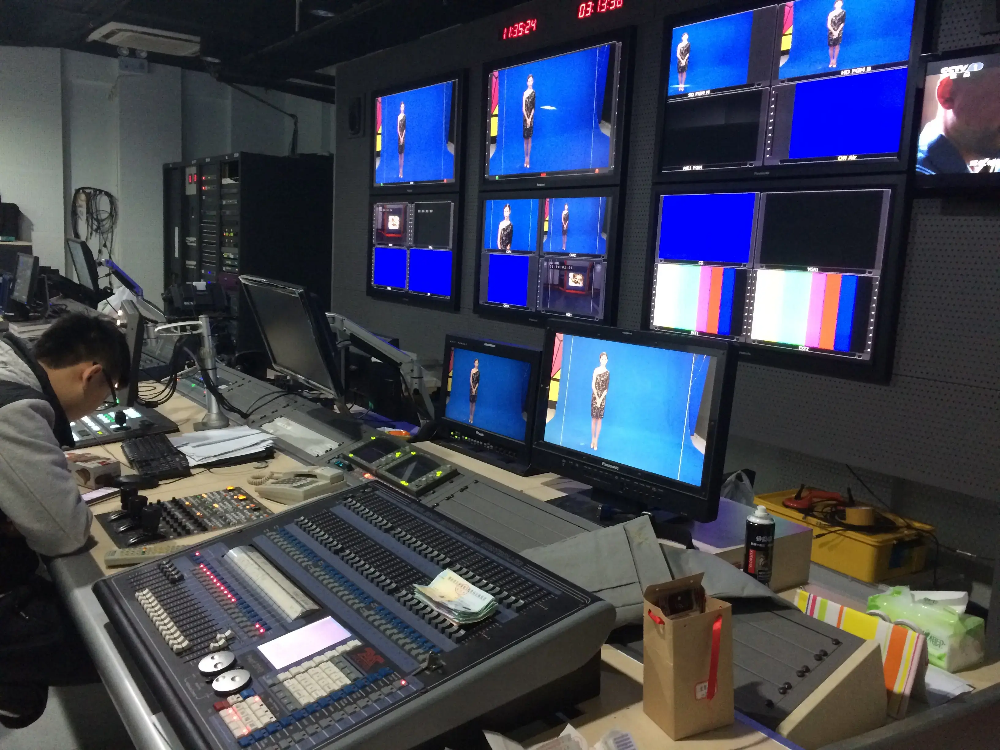

那会儿我的主要工作任务是在电视台从事预告片剪辑和设计栏目包装，为了尽快给片子找到合适的配乐和音效，几乎每天都必须刷几个小时各种音乐和音效库。领导审片会用音箱，设计师统一配的是森海塞尔 HD569 头戴式监听耳机，之后出差也发过森海的 PX90、HD201 等型号。

我想大多数人最初的「声音角落」，应该更多是从一副耳机开始的吧。只是，这个阶段我为了工作而不得不听的那些音乐，更多是一种刚需。每天超快的工作节奏好处是经验积累飞速提升，副作用就是毫无轻松闲暇可言。以至于，辞职后很长一段时间，我是非常排斥看电视的。而且，这份工作还捎带「毁掉」了很多我喜欢的音乐。

相信我，当你长年累月地为了剪视频而听音乐的时候，如果你遇到了一首自己喜欢的，往往舍不得用进片子里。因为心里非常清楚，用进去之后意味着未来几天要不得不反复听它几十上百次，最终几乎导致你烦到再也不想听，从此会「失去」这首音乐。

这有点像是如果你想毁掉一首歌，就把它设为闹钟铃声。

直到能够在团队中独当一面，一眼就能望到尽头的生活让我也意识到了是时候离开这里，去别处看看了。我选择去留学。

留学时期，我读的专业方向是纯艺术与视觉设计应用。念书时期，写论文和做项目本身就需要阅读大量资料，恰好极大地提升了我的审美能力。开始认识到了什么是美的事物，好的设计是如何一步步实现的。

加上相比上班的时候，我也有了更多的自由支配时间，于是在完成学业的同时，也开始无意识地去改造自己的创作环境。

如果你刚好也在这个阶段，推荐阅读和观看：

- [啊！设计](https://www.bilibili.com/video/BV1hwKfzmEr4?spm_id_from=333.788.recommend_more_video.11&trackid=web_related_0.router-related-2589621-qhxck.1784381163596.261&vd_source=55f768ce35e0b7a5a1934a62fcb29bd4)
	- 认识和观察好的设计
- [《写给大家看的设计书》](https://book.douban.com/subject/26657933/)
	- 非常经典，无须多言
- [秀出你的工作](https://book.douban.com/subject/36471384/)
	- 更推荐读英文原版，中文翻译的一般
- [IT之家](https://www.ithome.com/)
	- 从大学就在看，只是这个阶段开始真正了解主流的品牌和产品

## 发育期，学习和模仿

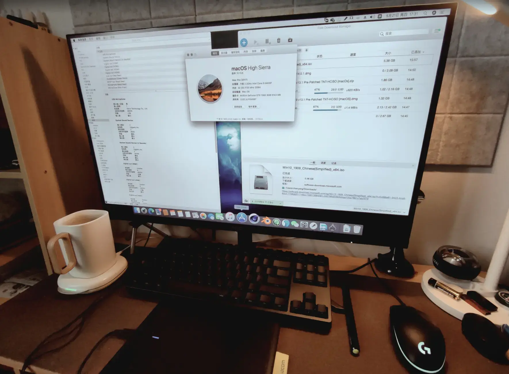

回国后，从开始下一份工作，到完全自由职业（2016-2020）。这期间工作流程和目标的变化，让我正式开始有意无意地改造自己的创作环境。现在看来本质上，我开始主动探索和适应它们了，落在行动上就是学习和模仿。

### 学到了什么

我学习总结下来最重要的一条准则很简单，**把预算和精力花在每天一定会用到的设备上**。

可是和很多刚入行的新人一样，刚开始我在意的东西也是硬件配置、是屏幕、鼠标、键盘，认为这些东西是每天使用时间最久的。但是通过进一步学习思考才意识到，更重要的是桌子，椅子，光线和声音。这个真相当时没有哪个媒体和网站表达出来被我看到过，只能通过一路用体验和实践去逐渐感悟。

屏幕只有你在看它的时候才算使用，鼠标键盘只有移动和点击的时候才算使用。而桌椅、光线和声音是只要你坐在那里，甚至进入到那个环境里就在使用了。这样看来，哪些东西的真实使用时间更长其实显而易见。当时我并没有认真思考过这些，反而沉迷在其他硬件上。看了无数帖子和测评，收藏了所有自己喜欢的品牌官网。比较有代表性的有：

- [少数派](https://sspai.com/)
	- 我潜水学习了很久，如今也成为了一名作者
- [Chiphell](https://www.chiphell.com/)
	- 依然在潜水，此论坛大佬们普遍财力雄厚，但适合提升审美
- [硬件茶谈](https://space.bilibili.com/14871346)
	- 第一梯队的硬件科普视频频道，视频动画制作十分精良
- [远古时代装机猿](https://space.bilibili.com/35359510)
	- 同样第一梯队的~~单口相声~~PC 硬件科普频道。

除了全面熟悉了解电脑硬件，当然也开始接触不同的操作系统和软件。知识储备中，专业技能之外的领域开始不断生长，在那个阶段更准确的说是爆发。

这个阶段我比较有代表性的行动是，从零到一，搭建出一台 [黑苹果工作站并开源分享](https://github.com/cgartlab/Hackintosh---MSI-B360m-Mortar) 到 GitHub 上。当时 MacBook Pro 系列还处于使用单热管压 i9 处理器的魔幻时期，Mac mini 图形性能不足，Mac Pro 太贵实在用不起。

总之，这么折腾的核心动力在于，相比当时（2019 年）同等配置性能的 Mac 价格大约是它的三倍。

### Hi-Fi

同时由于专业领域不断拓展，第一次接触到了 Hi-Fi ，又冒出来一大堆新的概念：DAC、解析力、声场、瞬态、结相、响度、前端、音频编解码、无损、线材、动圈动铁、声道、频率、阻抗……

哦，原来声音也是一门这么复杂的学问。不出意外地，在 2015 年，自己斥 1800 元巨资（当时工资只有 2500…）入手了人生第一台 Hi-Fi 耳机，SONY MDR 1A 。

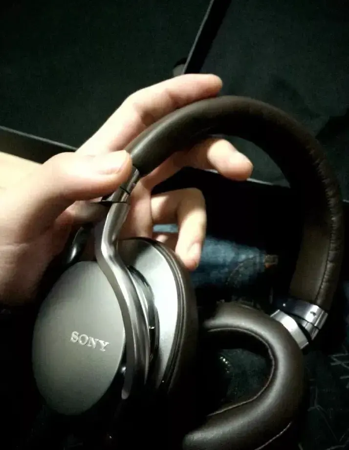

现在来看，我肯定不能算是 Hi-Fi 发烧友。由于~~财力限制且~~从我的听感出发，2000 价位左右的设备对我来说已经足够好了，再往上或许体验可以再提升个 5%，但是成本可能会翻好几倍。因此，我并没有继续尝试太多设备、线材。音源方面，PC、Mac、iPhone 事实上已经非常好了。

如果你对 Hi-Fi 也刚好感兴趣，其实更需要清楚的是，**在其他条件接近时，更大的发声单元通常能带来更好的低频表现和声音规模感。**

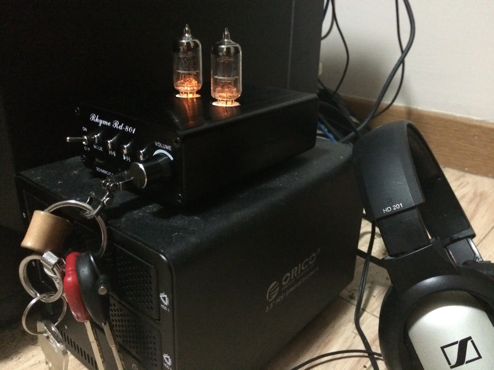

值得一提的是，前端音源我曾经用过一台国产胆机。这东西听起来非常奇妙，即使用森海 HD201 这种剪辑入门款的头戴式耳机，听起来也明显有一种暖洋洋的感觉，音乐真的像是被炭火「烤」过一样。[^1] 至今我并不清楚其中的原理，感兴趣的朋友可以试试。

等到自由职业阶段，预算也慢慢充足了，苹果推出了 M1 芯片，我也果断入手了一台 Macbook Pro，创作环境也多了一个移动便携的选项。

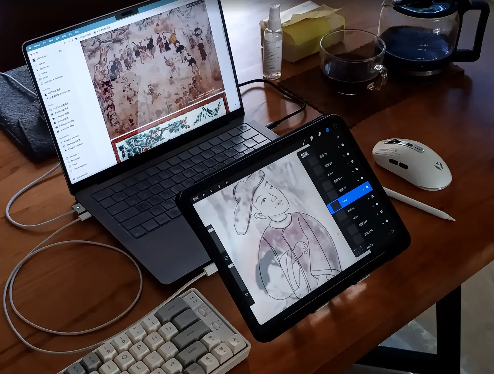

因为工作流里这台 Mac 的加入，或许是它自身的音质已经非常能打，自由职业也不需要担心会影响同事，不知不觉让我戴耳机的时间逐渐变少了。无论使用笔记本还是台式机，我更愿意和习惯使用音箱工作和营造氛围。

项目经理和插画师职位本身的变化，也让我终于有机会再回到自己的音乐世界里。从此以后，为了剪视频而听音乐终于不再是生活所迫，这个阶段，主力音箱是一套漫步者 R33BT。

### 对什么进行模仿

留学回来之后关注的博主基本都是 YouTuber 了，要说和创作环境相关，分享几个有代表性的：

- [devaslife - YouTube](https://www.youtube.com/@devaslife)
- [Matthew Encina - YouTube](https://www.youtube.com/@MatthewEncina)
- [2yn - YouTube](https://www.youtube.com/@2ynthetic)
- [DIY Perks - YouTube](https://www.youtube.com/@DIYPerks)
- [30X40 Design Workshop - YouTube](https://www.youtube.com/@30by40)
- [Dave2D - YouTube](https://www.youtube.com/@Dave2D)

当然作业不能（也没办法）照抄，创作环境的一切依然要围绕自己的真实需求来建立。对于重型设计类的工作，主力工作站也升级到了 13700K 处理器 + 64G 内存 + RTX 5070Ti 显卡的主流偏上配置。可以同时并发执行更多日常工作，以及应对几乎一切 [大型商业设计项目](https://cgartlab.com/posts/good-name-for-better-work/)。

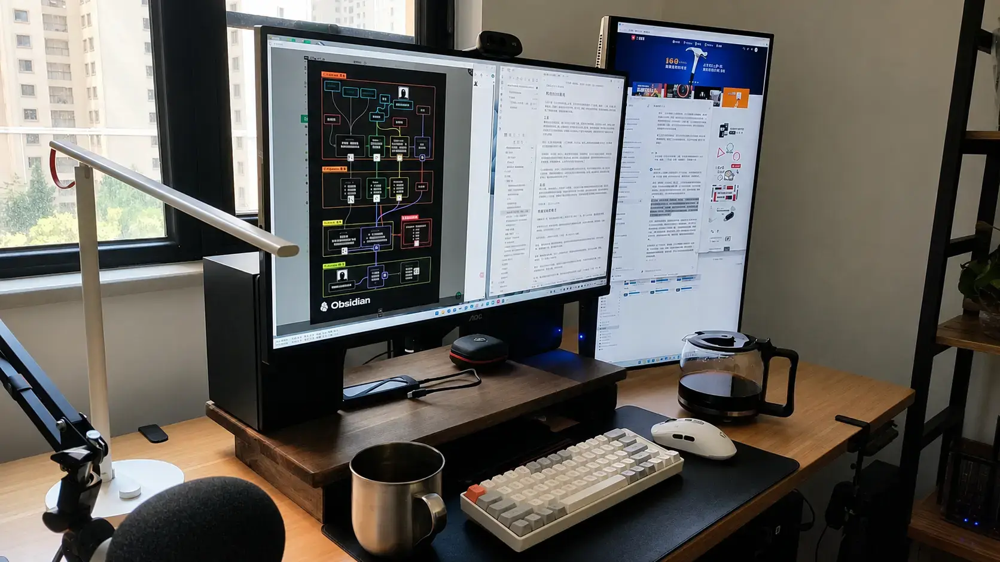

这段时期自己明显提升的是对屏幕的需求。在我熟悉的领域之外，加上又新接触了知识管理、私人服务器和编程。因此，阅读文档和写作占据了大量屏幕使用时间，屏幕也从一台 AOC 的入门 27 寸 2K 显示器 ，换成了双 4k 的一横一竖的布局。

然而，问题也开始一个一个地暴露出来。

## 瓶颈期，面对困境和挑战

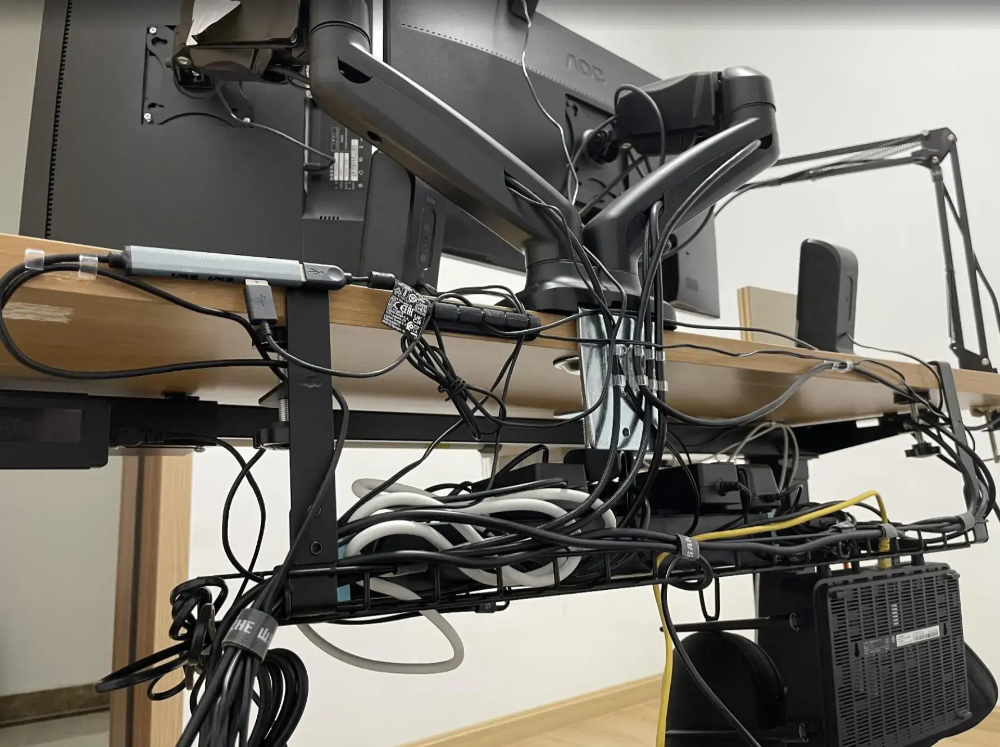

这个时期大致在 2020-2025 年。现在来看，其实从开始的理念和架构设计上就注定了这种环境迭代的不可持续。就像硬件性能无论提升多少，总会被新的软件迅速吃满一样。

梳理下来主要有：物理硬件、工作流、心态三个方面。

### 物理硬件

当设备越来越多，双显示器，工作站，笔记本，迷你主机，平板，背后往往意味着几十条线材。桌面的秩序开始逐渐崩塌，工作效率降低都不必说，光是视觉上已经开始越来越容易让我分心了。

还有，切换成本也是非常高的。每次计划新添置一个物件都不得不考虑：

- 到底好不好看？
- 插座够不够？
- 功率会不会超？
- 尺寸大还是小？
- 线要怎么绕和藏？
- ……

显然，这样又会开始把精力花在不必要的地方。明显更重要的问题依然是：

- 我会不会真的每天都要用到它？
- 如果是，真正使用它的时间到底有多少？

这里值得一说的就是音箱。可能由于近年蓝牙音箱和耳机过于火爆和流行（用着也确实方便），而大多数人并不知道的是：在正常使用和维护条件下，传统有线音箱的核心发声单元通常可以使用几十年，远超单组锂电池的寿命。如果你有兴趣，这是我用 GPT 总结的 [一张设备平均理论寿命的表格](https://chatgpt.com/share/6a5a5d09-f0c8-83ea-b6b5-5b6ff9d55f93) 可供参考，列表挺长就不放正文了。

由此我才知道，从产品的整个使用周期上看，有线音箱（还有麦克风）是除桌椅之外使用寿命最长的设备。有线头戴式耳机理论上其实也是一样长的，但因为通常要贴身或移动中使用，损坏概率更大些。

一个物件理论使用寿命越长，从根本上就意味着它的真实使用时间起码不会短。那么实际上集中精力去改进这些设备就能够更有效地改善创作环境了，不是么？

### 工作流

解决掉硬件方面的问题，下一步是工作流。

这个角落里的工具，每一件单独拿出来都是伟大的发明，并不代表把它们放在一起就能发挥伟大的作用。

在职期间，我的工作流是非常固定的。上过班的朋友都体会过当螺丝钉，总之大体上是这样的过程：

上游固定输入材料→我来加工→迭代→交付下游

开始自由职业之后，我的工作流发生了根本性的改变。大体上是这样的过程：

客户提出五花八门的需求→沟通→执行→确认真实的需求→迭代草稿→直到交付成品

你看，凭空增加了很多环节。这还只是执行环节，除此之外还有签合同，报税开票等商务细节没算进去。

新增的这些步骤，必然会带来更多的时间成本。如何控制好时间，更高效地完成任务是我必须面对和解决的问题。

我目前的解法就是建立一套自己的工作流系统。反应在创作环境上，主要体现在：

- 常用工具能够伸手可得
- 设备必须足够可靠
- 建立资产可回收的机制
- 永远存在 plan B

### 心态

接着看心态问题，首当其冲是完美主义。

这个太普遍了，随便举个例子：

如果你是学过（或者见过）画画的人，应该都经历过一个情景，没画完的时候不想给别人看。

换到创作领域里，实际这背后的想法是，我觉得我的作品还不够好，不好意思拿出来见人。

换到打造工作流和创作环境里，实际背后的想法是，一定有一个更好的方式，我还没找到。

不存在完美的作品和环境，这本身确实是事实没有错。问题在于意识到这个事实之后，结果我大部分时间就去纠结选什么工具了。

- 屏幕选 OLED 还是 LCD？
- 干活是用 PC 还是 Mac？
- CPU 选 AMD 还是 Intel？
- 笔记用 Notion 还是 Obsidian？
- ……

换到对声音的追求上，是不是特别像在纠结：你用的是银线还是铜线？火电还是水电？

第二个心态问题是，不能只关注当下的结果。换句话说就是，应该更加注重长期价值。

这个可以举例相对实际一些，比如：笔记本之前我还会考虑用 Windows，现在我更倾向于继续选择 MacBook。这个决策就是基于长期价值考虑的结果：

- 它续航更可靠稳定
- 外观设计更耐看
- 不需要经常升级
- 二手市场保值率更高
- ……

但台式工作站未来依然使用 Windows PC，这个决策也是基于长期价值考虑：

- PC 升级更方便
- 相同价格下性能更强
- 有问题可以哪里坏了换哪里
- 淘汰后依然可作为 NAS 继续服役
- ……

如果你也更认同长期价值，那么换到声音环境方面，决策更简单了：

在能力范围内，买最好的音箱即可。

如果你刚好在这个阶段，推荐阅读和观看：

- [禅与摩托车维修艺术](https://book.douban.com/subject/6811366/)
- [黑客与画家](https://book.douban.com/subject/6021440/)
- [最后的经济](https://ii.inc/the-last-economy/zh)
- [平面之道：平面设计发展简史](https://www.bilibili.com/video/BV1Rt4y127CR/?spm_id_from=333.1387.favlist.content.click&vd_source=55f768ce35e0b7a5a1934a62fcb29bd4)
- [抽象：设计的艺术](https://www.bilibili.com/video/BV1AE411t7Jo?spm_id_from=333.788.recommend_more_video.0&trackid=web_related_0.router-related-2589621-2f2gz.1784381084612.925&vd_source=55f768ce35e0b7a5a1934a62fcb29bd4)

## 现在，建立自己的秩序

如果说整个创作环境的演变是一种「切片再重组」的过程，声音身处其中的变化过程大致如下：

- 生存的刚需工具
	- 耳机几乎是唯一载体
- 回归享受音乐
	- 音箱开始取代耳机，音乐也不再是纯粹的工具
- 作为环境的基础设施
	- 不再局限于音箱，纯音乐和环境音都作为环境的一部分去考虑

我理解的「角落新声」应该不是「换了什么设备」或「提升了多少音质体验」，我需要处理的更多是「环境介质」。这些介质就是为了提高生产力，声音是其中之一，扮演的角色是，让我更容易进入专注甚至心流的创作状态。

声音在这个环境中和光线、桌椅一样，属于基础设施。从这个角度出发，窗外的风声、雷雨声、小猫呼噜声，拥有任何音箱都比不了的沉浸体验。尤其是深夜写作时，只是打开窗户，让外面的自然声音成为背景。

我想卓越的产品也应如此，轻松融进新的环境，然后在体感上尽可能让自己消失。

现在需要「音箱」这个设备出现的时候，几乎都是用来覆盖装修、广场舞、熊孩子这类噪音。款式还是那个款式，它慢慢没有了音质这个评判维度，只剩下了「能不能用」。

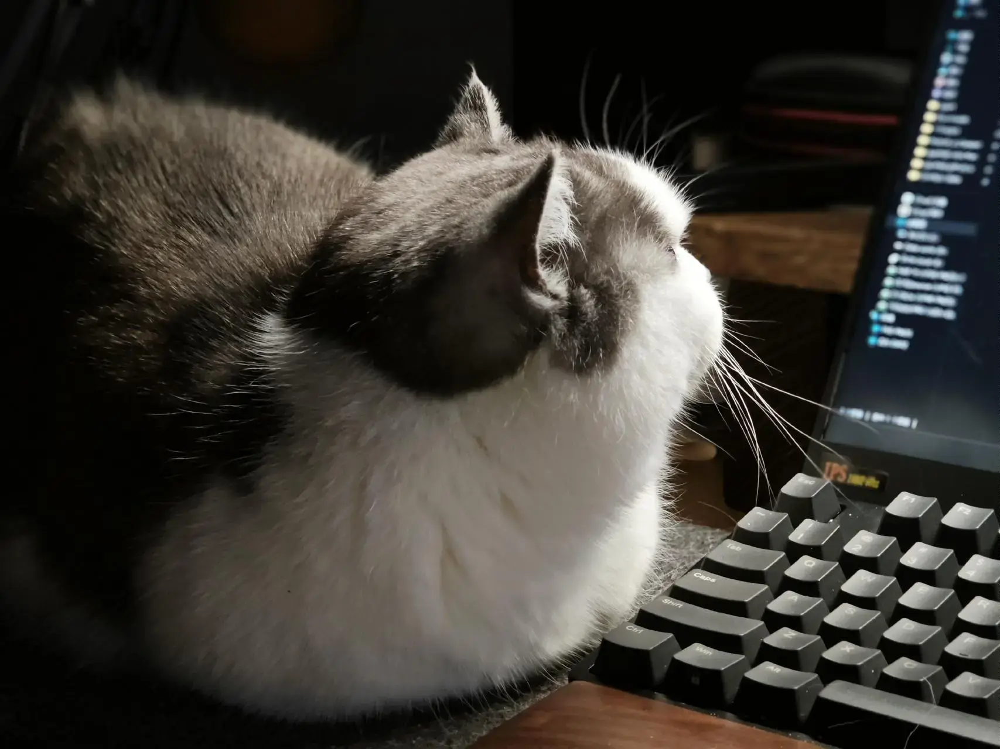

经历以上几个阶段后，如今我打造这个角落的思路也变得非常清晰：

- 什么更重要？
- 什么最重要？
- 这么做是否存在长期价值？

这三板斧砍下去，其他问题迎刃而解。

例如：

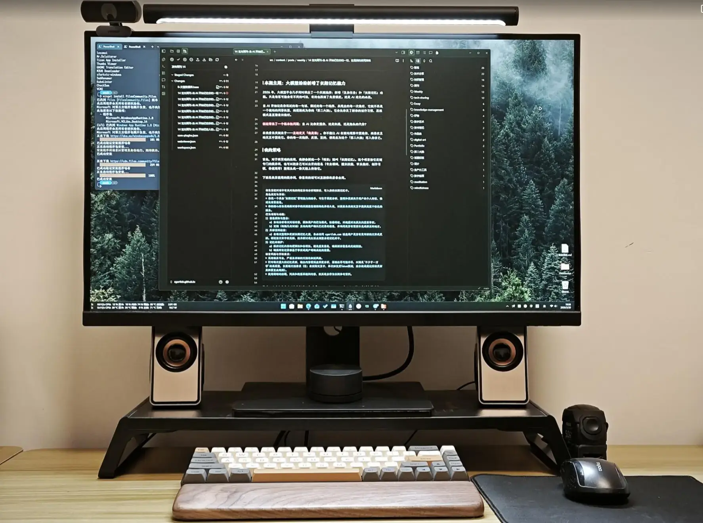

搭建一个更适合写作的环境，相比更好听的音箱，更高性能的电脑和显示器的数量，灯光、手感更好的键盘和高分辨率屏幕更重要。

写出对别人有用的内容最重要，长期价值自然不言而喻。

在专业创作中，显示器的宽度比高度更重要，屏幕换成了一台 5k 144Hz 49 寸 LG 面板的 DIY 显示器。因为 AI 的存在，真的不需要再去长期翻看文档了（但不是看文档不重要哈）。这台显示器面积相当于两台 27 寸无缝拼接，实际上我是切分成左中右三块屏幕来用。

另外附加了一个 1080p 60Hz 的普通便携显示器，平时作为工作站副屏，急用也可以用来做 NAS 的监视。

音箱依然是那套漫步者。最终决策逻辑是这样：

- 相比纠结用什么工具，建立系统和迭代的思维更重要。
	- 换句话讲也可以说是，去发现技术更迭的背后什么是不变的。
- 相比追求完美的工作流，完成眼前的工作更重要。
	- 追求完美没什么不好，前提是你真的具有无限趋近完美的时间和能力，否则最好把完成排在前面。
- 相比完成眼前的工作，身体更重要。
	- 这个目前我还做不好，因为似乎还有相比身体更重要的东西存在。

## 总结

以上就是我打造这个「角落」与「新声」的过程。

声音只是其中一个切片。客观来看，它记录的是我的创作环境如何不断迭代；但从个人经历来看，它真正映照的是我对创作这件事的理解如何变化。

如果你坚持看到了这里，感谢你的耐心阅读。如果你有不同的观点和经历，欢迎留言分享出来，我也很想知道其他创作者的经历和心得。

总的来说，写完这篇长文对我来说最重要的是梳理出了这套方法论，不写出来是绝对想不到这一步的。

## 相关阅读

- [2025年，我的生产力设备里留下了这些优秀工具](https://cgartlab.com/posts/good-tools-for-production-in-my-2025/)
- [大型三维设计项目实战心得：小小的文件命名加速高效创作](https://cgartlab.com/posts/good-name-for-better-work/)
- [2024年，如何优雅使用WindowsPC](https://cgartlab.com/posts/2024-elegant-use-windows/)

[^1]: 上面那两个「灯泡」是消耗品，3~5 年左右需要更换。
