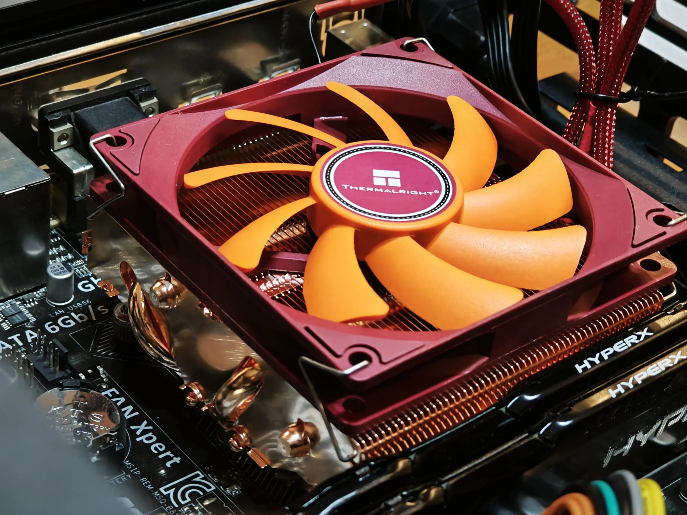
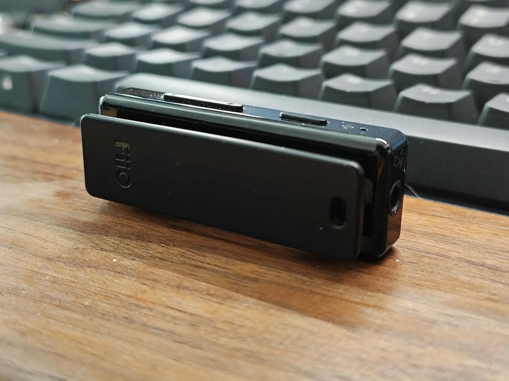
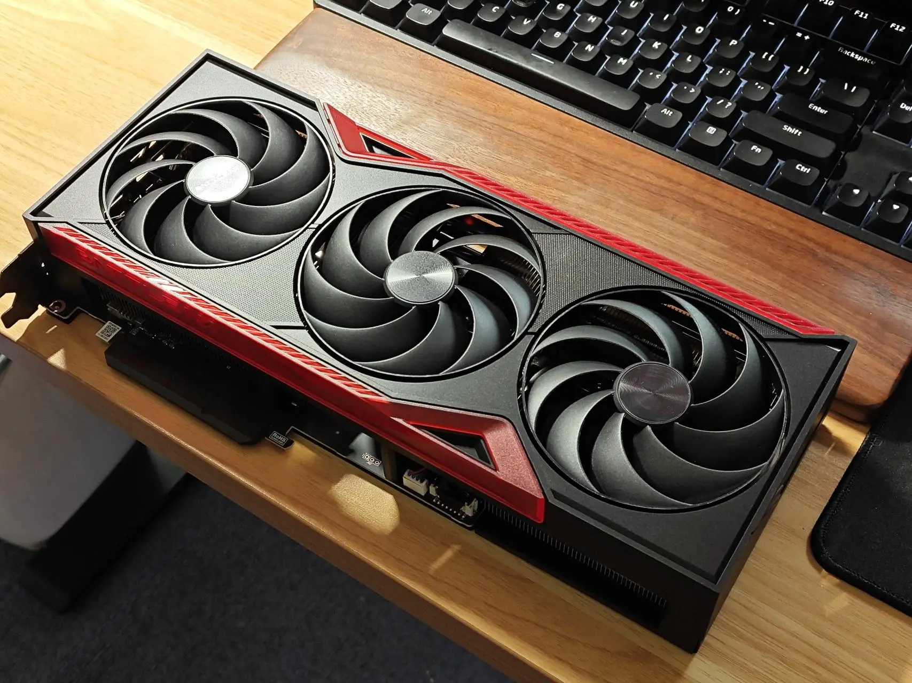
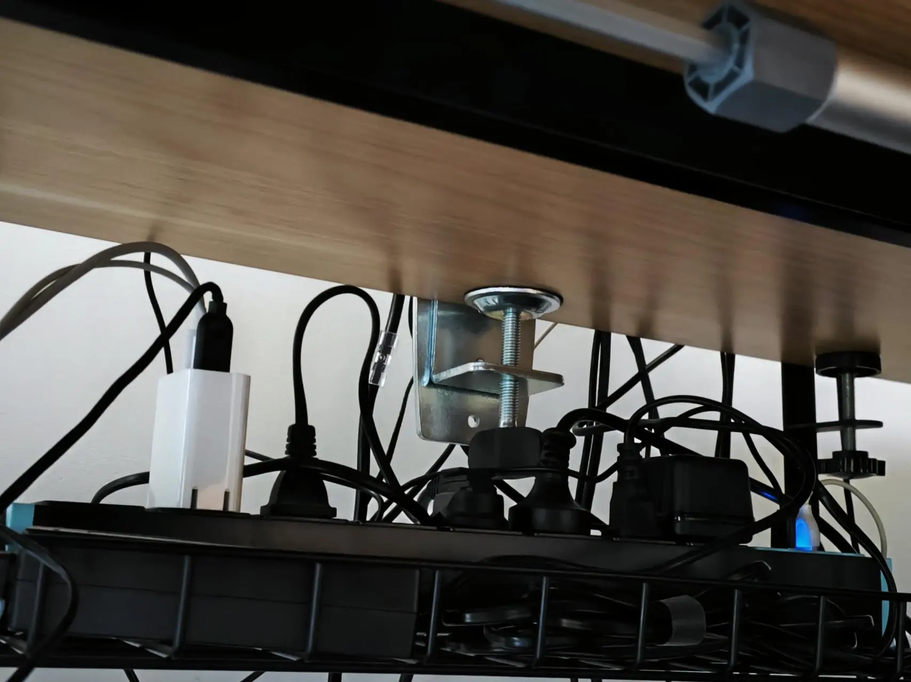
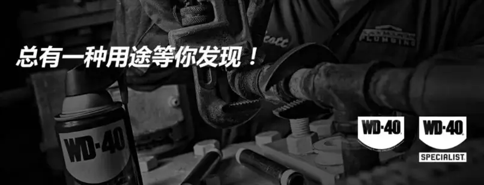

## Thermalright AXP90-X47 FULL Copper Low-Profile Cooler

Why: Scored a spare machine from a friend — a Xeon E3 1231v3 CPU, a legendary chip from a bygone era. I threw on a spare Intel stock cooler, but after all these years, it couldn't handle the heat during dual stress tests and started throttling. Picked up this Thermalright instead — probably one of the best low-profile coolers out there.

Experience: With air coolers, I think you just buy what fits your budget. The core principle of heat pipes means if you don't abuse them, they'll last practically forever.

Price: 209 CNY

Rating: 5/5

## FiiO BTR11 LDAC Bluetooth Receiver

Why: This tiny gadget turns any wired earphone into a Bluetooth headphone. I used to be an audiophile and have a stash of wired earphones, but most devices have dropped the headphone jack now.

Experience: I was worried about Bluetooth audio quality, but the tech has matured. Virtually no static noise. Adequate driving power — it pushed my Sony MDR-1A and Philips 9500 without issue. About 8 hours of battery life, longer with earbuds. Best used with a short male-to-male cable — it comes with a clip for your collar or headband. Not the most elegant look, but nobody's wearing full-size cans like these out on the street anyway.

This kind of device is ultimately a compromise for portability. When circumstances allow, go with speakers.

Price: 99 CNY

Rating: 4/5

## Colorful RTX 5070 Ti Battle Axe Deluxe

Why: My last GPU was the RTX 3070, also from Colorful, 4 years ago. I even went for the water-cooled version on impulse back then. The 3070's compute power is still decent for gaming, editing, and rendering still frames — but those 8GB of VRAM just aren't enough for running large models and high-res animation outputs. It was hurting my productivity.

Experience: Fast doesn't even begin to describe it. Thermal performance is wildly overkill — stress tests barely hit 60°C, matching my old 3070 with its water cooler. The 3070 was going to go on the second-hand market, but demand seems low. I'll build a gaming rig around it instead.

Price: 6,679 CNY — already gone up to 7,000+...

Rating: 5/5

## Liangong PDU Power Strip

Why: This thing is a godsend. This is my second one, and I'll definitely buy a third.

Experience: Pair it with a desk-mounted shelf from Taobao that matches the dimensions, toss it up there, and all the messy cables disappear from sight. They come in tons of sizes — I always leave 2-3 spare outlets. Similar commercial or industrial-grade gear is worth checking out too; the price isn't much higher, and you might discover some unexpected features.

Price: 39 CNY

Rating: 5/5

## WD-40 Precision Electronics & UAV Contact Cleaner

Why: Another lifesaver, but it's not a cure-all.

Experience: For electronics enthusiasts, oxidized contacts on keyboard switches, mouse microswitches, and various ports are a constant headache. Regular WD-40 is too oily, and alcohol often lacks cleaning power. This precision electronics cleaner is fast-drying with almost no residue. It evaporates quickly and works wonders on oxidized USB ports, HDMI connectors, and switch contacts.

**A few things to watch out for:**

First, it's essentially a strong solvent. It can potentially corrode or accelerate aging on certain plastics (especially ABS) and rubber parts. Always test on an inconspicuous spot first.

Second, it's strictly for cleaning and rust removal — no lubrication whatsoever. You may need to apply dedicated lubricant afterward.

Price: 45 CNY

Rating: 4/5