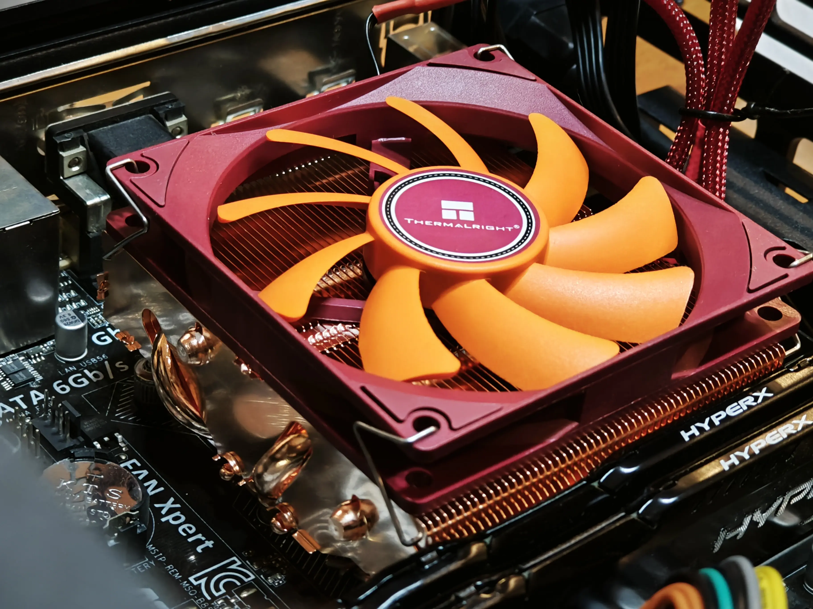
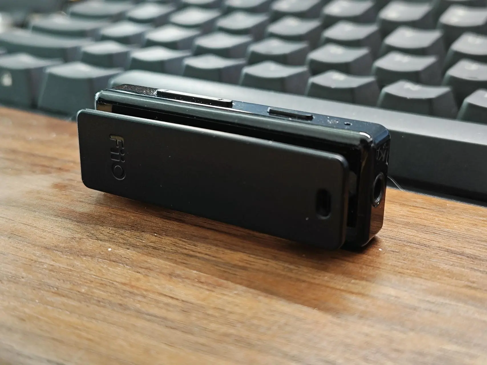
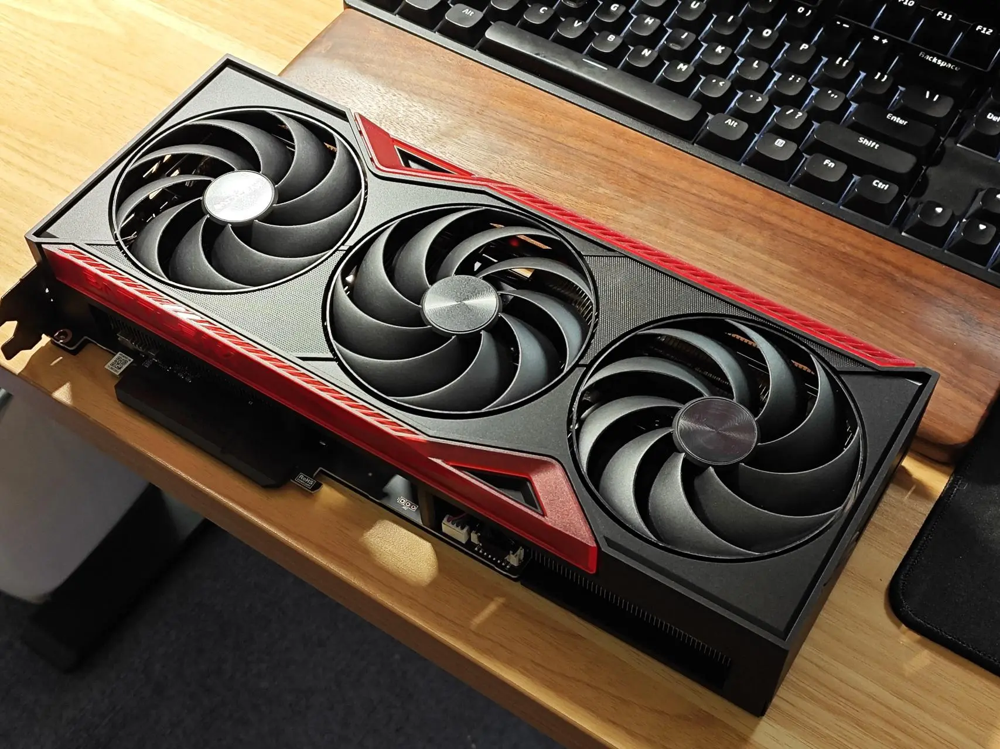
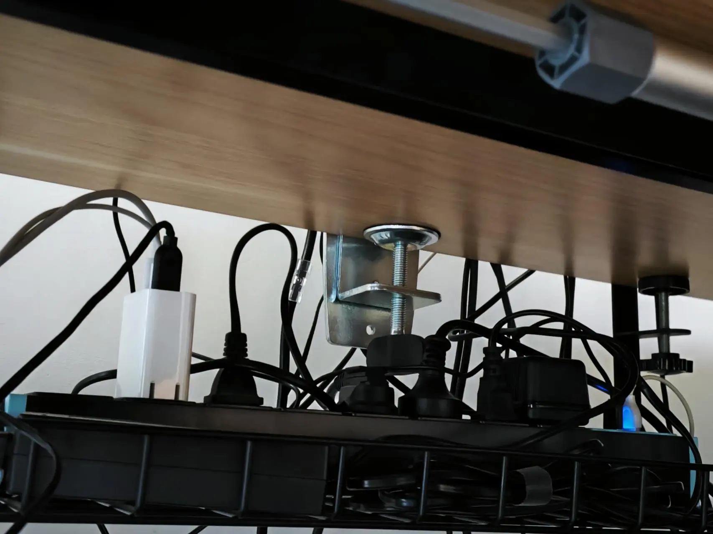
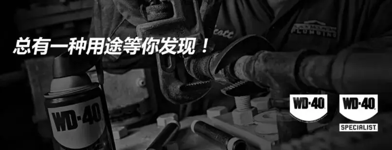

## 利民（thermalright）AXP90-X47 FULL 纯铜下压风冷散热器

为啥买：从朋友那里淘到了一台备用机，CPU 是 Xeon E3 1231v3，也是一颗上古神 U 。用自己闲置的一个 Intel 原装散热器压上之后，可能是时间长了，居然双烤会触发降频。然后就入手了利民的这个，下压式散热中应该算第一梯队了。

体验：风冷散热器这种东西，在我看来紧贴自己预算买就行，因为热管的核心原理造成这东西只要你不去暴力对待它，使用寿命几乎是无限的。

价格：209

评价：⭐⭐⭐⭐⭐

## FiiO 飞傲 BTR11 无损 LDAC

为啥买：就是这么个小东西，接在有线耳机上就变成蓝牙耳机，很方便。我~~曾经也~~是个音频发烧友，囤了很多有线耳机，但现在很多设备都取消耳机接口了。

体验：一开始也纠结过蓝牙传输的音质，还好现在技术已经挺成熟了，杂音几乎没有。推力也还行，最高推过索尼 MDR-1A 和 飞利浦 9500，都没什么压力，续航 8 小时左右，如果平头塞会坚持更久些。最好的体验式是配套弄个公对公的短线，它有个夹子可以夹在领子或者头梁上，虽然看着不够优雅，但也没人会带这种型号的大耳出街吧。

选这种设备终究是为了便携场景下而妥协的方案，条件允许的话尽量还是用音箱吧。

价格：99

评价：⭐⭐⭐⭐

## 七彩虹 RTX5070TI 战斧豪华版

为啥买：上次入手显卡还是 4 年前的 3070，也是七彩虹家的，当时冲动还买的水冷款。其实 3070 算力放现在打打游戏，剪片子，渲染静帧效果图还是够用的，无奈 8G 显存就那么点，跑大模型和高清动画出片已经影响到了生产效率。

体验：速度没得说，就是快，散热性能绝对过剩，压力测试最高也就 60 度出头，和 3070 水冷一个水平。3070 退役后本来还想挂二手，但看了看市场需求不大，还是组一台游戏机继续发光发热吧。

价格：6679，现在已经涨到 7000+ 了……

评价：⭐⭐⭐⭐⭐

## 良工家用 PDU 机柜插座

为啥买：这是个神器，这是第二个了，以后肯定会买第三个。

体验：淘宝配合选的尺寸找个桌下置物架，直接往上一丢就完事儿，所有乱七八糟的线都可以眼不见心不烦。而且它可选的尺寸分类非常多，我会习惯留出 2-3 个位置的冗余。其实类似这样的设备有很多都可以去看看商用或工业款，价格并不会高多少，且功能上会有意外收获。

价格：39

评价：⭐⭐⭐⭐⭐

## WD40 精密电器无人机插口清洁剂

为啥买：这也是个神器，但不是万能的。

体验：对于电子产品爱好者来说，键盘、鼠标微动、各种接口氧化导致的接触不良是常有的事。以前用普通 WD40 或者酒精，要么太油腻，要么清洁力不够。这个精密电器清洁剂是速干的，喷完几乎没有残留，挥发也快，对付氧化发黑的 USB、HDMI 接口或者开关触点效果拔群。

**不过它有几个需要注意的地方：**

首先，它本质上是一种强溶剂，对某些塑料（特别是 ABS）和橡胶部件有潜在的腐蚀或加速老化风险，使用前最好在不显眼处测试。

其次，它只有清洁和除锈功能，完全没有润滑效果，清洁后可能需要单独补充专用润滑脂。

价格：45

评价：⭐⭐⭐⭐
