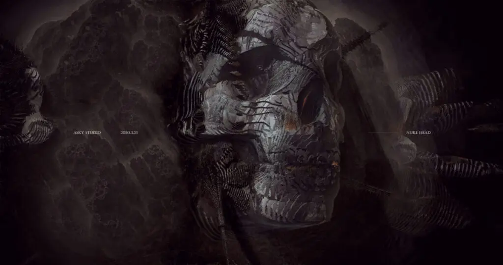

Sometimes when I want to relax, I browse sites unrelated to my field.

Today I suddenly realized that reading a lot of news and watching videos has become exhausting.

I find myself needing to enter a state of "reverse brainstorming" to judge information. Reverse, as in staying constantly alert — because what the author says doesn't matter as much as what they *don't* say.

Maybe we really are accelerating toward *Amusing Ourselves to Death*.

Print, photography, television — they've moved us into a world of peek-a-boo: no continuity, no meaning, but endlessly entertaining.

The internet has taken it a step further, pulling people straight into castles in the sky.

Everyone builds their own online castle. But the trouble starts when you try to live in it permanently.

With the right tools, you can manufacture context that has nothing to do with the audience — yet insiders know exactly how to make hearts race, bodies sway, and eyes well up. Pick a controversial topic, give people enough to talk about, let everyone voice their brilliant opinions. Even better if they start fighting. The director wishes everyone would just go at it. But just like the couples matched on *If You Are the One* — who cares what happens to them after they leave the stage?

On TV, the moment the host says "Alright, now..." it signals a topic shift.

Those three words are the only window you get to think while watching television.

Short videos have deleted that window entirely.

And my profession puts me right in the middle of this industry as a creator. Kind of bittersweet, really.