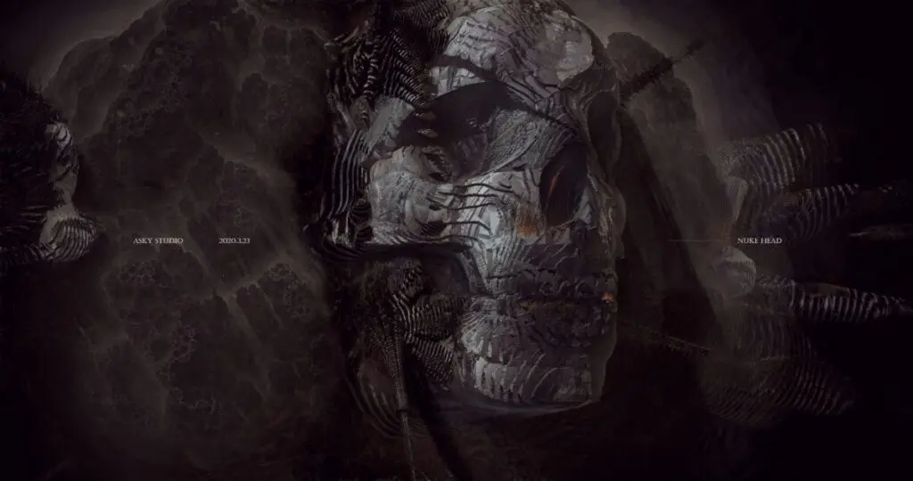

偶尔想放松一会儿，我会刷一些和专业无关的网站。

今天突然感觉到，我在看很多新闻和视频的时候，会很吃力。

发现自己需要用一种“逆向烧脑”的状态来判断信息，逆向的意思是，随时要保持警惕，因为作者说了什么不重要，重要的是没说的部分。

可能我们真的正在加速进入《娱乐至死》。

出版印刷，摄影，电视，让我们住进了类似躲猫猫的世界，没有连续性，无意义，但其乐无穷。

互联网则直接把人拽进了空中楼阁。

每个人都会在网上筑起自己的空中楼阁，但如果想要持续住在里面，问题就出现了。

有了这些，实际上可以人为制造语境，跟观众没有半毛钱关系，但内行可以用各种手法让他心跳加速、前仰后合、热泪盈眶。特意选取有争议的话题，让观众有足够的谈资，每个人能都可以评头论足发表自己的高见，如果能骂起来就更好了，导演恨不得所有人能打起来。但就像《非常勿扰》撮合的男女嘉宾，谁再会关心他们下台后如何？

电视节目中，只要主播说一声：“好，现在……”，那就代表要切换话题了。

说这三个字的时间，就是看电视的时候所能用来思考的时间。

短视频直接把这个时间删除了。

而我的职业，让自己还在以创作者的身份身处这个行业中，挺哭笑不得的。
