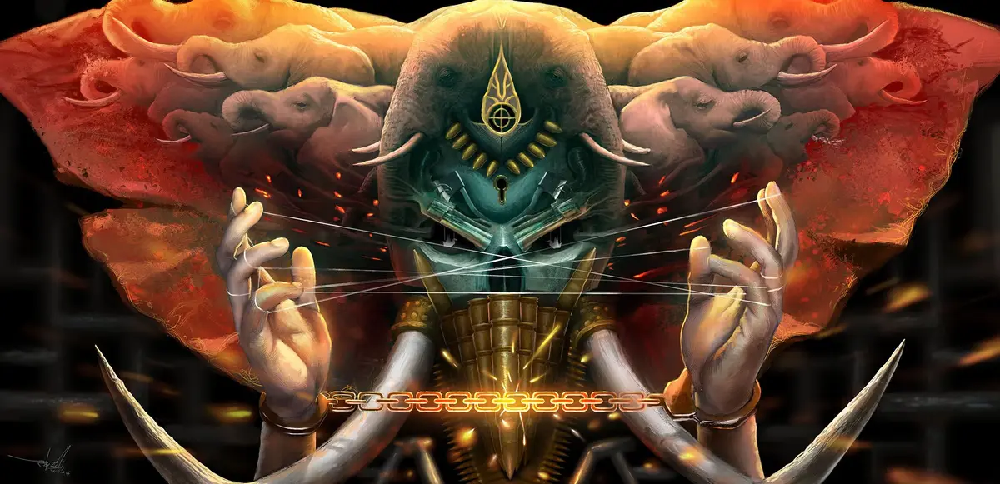
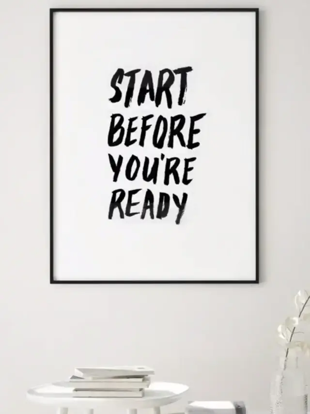
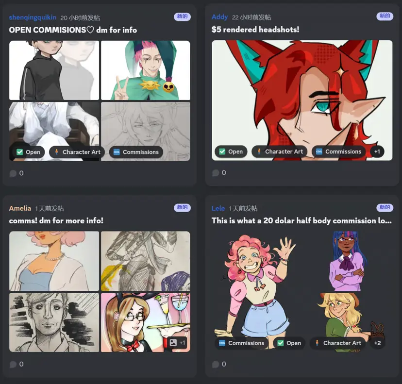

## Introduction

Having called myself [CG Art Lab](https://cgartlab.com) for so long, I rarely discuss CG art creation experiences and insights. Might as well start a series of articles - not talking too much about specific technical skills (there are plenty online), mainly discussing my understanding and experiences with this art form.

This series targets beginners interested in digital art creation but unsure where to start. Professionals can skip it - for them, it's mostly common knowledge.

Written content must convey well-founded conclusions.

I'm a beginner in writing, and my output targets amateur beginners in digital art creation. As a beginner myself, it's necessary to say some "common knowledge that everyone knows." Because I can't understand every reader's information level, knowledge base, emotional control ability, and independent thinking ability. I think this is why professional writers always elaborate on the same issue from multiple angles and provide multiple examples to prove their points.

## The Power of Dots, Lines, and Planes: Reviewing and Connecting

I've been exploring digital art creation for nearly ten years, haven't gained any noteworthy fame or money from it, driven entirely by interest and passion, gaining more nourishment for my main job. Because I have a main job, my creation frequency is extremely low - only about 30 works in ten years. But despite this low output level, despite having no so-called viral hits (I'm actually grateful for that), many interesting things happened during this period.

Because of these works, I attracted clients with similar aesthetics and ended up closing other business deals, continuing to this day;

Because of these works, I was able to study abroad and, as the first Chinese person (according to my supervisor), won the Thailand Annual Best Art Research Award;

Even during my thesis writing period, one piece was bought by a foreigner. Could say it was [the most unexpected income in my life so far](https://www.zhihu.com/question/522856095/answer/3470553145).

I never intended to make money with these paintings - they belong to my art, already available for free viewing once created. I just want to leave something behind, making myself feel I haven't wasted this opportunity to live, giving myself an explanation.

During the process of learning and creating these seemingly unbelievable, incomprehensible, [seemingly useless works](https://cgartlab.com/works/), I gradually discovered their profound impact on my work and life.

Like Steve Jobs said in his 2005 speech:

> Again, you can't connect the dots looking forward; you can only connect them looking backwards. So you have to trust that the dots will somehow connect in your future. You have to trust in something - your gut, destiny, life, karma, whatever. This approach has never let me down, and it has made all the difference in my life.

My translation:

> Again emphasizing, no one can predict the future; the cause and effect between events often only appear when looking back. You have to believe that cause and effect will connect in your future life. People always need some faith - intuition, destiny, karma, whatever - believe in the connection between cause and effect, giving you confidence to follow your will, even if unconventional, never stop, only then can you achieve something.

Yes, only when you look back can you discover these seemingly useless behaviors gradually forming miraculous connections and the power they unleash when connected.

There's also an interesting incident - I discovered that a designer I greatly respect, [Matthew Encina](https://www.instagram.com/matthewencina/), summarized the same pattern and even made a handwritten poster. In today's chaotic online world, finding like-minded strangers is truly comforting.

## What is Digital Art: Redefining Creation Boundaries

Before starting, beginners need to understand what digital art is. Not searching Baidu for answers, just discussing my own understanding.

I initially thought that paintings made with drawing tablets, images rendered with 3DMax, creating 3D animations were digital art - these were what I studied in school.

After working, I encountered television, VR films, trendy toys, music festivals, virtual idols, print advertising, fashion design, jewelry design, app development, etc. - I discovered these are also digital art.

Now, I believe even posting on social media is digital art.

Any creation using digital technology to express one's thoughts counts as digital art.

With current rapid technological development, actually, for interested amateurs, the threshold will only get lower. I think **for veterans, the threshold is constantly rising.**

The hardest part is starting - how to begin?

**Start directly before being ready.**

## Actually as Simple as Posting on Social Media: Overcoming Psychological Barriers

Creation itself objectively isn't difficult; it's the subconscious mind that thinks it's hard.

Everyone has two consciousness levels: surface subjective consciousness and subconsciousness.

If you think something is simple, your subconscious thinks it's simple, then subconscious power moves forward, subjective consciousness also moves forward. Their combined force is naturally very strong, so when learning and working, it genuinely feels simple, even thinking you didn't work hard, more like luck.

If you think something is difficult (not afraid of trouble - trouble corresponds to complexity, complexity ≠ difficulty), although your subjective consciousness moves forward, your subconscious accepts the "difficult" concept. Once subconscious power exceeds subjective consciousness, it avoids pain, and the combined force naturally moves backward. This can explain any decision you've made in life.

Try recalling your experience learning any skill. Preferably something you're inherently interested in - big things like post-work daily life financial management, small things like how your desk mate taught you to spin a pen. Recall how you went from starting to learning to mastering them. The source of confidence hides in these big and small experiences. Then return to now - if talking about a job you're already doing and earning money from, most people would first believe they can do it well.

Taking drawing as an example, the basic unit of drawing is the stroke. Each successful stroke is a small stage success, though the first stroke is 99% unsuccessful.

**Confidence is built on small stage successes.**

But why, when facing a new field again, do doubts still arise?

The answer is simple:

1. **No goal**
2. **No accurate goal**

If choosing a job offer, starting a company, managing a team, completing a large commercial project - goals are set by others, clear and executable. But artistic creation initially faces a blank canvas or an empty 3D window.

I encountered two situations.

First was complete cluelessness. Should I draw a person? Monster? Landscape? Architecture? Absolutely no idea.

Now if I face this situation, I'll randomly choose a color, randomly draw a shape. Then see what the shape resembles and continue. This is a method I invented for myself - will discuss in Part 2 "Shape and Silhouette."

Second situation: maybe I already have an image in mind, but past experience tells me it's too difficult, my level definitely can't achieve it. This is having no exact goal, also why the first step in learning drawing is copying. Sketching from life? In my view, apprentice-stage sketching is also copying. Copying goals are accurate - how to quantify creation goals?

At this point, we might step back and look from a distance. Today's digital art is no longer limited to drawing with tablets. Broadly speaking, even posting on social media counts as digital art creation. As long as people express their thoughts, it belongs to art, regardless of medium. When taking photos, editing, typing, and posting, who doubts their captions and selfies? (Of course, excluding those who rely entirely on this for confidence - off topic, won't discuss) When posting on social media, you actually have mysterious confidence. Artistic creation **in the initial stage** needs a bit of this **mysterious confidence**.

Note: with this mysterious confidence, it's not like posting on social media where you firmly believe you'll get likes and positive feedback. That comes from external sources, quickly forgotten, unreliable. Truly believing you can do it requires no external support whatsoever.

What's an accurate goal? **Quantification**.

Line art means completing line art, coloring means completing coloring, detailing means detailing. Completing any step, completing any character, tree, cloud, any step within them is an exact goal. Complete one step, then do the next, repeat this process.

**Confidence is built on small stage successes.**

When I have free time, I enjoy looking at works by artists I'm interested in. Honestly, mostly accumulating aesthetics and appreciation - can't learn from masters' works. Places where I can learn are some foreign forums where the atmosphere is genuinely good. These forums are circles coexisting with frontline professionals and amateur beginners. Experienced artists share insights unreservedly, answering any valuable questions. Domestic ones usually require paying tuition first.

The most important thing is that as long as the subject doesn't offend others, no matter how weak the foundation, people dare to post for everyone to see, raise their confusions, let everyone give suggestions. Even dare to price and sell, like setting up their own small stall. Such maximum inclusive environments I only found domestically around 2000s, now almost no such environments or platforms exist. Filled with aesthetically similar works and course promotion ads. If you find any, please tell me, greatly appreciated.

## No True Fresh Start: Digital Art's Iterative Advantage

I really like what a professional artist said in a QQ group after posting a painting:

> "If it's not modified beyond recognition, I'm embarrassed to post it."

In creation, I always believe **thinking clearly about what to create** is more important than thinking about how to create.

After starting, beginners quickly encounter two other difficulties.

1. Skill level not there, genuinely can't achieve expected results
2. Achieved expected results, but discovered this isn't what they wanted to create

The first seems unsolvable, only more practice. But remember this is digital art - no longer relying entirely on "hand skills." Many seemingly unsolvable problems can actually be solved by clicking a button or adjusting a parameter in software. Just need to use search engines well to know where that button and parameter are. Or use another software, even AI. (If you resist AI-assisted creation, I think this article ["Will Artists at Van Gogh's Level Be Replaced by AI?"](https://cgartlab.com/posts/vangogh-level-artists-ai-replacement/) can help)

For example, lines always crooked - in Procreate, draw a stroke and wait, line automatically straightens; in PS, with Shift can draw straight lines, even anti-shake brush functions, various symmetry functions - many methods available.

Another example: can't find good color schemes - use a nice photo, Gaussian blur, overlay on sketch, move/rotate/scale the photo, immediately countless excellent color schemes emerge, no need to try each individually.

Another example: face shape inaccurate - use liquefy deformation tool to directly "mold" accurate shapes. Facial proportions wrong - can adjust in seconds.

Some think these are cheating/lazy methods - they're not.

Although these techniques might cover some painting foundation deficiencies, I think more importantly they save time. Painting foundation still needs some basics, just not as crucial as traditional painting era. Traditional painting emphasized strong hand skills, partly for accuracy, partly for time-saving. Limited by technology, had to be this way.

Undo, layers, overlays, copying, filters, importing 3D models... These are digital technology's inherent advantages.

The troublesome one is the second difficulty. Works halfway done, technically no fatal issues, might suddenly discover (self-realized or pointed out by others) the content has deviated from the theme, not the original intended expression. To correct, requires massive rework or even redrawing. Encountering such situations, sometimes even advanced technology can't fix, having deviated from the original core direction.

This particularly resembles the classic joke: paying for movie tickets, halfway through realizing it's bad - leave or stay?

Most people won't leave. But I think for creation it's somewhat different. Movies are made by others, you can't do anything to improve the experience. Creation is self-directed, besides giving up, there's correction possibility, even just putting aside without discarding.

For digital technology creations, developing **archiving instead of deleting** habits is [crucial](https://cgartlab.com/posts/flow-program-iron-data/).

I've also had such experiences.

When creating the first piece of [SCP - China Series](https://cgartlab.com/works/), reaching the fifth image stage ready for detailing, I realized the metaphorical symbols in the image had problems, and large-scale ones. Had to drastically overturn my efforts, no matter how beautiful the shapes, had to save another version and patiently modify.

Movies often show someone writing, always troubled by poor writing, then crumpling paper and throwing it away. I think instead of taking new paper, better face the current one properly. Many beginners often overlook these "historical versions" value.

The fact is, **creation has no true fresh start, never ends, only gets abandoned.**

Seemingly facing a new canvas, actually every subsequent action integrates experiences and memories you thought were deleted. For unpredictable outcomes, all you can do is constantly correct direction on the way to the goal. Even if you put it aside, lessons learned will permeate the next step, if there are lessons.

## Amateurs Should Share More: Displaying Process and Value

As a beginner, definitely amateur - actually I'm still an amateur now.

In any field, amateurs are almost the largest group. People fear being seen as amateur, but amateurs have advantages - I dare say in creation, amateurs always have the highest freedom. Because they already have some interest and ability, far from reaching their skill ceiling. And in creation, more likely to do unconventional things, more possibilities.

Amateurs use any tools they can get to try expressing their ideas. Especially in the digital age, you don't need to be an expert, wealthy, famous, have fancy degrees or corporate backgrounds. Online, everyone can contribute some value.

Therefore, amateurs not only need creation confidence and courage, but should dare to share their works, thoughts, behind-the-scenes, even just sketches, small experiments. Even if not public, share with trusted friends. Final products indeed need audience, but many beginner friends feel they have nothing else worth sharing. Like saying "my work speaks for itself."

The fact is, works don't speak for themselves. Most people are really lazy - I discovered this data when building my website. Whenever articles published outside main site have main site links at beginning or end, those days main site traffic noticeably increases. Without these links, remains flat.

**Displaying rich work background information is as important as displaying the work itself.**

Due to professional reasons, I enjoy collecting movie soundtrack music. If hearing these music without seeing the movies first, I'd probably skip. Because many soundtrack names are numbers, unless the music itself is excellent. Actually, most cases are opposite - first watch the story, then immediately search for its background music. At this point, the story becomes the background music's background information.

**People are lazy, but more importantly curious.** People want to know where things come from, how they're made. When discussing your work, you greatly influence how others feel and understand your work. And this influence is usually beyond your expectations.

Just last month, I met a German medical student on Discord. All because I shared my [painting speed-up video](https://www.youtube.com/watch?v=4myVMqJurtI&t=7s) in forums - for professional video creators, this could be called a simple video. She saw it, found it useful. Added as friends, started chatting. Ended up discovering she's also a starting YouTuber, sharing many suggestions more suitable for international media development, like optimizing titles/thumbnails, tags, keywords, filming, voiceovers, etc. Whether drawing or making videos, we're both amateurs, but this is the unexpected value sharing brings.

Finally, others' feelings about your work and their understanding naturally affect their evaluation. Believe me, even if you only draw a realistic basket of eggs. If you say nothing, some still won't understand your expression. Professionals would probably consider it practice, other amateurs would probably think you're showing off.

In Austin Kleon's "Show your work" book, the original text says:

> Words matter. Artists love to trot out the tired line, "My work speaks for itself," but the truth is, our work doesn't speak for itself. Human beings want to know where things came from, how they were made, and who made them. The stories you tell about the work you do have a huge effect on how people feel and what they understand about your work, and how people feel and what they understand about your work effects how they value it.

I'm also correcting my direction.

Trying to build a website, putting up my writing, paintings, behind-the-scenes.

Trying to gather lifelong learning from every field I've touched, seeing what fresh things emerge.

Trying to use higher quality output to force higher quality input.

Trying to plan different content for different platforms, understanding each platform's rules.

Trying to meet people worldwide, discussing the value of recording and sharing creation processes.

Trying to embrace all possibilities.

## Summary

Reading this far, I think you've discovered. I didn't separate confidence and courage - not just in creation, but almost anything in life, confidence and courage coexist, mutually influencing. Next part, let's discuss another new discovery - "Shape and Silhouette."
