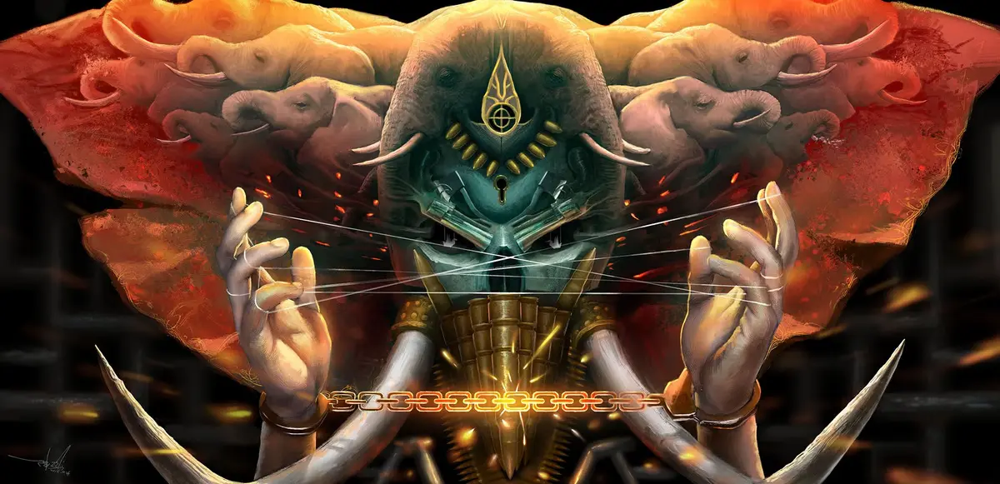
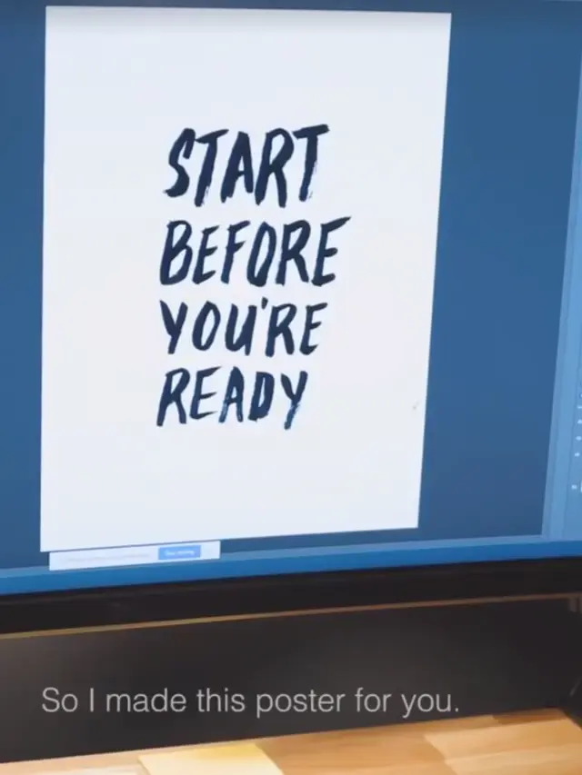
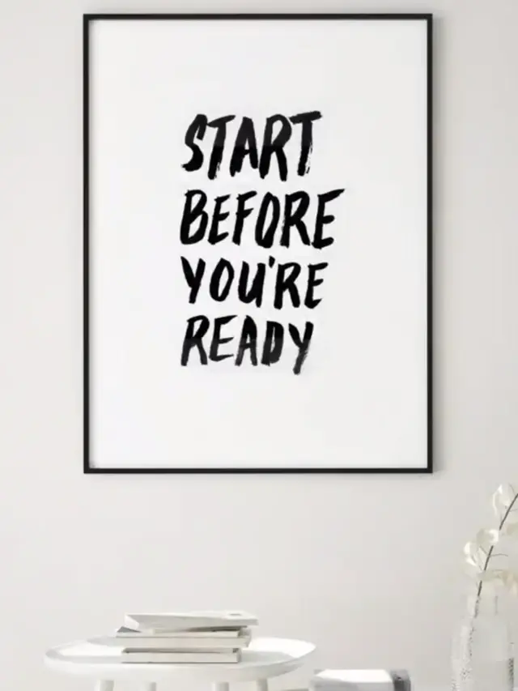
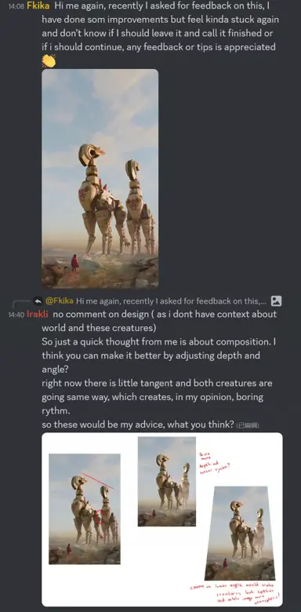
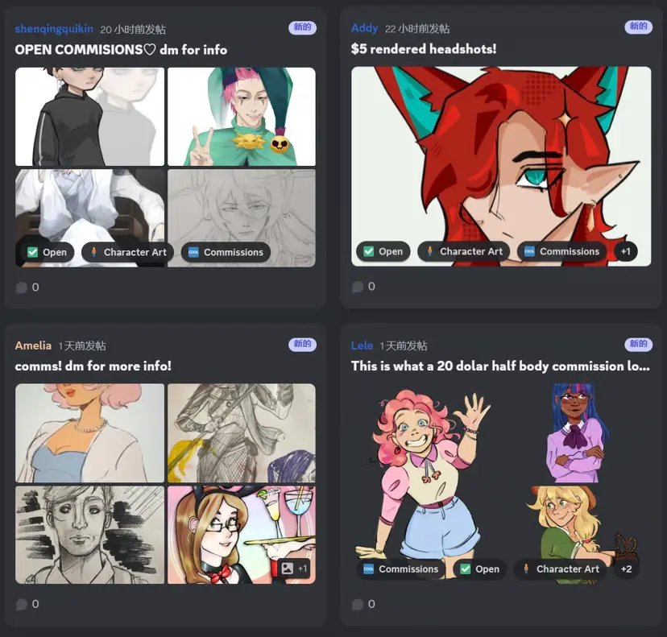
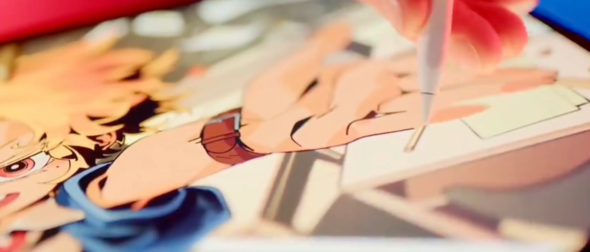
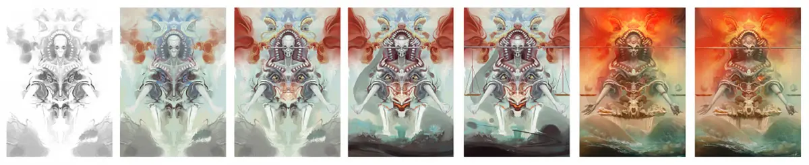
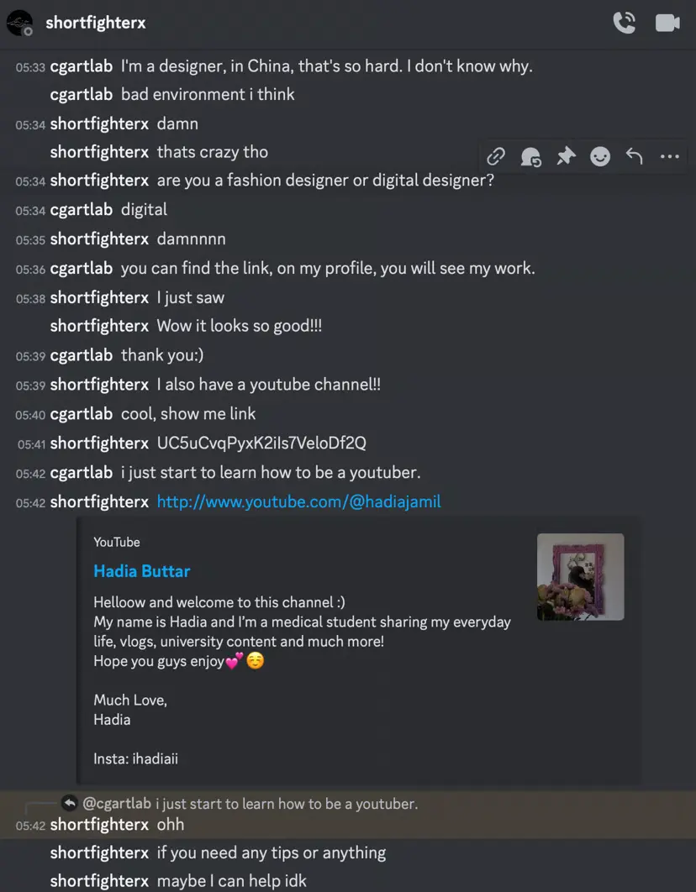

# 引言

叫了这么久 [CG 艺术实验室](https://cgartlab.top) 的名字，却很少谈论 CG 艺术方面的创作经验和心得。干脆开一个系列文章，不谈论过多具体的操作技巧，技巧网上有的是，主要是聊一聊我对这门艺术创作的体会和理解。

这个系列面对的是对数字艺术创作感兴趣但不知如何是好的新手朋友，内行可以不看，对于内行来说基本都属于废话。

写下来的内容，必须得传递有根据的结论。

我是写作上的新手，输出的内容也是面对数数字艺术创作的业余新手。那么对于我这个新手来说，是有必要说一些“人尽皆知的废话”的。因为我没办法了解每一个读者的信息量和知识储备，情绪控制能力以及独立思考能力。我想这也是为什么职业作家总是从若干个角度阐述同一个问题的原因，也是他们总是要举若干个例子证明自己观点的原因。

# 点线面的威力

我在数字艺术创作这条路上摸索了将近十年，并没有靠它获得什么值得一提的名望或金钱，全凭兴趣和热爱驱动着，获得的更多是对本职工作的滋补。因为有本职工作，我的创作频率可以说是低的离谱，十年里也就出了 30 幅左右的作品。但尽管是这样低产出的程度，尽管没有任何所谓的爆款（我反而庆幸），在这期间也引发了很多有趣的事。

因为有这些作品，为我吸引到了审美相近的客户，反而谈成了别的生意，至今也是如此；

因为有这些作品，我得以出国留学，并作为第一个中国人（我导师是这么说的），获得了泰国年度最佳艺术研究奖；

甚至，在写论文的期间，还被老外买走了一张。可以说是 [我目前人生中最意外的一笔收入](https://www.zhihu.com/question/522856095/answer/3470553145)。

我从未想过要用这些画去赚钱，这些是属于我的艺术，画出来已经是能免费看的了。我只是想留下点东西，让自己觉得没有浪费这次活着的机会，给自己有交代。

在学习和创作这些看似匪夷所思，不知所云，[毫无用处的作品](https://cgartlab.top/artwork/) 过程中，我渐渐发现它对我的工作和生活影响如此之大。

就像乔布斯 2005 年的演讲中说的那样：

> Again, you can't connect the dots looking forward; you can only connect them looking backwards. So you have to trust that the dots will somehow connect in your future. You have to trust in something - your gut, destiny, life, karma, whatever. This approach has never let me down, and it has made all the difference in my life.

我给翻译一下：

> 再次强调，没人可以未卜先知，事与事间的因和果，往往只在回首时显现。你得相信，因和果会在未来生活中联系起来。人总要有些信仰才行，直觉也好，命运也罢，因果轮回，不管什么，去相信因与果的联系，会给你信心去跟从自己的意愿，哪怕离经叛道，也绝不止步，只有这样，才能有所成就。

是的，只有当你回顾过去的时候，才能发现这些看似无用的行为慢慢有了奇迹一样的联系，以及这些行为连在一起所发挥出的威力。

其中还发生个有趣事，我居然发现自己非常尊敬的一位设计师 [Matthew Encina](https://www.instagram.com/matthewencina/) 也总结出了同样的规律，他还做了一张手写海报。在如今乌烟瘴气的网上，能发现素不相识的同道中人，真的很欣慰。

# 什么是数字艺术

在开始之前，新手有必要先弄明白什么是数字艺术。不去百度搜答案，只谈我自己的理解。

我最开始以为，用手绘板画的画，用 3DMax 渲染出的一张图，做一段三维动画，就叫数字艺术，读书时学的就是这些。

工作之后接触了电视，VR 电影，潮玩，音乐节，虚拟偶像，平面广告，服装设计，首饰设计，App 开发等各行各业，我发现这些也是数字艺术。

再到现在，我认为发个朋友圈，也是数字艺术。

凡是用数字技术在创作作品，用这样的作品在表达自己的思想，都算数字艺术。

目前技术发展这么快，实际上，对于感兴趣的外行来说门槛只会越来越低，我想**对于老手，门槛是在不断变高的。**

万事开头难，如何开始呢？

**在做好准备之前，直接开始。**

# 其实就像发朋友圈一样简单

创作，客观上看本身并不难，是人的潜意识觉得它难。

所有人都有的两种意识层面，表层的主观意识与潜意识。

如果你觉得一件事情很简单，你的潜意识就觉得很简单，那么潜意识力量向前，主观意识也向前。两者合力自然非常大，所以学习和做事的时候，就真的感到很简单，甚至还会认为自己没怎么努力，更多的是运气好。

如果你觉得一件事情很难（不是怕麻烦，麻烦对应的是复杂，复杂不等于难），虽然你的主观意识是向前的，但是你的潜意识接受了很难这个观念，潜意识的力量一旦强于主观意识，它就会逃避痛苦，合力自然是向后的。这也可以解释人生中你做过的任何一个决策。

不妨回想一下你学习任何一门技能的经历。最好是你本身就感兴趣的技能，大到工作后的柴米油盐金融理财，小到上学时同桌教你怎么转笔，都可以。回想你是如何从开始到学会，再到熟练掌握它们的。自信的源头就藏在这些大大小小的经历中。然后回到现在，如果说到你正在做的一份工作，已经能赚到钱了，大部分人都首先会相信自己有能力做好这件事。

以画画来说，画的基本单位是笔，每一笔的成功就是一次阶段性的小成功，只是第一笔 99% 是不成功的。

**自信就是建立在这一次次的阶段性小的成功上。**

可是，为什么再次面对一个新的领域时，依然会产生怀疑？

答案很简单**，**

1. **没有目标**
2. **没有准确的目标。**

如果是选一份 offer，开一家公司，管理一个团队，完成一个大型商业项目，目标是别人定的，明确且可执行。而艺术创作最开始面对的是一张空白画布，或一个虚无的三维窗口。

我自己是遇到了两种情况。

第一种是毫无头绪。我是画个人？还是怪物？还是风景？还是建筑？Absolutely no idea.

现在如果我遇到这种情况，我会任意选个颜色，随机画一个形状。然后看这个形状像个什么，再继续。这是我给自己发明的一个方法，放到第二篇《形状与剪影》再聊。

第二种情况，可能脑子里已经有了画面，但过去的经验在脑子里告诉自己，太难了，我这水平肯定做不到。这就是没有确切的目标，也是为什么学画画的时候，第一步是临摹。你说写生？学徒阶段的写生在我看来也是临摹。临摹的目标是准确的，如何量化创作的目标？

这时我们不妨往后退一步离远一点看，如今的数字艺术早已不仅仅局限于用手绘板画画了。广义上，就连发一条朋友圈写个微博，也算数字艺术创作的。只要是人在表达自己的思想，就属于艺术，不限任何传播媒介。从拍照 P 图到打字发布的时候，谁会怀疑自己的文案和自拍不好吗？（当然不排除有人完全靠这支撑自信，偏题，不做讨论）把朋友圈发出来的时候，你甚至是迷之自信的，艺术创作**在最开始的阶段**，是需要一点这种**迷之自信**。

注意，在这种迷之自信下，并不是像发朋友圈一样，你笃定认为会得到点赞和正面评价。那是来自外界的，很快就会被遗忘，靠不住。你真的相信自己可以，根本不需要从外界获得一丝一毫的支持。

什么是准确的目标？**量化**。

勾线就是完成勾线，上色就是完成上色，刻画细节就是刻画细节。完成任何一步，完成任何一个角色，一棵树，一片云，中的任何一个步骤，就是确切的目标。做好一步，就做下一步，重复这个过程。

**自信就是建立在这一次次的阶段性小的成功上。**

我闲着没事儿的时候，爱看自己感兴趣的艺术家的作品，说实话更多只是积累审美和欣赏，大师的东西学不来的。能学到东西的地方反而是一些国外的论坛，那里氛围真的很好。这些论坛是一个个一线职业精英与业余新手并存的圈子，有经验的艺术家会毫无保留分享自己的见解，只要提出有价值的问题都会给予答复。国内的一般要先交学费上课。

最重要的一点是，只要题材不触犯他人，无论基础多么薄弱，都有人敢发出来给大家看，提出自己的困惑，让所有人提建议。甚至，敢报价卖钱，就像摆个自己的小地摊一样。这种几乎最大限度的包容环境，我在国内只在零几年发现过，现在几乎没有这样的环境和平台。充斥着审美趋同的作品和课程引流广告，如果你发现有，可以告诉我，感激不尽。

# 不存在真正的重新开始

我非常喜欢当年在 QQ 群里一位职业选手发了一张画之后讲的：

> “不改到面目全非，不好意思发出来。”

在创作上，我始终认为，**想清楚创作什么**比想清楚怎么创作，更要紧一些。

开始动笔之后，新手很快会遇到另外两个困难。

1. 水平没到，确实做不出预期的效果
2. 做出了预期的效果，结果发现这并不是自己想画的内容

第一个看起来没招，只能多练习。但别忘了这是数字艺术，已经不需要全凭“手上功夫”了。很多看似无解的问题，其实在软件里点一个按钮，调一个参数就可以搞定。只需要善用搜索引擎，去知道那个按钮和参数在哪里。或者可以用另一个软件来实现，甚至是 AI。（如果你对 AI 来辅助创作有所排斥，我想这篇 [《梵高那种水平的画家会被 AI 淘汰吗？》](https://cgartlab.top/%e6%a2%b5%e9%ab%98%e9%82%a3%e7%a7%8d%e6%b0%b4%e5%b9%b3%e7%9a%84%e7%94%bb%e5%ae%b6%e4%bc%9a%e8%a2%abai%e6%b7%98%e6%b1%b0%e5%90%97%ef%bc%9f/) 能够帮到你）

例如，线总是画不直，用 Procreat 画一笔别动，等一会儿，线就自动变直了；PS 里配合 Shift 也可以画出直线，甚至还有防抖画笔功能，各种对称功能，手段非常多。

再例如，找不到好看的配色，用一张好看的照片，高斯模糊之后，叠加在草图上，移动旋转缩放这张照片，马上就有无数优秀的配色方案冒出来，根本不需要自己闷头挨个尝试；

再再例如，脸型画不准，可以用液化变形工具来直接“捏”出准确的形状。五官比例画不对，几秒钟就可以调整过来。

有人认为这些是作弊偷懒的手段，不是的。

纵然这些技术或许会掩盖一些绘画基本功的不足，我认为更重要的是节约了时间。绘画基本功当然还是要有一些，只是早已没有传统绘画时代那么重要了。传统绘画里，提倡手上功夫的过硬，除去为了画得更准确，也一样是为了节约时间。只是技术所限，必须如此。

撤回，分层，叠加，复制，滤镜，导入 3D 模型……这是数字技术的天生优势。

麻烦的反而是第二种困难。是那些已经做到一半，技术层面并无致命问题的作品，很可能会突然发现（可能是自己发现的，也可能是别人指出来的）作品内容已经偏离了主题，不是最初要表达的想法。要修正，必须需要巨量的返工修正甚至重画。遇到这样的情况，有时候就算用再先进的技术也无法修补，毕竟偏离了最初的核心方向。

这特别像那个经典段子讲的，掏钱买票看电影，看了一半觉得这是个烂片，走还是不走？

大部分人是不会走的。但是我认为对于创作来说还有点不一样。电影是别人拍的，你做不了什么可以让体验更好。创作是自己主导的，除了放弃还有修正的可能，哪怕收起来不看了也行，起码不要丢掉。

数字技术创作的产物，养成**归档而不是删除**的习惯 [至关重要](https://cgartlab.top/%E6%B5%81%E6%B0%B4%E7%9A%84%E7%A8%8B%E5%BA%8F%EF%BC%8C%E9%93%81%E6%89%93%E7%9A%84%E6%95%B0%E6%8D%AE/)。

我也碰到过这样的经历。

在创作 [SCP - 华夏系列](https://cgartlab.top/artwork/) 第一张时，到了上图第五张准备细化的阶段，我才意识到画面里的隐喻象征物出了问题，而且是大面积的。这时候必须大刀阔斧的推翻自己付出的心血，无论画的形状多么好看，只能狠下心另存一个版本，继续耐心修改。

电影里经常能看到一个人在写东西，总是苦恼写不好，然后直接把纸揉成团扔了。我觉得重新拿一张纸，还不如好好面对当前这一张。很多新手经常会忽略这些“历史版本”的价值。

事实是，**创作中不存在真正的重新开始，也不会结束，只会被放弃。**

看起来是重新面对的一个新的画布，实际上之后每一个行动都融合了你觉得已经被删除掉的经验和记忆。对于一个结果不可预测的事情，能做的只有在达到目标的路上不断修正方向。即使你把它扔在一边，从中吸取的教训也会渗透到下一步里，如果有教训的话。

# 业余选手更应该去分享

作为一个新手，肯定是业余的，其实到现在我也是个业余选手。

任何领域里，业余选手几乎是任何领域里数量最多的群体。人都害怕自己被看出来是业余的，但是业余有业余的优势，我敢说在创作上业余选手的自由度永远是最高的。因为他们已经有一定的兴趣和能力，同时远远没到自己实力的天花板。而且在创作上更容易做出剑走偏锋的事儿，有更多的可能性。

业余选手会用他们能拿到手的任何工具，去尝试表达自己的想法。尤其在数字时代，你不必是一个专家，你不必富有，你不必出名，你不必有华丽的学历和巨头公司的职业背景。在网上，每个人都有能力贡献一些价值。

因此，业余选手不仅需要创作上的自信和勇气，更应该敢于把自己的作品、思路、幕后，哪怕只是个草图，做了一个小的实验，都可以晒出来。即便不是公开，也可以分享给自己信任的朋友。最终的成品确实是要给人看的，可是很多新手朋友会觉得，自己没别的什么东西值得分享。这就好比在说“我的作品说明了一切”。

事实是，作品不会说明一切。大部分人真的很懒，我在做自己的网站时在后台就发现了一个数据。只要在主站外发布的文章开头或结尾，放上一个主站链接。那几天主站的访问量会明显升高。没有加这个链接，依然平淡。

**展示丰富的作品背景信息，和展示作品本身一样重要。**

由于职业原因，我有个爱好是喜欢收集电影原声配乐。如果这些音乐在没看过电影的时候第一次听，我大概率会划走。因为很多原声音乐的名字都是编号，除非音乐本身素质过硬。实际上，大多数情况正好相反，是先看了片子讲的故事，然后马上去搜哪里有它的背景音乐。这个时候，故事反而成为了背景音乐的背景信息。

**人是懒惰的，更是好奇的。**人们想要知道知道事物从何而来，它们是如何被制造出来的。你在谈论自己作品的时候，会对别人如何感受以及他们如何理解作品产生巨大的影响。并且，这影响通常在你的意料之外。

就在上个月，我在 Discord 上认识了一位来自德国的医学院学生。一切只因为我在 论坛里分享了自己的 [绘画倍速视频](https://www.youtube.com/watch?v=4myVMqJurtI&t=7s)，对于职业视频创作者，这可以说是个简陋的视频。人家看到了，觉得有用。就加了好友，开始聊天。结果聊着聊着发现她居然同时也是一位刚起步的 youtuber，给我分享很多更适合国外媒体发展的建议，比如怎样优化标题封面，标签，关键词，拍摄和配音等等。无论画画还是做视频，我们都是业余选手，但这就是分享带来的意外价值。

最后，别人对作品的感受以及他们如何理解你的工作，自然会影响他们的评价。相信我，就算你只画了逼真的一筐鸡蛋。如果你什么都不说，也一样有人不明白你在表达什么。大概率高手会认为这是一张练习，其他业余选手大概率会认为你在炫耀。

在 Austin Kleon 的《Show your work》一书里，原文是这么说的：

> Words matter. Artists love to trot out the tired line, “My work speaks for itself,”but the truth is, our work doesn’t speak for itself. Human beings want to know where things came from, how they were made, and who made them. The stories you tell about the work you do have a huge effect on how people feel and what they understand about your work, and how people feel and what they understand about your work effects how they value it.

我也正在修正自己的方向。

尝试搭建一个网站，放上自己的文字、画作、幕后花絮。

尝试把自己接触过每个领域里的毕生所学汇聚在一起，看看能碰撞出什么新鲜玩意儿。

尝试用更高质量的输出，去倒逼自己输入更高质量的原料。

尝试去规划在不容平台，发布不同的内容，了解每个平台的游戏规则。

尝试去认识来自世界各地的人，和他们谈论记录和分享创作过程的价值。

尝试拥抱一切可能性。

# 小结

读到这里，我想你应该发现了。我没把信心与勇气分开来说，不仅在在创作上，生活中几乎任何事上，信心和勇气同时存在，相互影响。下一篇，我们来谈谈另一个新发现——“形状与剪影”。
