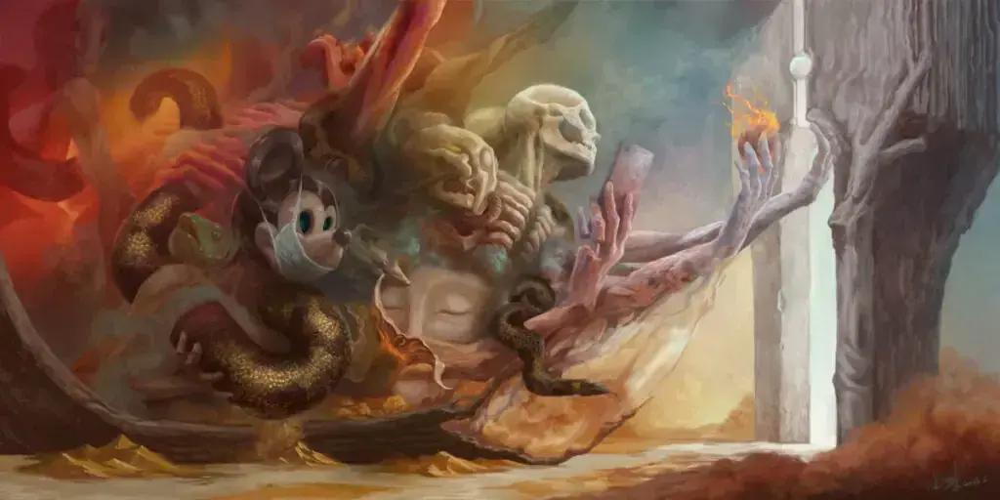
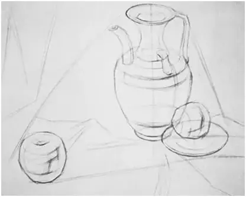
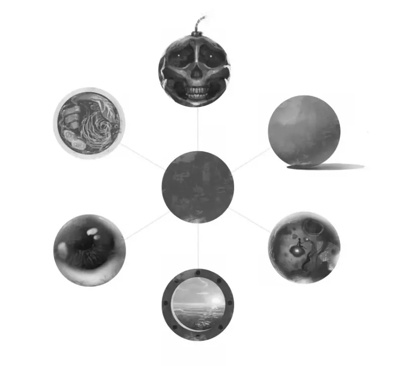
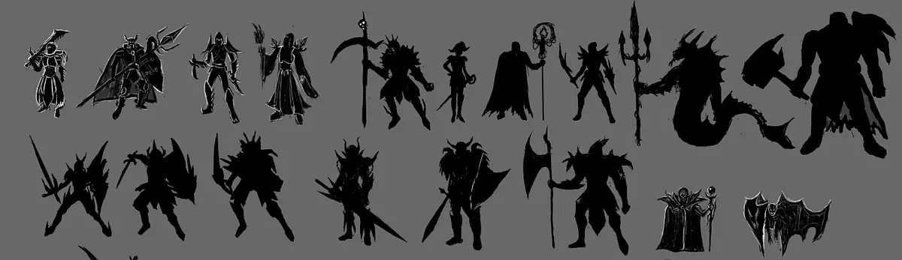

## Introduction: From Psychology to Practice

The [previous article](https://cgartlab.com/posts/digitalpainting1-confidence) covered confidence and courage — how to take the first step. It was fundamentally about mindset.

Mindset is intangible; execution is concrete.

This article covers the practical problems you'll encounter and how I approach them.

When you start a drawing, the very first mark you make is always a shape. If confidence and courage are the first step in creation, shape is the first step in any artwork.

## What Sketching Really Does: Establishing Creative Order

If you were (or are) an art student, you're probably very familiar with "sketching" — the first thing studio teachers teach. You use a pencil to define the height and width of your subject on paper, establish proportions and placement, then break the subject down into geometric forms using long straight lines to approximate curves. The classic example is "peeling an apple" — seeing a real apple as one that's already been peeled. I'd wager more than 99% of students who learn to draw can't skip this step. Only after this do you move on to perspective, the terminator line, lights and darks — one step at a time.

Image from the internet

"Sketching" literally means "beating out" the shape. The "beating" is about establishing order — the order that makes an image realistic. This holds true whether the method comes from Soviet or Western academic traditions.

This is the approach for exam-oriented realism, not for creative work. "Sketching" is fine, but the "shape" is static.

When it comes to creation, it's a different story altogether.

## What Is Shape: The Fundamental Element of Art

In art and design, the term "shape" carries immense depth.

Simply put, a shape is the outer form or contour of an object — the basis for recognition and judgment. As we observe the world, our brains automatically identify and categorize shapes, which become the foundation for understanding and depicting reality.

In creative work, shape is no longer just a depiction of physical contours — it becomes a medium for the artist's personal expression. This medium has infinite possibilities. **It is not limited to the inherent shapes of the physical world, but also includes shapes born from the artist's thinking and perception during the creative process.**

For example, a simple circle, with imagination, can transform into countless new elements, characters, and scenes. It can move from abstract to concrete, and back again.

The evolution of a circle

Shape creation is not isolated — it's tightly connected to color, line, space, and texture. Let's not overload our minds with too many concepts at once; let's start with simple, single-color shapes.

When learning to draw, you always start with the simplest geometric forms: spheres, cubes, triangular pyramids. That's because almost any real-world object's structure can be reduced to these basic forms. And these forms are built from fundamental shapes: circles, squares, and triangles.

For instance, a square often conveys stability, rigidity, weight, reliability, and seriousness. A circle suggests perfection, infinity, softness, and smoothness. A triangle evokes sharpness, danger, direction, and imbalance.

Shape can also be a projection of the artist's personal emotions. Different fundamental shapes naturally evoke different psychological responses.

In artistic creation, the definition and use of shape are far more complex. It can be representational — directly depicting real objects, like the shape of an apple or a tree. Representational shapes demand keen observation to capture the true form and subtle variations, then reproduce them on canvas with line and color.

Shape can also be abstract — a color block or the shape of a line. Abstract shapes no longer directly depict reality; they are the artist's understanding and expression of the essence of shape. Creating abstract shapes requires rich imagination — twisting, deforming, combining, and subverting shapes to create something unique and expressive.

From this perspective, a line enlarged is a shape; a dot enlarged is also a shape. This is why I said in a [previous article](https://cgartlab.com/posts/fragmented-writing/): "The essence of calligraphy is drawing."

## What Is Silhouette: The Art of Contour

Silhouette, literally, means a shadow cut out with scissors. Before photography, all you needed was paper and scissors. Its essence is the outer contour of an object — a combination of shapes.

Simple as it seems, a silhouette divides a plane into three parts: "inside," "outside," and "edge." The "inside" and "edge" are where imagination takes root.

Even with two identical silhouettes, the fundamental shapes within them can be arranged differently.

A more precise term for these shapes is "projected shapes" — imagine a backlight casting a shadow, and the shape that shadow makes.

So, in my understanding, a silhouette is a composition of these projected shapes.

Image from the internet

Since a silhouette is a combination of projected shapes, it can also be seen as the projection of a 3D object onto a 2D plane perpendicular to the viewer's eye. A silhouette represents purely planar information.

A shape, on the other hand, contains 3D information. The very first mark in any image is a shape. If the artist intends to create a perspective-driven element, there is necessarily an invisible 3D structure in their mind from the start. This 3D structure manifests on the silhouette's "edge" — creating detail associations, rhythm, tension, motion, weight, and more.

A silhouette is judged by these very qualities.

## What Makes a Good Silhouette: Clear and Powerful Visual Expression

In digital art, a good silhouette should clearly express the object's shape and general structure. First and foremost, it needs appropriate exaggeration with correct proportions. This allows the viewer to accurately infer the internal 3D structure.

It should be clean and simple — removing excess detail, retaining only the core contour to reveal the object's essence. At the same time, a good silhouette needs creativity, using contour manipulation to create distinctive imagery.

**A good silhouette should be clear, concise, and powerful.**

It emphasizes contour, highlighting shape and structure over detail. This clean visual effect lets viewers identify the main shape and structure at a glance, making visual information processing more direct and efficient.

**It should showcase the artist's unique perspective and creativity.**

Through clever contour treatment, the artist creates a silhouette that is both unique and expressive. This innovative approach not only demonstrates the artist's individuality and creativity but also offers the viewer a fresh visual experience.

**It should spark the viewer's imagination, guiding them to explore and understand the deeper meaning behind the image.**

Through silhouette, the artist can abstractly express an object's shape and structure, allowing the viewer to fill in the details with their own imagination. This approach not only enhances the work's artistic appeal but also gives the viewer more satisfaction and enjoyment in the process.

## The Architect and the Archaeologist: Two Creative Thinking Mechanisms

Now that we understand what makes a good silhouette, let's explore two approaches I like to use when creating them. These didn't come to me overnight — they emerged from reflecting on my own creative process over time. Combined with my recent interest in knowledge management, I've gained new insights into digital art creation that I'd like to share with you.

The architect and the archaeologist are two ways of thinking about building knowledge structures in knowledge management.

Simply put, the architect thinks in terms of categories and structure first — like drawing up blueprints before building a house, then filling in the content systematically. In digital art, this means knowing what you want to create beforehand, with sketches and line art already formed in your mind.

The second is the archaeologist. As the name suggests, this process isn't planned in advance. You might start with only a vague image or element in your mind — especially suitable for abstract subjects.

For example, in my [Meditation Series](https://cgartlab.com/works/), many pieces ended up nothing like what I initially imagined. They often started as nothing more than "blobs" of combined shapes. Gradually, these blobs took form as a creature making a gesture, then a background was added. But a day or two later, when I looked at the subject from a different angle, the entire image became just a small part of the final piece.

The architect and archaeologist approaches are flexible — there's no rule that you must stick to one. I find these two approaches useful for two common creative situations:

- **When you know what to draw but can't nail the details:** The architect's approach works better. Redraw the sketch, find references — applying the architect's mindset at a micro level helps you push through.
- **When you've drawn what was in your head but realize it's not what you wanted:** Duplicate the original, identify the parts you don't like, strip away unnecessary details, return to the initial draft, and use the archaeologist's approach to rediscover new possibilities. Of course, if you need to start over entirely, you'll need the "courage" from the previous article — the courage to tear it down and begin again.

## Summary: The Artistic Value of Shape and Silhouette

Depicting shape and silhouette is the first step in any digital creation.

Understanding them won't instantly make your work better — but it will open up new creative directions. Technique and tricks are certainly important, because they quickly produce eye-catching results. But over time, content created purely through tricks becomes homogenized. The value of tricks is mainly in getting beginners interested. Once you're past that stage, you'll find that technique is secondary — even just a means to improve production efficiency. Those are problems to solve later.

A good silhouette is like a solid foundation — it creates room for creativity to grow.