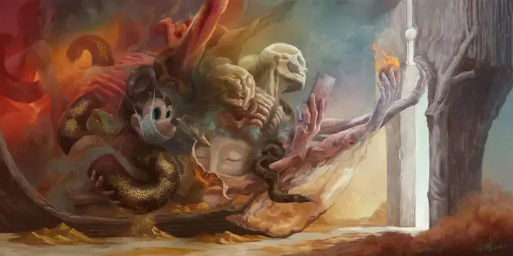
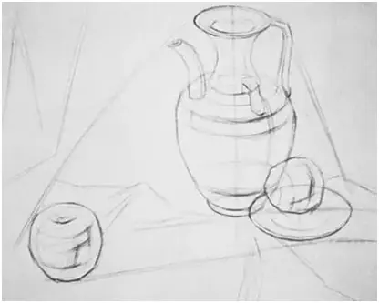
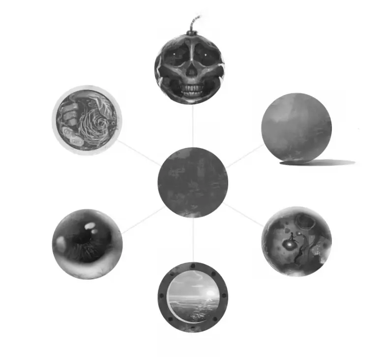
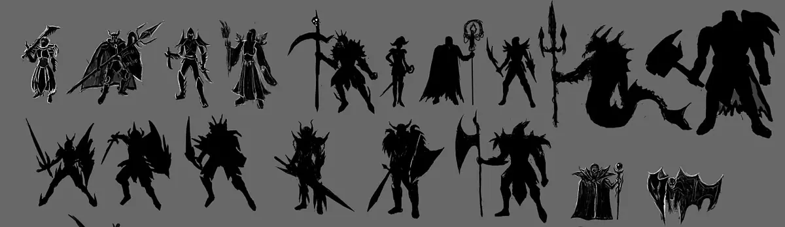

# 引言

[上一篇](https://cgartlab.com/posts/digitalpainting1-confidence) 谈自信和勇气，主要处理的是如何迈出第一步的问题，本质是心理层面。

心理为虚，操作为实。

这一篇聊聊实际操作会遇到的问题和我的解决方法。

画一张图，起稿的第一笔，没有别的可能，画的肯定是形状。

如果说自信和勇气是创作的第一步，形状就是一张作品的第一步。

# 打形是在干嘛

如果你 (曾经) 是美术生，肯定对“打形”已经了如指掌。画室老师教的第一步都是打形。即用铅笔定出描述对象（一般开始都是静物）在纸上的高低宽窄，分好位置和比例，再用长线把对象理解成几何体，连接用直线画曲线。最典型的例子就是“削苹果”，把一个真苹果看作一个削好的苹果。我想将近多于 99% 学画的同学是跳不过这一步的。在这之后才涉及到透视，明暗交界线，黑白灰之类的理论，这些不讲，一步一步来。

图片来自网络

“打形”，字面上的意思是把形状“打”出来。“打”实际意味着建立秩序，建立让画面逼真的秩序。无论这种方法来自苏联，还是西方的什么学院派理念。

这是针对国内应试的写实画法，和创作无关。“打”没问题，但“形”是死的。

一旦涉及到创作，就是另外一个含义了。

# 到底什么是形状

形状，这个术语在艺术和设计创作中拥有着极其丰富的内涵。

简单来说，形状通常是指一个物体的外形或轮廓，它是我们对物体进行识别和判断的基础。在观察世界的过程中，我们的大脑会自动地去识别和分类各种形状，这些形状成为了我们理解和描绘世界的基石。

当形状在创作中，就不再是简单的实物轮廓的描绘，而是艺术家个人表达的媒介。这个媒介具有丰富的可能性，它**不仅限于物理世界中的固有形状，也包括艺术家在创作过程中经过思考和感知产生的形状**。

例如一个简单的圆形，加入想象力之后可以变成各种新的元素，角色和场景。也可以从抽象到具象，再从具象到抽象。

一个圆形的变化

同时，形状的创作并不是孤立的，它和色彩、线条、空间、质感等元素紧密相连。我们先不给头脑中加入那么多复杂的概念，只考虑单一单色的简单形状。

形状的创作并不是孤立的，它和色彩、线条、空间、质感等元素紧密相连，相互影响，共同构建了艺术作品的视觉语言。艺术家通过对形状的运用，可以表达出各种复杂的情感和思想，使作品充满生命力和张力。

学画画时一般都是从最简单的球，立方体，三棱锥这些最简洁的几何体开始。正是因为现实中的实际物体的造型结构几乎都可以用这些基本几何体来进行最大限度的概括。而这些几何体都是由圆，方，三角这些基本形状建立的。

例如，方形通常给人的感受是稳定、刚性、重量、可靠、严肃等等。圆形通常给人的感受是完美，无限，柔软，顺滑等。三角形通常给人的感受是锋利、危险、指引、失衡等等。

所以说，形状还可以是艺术家个人情感的投射，艺术家使用不同的基本形状，本身就会给人的心理带入一些对应的感受。

在艺术创作中，形状的定义和使用要复杂得多。它可以是具象的，也就是直接描绘现实中的物体，如一个苹果或一棵树的形状。具象的形状需要艺术家具有敏锐的观察力，去捕捉物体的真实形态和细微变化，并用线条和颜色将其再现在画布上。

形状也可以是抽象的，如一个色块或一条线的形状。抽象的形状不再是对现实的直接描绘，而是艺术家对形状本质的理解和表达。抽象形状的创作需要艺术家具有丰富的想象力，通过对形状的扭曲、变形、组合和颠覆，创造出独特且富有表现力的形状。

其实从这个角度去看，一根线放大后也是形状，一个点放大后也是形状。这也是为什么我在 [之前文章](https://cgartlab.com/posts/fragmented-writing/) 里说：“书法的本质也是画画”。

# 剪影又是什么

剪影，字面意思是用剪刀剪出的影子。在没有摄影技术的年代，一张纸一把剪刀就能创作。它的本质是物体的外部轮廓，形状的组合。

看似简单，把一个平面分成“内”、“外”和“边”三个部分。这个“内部”和“边”就是挥发想象力的土壤。

在画基本形状的时候，即便是相同的两个剪影，其中也可以构成不同的基本形状组合。

这里的形状，更准确的说法是“投影形状”。顾名思义，就是假设有一个背光，从这个背光投射出的影子的形状。

所以，以我的理解，剪影的本质就是这若干“投影形状”的组合。

图片来自网络

既然剪影是若干“投影形状”的组合，也可以说，剪影是三维物体在一个与人眼垂直的二维平面上的投射。所以，剪影表示的是纯粹的平面信息。

而形状，是包含了三维信息在里面的。任何一个画面，第一笔实际画的都是形状。这时只要艺术家打算创作的是带有透视的元素，那么在画的同时脑海中是必然带有一个隐形的三维结构在里面。三维结构表现在剪影的“边”上，就会形成细节联想、节奏、张力、动感、重量等等的特点。

而一个剪影好坏与否，也是根据这些来判断的。

# 什么是好的剪影？

在数字艺术创作中，好的剪影应该是能够清晰地表达出物体的形状和大致结构的，首先当然要满足适当夸张的前提下，比例也正确。这样才能让人更准确的去联想内部的三维结构。

最开始它需要简洁明快，去除多余的细节，只保留最核心的轮廓，以此来展现物体的本质。同时，好的剪影还需要富有创意，通过对轮廓的改变，创造出具有个性和特色的影像。

**好的剪影应该是清晰、简洁且有力度的。**

它以轮廓为主，强调物体的形状和结构，而非细节。这种简洁明快的视觉效果，使得观众能够一眼就分辨出物体的主要形状和结构，使其对视觉信息的解读更加直接和高效。

**能够展现出艺术家的独特视角和创造力。**

通过对轮廓的巧妙处理，艺术家能够创造出独特且富有表现力的剪影。这种创新性的表现方式，不仅能够展现出艺术家的个性和创造力，也能够给予观众新的视觉体验和感受。

**能够激发观众的想象力，引导他们去探索和理解画面背后的深层含义。**

通过剪影的形式，艺术家能够抽象地表达出物体的形状和结构，使观众能够通过自己的想象力去填充和理解物体的细节。这种激发观众想象力的表现方式，不仅能够增强作品的艺术吸引力，也能够使观众在欣赏作品的过程中获得更多的乐趣和满足感。

# 建筑师和考古学家

了解什么是好的剪影以后，再展开聊聊创作剪影时我喜欢使用的两种思路。这两种思路也不是一开始就有，也是对自己长时间创作的一次阶段性归纳总结。再加上近些年对知识管理的兴趣研究、应用，让我对数字艺术的创作方式也有了新的感悟，分享给你。

建筑师和考古学家是知识管理中建立知识结构体系的两种思维方式。

简单来说，在知识管理中，建筑师思维是先想好分类和结构，好比盖一栋楼之前已经规划好了设计图纸，然后按顺序往里面填充内容。相对应的，在数字艺术创作中，就是先想清楚自己要创作什么内容，脑海中想好了草图和线稿。

第二种是考古学家思维，顾名思义，这样的创作过程不是事先规划设计好的。一开始可能脑海里只有一个模糊的形象或元素，这尤其适用于抽象的创作主题。

例如，在 [《冥想系列》](https://cgartlab.com/works/) 中，很多张作品完全不是我事先想到的样子，甚至最开始的时候就是一些形状组合成的“团块”。然后这些“团块”逐渐描绘形成一个生物角色在做出一个动作，再描绘适当的背景环境。可是过了一两天，当我用另一个角度重新看待创作的主题之后，整个画面反而变成了最终作品的局部。

建筑师和考古学家这两种思维同时也是可以灵活运用的，没有什么规定非要按照一个思路贯彻始终。我想这两种思维适用于解决创作时两类状况：

- 第一个是知道画什么，但是一些细节画不出，这样更适合用建筑师的思维处理，重新画一下草图，找一些参考资料，便是在细微处运用建筑师的思维，会更容易继续下去。
- 第二个是画出了脑海中的内容，可是忽然发现并不是自己想要的。这个时候不妨复制一份原稿，找到不满意的地方，去掉里面不必要的细节，重新回到最初始的剪影，再运用考古学家的思维在里面重新发现新的可能性。当然，如果发现需要重新开始，就需要上一篇说的“勇气”，勇敢的推倒重来。

# 总结

描绘形状和剪影是任何数字创作实践的第一步。

如何理解它们不会一下子让作品更好，而是会开发出新的创作方向。技巧套路当然重要，因为容易快速的得到吸引眼球的结果。但时间久了或者看的多了内容就会同质化，因为内容本身就是吸引眼球的，唯一的好处是容易让人产生兴趣入门学习。过了这个阶段就会发现，技巧套路都是次要的，甚至是只为了提高生产效率，这些全是之后才需要考虑解决的问题。
