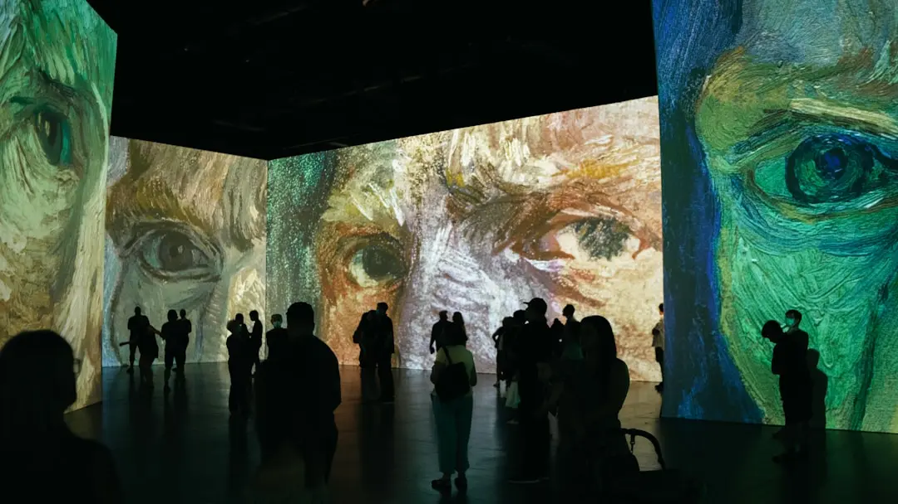

## Introduction

> Would artists at Van Gogh's level be replaced by AI?

This was a [question](https://www.zhihu.com/question/585630924) I was invited to answer on Zhihu. Halfway through writing my response, I decided it would make a great blog post, so I'm expanding on my thoughts.

Let me start with the conclusion: Van Gogh would absolutely not be replaced.

As for artists "at that level" — well, frankly, I don't know what level that refers to. And as a fellow art creator, I don't believe we can categorize artists so simply. But that doesn't stop me from thinking about it.

Van Gogh — everyone knows the name. There's probably no one alive today who's seen him in person. So when we talk about his "level," what are we really referring to?

Everything we know about him comes from historical records — other people's commentary. Some written beneath his works, some compiled into books.

So the "level" we discuss is really a profile sketched by external factors: reputation, influence, authoritative criticism, collective memory, the momentum of the era — a kind of impressionistic portrait.

I don't think that's an accurate assessment. Let's slow down and not rush to judgment.

## A Painter Is First a Person; AI Is First a Machine

The biggest difference between humans and machines — and also the most obvious one — is that machines don't know fear. Humans do.

This question itself is one that only humans would ask. Its root is the fear of being replaced, stirring deep within.

A machine doesn't even know what fear means. It can look up the definition of fear for you, even comfort you — but at least for now, it cannot experience the feeling of fear.

## Intention, Experience, Becoming

Before creating, a painter first has a motivation — more precisely, a catalyst. When all conditions are met, the brush naturally begins to move. And they may have been preparing for this piece for a long time. If they want to express an idea or raise a question through the work, they must have lived through that experience themselves. They might even feel that a two-dimensional surface is insufficient to hold it.

A machine only needs a command. It searches its database for the meaning of that command, then decides how to translate it into the color of each pixel. Reliable and tireless.

During the creative process, the painter is filled with emotions. These emotions inevitably influence the pressure of their brushstrokes, the saturation of colors, the tension of the composition. The entire process is a mix of fragmented, unpredictable, objective and subjective elements. Eventually, the painter feels: "This is enough. It's done." And the work settles into its final form.

But during the machine's creative process, there is no emotion — only mathematical computation. The generated image is essentially a string of 0s and 1s.

The human path to creation is: form an intention or motivation, naturally generate action, experience the process of creation through that action, and finally, through the completion of the work, recognize oneself as its creator.

Yes, the person behind the machine is also human, and the output is also a painting. But the missing link is "experiencing creation through action." That's the biggest feeling I get when trying to create with AI. I don't recognize that image as my creation.

It's like — before, I held the paintbrush in my hand. But when using AI, I've handed over even the hand holding the brush. All that's left is the hand typing on the keyboard.
