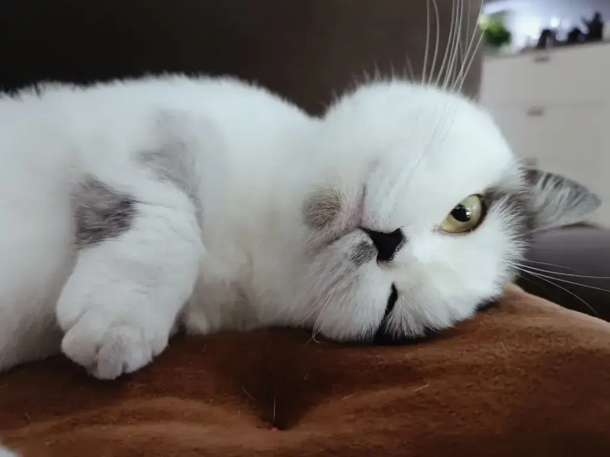
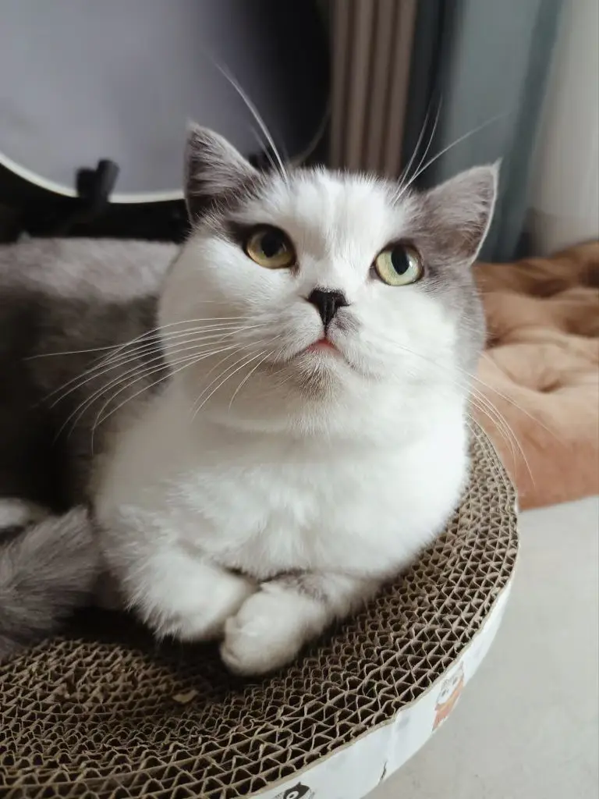
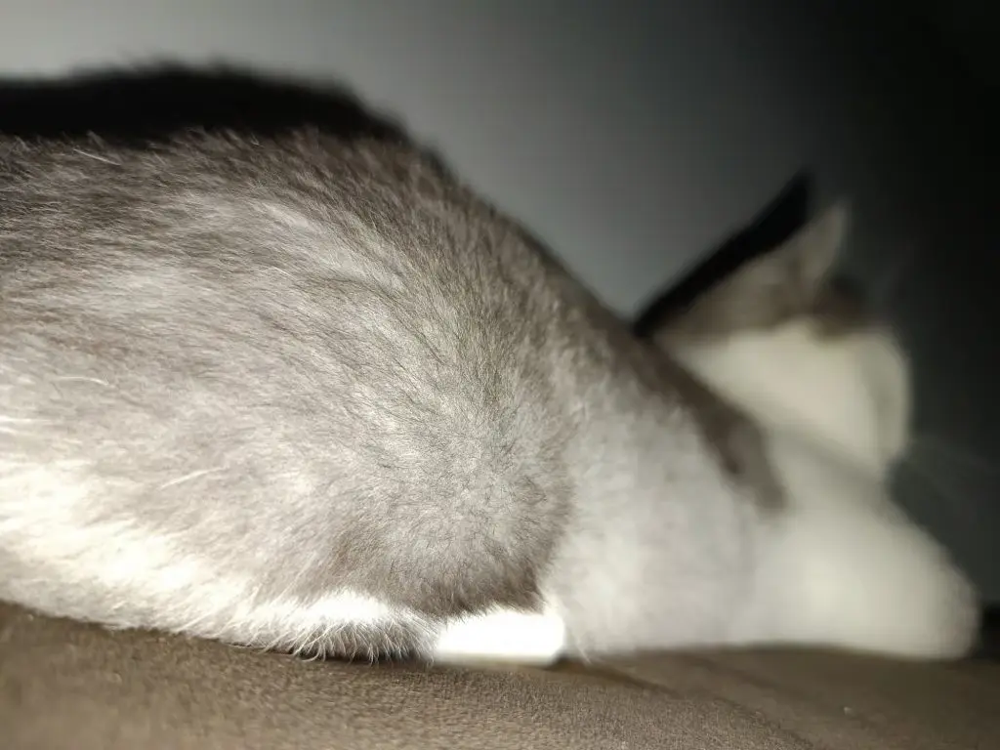
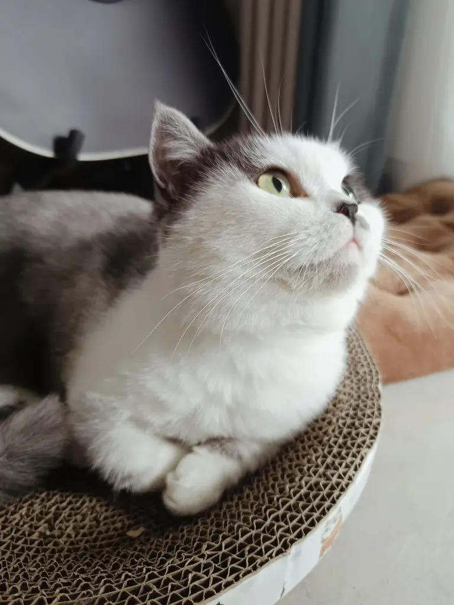
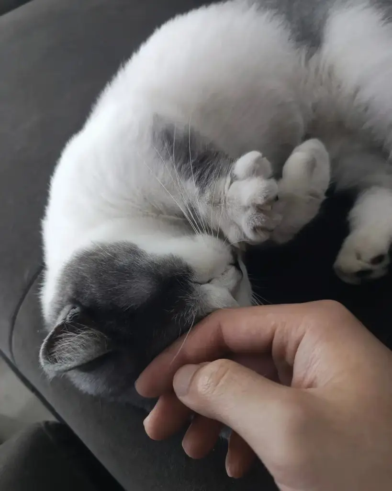
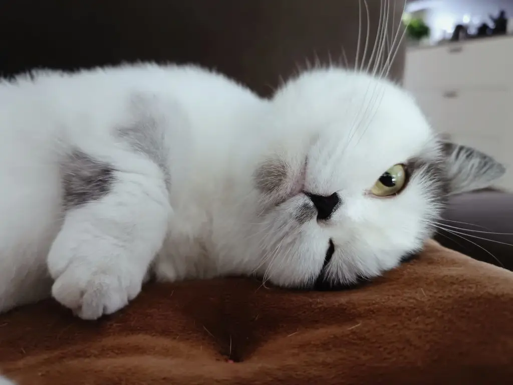
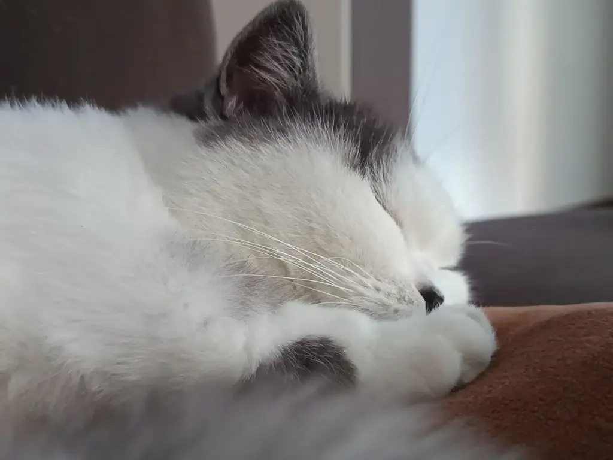
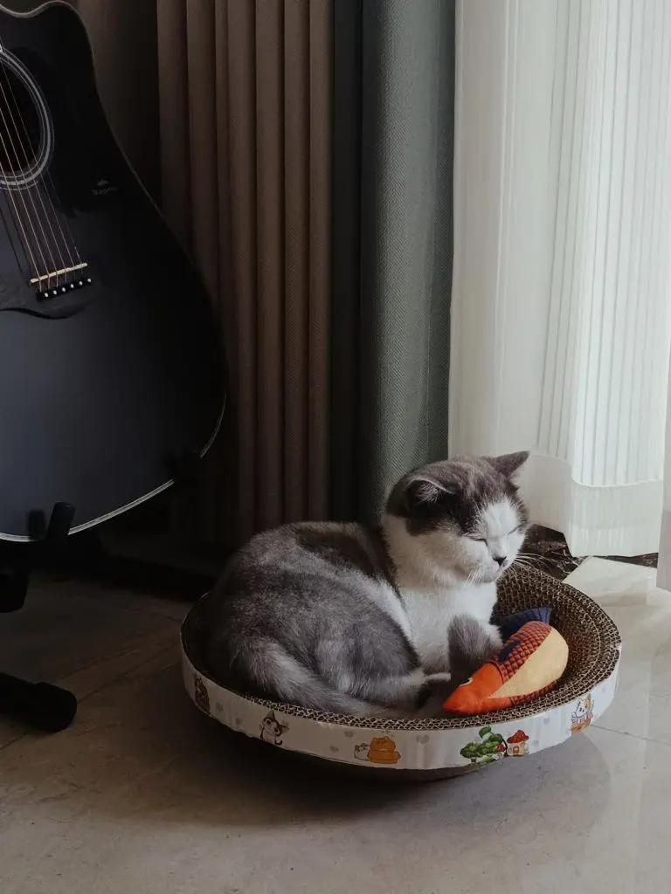

I've always loved animals. Growing up, I've had dogs, rabbits, chickens, parrots, crabs, shrimp, river clams, golden snails, loaches, turtles, and katydids. But I'd never had a cat — until now.

Her name is Loya — from Hallelujah. A one-year-old Munchkin. A friend had two and couldn't keep them anymore, posted on social media asking if anyone wanted to take one. I volunteered with a single phone call.

On August 4th, I went to pick up the cat. It was far — 27 subway stops. Coming back with a cat meant no subway, so I had to take a cab. She was calm and well-behaved the whole way, like she'd seen it all before. I was the one worried it might rain.

We got home close to 12:30 AM. As soon as I let her out, the little one was terrified — she bolted under the sofa and wouldn't come out. I followed my friend's advice: ignore her, set up the litter box and a bowl of water, and go about my business.

First time with a cat, but my experience with dogs told me there was no point trying to catch her — she'd have to get familiar with the environment on her own. The litter box wouldn't arrive until the next day. I was terrified she'd take a liking to the sofa and leave me a present. So I decided to sleep on the sofa that night, to make it clear: this is the reality, abandon all hope.

Then, at 5 AM, I was woken up by a paw stepping on me. I turned on my phone flashlight — and there it was, a whole butt facing me.

Over the next few days, I watched her every day. I slowly realized that cats seem to have a kind of spiritual awareness. It took her only four days to go from hiding to letting me pet her belly and trim her nails.

I've heard from cat-owning friends that cats don't think they're cats, and they don't think you're their owner. They just see you as a tall roommate living under the same roof. Come to think of it, no animal has a name — names are human inventions. A lot of people wish they could come back as someone's cat in the next life: carefree, well-fed, petted all day. Living proof to those running the rat race of what life is really about.

If there is a next life, I wouldn't want to be a cat. I've written about why in [Cats, Dogs, and Your Confidence](https://cgartlab.com/en/posts/cat-dog-confidence/) — it's a life of being at someone's mercy. But if I'm lucky enough to be human again, I'd still keep cats. Animals have a unique kind of magic. You don't choose them — they choose you. Like a wand choosing its wizard.

