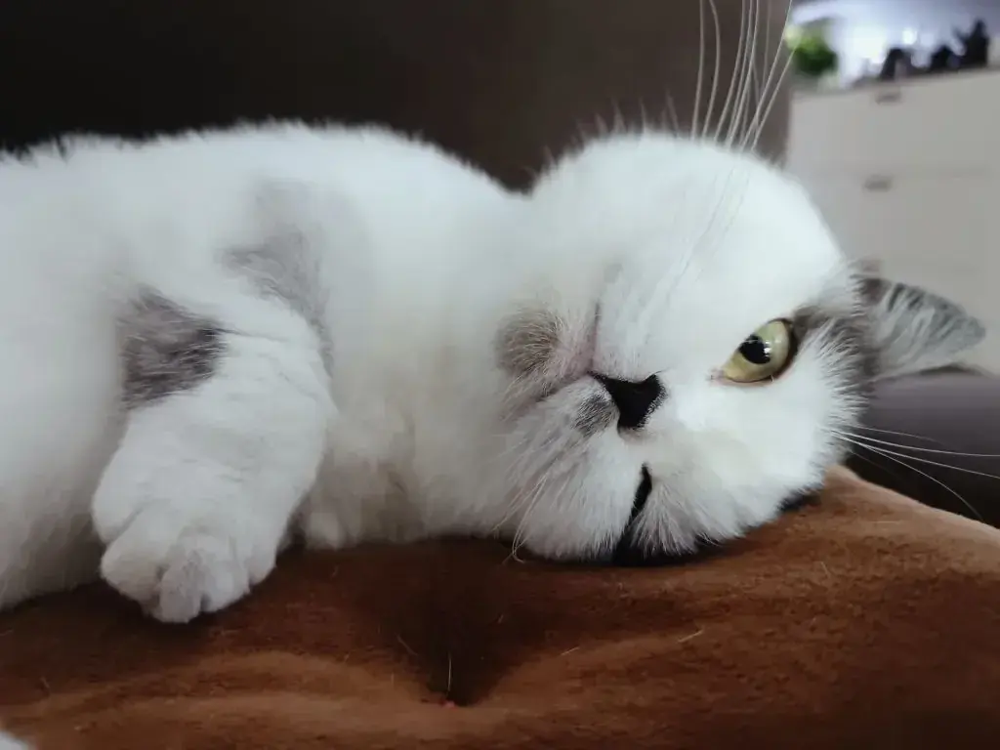
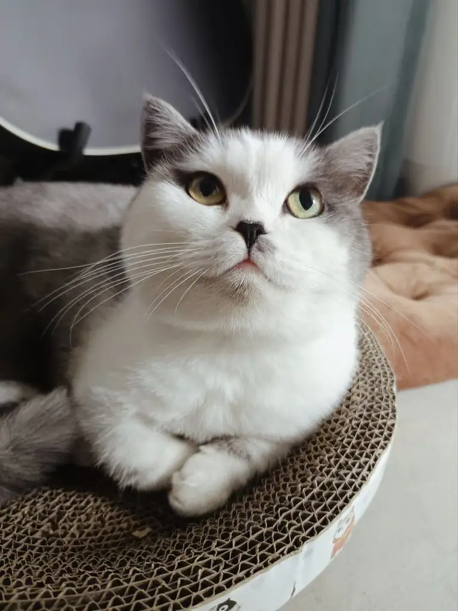
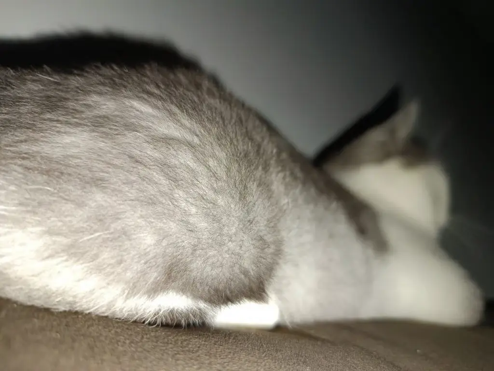
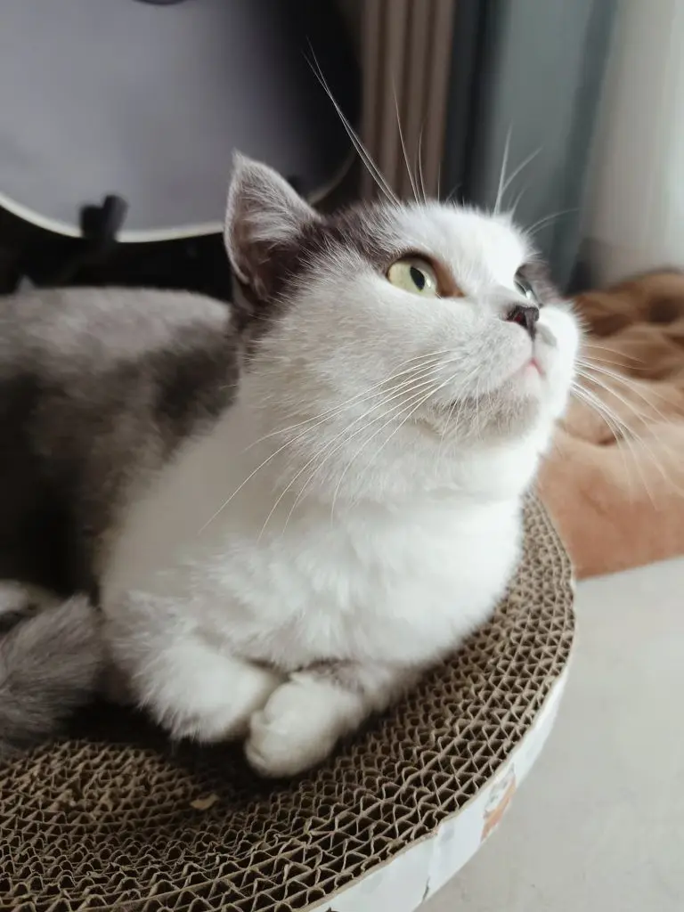
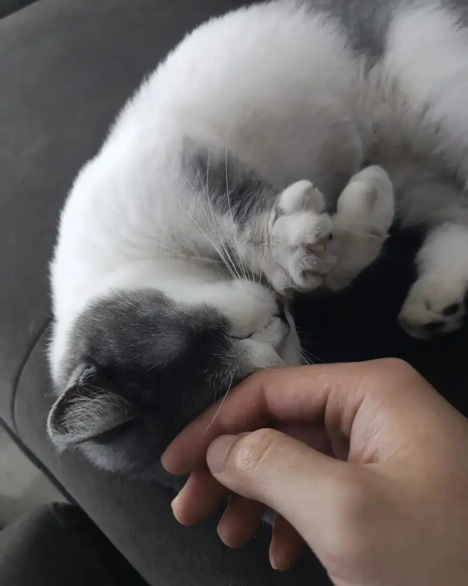
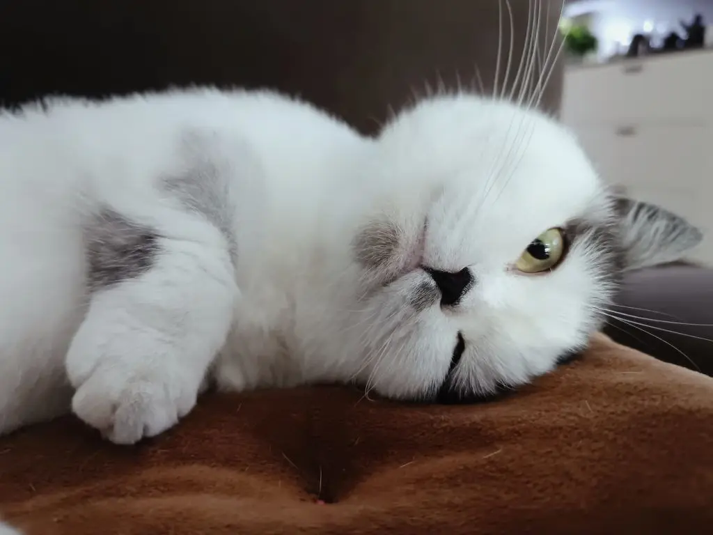
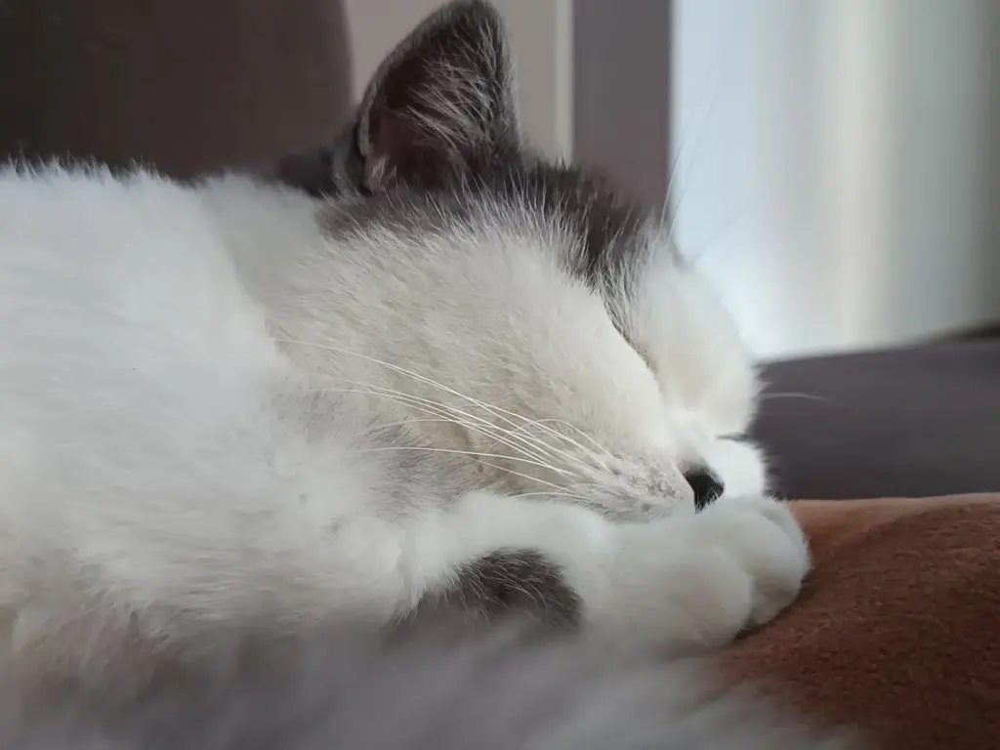
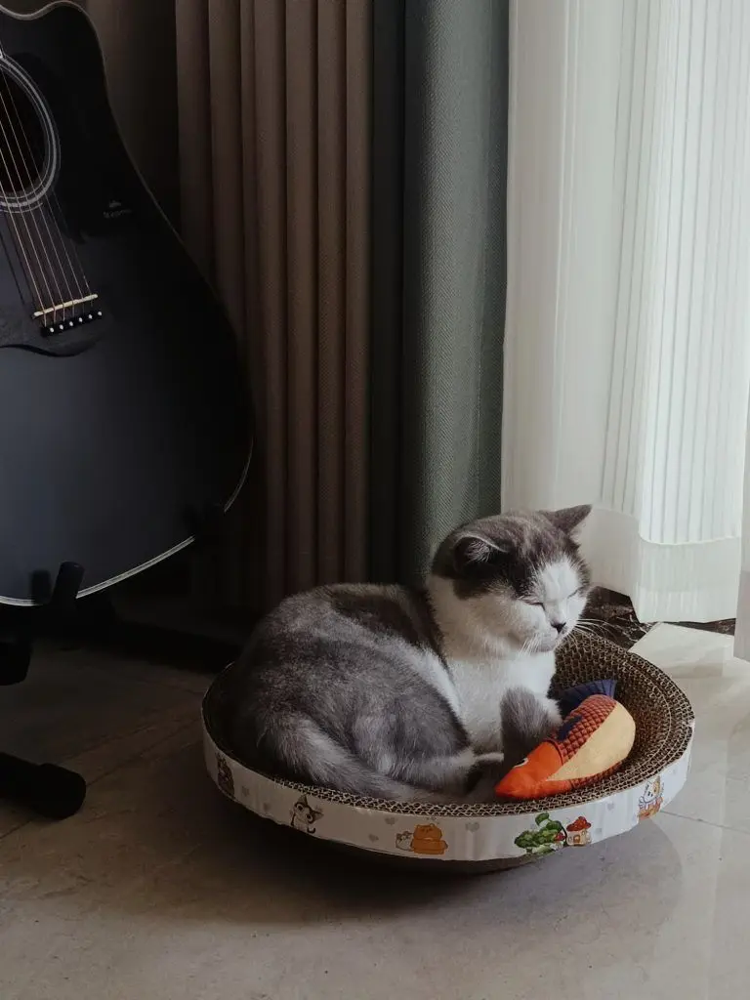

我超爱各种动物。从小到大养过狗，兔子，鸡，鹦鹉，螃蟹，虾，河蚌，黄金螺，泥鳅，龟，蝈蝈。但从未养过猫，这是头一回。

它叫路亚，哈利路亚的路亚，一岁多的曼基康。是朋友养了两只，养不住了，发朋友圈说谁要抱走，我自告奋勇一个电话打了过去。

8 月 4 日，去朋友家抱猫。很远，坐地铁有 27 个站，回来的时候带着猫就不能坐地铁了，只好打车。猫一路很乖巧平静，一副见过世面的样子，倒是我一直担心会下雨。

到家已经快晚上 12 点半，刚放出来小家伙很害怕，蹭的一下钻到沙发底下不出来。我按朋友说的，无视，准备好猫砂盆和一碗水，然后该干嘛去干嘛。

虽然是第一次养猫，但凭借养狗的经验告诉我，抓肯定是别想抓住它的，得让它自己熟悉环境。猫砂第二天才能到，我怕它万一相中了沙发，给我来一泡可就完了。然后决定豁出去，我先睡一晚上沙发，告诉它认清形势，放弃幻想。

然后，凌晨 5 点，我被它一脚踩醒，打开手机闪光灯一看，好嘛，一整个屁股对着我。

之后几天，我每天都在观察它，慢慢发现猫这种动物貌似真的有灵性，从不敢路面到完成巡回训练只用了短短 4 天，也让我摸肚皮剪指甲了。

很早就听养猫的朋友们说，猫不认为自己是猫，也不认为你是它的主人，它只把你当作一个屋檐下生活的大个子室友。想想也是，任何动物本身并没有名字，都是人类赋予的。很多人都希望自己下辈子做一只别人家的猫，无忧无虑，有吃有喝有人摸。无时无刻身体力行地告诉那些卷到不成样子的人类什么才叫生活。

如果存在下辈子，我是不愿意做猫的，原因在 [《猫猫狗狗与你的信心》](/posts/猫猫狗狗与你的信心/) 里有讲过，那是种被玩弄于股掌之上的生活。但若有幸继续为人，我想我还会养猫。动物们身上有独特的魔法，不是你选择它们，是它们来选择你。就像魔杖选择巫师。

