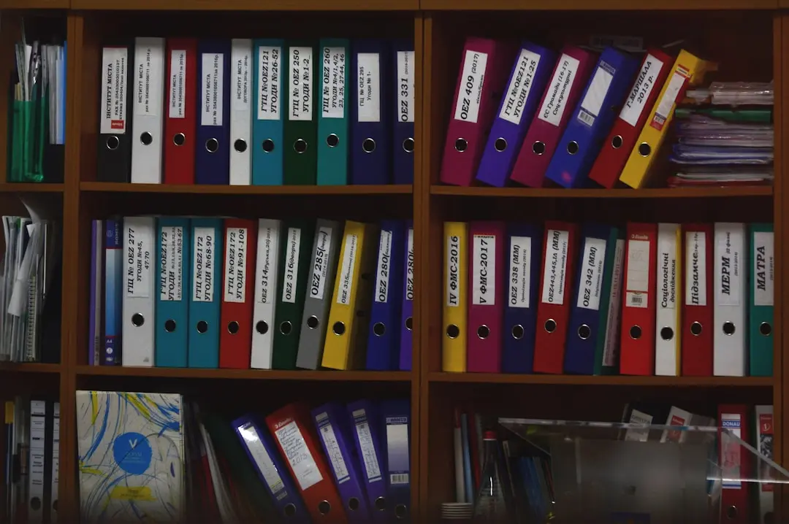
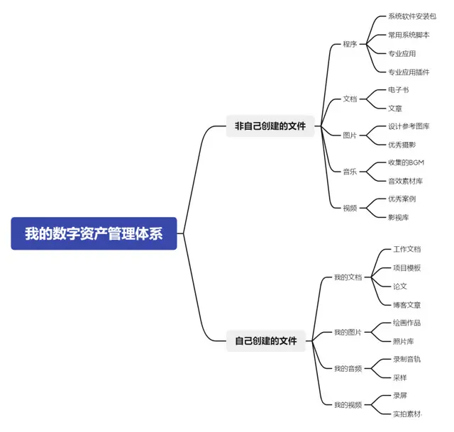

### Lessons Learned the Hard Way

Another hard drive of mine just died — the third one I can remember. While my computer was frantically trying to recover my data, I figured it was time to sum up what I've learned.

I'm grateful I developed the habit of organizing project files back in college. I studied animation as an undergrad. Back then, we were using 3ds Max, which has its own file management system. Our teacher emphasized the importance of consistent file naming and categorization. Looking back, that's one of the few things from university that has truly benefited me for life.

It's been nearly ten years since I graduated. Through both commercial and personal projects, I've worked across many fields: TV branding, print advertising, stage design, designer toys, architectural visualization, UI, illustration... In a company, a healthy department has its own file management standards and corresponding workflows. Since I went fully freelance and started my own studio a couple of years ago, I've become a one-person team, gradually developing a personal digital asset management system that goes beyond just work.

I set a few core principles for this system:

- **Don't add categories unless necessary**

    Only if the category can be exhaustive — for example, file types are finite, but formats are endless.

- **Archive within 1 minute**

    I've seen many people who know archiving is important but rarely stick with it for more than a year. After finishing work, you're already exhausted and irritable — who wants to deal with tedious filing? But if you've designed your categories well, a 1-minute archive is just a natural flow.

- **Use English + date-based naming when possible**

    This is a professional habit. Many professional applications only recognize English paths, and some fonts don't support Chinese, causing garbled text.

- **Back up important files weekly — both hot and cold backups**

    You can skip organizing, but please back up your files. For world peace.

### Designing the Category Structure

My file organization logic is straightforward:

- There are only two types of files on a computer: programs and data.
- Everything I store is data.
- That data is either created by me or created by someone else.
- All data ultimately outputs as one of four types: text, image, audio, or video.
- From there, just subdivide by purpose based on life or work needs.

### Categorization vs. Search

This approach is **category-first**. Another approach is **search-first**. I personally prefer search within specific sub-categories — for example, movies, music, and ebooks are best handled by search. But images are better suited for categories — I use Eagle for that; maybe I'll write about it another time. For my own photos, Apple's built-in Photos app is more than enough.

For search to work well, you need consistent naming conventions for files or paths. My habits do support that advantage, but honestly, I rarely need to search for anything specific. If a file goes missing, professional applications usually tell you which path it was in. And typically, files don't disappear one at a time — they vanish in bulk, haha. But that's beyond what search can solve.

There is one place where I always use search, though: my second brain. I've written about [building the second brain](https://cgartlab.com/en/posts/build-the-second-brain/) before. In that space, I don't force myself to remember anything, and even my categories are quite loose.

### Bonus Thoughts

In a way, these two management approaches are inspired by Notion and Obsidian.

Notion corresponds to category-first — you build the framework yourself, which requires knowing your needs in every area. It has its own underlying rules, but offers a high degree of freedom.

Obsidian is search-first. Its bi-directional linking feature is essentially pre-built search, with almost no rules — it's better suited for letting content grow organically.

One last thing: this system is the version I settled on after buying a NAS last year and doing a thorough optimization. In practice, it barely holds up to my current file volume. Consider my approach as a reference, but do what works for you. If something isn't working well enough, iterate on it — can repetitive operations be templated? Can backups be incremental? There's no one-step solution, and no shortcuts.
